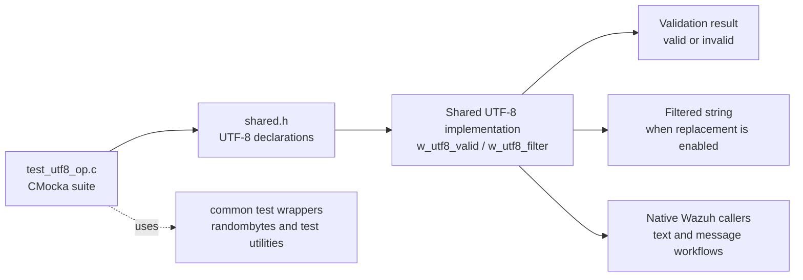
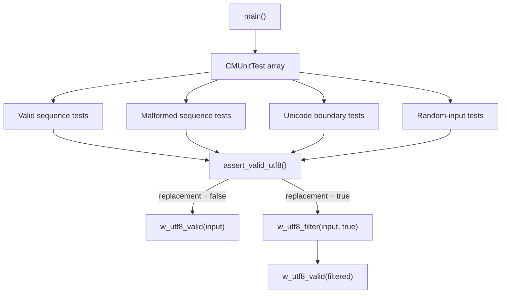
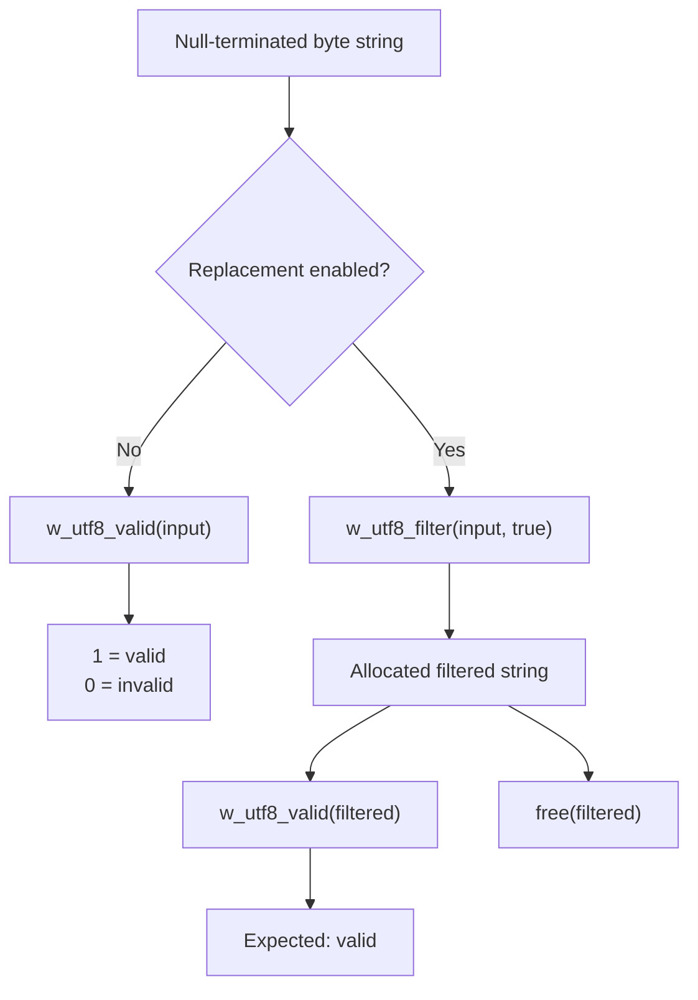
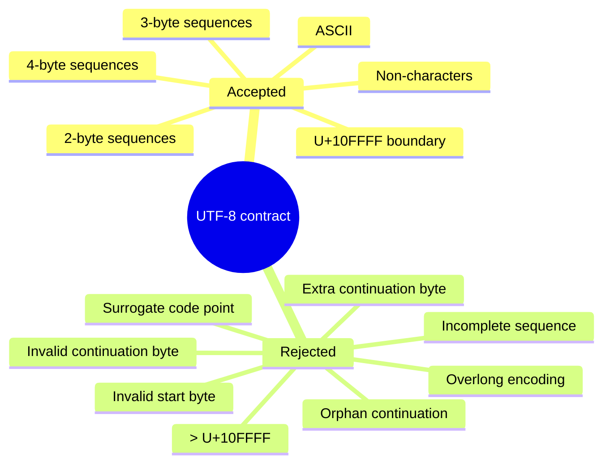
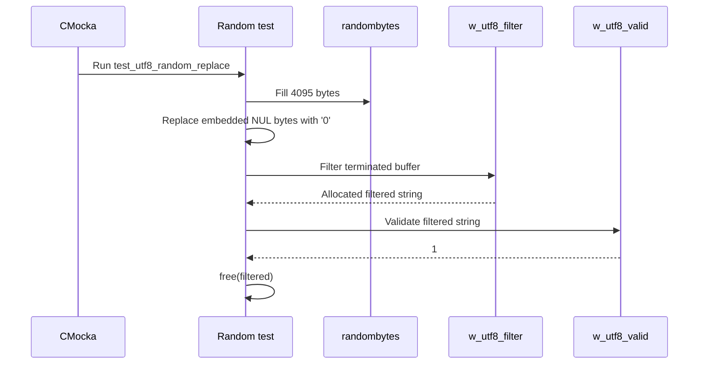
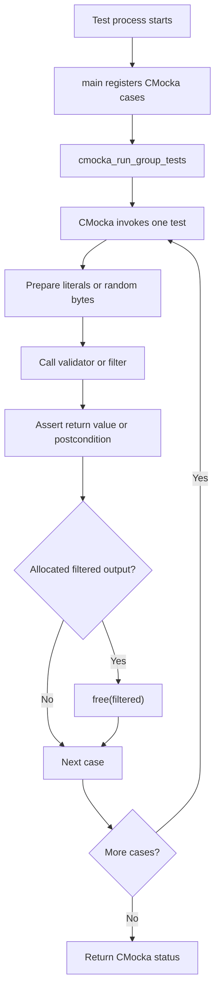
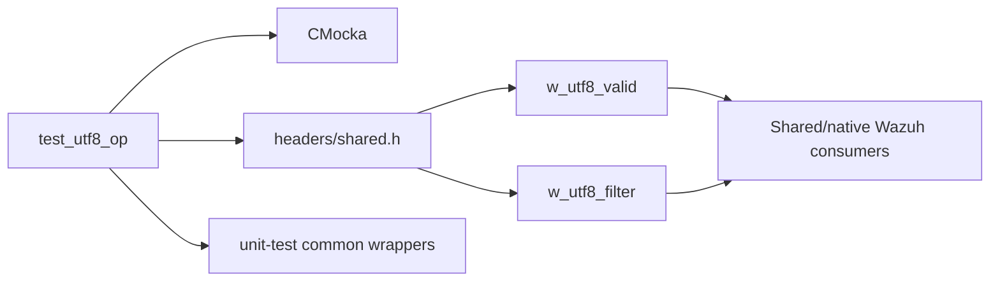

# `test_utf8_op`

`test_utf8_op` is the CMocka unit-test module for Wazuh's shared UTF-8 validation and filtering helpers. It verifies that `w_utf8_valid` accepts well-formed UTF-8, rejects malformed byte sequences, and that `w_utf8_filter` can produce valid output when replacement is enabled.

The test source is `src/unit_tests/shared/test_utf8_op.c`. The production helpers are part of the shared string-validation layer; see [shared_lib_string_validation.md](shared_lib_string_validation.md). The common test harness and wrapper conventions are described in [test_infrastructure.md](test_infrastructure.md).

## Purpose and system position

UTF-8 handling is a low-level boundary for native Wazuh components that receive, construct, log, serialize, or forward text. This module does not transform application data itself; it protects the contract of the shared helpers used by those higher-level paths.

## Architecture

The suite has three layers:

| Layer | Components | Responsibility |
|---|---|---|
| Test runner | `CMUnitTest`, `main` | Registers cases and invokes `cmocka_run_group_tests`. |
| Test helper | `assert_valid_utf8` | Applies either direct validation or filtering followed by validation. |
| Shared API boundary | `w_utf8_valid`, `w_utf8_filter` | Performs UTF-8 recognition and optional invalid-byte replacement. |

### Test runner and helper

`main` creates a static array of `CMUnitTest` entries and registers 23 cases. It passes no group setup or teardown callbacks to CMocka. Each test receives the conventional `void **state` argument, but the current cases do not use fixture state.

`assert_valid_utf8` centralizes the expected contract:

1. With `replacement == false`, it calls `w_utf8_valid(input)` and compares the result with `expect_valid`.
2. With `replacement == true`, it calls `w_utf8_filter(input, true)`, validates the returned string, asserts that the result is valid, and frees the allocated string.

The helper intentionally checks the postcondition of filtering rather than the exact replacement representation. The test therefore remains independent of whether the implementation uses one replacement character, multiple replacement characters, or another documented replacement policy.

## Data flow

The input is always a NUL-terminated C string. The tests cover both literal text and explicit hexadecimal byte sequences, making the byte-level rules observable without relying on source-file encoding.

## Validation rules covered

The cases collectively exercise the UTF-8 constraints expected by the shared validator:

- ASCII and valid two-, three-, and four-byte sequences.
- Multilingual text, including Greek, Chinese, accented characters, combining marks, and zero-width space.
- The minimum legal continuation and leading-byte boundaries: `U+0080`, `U+0800`, `U+10000`, and the one-byte `U+007F` boundary.
- The highest valid scalar value, `U+10FFFF` (`F4 8F BF BF`).
- Code points immediately before, inside, and immediately after the UTF-16 surrogate range.
- Continuation bytes without a leading byte.
- Invalid start bytes above `F4`, including `F5` and `FE`.
- Invalid second-byte restrictions for `E0` and `F0` sequences.
- Incomplete two-, three-, and four-byte sequences.
- Overlong encodings, including encodings of NUL and `/`.
- Five-byte sequences and `FF`, which are outside UTF-8.
- Extra continuation bytes after an otherwise valid sequence.
- Unicode non-characters such as `U+FDD0` and `U+FFFE`, which this validator treats as structurally valid UTF-8.

## Test groups and expected behavior

### Valid and invalid sequences

`test_valid_utf8_sequences` checks ordinary ASCII, Latin characters, a snowman, an emoji, and multilingual text. Every valid input must pass direct validation; the same inputs are also sent through filtering and must remain valid.

`test_invalid_utf8_sequences` checks overlong encodings, a surrogate half, a five-byte sequence, an invalid byte, an orphan continuation byte, and a bad continuation byte. Direct validation must return invalid. Filtering with replacement enabled must yield a string that passes validation.

### Boundary and scalar-value tests

The boundary-focused tests divide the Unicode space at the points where UTF-8 encodings change shape or become illegal:

| Test | Focus |
|---|---|
| `test_utf8_edge_cases` | `U+10FFFF` accepted; the next range rejected. |
| `test_maximal_overhead_cases` | Maximum value representable by each legal byte width. |
| `test_surrogate_pair_boundary` | `U+D7FF` accepted; `U+D800` rejected. |
| `test_surrogate_pair_extended_boundary` | `U+D7FF` accepted; `U+DFFF` rejected. |
| `test_surrogate_range_after` | `U+E000` accepted after the surrogate range. |
| `test_multilingual_plane_cases` | Start and representative end of the supplementary multilingual plane. |
| `test_specific_byte_sequence_boundaries` | Minimum legal sequences and rejection of trailing continuation bytes. |
| `test_invalid_start_bytes` | Start bytes beyond the UTF-8 four-byte range. |
| `test_invalid_second_byte_sequences` | Special second-byte limits for `E0` and `F0`. |
| `test_non_characters` | Structurally valid non-character code points remain accepted. |

### Empty, incomplete, and mixed input

`test_empty_string` establishes that an empty NUL-terminated string is valid. `test_incomplete_utf8_sequences` and `test_incomplete_three_byte_sequence` verify that truncating a multi-byte sequence at the end is invalid.

`test_mixed_valid_invalid_utf8` and `test_mixed_valid_invalid_with_surrogates` place malformed bytes between ordinary ASCII characters. This ensures validation scans the complete string and does not accept a prefix merely because it begins with valid text.

`test_continuation_without_leading` isolates `80`, `A0`, and `BF` as invalid standalone bytes.

### Random-input robustness

`test_utf8_random_replace` fills a 4095-byte buffer with random non-NUL bytes, terminates it explicitly, filters it, and asserts that the result is valid. This is a property-style postcondition test rather than a deterministic expected-output test.

`test_utf8_random_not_replace` performs the same random generation and calls `w_utf8_valid` without asserting validity. Arbitrary bytes may form either valid or invalid UTF-8; the test exists to exercise the validator over a large input without imposing an incorrect expectation.

## Process flow

## Dependencies and integration points

The direct dependencies visible in the test source are:

- `cmocka.h` for assertions, test descriptors, and the test runner.
- Standard C headers for `bool`-compatible declarations, memory management, and string handling.
- `../../headers/shared.h` for the shared UTF-8 API and common Wazuh declarations.
- `../wrappers/common.h` for common unit-test support, including random-byte generation used by the robustness tests.
- The shared UTF-8 implementation documented in [shared_lib_string_validation.md](shared_lib_string_validation.md).

The module is independent of API controllers, databases, daemons, and platform-specific providers. Those components consume the shared contract indirectly; their detailed behavior should be documented in their respective module files rather than duplicated here.

## Maintenance guidance

When changing UTF-8 behavior, update the tests according to the contract being changed:

- Add deterministic hexadecimal cases for any new boundary or byte restriction.
- Keep valid and invalid cases paired where filtering is expected to repair malformed input.
- Preserve the random replacement postcondition: filtered output must always validate and must be freed.
- Do not assert the exact replacement bytes unless the public API explicitly standardizes them.
- If the accepted treatment of Unicode non-characters changes, update `test_non_characters` and this module's contract description.

Run the generated CMocka target for `test_utf8_op` through the repository's normal unit-test build. The source itself returns the status from `cmocka_run_group_tests`, so a failed assertion propagates as a non-success test result.
