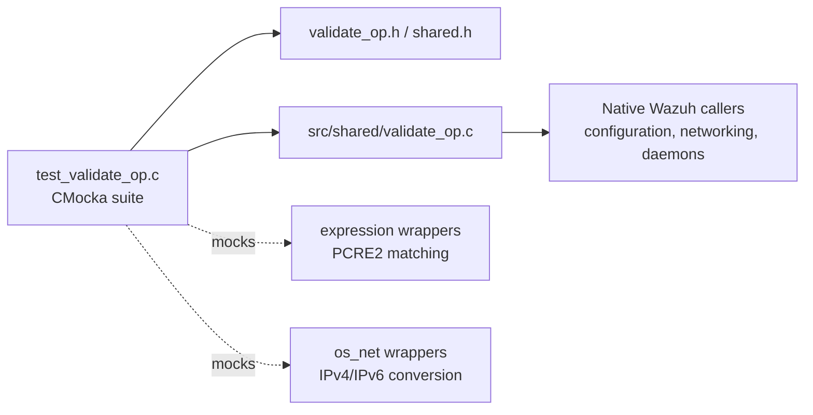
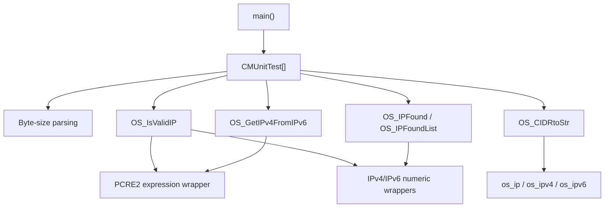
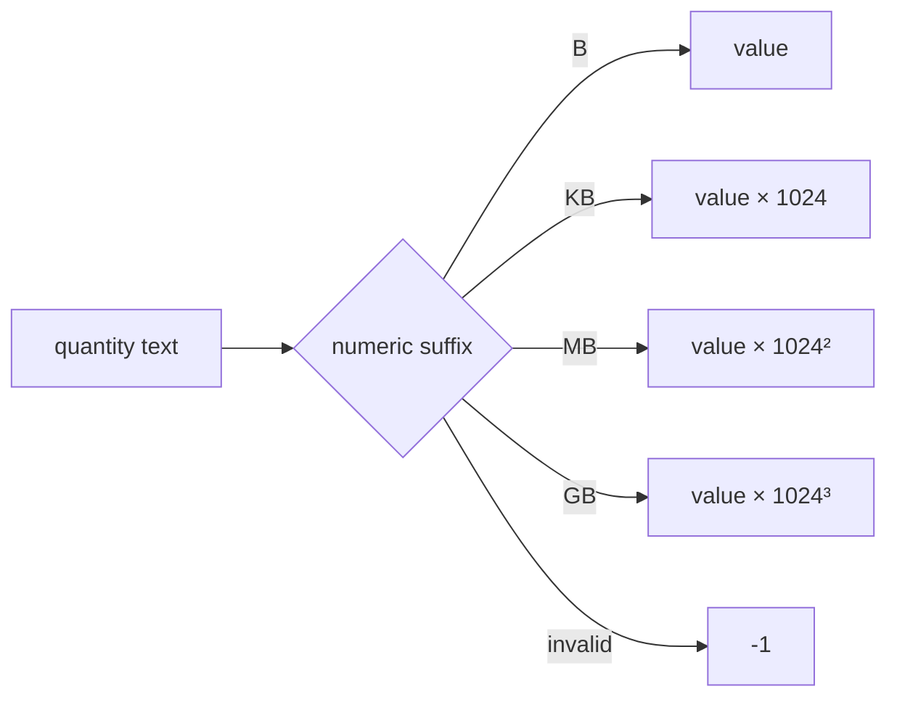
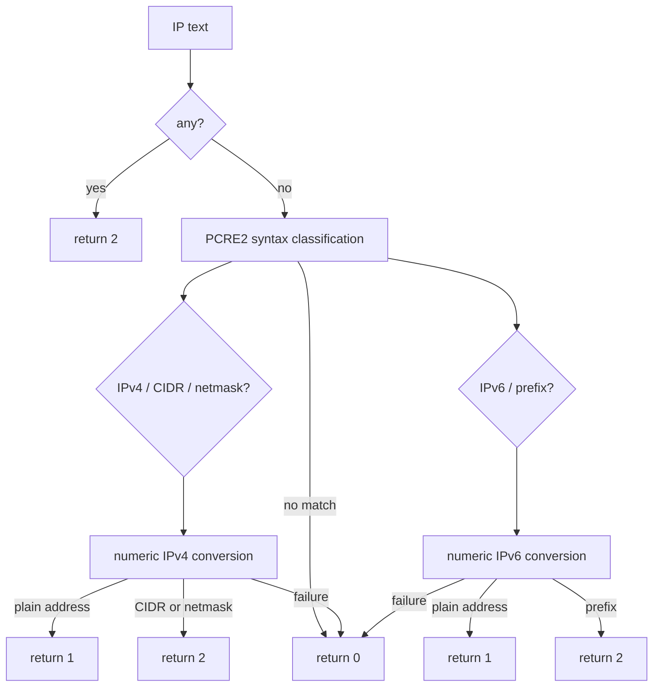
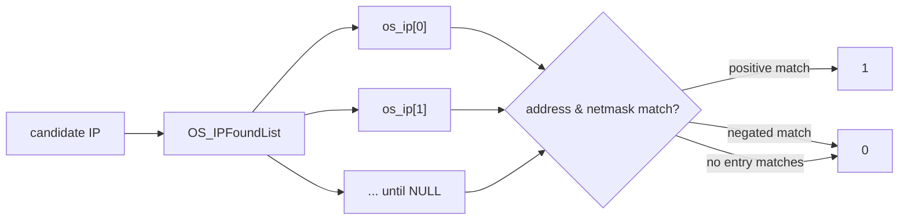
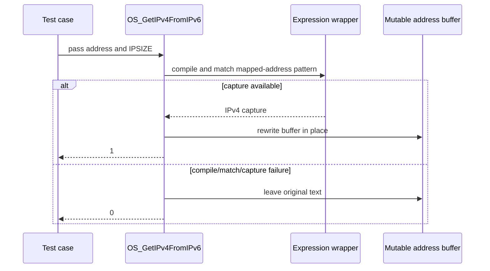
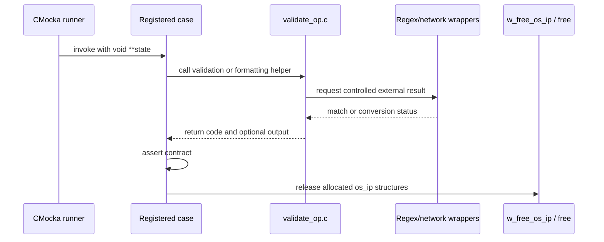

# `test_validate_op`

`test_validate_op` is the CMocka unit-test module for Wazuh's low-level validation helpers in `src/shared/validate_op.c`. It verifies byte-size parsing, IPv4/IPv6 parsing and matching, CIDR/netmask formatting, IPv4-mapped IPv6 conversion, and the error paths around malformed input and mocked conversion/regex failures.

The test source is [`src/unit_tests/shared/test_validate_op.c`](src/unit_tests/shared/test_validate_op.c). The production implementation belongs to the shared string-validation layer documented in [shared_lib_string_validation.md](shared_lib_string_validation.md). CMocka setup and wrapper conventions are described in [test_infrastructure.md](test_infrastructure.md); socket/address conversion helpers are related to [os_net.md](os_net.md).

## Purpose and system position

The module protects shared validation code used by native daemons, configuration readers, network components, and higher-level API/framework code. It is a verification module, not a runtime service: `main` registers test cases and returns the status from `cmocka_run_group_tests`.



## Architecture

| Component | Responsibility |
|---|---|
| `CMUnitTest` | CMocka test descriptor used by the registration table. |
| `main` | Groups and registers all cases, then runs the suite. |
| `w_validate_bytes_*` cases | Verify numeric byte quantities and unit conversion. |
| `OS_IsValidIP_*` cases | Verify accepted and rejected IPv4/IPv6 forms, prefixes, and netmasks. |
| `OS_IPFound*` cases | Verify membership against one address or a list, including negation. |
| `OS_CIDRtoStr_*` cases | Verify conversion of an internal `os_ip` representation to text. |
| `OS_GetIPv4FromIPv6_*` cases | Verify extraction from IPv4-mapped IPv6 text. |
| Wrapper functions | Control regex and numeric conversion outcomes so error paths are deterministic. |



The test includes `../../shared/validate_op.c` directly. Consequently, the suite exercises the implementation in the test translation unit while replacing selected external behavior through wrappers. This makes parser and comparison branches observable without depending on host networking or a particular regex engine result.

## Functional coverage

### Byte-size validation

`w_validate_bytes` is tested with:

- a non-numeric value (`hello`), which returns `-1`;
- bytes (`1024B`), returning `1024`;
- kilobytes (`1024KB`), megabytes (`1024MB`), and gigabytes (`1024GB`), using powers of 1024.



### IP validation

`OS_IsValidIP` covers the following behavior:

- `NULL` is invalid; the special value `any` returns the dedicated result `2`.
- Plain IPv4 addresses return `1` and populate `os_ip` as IPv4.
- IPv4 CIDR prefixes and dotted netmasks return `2` when structurally and numerically valid.
- IPv4 addresses and netmasks are rejected when numeric conversion fails, octets are out of range, leading-zero forms are invalid, or prefix values exceed the address width.
- IPv6 full and compressed forms return `1`; IPv6 prefixes return `2`.
- IPv4-mapped IPv6 text such as `::ffff:10.2.3.1` is accepted as IPv6 input.
- Invalid compression, invalid hexadecimal groups, too many groups, invalid prefixes, and numeric conversion failures return `0`.
- A caller may pass `NULL` for the output `os_ip`; validation still returns the appropriate status.

The suite uses `os_ip`, `os_ipv4`, and `os_ipv6` fields to verify address family and parsed storage. Numeric conversion is controlled with `__wrap_get_ipv4_numeric` and `__wrap_get_ipv6_numeric`; expression allocation, compilation, and matching are controlled through the expression wrappers.



### Address membership

`OS_IPFound` compares a candidate address with one parsed `os_ip` value. The tests establish that:

- matching IPv4 and IPv6 addresses return `1`;
- a non-matching address returns `0`;
- a leading `!` on the stored address negates the match, so an equal address returns `0`;
- malformed candidates return `0`;
- IPv4 and IPv6 comparisons use the corresponding stored address and netmask.

`OS_IPFoundList` applies the same operation to a NULL-terminated array of `os_ip *`. It returns `1` when a positive entry matches, returns `0` for no match, and honors negated entries. The cases also cover an invalid candidate and invalid IPv6 comparisons.



### CIDR formatting

`OS_CIDRtoStr` serializes an `os_ip` object into a caller-provided `IPSIZE` buffer. The tests cover:

- `any`, preserving the literal `any` representation;
- IPv4 host addresses without a suffix when the netmask is `/32`;
- IPv4 `/0` and `/24` output;
- IPv6 `/0`, `/64`, and `/127` output;
- IPv6 `/128`, which is emitted without a prefix because it represents a host address.

The function is expected to return `0` for these valid formatting operations and to write a NUL-terminated string suitable for exact C-string comparison.

### IPv4-mapped IPv6 conversion

`OS_GetIPv4FromIPv6` rewrites an IPv4-mapped IPv6 string in place. The success cases convert both a plain address and an address with a dotted netmask:

```text
::ffff:10.2.2.3                    -> 10.2.2.3
::ffff:10.2.2.3/255.255.255.255   -> 10.2.2.3/255.255.255.255
```

Compilation failure, regex mismatch, and a missing capture group leave the input unchanged and return `0`. A successful capture returns `1`.



## Test process and dependencies



Direct dependencies from the test source are:

| Dependency | Use |
|---|---|
| `cmocka.h` | Assertions, expectations, return-value control, and test execution. |
| `shared.h` | Wazuh allocation helpers, status constants, and shared address types. |
| `validate_op.h` | Public declarations for the validation functions. |
| `shared/validate_op.c` | Implementation under test, included directly. |
| `expression_wrappers.h` | Mocks PCRE2 expression allocation, compilation, and matching. |
| `os_net_wrappers.h` | Mocks numeric IPv4/IPv6 conversion. |

The tests allocate and release `os_ip` trees explicitly with `w_free_os_ip`. List tests allocate the pointer array separately and release it after freeing each element. This ownership pattern is part of the test fixture behavior and should be preserved when adding cases.

## Return-code contract captured by the suite

| Function | Success / classification | Failure |
|---|---|---|
| `w_validate_bytes` | Parsed byte count | `-1` for non-numeric input |
| `OS_IsValidIP` | `1` plain address, `2` CIDR/netmask or `any` | `0` |
| `OS_IPFound` | `1` matching positive entry | `0`, including negated match |
| `OS_IPFoundList` | `1` when a positive list entry matches | `0` otherwise |
| `OS_CIDRtoStr` | `0` and formatted output | Failure behavior is not broadly covered here |
| `OS_GetIPv4FromIPv6` | `1` and in-place rewrite | `0`, preserving input |

## Coverage boundaries

This is a deterministic unit suite. It does not establish socket behavior, DNS behavior, concurrency, performance, or complete configuration validation. It also does not exhaustively test output-buffer exhaustion for `OS_CIDRtoStr`; its focus is address parsing, comparison, and representative serialization.

When modifying `src/shared/validate_op.c`, `validate_op.h`, `os_ip` structures, or the numeric/expression wrapper contracts, update this suite for changed return codes, accepted syntax, address-family state, ownership, or in-place mutation. Broader integration behavior belongs in the owning module tests rather than being duplicated here.
