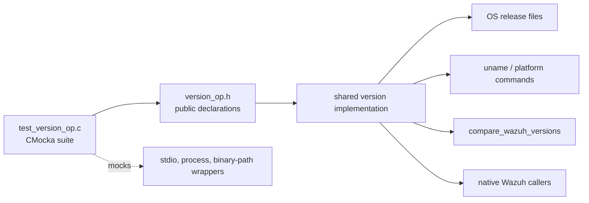
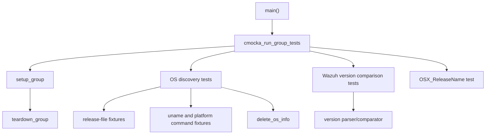
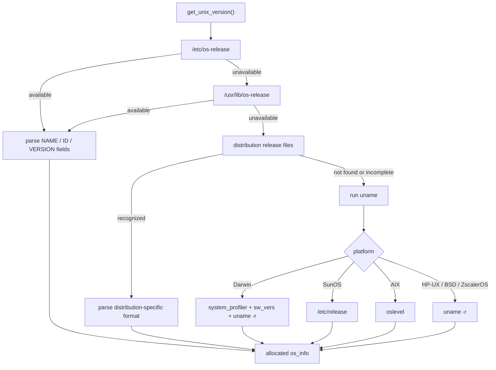
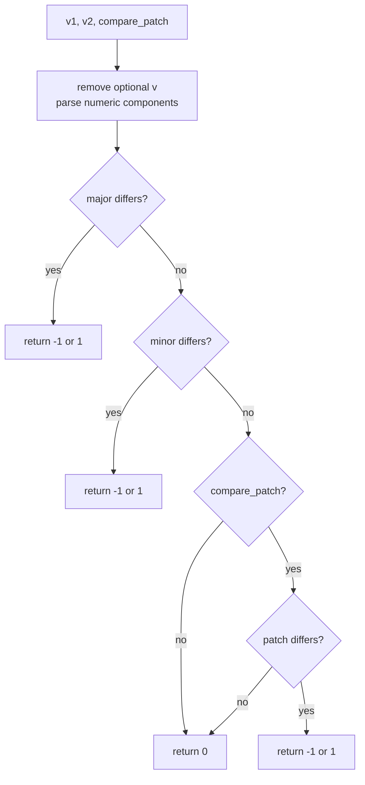
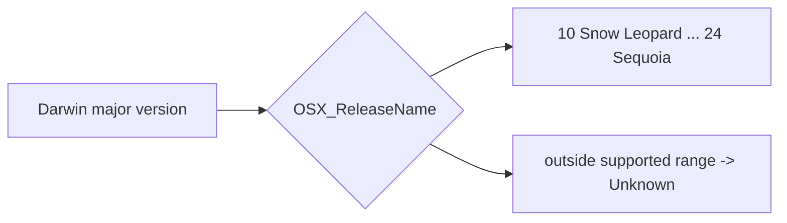
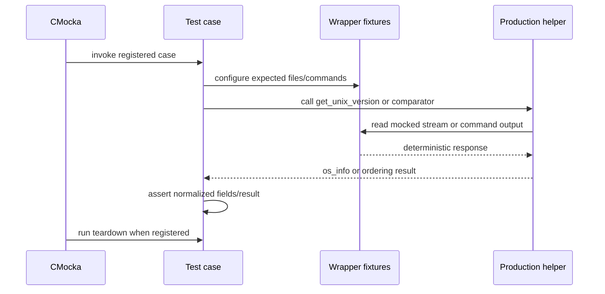
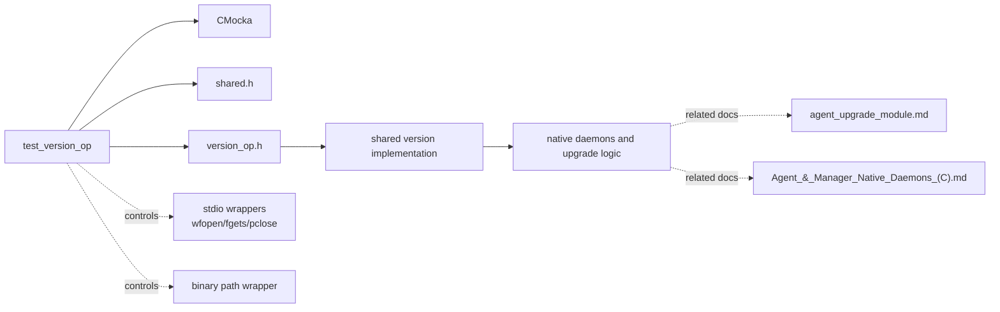

# `test_version_op`

`test_version_op` is the CMocka unit-test module for Wazuh’s shared operating-system and version helpers. It verifies two related contracts: discovery and normalization of Unix-like operating-system metadata, and comparison of Wazuh version strings. The test source is `src/unit_tests/shared/test_version_op.c`; the production declarations are provided by `src/headers/version_op.h` and the implementation belongs to the shared native library.

The module is test-only. It does not detect the host OS during normal Wazuh execution; instead, it supplies deterministic mocked files and command output to exercise the production detection logic.

## Purpose and system position

Version and platform metadata is consumed by native daemons and upgrade-related code when selecting compatible behavior, reporting agent information, or comparing installed and target Wazuh releases. Related consumers should be documented through links rather than duplicated here; see [shared_lib.md](shared_lib.md), [agent_upgrade_module.md](agent_upgrade_module.md), and [wazuh_modules_core.md](wazuh_modules_core.md).

## Architecture

| Component | Responsibility |
|---|---|
| `main` | Registers the test cases and runs them with `cmocka_run_group_tests`. |
| `setup_group` | Enables `test_mode` for the duration of the suite. |
| `teardown_group` | Restores `test_mode` to zero. |
| `delete_os_info` | Frees the `os_info` object returned by OS-detection tests. |
| `test_get_unix_version_*` | Exercise release-file, `uname`, and platform-command detection paths. |
| `test_compare_wazuh_versions_*` | Verify equality and ordering for major, minor, and patch components. |
| `test_OSX_ReleaseName` | Verifies Darwin major-version to marketing-name mapping. |
| CMocka wrappers | Provide controlled file contents, command paths, streams, and process output. |

The suite is compiled with Linux-only OS-discovery tests under `__linux__`. Version comparison tests are platform-independent, while the macOS release-name mapping is registered only in the Linux build shown by this source.

## OS discovery behavior

`get_unix_version()` returns an allocated `os_info` structure. The tests verify the normalized fields `os_name`, `os_major`, `os_minor`, `os_patch`, `os_version`, `os_codename`, `os_platform`, and `sysname` where applicable.

### Source precedence and fallback

The tests model a fallback chain rather than assuming one universal release-file layout:

1. Read `/etc/os-release`.
2. If unavailable, read `/usr/lib/os-release`.
3. Try distribution-specific files such as `/etc/centos-release`, `/etc/fedora-release`, `/etc/redhat-release`, `/etc/arch-release`, `/etc/gentoo-release`, `/etc/SuSE-release`, `/etc/lsb-release`, `/etc/debian_version`, `/etc/slackware-version`, and `/etc/alpine-release`.
4. If release files are insufficient, invoke `uname` and platform-specific commands such as `system_profiler`, `sw_vers`, or `oslevel`.

### Linux distribution cases

The suite covers structured `os-release` parsing for Ubuntu, Alpine, Arch Linux, Manjaro, and openSUSE Tumbleweed. It checks that:

- quoted and unquoted values are accepted;
- major, minor, and patch components are split from `VERSION` or `VERSION_ID` when meaningful;
- codenames are extracted from Ubuntu’s parenthesized version text;
- rolling or template versions are allowed to produce an empty normalized version;
- the distribution identifier becomes `os_platform`.

Fallback tests cover CentOS, Fedora, RHEL, Ubuntu through `/etc/lsb-release`, Gentoo, SUSE, Debian, Slackware, and Alpine. For example, CentOS release text is normalized to `os_platform = "centos"` and a `7.5` version, while Fedora can produce a major-only version.

### Non-Linux and unusual Unix cases

The mocked `uname` paths cover:

- Darwin/macOS: uses `system_profiler` to identify the OS name and `sw_vers` for the product version and build; the test expects normalized `darwin` platform data.
- SunOS/Solaris: parses `/etc/release`, including both `11.1` and Solaris 10 `x/y` formats.
- HP-UX: parses the `B.3.5` form returned by `uname -r` into `3.5`.
- BSD and ZscalerOS: parses kernel release text and normalizes the platform to `bsd`.
- AIX: uses `oslevel` and extracts `7.1`.

The expected `sysname` values in the supplied tests are historically fixed to `Linux` even for mocked non-Linux branches. This is a test fixture expectation and should not be interpreted as a general runtime guarantee.

## Wazuh version comparison

`compare_wazuh_versions(v1, v2, compare_patch)` returns an ordering result:

| Result | Meaning |
|---:|---|
| `1` | `v1` is greater than `v2`. |
| `0` | Versions compare equal under the selected precision. |
| `-1` | `v1` is lower than `v2`. |

The tests establish that a leading `v` is ignored and that missing components compare as zero at the precision being considered. Major, minor, and patch comparisons short-circuit in that order. When `compare_patch` is false, patch differences do not affect the result.

Covered examples include `v4.0.0` versus `v4.0.0`, `4` versus `v4`, major/minor/patch ordering, and the `4.0.1` versus `v4.0.0` case with patch comparison both enabled and disabled. Passing two NULL pointers is expected to return equality (`0`) in the tested contract.

## macOS release-name mapping

`OSX_ReleaseName()` maps Darwin major versions to macOS marketing names. The test verifies versions 10 through 24:

The cases explicitly verify `Unknown` for 9 and 25, and names from Snow Leopard through Sequoia for 10–24. This makes the mapping table’s boundaries visible and prevents accidental reuse of a stale release name.

## Test execution and isolation

OS-discovery cases use `cmocka_unit_test_teardown(..., delete_os_info)`. The test stores the returned pointer in CMocka state so the allocated structure is released after assertions. The group fixture toggles `test_mode`, allowing shared wrappers to behave in deterministic test mode. Version comparison cases use no heap fixture and therefore have no per-test teardown.

## Dependency relationships

The suite does not test the full agent-upgrade workflow, daemon lifecycle, or system-information provider. Those modules consume or provide adjacent data and should be consulted for end-to-end behavior: [agent_upgrade_module.md](agent_upgrade_module.md), [SysInfo_Provider.md](SysInfo_Provider.md), and [framework_core_utils_query_engine.md](framework_core_utils_query_engine.md).

## Coverage summary and limitations

The supplied tests cover:

- OS metadata parsing across common Linux distributions and several Unix families;
- release-file fallback and command-based discovery;
- version component normalization and ordering;
- optional patch comparison;
- NULL version comparison behavior;
- macOS release-name boundaries;
- cleanup of allocated `os_info` results.

They do not explicitly cover malformed release-file lines, allocation failures, extremely large numeric components, command execution failures after successful path lookup, locale-specific output, concurrent calls, or every possible Unix distribution. The non-Linux assertions also reflect mocked historical behavior in this file, so maintainers should verify the production platform contract in `version_op.h` and its implementation before changing those expectations.

