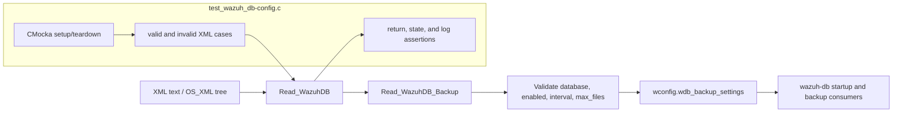
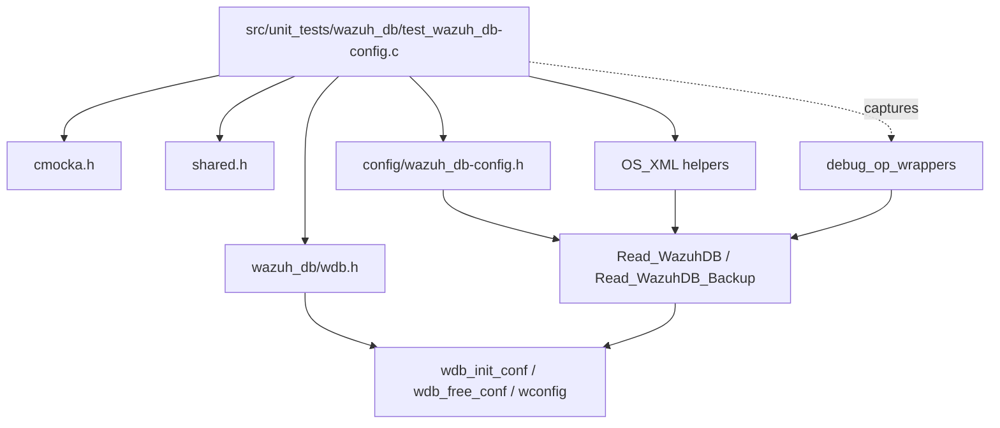
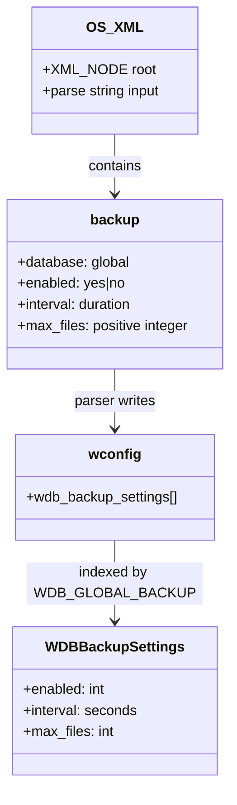
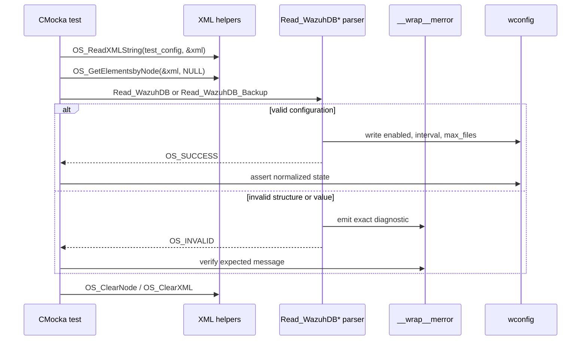
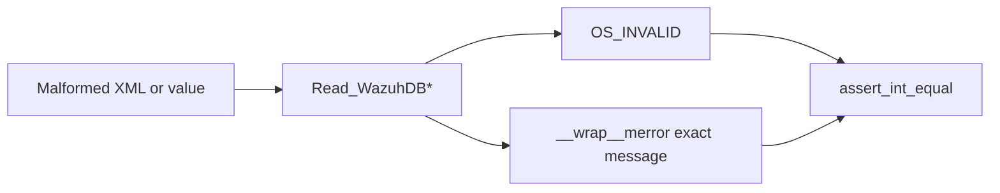
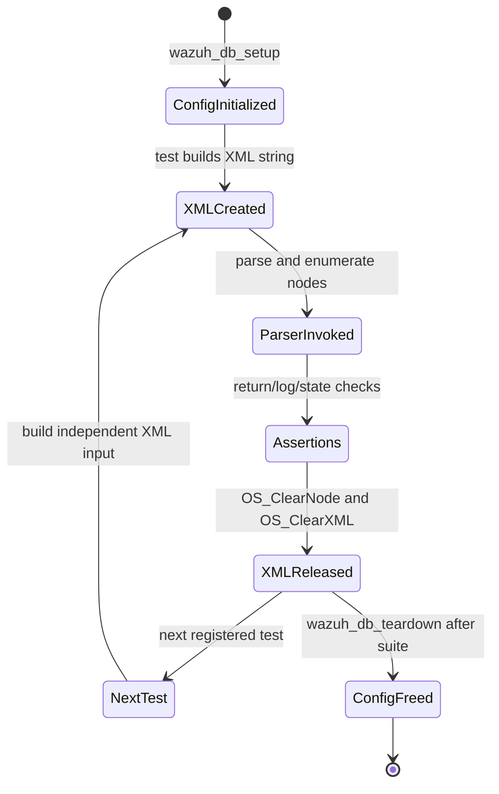

# `test_wazuh_db_config` module

`test_wazuh_db_config` is the CMocka unit-test suite for the Wazuh DB XML configuration parser. It validates `Read_WazuhDB` and `Read_WazuhDB_Backup`, including accepted backup settings, conversion of duration values, numeric constraints, malformed XML nodes, invalid attributes, and null configuration content.

The suite is intentionally limited to configuration parsing. The runtime database engine, SQLite lifecycle, statement cache, backup execution, and database protocol are documented by [Wazuh DB configuration](Wazuh_DB_Config.md), [Wazuh DB engine](wazuh_db_engine.md), [Wazuh DB command parser](wazuh_db_command_parser.md), and [Wazuh DB daemon](wazuh_db.md).

## System position

The test belongs to `Unit_Tests_-_Wazuh_DB` and exercises the configuration boundary used when the `wazuh-db` daemon initializes its global configuration. The parser consumes the generic XML representation produced by the shared XML library and writes normalized values into the global `wconfig` object used by the database daemon.



## Responsibilities and boundaries

| Component | Role in this module |
| --- | --- |
| `wazuh_db_setup` | Calls `wdb_init_conf()` before every test group. |
| `wazuh_db_teardown` | Calls `wdb_free_conf()` after the group to release configuration state. |
| `main` | Registers the CMocka tests and runs them with the group fixtures. |
| `Read_WazuhDB` | Parses top-level Wazuh DB configuration nodes and dispatches recognized children. |
| `Read_WazuhDB_Backup` | Parses one `<backup database="...">` block into a selected backup-settings slot. |
| `OS_ReadXMLString` / `OS_GetElementsbyNode` | Build the XML input used by the tests. |
| `OS_ClearNode` / `OS_ClearXML` | Release per-test XML allocations. |
| `__wrap__merror` | Captures expected parser diagnostics without emitting real daemon logs. |
| `wconfig.wdb_backup_settings` | Observable normalized configuration state asserted by valid cases. |

The test does not verify that backups are created, rotated, restored, or removed. Those operations belong to the database runtime and related backup-management components; see [Wazuh DB global](wazuh_db_global.md) and [Wazuh DB engine](wazuh_db_engine.md).

## Architecture and dependencies



The production parser is isolated at three useful seams:

1. XML is constructed from strings, avoiding filesystem configuration files.
2. Logging is wrapped so invalid-input diagnostics can be compared exactly.
3. Configuration is initialized and freed around the suite, preventing one test's settings from leaking into another.

## Configuration model under test

The supported form is a `<backup>` element with a `database` attribute. The tested `global` database maps to `WDB_GLOBAL_BACKUP` and stores three normalized fields:

| XML field | Accepted values in the suite | Stored representation |
| --- | --- | --- |
| `database` attribute | `global` | Selects `wconfig.wdb_backup_settings[WDB_GLOBAL_BACKUP]`. |
| `enabled` | `yes`, `no` | Boolean `1` or `0`. |
| `interval` | Duration strings such as `1d`, `12h`, `120w` | Seconds (`86400`, `43200`, `72576000`). |
| `max_files` | Positive integer, such as `1`, `3`, `10` | Integer count. |

The suite confirms that the parser performs semantic conversion rather than merely accepting XML text. For example, `120w` is stored as `72,576,000` seconds and `1d` as `86,400` seconds.



## Parsing flow

### Top-level `Read_WazuhDB`

`Read_WazuhDB` receives the XML document and the list of child nodes. It rejects null or unknown nodes, validates the `<backup>` attribute, and delegates the recognized block to `Read_WazuhDB_Backup`.

```mermaid
flowchart TD
    Start[Read_WazuhDB(xml, nodes)] --> Node{nodes and element valid?}
    Node -- no --> E1[OS_INVALID + error 1231]
    Node -- unknown element --> E2[OS_INVALID + error 1230]
    Node -- backup --> Attr{database attribute valid?}
    Attr -- no/missing --> E3[OS_INVALID + error 1233]
    Attr -- unsupported value --> E4[OS_INVALID + error 1235]
    Attr -- global --> Child[Read_WazuhDB_Backup]
    Child --> Result[OS_SUCCESS or OS_INVALID]
```

### `Read_WazuhDB_Backup`

The backup parser walks child elements, validates each value, converts accepted values, and exposes the resulting settings through the selected configuration slot.

```mermaid
flowchart TD
    Start[Read_WazuhDB_Backup(xml, node, backup_id)] --> Root{backup node valid?}
    Root -- no --> Invalid[OS_INVALID]
    Root -- yes --> Children[Iterate child elements]
    Children --> Name{recognized child?}
    Name -- no --> InvalidName[Error 1230]
    Name -- enabled --> Enabled{yes or no?}
    Enabled -- no --> InvalidValue[Error 1235]
    Enabled -- yes/no --> Next[Continue]
    Name -- interval --> Interval{valid duration?}
    Interval -- no --> InvalidValue
    Interval -- yes --> Next
    Name -- max_files --> Max{positive integer?}
    Max -- no --> InvalidValue
    Max -- yes --> Next
    Next --> More{more children?}
    More -- yes --> Name
    More -- no --> Commit[Store normalized settings]
    Commit --> Success[OS_SUCCESS]
    Invalid --> Return[OS_INVALID]
    InvalidName --> Return
    InvalidValue --> Return
```

## Data and diagnostic flow



The exact diagnostic text is part of the tested contract. The relevant error families are:

| Error | Condition covered |
| ---: | --- |
| `1230` | Unknown top-level or child element. |
| `1231` | Null element/content encountered while walking configuration nodes. |
| `1233` | Missing or unsupported attribute on `<backup>`. |
| `1234` | Null content for a child element. |
| `1235` | Invalid value for `database`, `enabled`, `interval`, or `max_files`. |

## Test inventory

The source registers 16 CMocka tests. The module tree lists the primary valid and null cases; the implementation also contains explicit invalid-element, invalid-attribute, and invalid-value cases documented below.

| Area | Tests | Coverage |
| --- | --- | --- |
| `Read_WazuhDB` structure and attributes | `test_Read_WazuhDB_element_NULL`, `test_Read_WazuhDB_element_invalid`, `test_Read_WazuhDB_attribute_NULL`, `test_Read_WazuhDB_attribute_invalid`, `test_Read_WazuhDB_attribute_value_invalid` | Null node, unknown element, missing/unknown attribute, unsupported database value. |
| `Read_WazuhDB` success | `test_Read_WazuhDB_valid_config` | Complete global backup block and normalized state. |
| Backup node structure | `test_Read_WazuhDB_Backup_element_NULL`, `test_Read_WazuhDB_Backup_element_invalid`, `test_Read_WazuhDB_Backup_content_NULL` | Null child, unknown child, and missing child content. |
| `enabled` validation | `test_Read_WazuhDB_Backup_enabled_empty_value`, `test_Read_WazuhDB_Backup_enabled_invalid_value` | Empty and non-boolean values. |
| `interval` validation | `test_Read_WazuhDB_Backup_interval_invalid_value` | Non-duration input. |
| `max_files` validation | `test_Read_WazuhDB_Backup_maxfiles_invalid_string`, `test_Read_WazuhDB_Backup_maxfiles_invalid_value` | Non-numeric and zero values. |
| Backup success | `test_Read_WazuhDB_Backup_valid_config`, `test_Read_WazuhDB_Backup_valid_config2` | Enabled and disabled configurations with different durations and retention counts. |

### Valid cases

- `test_Read_WazuhDB_valid_config` parses a complete `<backup database='global'>` block with `yes`, `120w`, and `1`, then checks `enabled == 1`, `interval == 72576000`, and `max_files == 1`.
- `test_Read_WazuhDB_Backup_valid_config` checks the direct backup parser with `yes`, `1d`, and `3`.
- `test_Read_WazuhDB_Backup_valid_config2` checks `no`, `12h`, and `10`, proving that disabled backups still accept and retain valid interval and retention settings.

### Invalid cases

Invalid cases expect both `OS_INVALID` and the corresponding wrapped error. This is important because the tests protect parser behavior for malformed configuration, not just return-code handling.



The suite covers null node pointers, unknown names, absent attributes, unsupported attribute values, empty content, non-boolean enablement, invalid duration syntax, non-numeric retention, and zero retention.

## Fixture and memory lifecycle



`wazuh_db_setup` initializes the global configuration through `wdb_init_conf()`. This gives each group run a known settings structure. `wazuh_db_teardown` calls `wdb_free_conf()` so allocated backup settings do not survive the test process.

Each test constructs its own `OS_XML` object and node list. After the assertion, it releases the node list and XML tree. The test suite therefore exercises parser behavior without relying on persistent files or shared XML state.

## Execution and maintenance

The test is compiled as part of the Wazuh DB CMocka tests and is run through the `main` function with group setup and teardown. A focused run depends on the repository's unit-test build system; the source-level test entry point is:

```text
src/unit_tests/wazuh_db/test_wazuh_db-config.c
```

When changing the parser:

1. Add a valid case whenever a new configuration attribute or value is accepted.
2. Add an invalid case for empty, malformed, unsupported, and boundary values.
3. Assert normalized `wconfig` fields for successful parsing.
4. Preserve exact diagnostic assertions when error codes or messages are part of the configuration contract.
5. Keep XML allocation cleanup in every test, including early-error cases.
6. Pair parser changes with the broader [Wazuh DB engine](wazuh_db_engine.md), [Wazuh DB global](wazuh_db_global.md), and [Wazuh DB state](wazuh_db_state.md) tests when runtime behavior is affected.

## Related documentation

- [Wazuh DB configuration](Wazuh_DB_Config.md) — production configuration structures and parser context.
- [Wazuh DB engine](wazuh_db_engine.md) — SQLite connections, transactions, statements, and runtime persistence.
- [Wazuh DB daemon](wazuh_db.md) — daemon lifecycle and component relationships.
- [Wazuh DB command parser](wazuh_db_command_parser.md) — wire-command parsing and dispatch.
- [Wazuh DB global](wazuh_db_global.md) — global agent/group database behavior and backup operations.
- [Wazuh DB metadata and upgrade](wazuh_db_metadata_upgrade.md) — database metadata, schema upgrades, and backup creation.

## Source references

- Test implementation: `src/unit_tests/wazuh_db/test_wazuh_db-config.c`
- Configuration parser declarations: `src/config/wazuh_db-config.h`
- Database configuration state: `src/wazuh_db/wdb.h`
- Shared XML helpers: `src/os_xml/os_xml.h`
- Logging wrapper used by the tests: `src/unit_tests/wrappers/wazuh/shared/debug_op_wrappers.h`
