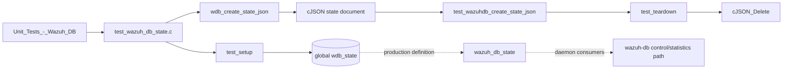
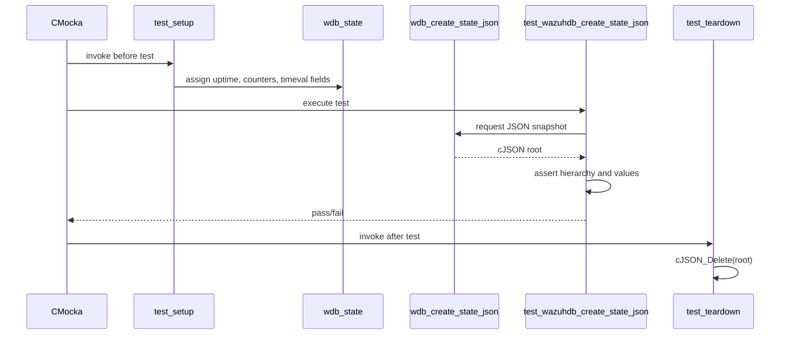
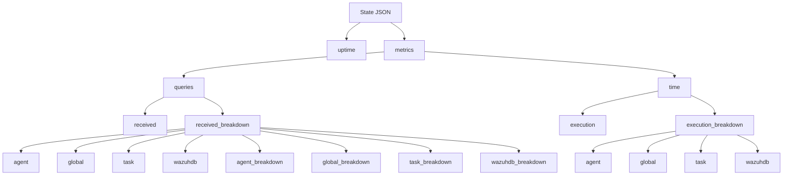
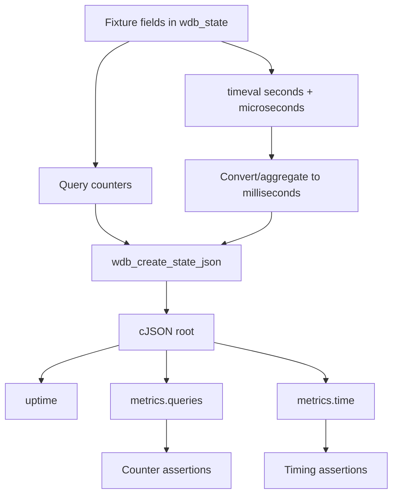

# `test_wazuh_db_state` module

`test_wazuh_db_state` is the CMocka unit-test module for the Wazuh DB state serializer. It initializes the global `wdb_state` structure with representative counters and timings, calls `wdb_create_state_json()`, and verifies that the resulting nested cJSON document preserves the expected metric hierarchy and converted execution times.

The production data model, counter-update API, locking strategy, and serializer implementation are documented in [wazuh_db_state.md](wazuh_db_state.md). This document describes the test boundary and its role in the Wazuh DB test suite.

## System position

The test is part of `Unit_Tests_-_Wazuh_DB` and targets the state-reporting path of the `wazuh_db` daemon. It does not execute SQL, open sockets, or exercise the daemon loop. Instead, it supplies an in-memory snapshot of the production singleton and validates the public JSON serialization result.



## Responsibilities and boundaries

| Component | Responsibility |
| --- | --- |
| `CMUnitTest` | CMocka test registration type used by `main`. |
| `test_setup` | Populates `wdb_state` with deterministic uptime, query counters, and `timeval` values. |
| `wdb_create_state_json` | Production serializer under test; converts the state structure into nested cJSON. |
| `test_wazuhdb_create_state_json` | Verifies object existence and selected count/time values at every major hierarchy. |
| `test_teardown` | Deletes the cJSON tree stored in the CMocka state pointer. |
| `main` | Registers one setup/teardown-wrapped test and runs the CMocka group. |

The module deliberately excludes counter mutation, mutex behavior, SQL execution, query dispatch, socket transport, and API formatting. Those concerns belong to the production module and its callers; see [wazuh_db_state.md](wazuh_db_state.md), [wazuh_db_engine.md](wazuh_db_engine.md), and [wazuh_db_command_parser.md](wazuh_db_command_parser.md).

## Architecture and dependencies

```mermaid
graph TD
    Test[src/unit_tests/wazuh_db/test_wazuh_db_state.c]
    Test --> CMocka[cmocka.h]
    Test --> Header[../wazuh_db/wdb_state.h]
    Header --> Model[wdb_state_t and nested breakdown structs]
    Test -. extern .-> Singleton[(wdb_state)]
    Test --> Serializer[wdb_create_state_json()]
    Serializer --> CJSON[cJSON object tree]
    Test --> Assertions[CMocka assertions]
    Test --> Cleanup[cJSON_Delete]

    Model -. production implementation .-> Production[wazuh_db_state.c]
    Production --> Runtime[wazuh-db daemon metrics path]
```

The test includes `wdb_state.h` and declares the production singleton with `extern wdb_state_t wdb_state`. This is important: the fixture writes directly into the same state object consumed by the serializer, making the test an end-to-end check of the struct-to-JSON mapping within the module boundary.

## Test lifecycle



### Setup fixture

`test_setup` creates a broad, deterministic fixture rather than a minimal one. It covers:

- top-level uptime (`123456789`) and total received queries (`856`);
- agent, global, task, and generic Wazuh DB query totals;
- database operation counters such as SQL, remove, begin, commit, close, vacuum, backup, and fragmentation;
- FIM/syscheck, rootcheck, SCA, CIS-CAT, current Syscollector, and deprecated Syscollector counters;
- global agent, group, belongs, and labels operations;
- task operations for upgrades, custom upgrades, status, results, cancellation, timeout, and cleanup;
- elapsed times represented as seconds plus microseconds, allowing the serializer’s millisecond conversion to be checked.

The fixture values are intentionally nonuniform. This makes accidental field swaps or incorrect nesting visible in the assertions.

### Teardown

The test stores the returned cJSON root in the CMocka state pointer. `test_teardown` retrieves it and calls `cJSON_Delete`, ensuring the entire generated tree is released after the assertion phase.

## JSON contract under test

The expected output has two principal branches beneath `metrics`:



The test verifies the following mapping patterns:

| JSON area | Meaning | Representative assertions |
| --- | --- | --- |
| `uptime` | Daemon uptime copied from `wdb_state.uptime`. | `123456789` |
| `metrics.queries.received` | Total received queries. | `856` |
| `received_breakdown.agent` | Total per-agent queries. | `365` |
| `agent_breakdown.db` | Agent database lifecycle/query counters. | `sql`, `remove`, `begin`, `commit`, `close`, `vacuum`, `get_fragmentation` |
| `agent_breakdown.tables` | Agent table-specific counters. | `syscheck`, `rootcheck`, `sca`, `ciscat`, `syscollector`, `sync` |
| `global_breakdown.tables` | Global database operation counters. | agent, group, belongs, labels |
| `task_breakdown.tables.tasks` | Task-management counters. | upgrade, status, result, timeout, delete-old |
| `wazuhdb_breakdown.db` | Generic Wazuh DB counters. | `remove` |
| `metrics.time.execution` | Total elapsed execution time in milliseconds. | `26212` |
| `execution_breakdown` | Per-category elapsed time in milliseconds. | agent `18533`, global `7091`, task `456`, wazuhdb `132` |

## Serialization and data flow



The serializer is expected to preserve counters as integer values and normalize accumulated `timeval` values into integer millisecond values. For example, the fixture’s agent SQL time of 1 second and 546332 microseconds is asserted as `1546` milliseconds, while the global backup time of 1 second and 145452 microseconds is asserted as `1145` milliseconds.

## Assertion strategy

`test_wazuhdb_create_state_json` follows the output tree from the root downward:

1. Assert the root exists and verify `uptime`.
2. Assert `metrics`, then `queries`, then total and received-breakdown nodes.
3. Verify each major category and its nested database/table operation values.
4. Assert `metrics.time`, total execution time, and all major timing breakdowns.
5. Use `assert_non_null` before reading `valueint`, so a missing node fails at the structural boundary instead of causing an unsafe dereference.

This combination checks both schema shape and selected value fidelity. It is stronger than checking only a serialized string because it does not depend on JSON key ordering or formatting.

## Notable coverage detail

The current test contains a likely assertion typo in the agent syscheck timing section: `fim_registry_key` is located, but the following value assertion reads `fim_registry_value` and expects `223`; the same value assertion is then repeated. The fixture sets `fim_registry_key_time` to `222548` microseconds, so a maintenance improvement would be to assert `fim_registry_key == 222` and retain the separate `fim_registry_value == 223` assertion.

## Execution model

The test is registered as one CMocka test:

```c
cmocka_unit_test_setup_teardown(
    test_wazuhdb_create_state_json,
    test_setup,
    test_teardown
)
```

`main` passes this array to `cmocka_run_group_tests`. The source itself does not define a command-line interface or test filtering behavior; filtering and build integration are provided by the repository’s unit-test build system.

## Related documentation

- [wazuh_db_state.md](wazuh_db_state.md) — production state model, counter APIs, locking, and JSON serializer.
- [wazuh_db.md](wazuh_db.md) — parent Wazuh DB daemon architecture.
- [wazuh_db_engine.md](wazuh_db_engine.md) — SQLite execution and statement infrastructure that produces metrics.
- [wazuh_db_command_parser.md](wazuh_db_command_parser.md) — command dispatch and control-socket integration.
- [test_wazuh_db_config.md](test_wazuh_db_config.md) — neighboring Wazuh DB configuration test style and lifecycle.
