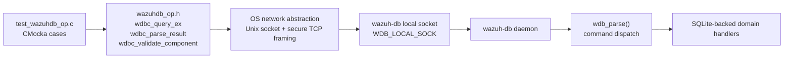
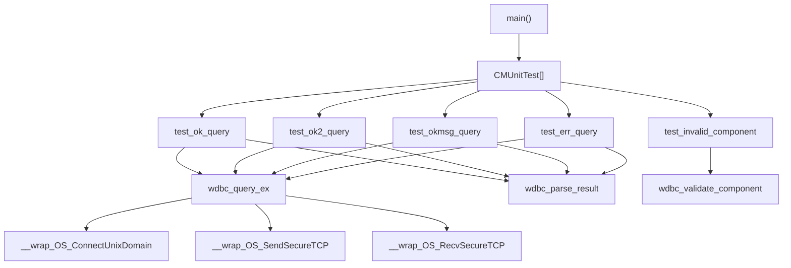
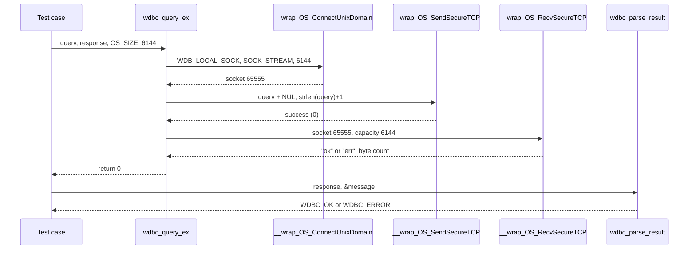
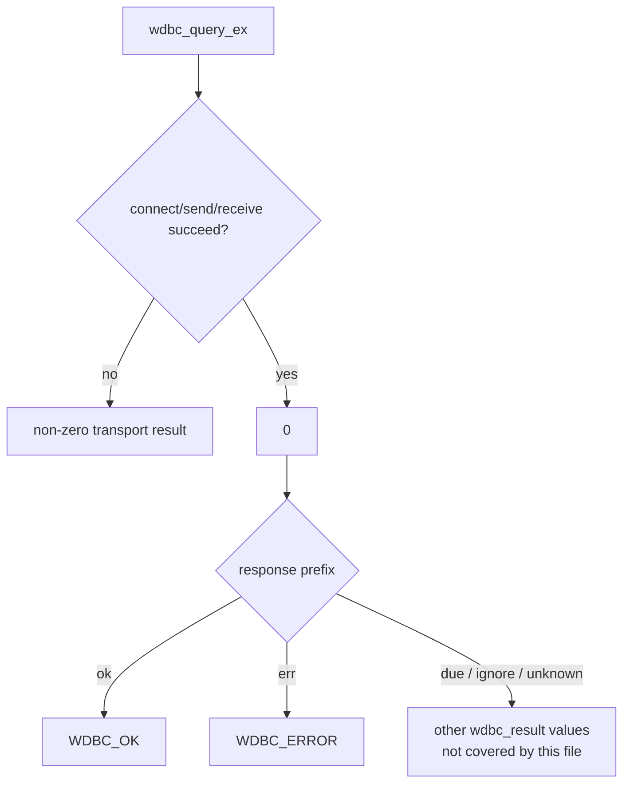
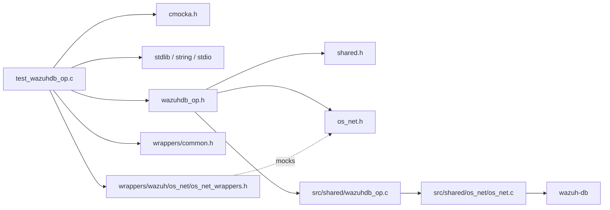

# `test_wazuhdb_op`

`test_wazuhdb_op` is the CMocka unit-test module for the native Wazuh DB protocol client declared in `src/headers/wazuhdb_op.h`. It verifies that a caller can send text commands to `wazuh-db` through the local Unix socket, receive bounded responses, classify `ok` and `err` statuses, and reject an unknown DB component name.

The test source is [`src/unit_tests/shared/test_wazuhdb_op.c`](https://github.com/wazuh/wazuh/blob/master/src/unit_tests/shared/test_wazuhdb_op.c). The production protocol implementation is covered in [shared_lib_networking](shared_lib_networking.md); the server-side command routing is documented in [wazuh_db_command_parser](wazuh_db_command_parser.md).

## Purpose and system position

The module protects the narrow boundary between native Wazuh processes and the `wazuh-db` daemon. It does not test SQLite directly and does not start a real daemon. Instead, it isolates the client API from the network implementation with CMocka wrappers.



## Architecture

| Component | Responsibility |
|---|---|
| `CMUnitTest` | CMocka test descriptor used by the registration table. |
| `main` | Registers five tests and returns `cmocka_run_group_tests()` status. |
| `test_ok_query` | Exercises an agent syscheck-save command and expects an `ok` response. |
| `test_ok2_query` | Exercises an agent syscheck-delete command and expects an `ok` response. |
| `test_okmsg_query` | Exercises an agent scan-info command and expects an `ok` response. |
| `test_err_query` | Sends an incomplete `agent 000` command and expects an `err` response. |
| `test_invalid_component` | Verifies that `random_component` maps to `WB_COMP_INVALID`. |
| `__wrap_OS_ConnectUnixDomain` | Mocks connection creation to `WDB_LOCAL_SOCK`. |
| `__wrap_OS_SendSecureTCP` | Mocks transmission and checks socket, message, and size. |
| `__wrap_OS_RecvSecureTCP` | Mocks the response payload and received byte count. |



## Tested protocol flow

Each query test follows the same interaction contract:

1. Start with `wdb_sock = -1` and a caller-owned response buffer of `OS_SIZE_6144` bytes.
2. Expect a stream Unix-domain connection to `WDB_LOCAL_SOCK`, with a maximum message size of `OS_SIZE_6144`.
3. Return the mocked descriptor `65555`.
4. Expect the exact query and `strlen(query) + 1` bytes sent through secure TCP framing.
5. Return a response (`"ok"` or `"err"`) and its byte count.
6. Assert that `wdbc_query_ex()` returns `0`.
7. Pass the response to `wdbc_parse_result()` and assert `WDBC_OK` or `WDBC_ERROR`.



## Test cases

### Successful queries

`test_ok_query` uses:

```text
agent 000 syscheck save file 0:0:0:0:0:0:0:0:0:0:0:0!0:0 /tmp/test.file
```

It represents a syscheck/FIM save operation. `test_ok2_query` uses `agent 000 syscheck delete /tmp/test.file`, covering a deletion command. `test_okmsg_query` uses `agent 000 syscheck scan_info_get start_scan`, covering a command whose result is primarily a status message. All three receive `ok` and must parse as `WDBC_OK`.

The tests validate the client-side wire contract, not whether the server actually performs the requested operation. Server interpretation belongs to [wazuh_db_command_parser](wazuh_db_command_parser.md), while FIM/syscheck persistence belongs to the relevant Wazuh DB modules.

### Error query

`test_err_query` sends the incomplete command `agent 000`. The mocked server returns `err`; transport still succeeds, so `wdbc_query_ex()` returns `0`, while `wdbc_parse_result()` returns `WDBC_ERROR`. This distinction is important: transport success and command success are separate outcomes.



### Component validation

`test_invalid_component` calls `wdbc_validate_component("random_component")` and expects `WB_COMP_INVALID`. The production header defines the accepted component categories for syscollector, syscheck, and FIM data, with `WB_COMP_INVALID` as the sentinel. Valid-component behavior is outside this test’s scope.

## Dependencies and boundaries



The test intentionally mocks the socket boundary. It therefore avoids filesystem databases, daemon startup, timing variability, and real IPC. See [shared_lib_networking](shared_lib_networking.md) for connection retry, framing, reconnect, result parsing, and socket ownership behavior that is broader than this unit test.

## Ownership and test isolation

- Query literals are string literals and are not freed.
- `response` is stack storage owned by each test.
- `message` points into the parsed response representation and is not independently freed by these cases.
- The mocked descriptor is controlled entirely by the wrapper expectations.
- CMocka verifies every expected call, argument, and return value, so an unexpected connection path or altered message size fails the test.

## Running the tests

The file is part of the native shared-library unit-test suite. Build the project’s unit tests using the repository’s normal build configuration, then run the generated `test_wazuhdb_op` binary or select the corresponding CTest target. The exact binary location is build-system dependent.

## Related documentation

- [shared_lib_networking](shared_lib_networking.md) — production `wazuhdb_op.c` protocol helpers and network abstractions.
- [wazuh_db_command_parser](wazuh_db_command_parser.md) — server-side parsing and dispatch of the commands sent by this test.
- [wazuh_db_daemon_core](wazuh_db_daemon_core.md) — daemon lifecycle and socket listener.
- [wazuh_db_engine](wazuh_db_engine.md) — SQLite handles, transactions, statement caching, and connection pools used after dispatch.
- [test_rootcheck_op](test_rootcheck_op.md) — another unit test exercising a higher-level helper that relies on the same Wazuh DB client boundary.
