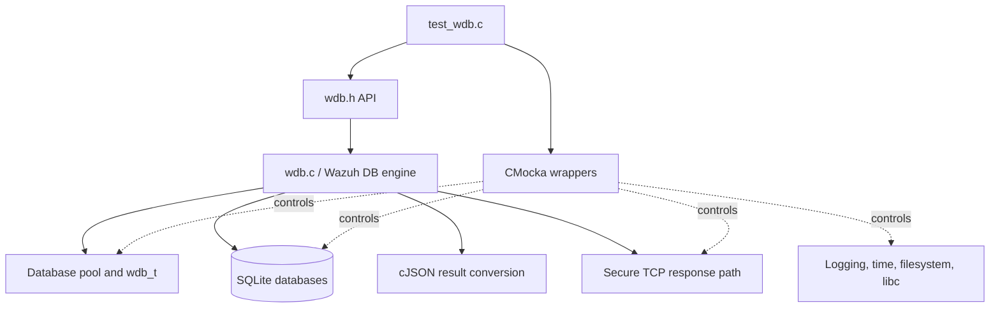
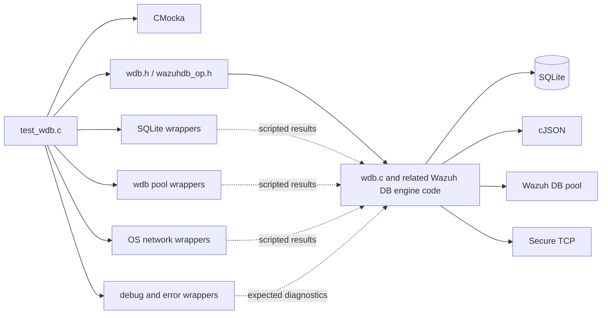
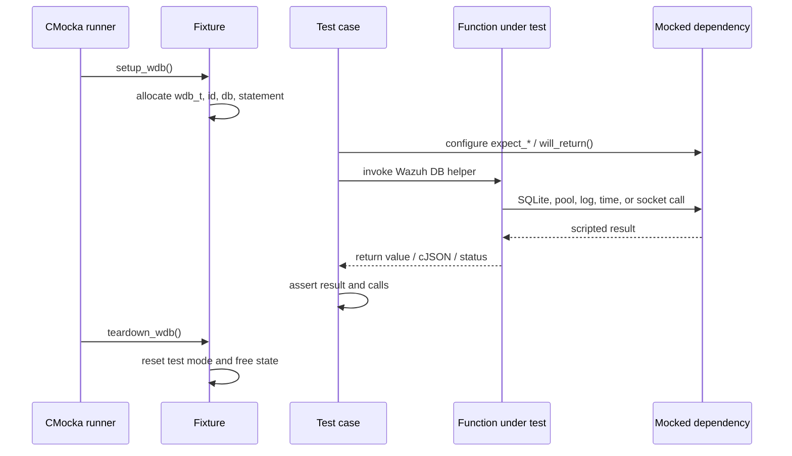
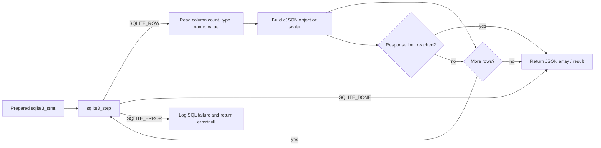
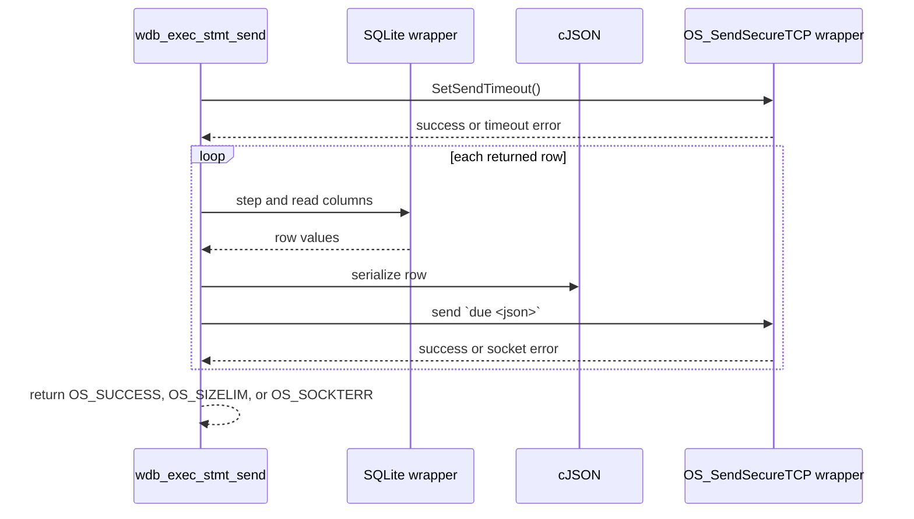
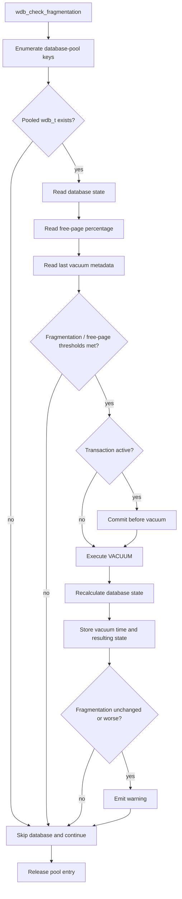

# `test_wdb` — Wazuh DB engine unit tests

`test_wdb` is the CMocka unit-test suite for the low-level Wazuh DB engine exposed by
`src/wazuh_db/wdb.h` and implemented primarily in `src/wazuh_db/wdb.c`. It verifies SQLite
database opening and closing, prepared-statement execution, JSON conversion, socket response
delivery, statement caching, configuration reporting, and database health/fragmentation
maintenance.

The suite tests the database engine in isolation. SQLite, sockets, logging, time, filesystem,
pool, and memory-related boundaries are replaced with wrappers, allowing every success and
failure branch to be deterministic. The production module context is described in
[`wazuh_db_engine.md`](wazuh_db_engine.md); this page documents the tests themselves.

## Role in the Wazuh DB subsystem

The suite is a leaf test module under the Wazuh DB area. It exercises shared engine behavior used
by higher-level database features such as agents, FIM, Syscollector, integrity synchronization,
metadata, and state management. Those feature-specific responsibilities are documented in
[`wazuh_db_fim_syscollector.md`](wazuh_db_fim_syscollector.md),
[`wazuh_db_integrity.md`](wazuh_db_integrity.md), and
[`wazuh_db_state.md`](wazuh_db_state.md).

## Components and dependencies

| Component | Responsibility in this suite |
|---|---|
| `test_wdb.c` | Defines fixtures, tests, wrapper expectations, and the CMocka runner. |
| `wdb_t` | Test subject representing one pooled Wazuh DB connection and its statements. |
| SQLite wrappers | Script `open`, `prepare`, `step`, column access, bind, finalize, close, and `exec` results. |
| Wazuh DB wrappers | Control pool lookup/leave, statement-cache interactions, and database helpers. |
| Network wrappers | Verify timeout setup and `OS_SendSecureTCP` payloads without a real socket. |
| Logging wrappers | Assert diagnostic messages for invalid SQL, SQLite failures, size limits, and maintenance failures. |
| CMocka | Provides `expect_*`, `will_return`, fixtures, assertions, and test registration. |
| cJSON | Represents query rows and result arrays returned by the engine. |

The suite also depends on the common wrapper conventions described in
[`test_infrastructure.md`](test_infrastructure.md). It does not require live database files,
network peers, or host-specific filesystem state.

## Fixtures and test lifecycle

`setup_wdb` enables `test_mode`, allocates a minimal `test_struct_t`, creates a `wdb_t` with id
`"000"`, supplies a database pointer, and installs a non-null fake statement in `stmt[0]`.
`teardown_wdb` disables test mode and releases the allocated state. Tests that inspect global
Wazuh DB configuration use `wdb_init_conf` and `wdb_free_conf` through dedicated setup and
teardown functions.

## Functional coverage

### Database opening and lifecycle

The opening tests cover both pooled and file-creation paths:

- `wdb_open_tasks` uses `queue/tasks/tasks.db` and `WDB_TASK_NAME`.
- `wdb_open_global` uses `queue/db/global.db` and `WDB_GLOB_NAME`.
- An already-open pooled object is returned unchanged.
- A missing database is retried with `SQLITE_OPEN_READWRITE | SQLITE_OPEN_CREATE`.
- Creation, retry-open, and pool errors return `NULL`, log the failure, and release the pool entry.
- `wdb_close` closes the SQLite handle and reports SQLite errors with the database id.
- `wdb_finalize_all_statements` finalizes both the fixed statement array and linked statement cache,
  then clears their pointers.
- `wdb_set_synchronous_normal` executes `PRAGMA synchronous=1;` and distinguishes success from
  SQLite execution failure.

### Query execution and JSON conversion

The result helpers are tested at row and whole-statement granularity.

| Helper | Verified behavior |
|---|---|
| `wdb_exec_row_stmt_multi_column` | Converts an SQLite row into a cJSON object keyed by column names; handles integer and text values, `SQLITE_DONE`, and `SQLITE_ERROR`. |
| `wdb_exec_row_stmt_single_column` | Converts a one-column row into a scalar number or string and reports invalid statements and step errors. |
| `wdb_exec_stmt` | Iterates rows into a JSON array and returns `NULL` for invalid or failed statements. |
| `wdb_exec_stmt_sized` | Produces single-column or multi-column arrays while stopping before the configured response-size limit. |
| `wdb_exec_stmt_silent` | Maps `SQLITE_ROW` and `SQLITE_DONE` to `OS_SUCCESS`; maps other step results to `OS_INVALID`. |

The conversion flow is:

### Sending query results to a peer

`wdb_exec_stmt_send` validates the statement, sets a send timeout, converts each row to compact
JSON, prefixes it with `due `, and sends it through `OS_SendSecureTCP`. The suite covers one row,
many rows, no rows, oversized rows (`OS_SIZELIM`), timeout failures, send failures
(`OS_SOCKTERR`), and invalid statements.

### Statement cache

`wdb_init_stmt_in_cache` is tested as a transaction-plus-cache operation. A successful test
prepares and finalizes the transaction statement, resets and clears bindings on the cached
statement, and returns it. Separate cases cover failure to begin the transaction and an invalid
statement index (`WDB_STMT_SIZE`), including the associated diagnostics.

### Configuration and backup state

The configuration tests verify the externally visible JSON shape rather than exact deployment
values:

- `wdb_get_internal_config` exposes numeric `commit_time_max`, `commit_time_min`, `open_db_limit`,
  and `worker_pool_size` under `wazuh_db`.
- `wdb_get_config` exposes a `wdb.backup` array whose entries contain `database`, `enabled`,
  `interval`, and `max_files`.
- `wdb_check_backup_enabled` mirrors the global backup setting in `wconfig` for enabled and
  disabled cases.

### Database health and fragmentation maintenance

The health tests exercise the small SQL primitives used by maintenance code:

- `wdb_execute_single_int_select_query` handles null SQL, prepare errors, step errors, and a
  successful integer result.
- `wdb_execute_non_select_query` handles null SQL, prepare errors, step errors, and successful
  non-select execution.
- `wdb_select_from_temp_table` reads the temporary-table metric and maps it to the tested state
  percentage range.
- `wdb_get_db_free_pages_percentage` combines page-count and free-page queries.
- `wdb_get_db_state` creates, truncates, inserts into, and selects from a temporary table; every
  stage has an explicit failure test.

`wdb_get_last_vacuum_data` reads `last_vacuum_time` and `last_vacuum_value` from `metadata`, while
`wdb_update_last_vacuum_data` binds and updates those values. A constraint result is intentionally
accepted as a successful update, while prepare and non-constraint step errors fail.

`wdb_check_fragmentation` is tested across the complete maintenance decision path:

The fragmentation cases cover missing pooled nodes, failures at each measurement or SQL step,
commit and vacuum errors, first-vacuum behavior, threshold and delta decisions, successful vacuum,
post-vacuum degradation warnings, and metadata-update failures. Threshold inputs are changed in
the tests through `wconfig.max_fragmentation`, `free_pages_percentage`,
`fragmentation_threshold`, and `fragmentation_delta`.

## Error and observability contracts

The suite asserts both return values and diagnostic side effects. Important contracts include:

- invalid statements and null queries are rejected before SQLite access;
- SQLite prepare/step/finalize failures are logged with the SQLite error text where applicable;
- pool entries are released on database-opening and fragmentation-maintenance exits;
- statement and cache resources are finalized on cleanup;
- network timeout and send failures are distinguished from oversized response failures;
- maintenance failures identify the affected database and operation;
- a successful vacuum records timing and updates metadata, while a worse result emits a warning.

This emphasis makes the suite useful for preserving operational behavior, not only return-value
correctness.

## Test inventory

The registered CMocka cases are organized by the production operation they protect:

1. task and global database opening;
2. multi-column and single-column row conversion;
3. complete, sized, silent, and socket-sent statement execution;
4. prepared-statement caching and finalization;
5. public and internal configuration, including backup enablement;
6. database close and synchronous-mode configuration;
7. scalar SQL helpers, temporary-table state, and free-page calculations;
8. vacuum metadata read/write;
9. complete fragmentation-monitoring and vacuum decision flows.

Together these cases cover normal results, empty results, invalid inputs, SQLite errors, resource
cleanup, response-size limits, and external I/O failures.

## Relationship to neighboring documentation

- [`wazuh_db.md`](wazuh_db.md) — top-level Wazuh DB subsystem.
- [`wazuh_db_engine.md`](wazuh_db_engine.md) — production engine, pools, statements, and SQLite lifecycle.
- [`wazuh_db_command_parser.md`](wazuh_db_command_parser.md) — command parsing that dispatches into DB operations.
- [`wazuh_db_state.md`](wazuh_db_state.md) — database-state and maintenance concepts.
- [`wazuh_db_metadata_upgrade.md`](wazuh_db_metadata_upgrade.md) — metadata and upgrade responsibilities.
- [`test_infrastructure.md`](test_infrastructure.md) — common CMocka and wrapper-isolation patterns.
- [`framework_core_communication_wdb.md`](framework_core_communication_wdb.md) — framework-side WDB communication clients.

