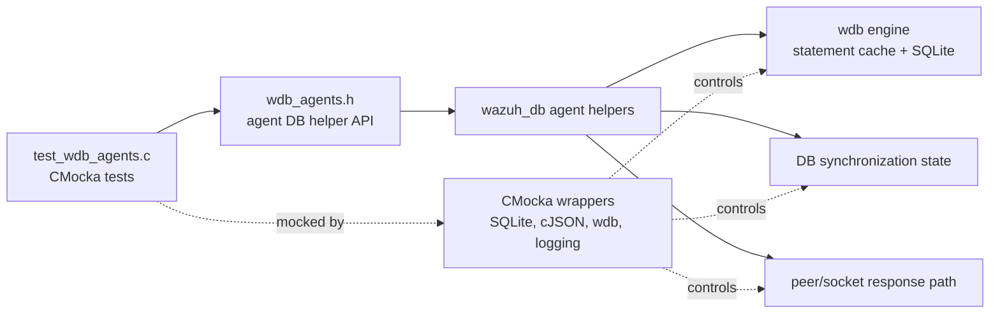
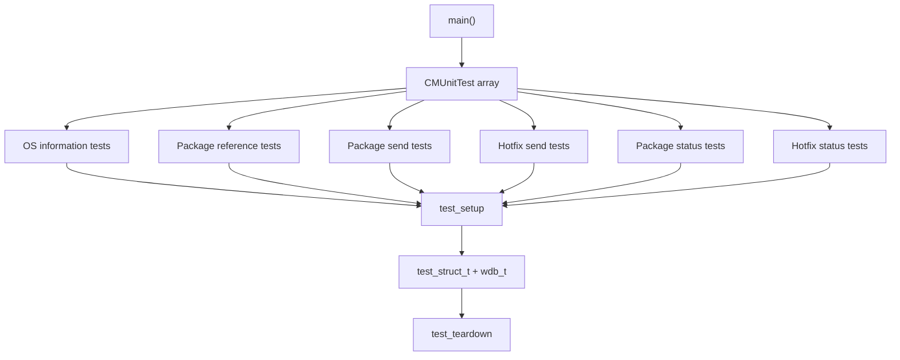
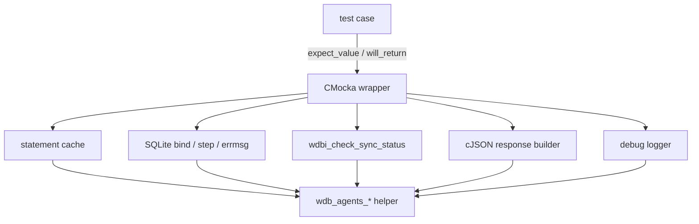
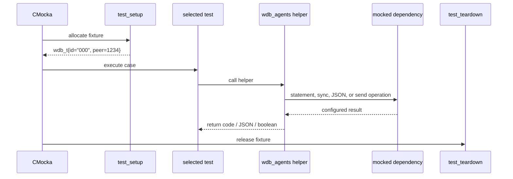
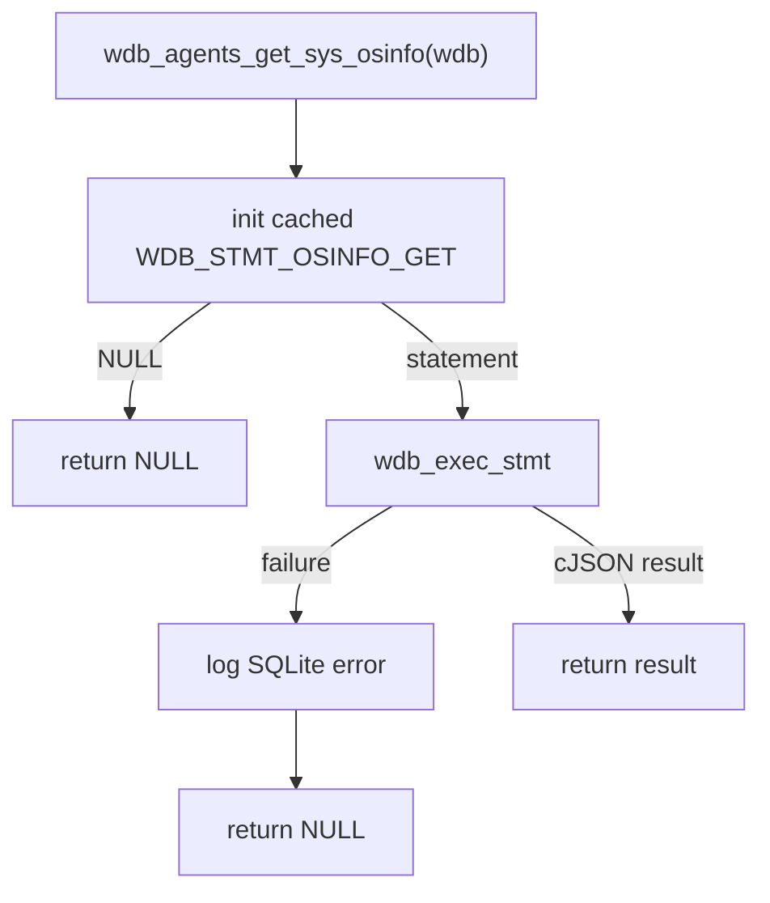
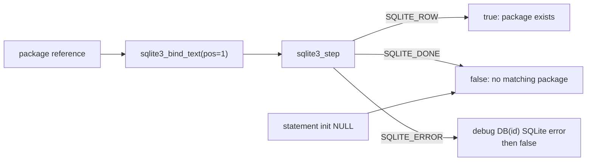
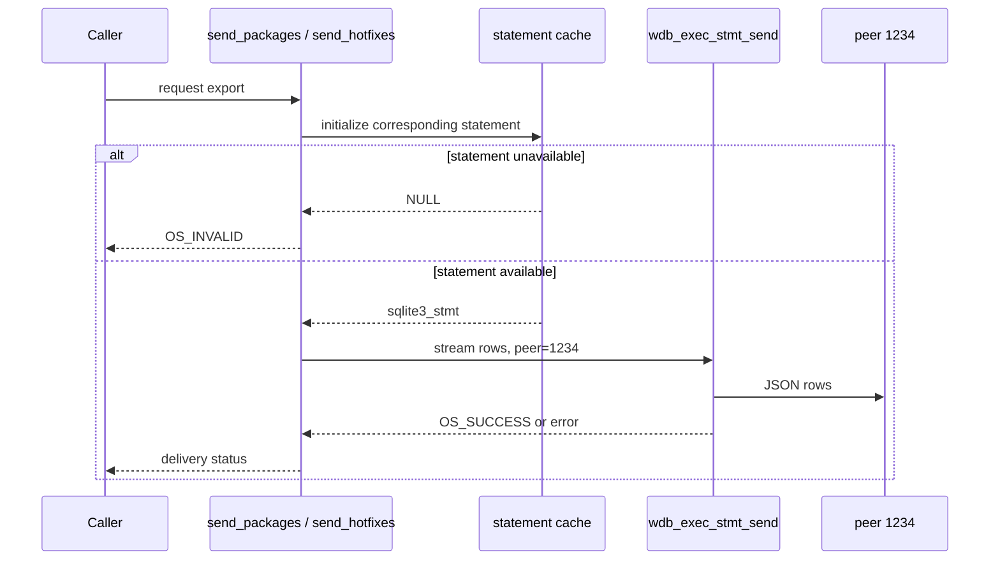
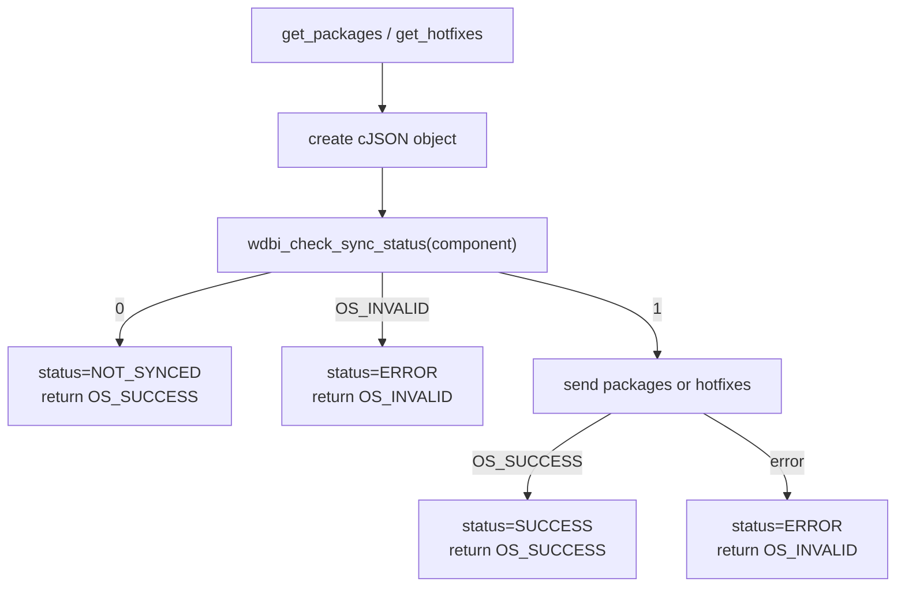
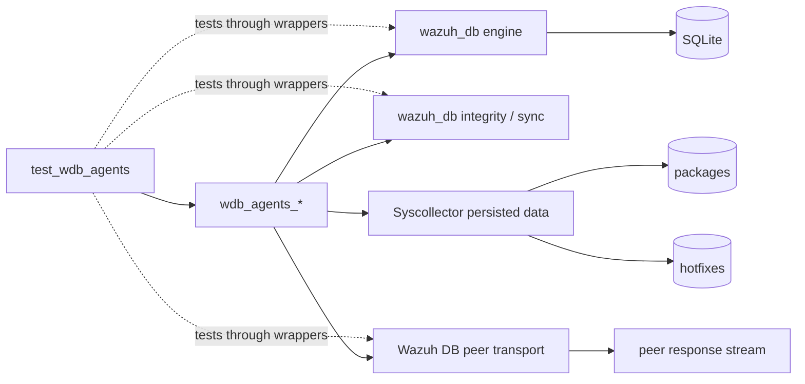
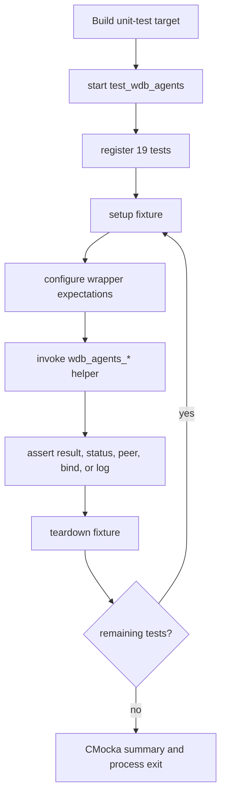

# `test_wdb_agents`

`test_wdb_agents` is the CMocka unit-test module for the agent-oriented Wazuh DB helpers in `src/unit_tests/wazuh_db/test_wdb_agents.c`. It verifies retrieval of agent operating-system information, package-reference lookups, package and hotfix export requests, and the synchronization-status decisions that guard those exports.

The tests exercise the Wazuh DB layer in isolation. SQLite, cJSON, statement-cache operations, result streaming, synchronization checks, and debug logging are replaced by wrappers so each test can force a specific success or failure branch without opening a real database or socket.

## Purpose and system position

The module sits below the API/framework layer and directly tests the native `wazuh_db` service. Its production subjects are the functions declared by `src/wazuh_db/wdb_agents.h` and implemented in the Wazuh DB agent helpers. The database engine, statement lifecycle, and socket protocol are shared concerns documented in [wazuh_db.md](wazuh_db.md), [wazuh_db_engine.md](wazuh_db_engine.md), and [wazuh_db_daemon_core.md](wazuh_db_daemon_core.md). Syscollector data and synchronization semantics are related to [syscollector_module.md](syscollector_module.md), [wazuh_db_fim_syscollector.md](wazuh_db_fim_syscollector.md), and [dbsync.md](dbsync.md).

This is a unit-test boundary, not a runtime module. It confirms the contract between agent-specific database helpers and the common Wazuh DB infrastructure.

## Architecture

### Test components

| Component | Responsibility |
|---|---|
| `test_setup` | Allocates a minimal `test_struct_t`, a `wdb_t`, the database handle slot, and the manager/database identifier. It sets `wdb->id` to `"000"` and `wdb->peer` to `1234`. |
| `test_teardown` | Frees the output buffer, database identifier, database handle slot, `wdb_t`, and fixture object. |
| `test_struct_t` | Owns the per-test `wdb_t` and an output pointer reserved for test state. |
| `wrap_wdb_exec_stmt_sized_success_call` | Configures a bounded multi-column or single-column statement execution to return `SQLITE_DONE` and a supplied JSON array. |
| `wrap_wdb_exec_stmt_sized_failed_call` | Configures bounded statement execution to return `SQLITE_ERROR` and no result. |
| `main` | Registers the CMocka tests and runs them with `cmocka_run_group_tests`. |

### Mocked dependency boundary

The test file includes wrappers for:

- `wdb_init_stmt_in_cache`, `wdb_exec_stmt`, `wdb_exec_stmt_sized`, and `wdb_exec_stmt_send` for statement creation, execution, bounded output, and peer delivery;
- `sqlite3_bind_text`, `sqlite3_step`, and `sqlite3_errmsg` for parameter binding and row-state/error paths;
- `wdbi_check_sync_status` for Syscollector package and hotfix synchronization state;
- cJSON constructors and `cJSON_AddStringToObject` for response-status construction;
- `_mdebug1` for verifying diagnostic messages on database failures.

These wrappers are test controls rather than production dependencies. The relevant database engine behavior is described in [wazuh_db_engine.md](wazuh_db_engine.md); wrapper implementations remain under `src/unit_tests/wrappers/`.

## Fixture and lifecycle

`test_setup` deliberately creates only the fields used by these helpers. The database pointer is allocated as a slot for `sqlite3 *`, but no SQLite connection is opened. This makes tests deterministic and ensures all database interactions must pass through configured wrappers.

The fixture values have observable consequences: `peer=1234` is asserted for package and hotfix sends, while `id="000"` is included in the expected SQLite error log for package lookup failures.

## Production behaviors under test

### Operating-system information

`wdb_agents_get_sys_osinfo` retrieves the agent OS-information row through the cached `WDB_STMT_OSINFO_GET` statement and returns a cJSON result.

- `test_wdb_agents_get_sys_osinfo_statement_init_fail` makes statement initialization return `NULL` and expects a `NULL` result.
- `test_wdb_agents_get_sys_osinfo_exec_stmt_fail` supplies a statement but makes `wdb_exec_stmt` fail; it expects `NULL` and verifies the formatted `wdb_exec_stmt(): ERROR MESSAGE` debug message.
- `test_wdb_agents_get_sys_osinfo_success` returns a sentinel cJSON pointer and verifies pointer identity.

### Package reference lookup

`wdb_agents_find_package` binds a package reference at position 1 on `WDB_STMT_PROGRAM_FIND`, then interprets `sqlite3_step`:

| Step result | Expected helper result | Test |
|---|---:|---|
| `SQLITE_ROW` | `true` | `test_wdb_agents_find_package_success_row` |
| `SQLITE_DONE` | `false` | `test_wdb_agents_find_package_success_done` |
| `SQLITE_ERROR` | `false`, with a `DB(000) SQLite: ...` debug log | `test_wdb_agents_find_package_error` |
| statement initialization returns `NULL` | `false` | `test_wdb_agents_find_package_statement_init_fail` |

The supplied reference is `1c979289c63e6225fea818ff9ca83d9d0d25c46a`. The test verifies that it is bound unchanged, so the case covers both statement selection and parameter propagation.

### Package and hotfix streaming

`wdb_agents_send_packages` and `wdb_agents_send_hotfixes` prepare the corresponding cached statement and stream rows to the configured peer through `wdb_exec_stmt_send`.

| Helper | Statement index | Peer | Success | Initialization failure |
|---|---|---:|---:|---:|
| `wdb_agents_send_packages` | `WDB_STMT_SYS_PROGRAMS_GET` | `1234` | `OS_SUCCESS` | `OS_INVALID` |
| `wdb_agents_send_hotfixes` | `WDB_STMT_SYS_HOTFIXES_GET` | `1234` | `OS_SUCCESS` | `OS_INVALID` |

The tests `test_wdb_agents_send_packages_success`, `test_wdb_agents_send_packages_stmt_err`, `test_wdb_agents_send_hotfixes_success`, and `test_wdb_agents_send_hotfixes_stmt_err` cover these branches. The send helpers are responsible for delivery status; response-object construction belongs to the higher-level get helpers.

### Synchronization-gated package and hotfix responses

`wdb_agents_get_packages` and `wdb_agents_get_hotfixes` create a cJSON response object, check the relevant Syscollector component, and add a `status` field.

| Sync check result | Status field | Return code | Meaning |
|---:|---|---:|---|
| `1` | `SUCCESS` after a successful send | `OS_SUCCESS` | Data is synchronized and export was requested successfully. |
| `0` | `NOT_SYNCED` | `OS_SUCCESS` | No export is attempted because the component is not synchronized. |
| `OS_INVALID` | `ERROR` | `OS_INVALID` | Sync-state evaluation failed. |
| `1`, send returns `OS_INVALID` | `ERROR` | `OS_INVALID` | Data is synchronized but export delivery failed. |

Package tests use `WDB_SYSCOLLECTOR_PACKAGES`; hotfix tests use `WDB_SYSCOLLECTOR_HOTFIXES`. The test cases cover success, not-synced, synchronization error, and send error for both data types.

## Test inventory

The source registers 19 CMocka cases. The module tree lists the same named test family; the source additionally contains `test_wdb_agents_find_package_error`, which explicitly covers the `SQLITE_ERROR` step branch.

| Test group | Cases | Primary contract |
|---|---:|---|
| Fixture lifecycle | shared by all cases | Minimal `wdb_t` setup and complete cleanup |
| OS information | 3 | Statement-init failure, execution failure/logging, successful cJSON return |
| Package lookup | 4 | Statement-init failure, row match, no row, SQLite error/logging |
| Package streaming | 2 | Successful peer send and statement-init failure |
| Hotfix streaming | 2 | Successful peer send and statement-init failure |
| Package status response | 4 | Synchronized, not synchronized, sync error, send error |
| Hotfix status response | 4 | Synchronized, not synchronized, sync error, send error |

All registered tests use `cmocka_unit_test_setup_teardown`, so every case receives an isolated fixture and cleanup path. Assertions focus on externally visible return values, pointer identity where appropriate, wrapper arguments, status strings, and required diagnostics.

## Dependency and data-flow relationships

The module does not duplicate the implementation of SQLite statement caching, DB synchronization, Syscollector persistence, or peer transport. Those responsibilities remain in their owning modules.

For database transaction and statement behavior, see [wazuh_db_engine.md](wazuh_db_engine.md). For synchronization checks and checksum state, see [wazuh_db_integrity.md](wazuh_db_integrity.md). For the data-producing Syscollector daemon and API/framework consumers, see [syscollector_module.md](syscollector_module.md) and [syscollector_module_api_framework.md](syscollector_module_api_framework.md).

## Execution flow

The test binary is compiled with the Wazuh unit-test build and run as a CMocka executable. A typical execution sequence is:

The module requires no live Wazuh manager, agent, SQLite database, Syscollector feed, or network peer. Failures should therefore be investigated first as contract changes in the helper APIs, wrapper expectations, response status conventions, or fixture cleanup.

## Maintenance notes

- Keep statement-index expectations synchronized with `wdb_agents.c` and `wdb.h`; changing a cached statement can silently invalidate the test's intended coverage.
- Preserve the `peer=1234` fixture assertion when modifying streaming behavior. It verifies that the helper forwards the database peer rather than using an unrelated destination.
- When adding a new synchronization state, extend both package and hotfix decision tables and assert the cJSON status string as well as the numeric return code.
- Keep database error-message assertions aligned with the production logging format. These tests intentionally verify context such as the database ID and SQLite message.
- Add tests for new error branches before changing wrappers; wrapper return values are the module's mechanism for reaching otherwise difficult-to-reproduce database and transport failures.
- If the production helper begins owning cJSON memory differently, review `status_response` ownership and the fixture teardown before updating assertions.
