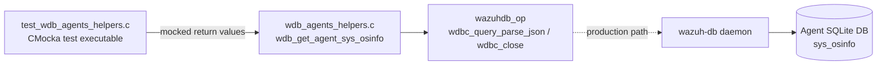
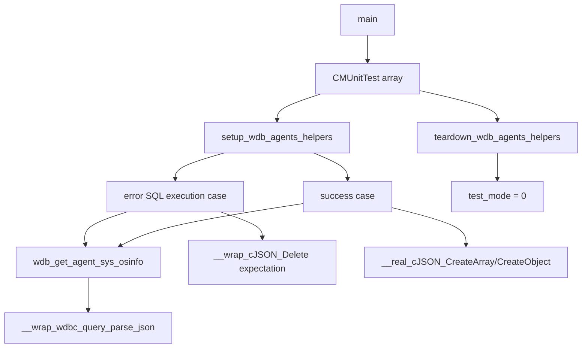
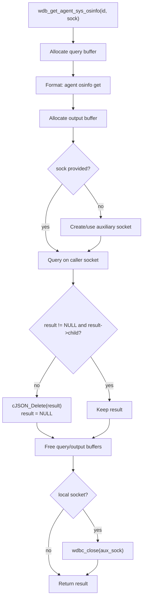
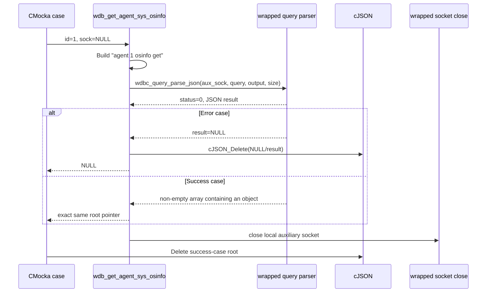
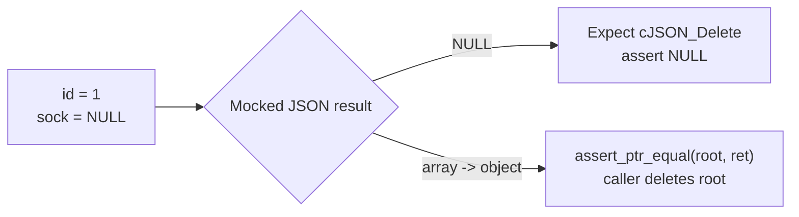

# `test_wdb_agents_helpers`

`test_wdb_agents_helpers` is a CMocka unit-test module for the Wazuh DB agent helper `wdb_get_agent_sys_osinfo()`. It exercises the helper’s JSON query boundary for an agent’s `sys_osinfo` data: a valid non-empty result is returned unchanged, while a failed or empty result is deleted and converted to `NULL`.

The test belongs to the native Wazuh DB test suite. The broader daemon lifecycle, SQLite engine, and agent-database command handling are documented in [wazuh_db](wazuh_db.md), [wazuh_db_engine](wazuh_db_engine.md), [wazuh_db_daemon_core](wazuh_db_daemon_core.md), and [wazuh_db_command_parser](wazuh_db_command_parser.md).

## Scope and system position

The module does not open SQLite directly. It tests the helper layer that formats an agent-scoped Wazuh DB command, delegates transport and JSON parsing to `wazuhdb_op`, validates the returned JSON shape, and optionally closes a locally-created socket.

In the unit test, the `wazuhdb_op` boundary and cJSON cleanup calls are wrapped. Therefore, the test is deterministic and does not require a running daemon or a populated agent database. Runtime query behavior is covered by [test_wdb](test_wdb.md) and the database subsystem documentation.

## Components

| Component | Responsibility |
|---|---|
| `setup_wdb_agents_helpers` | Sets global `test_mode` to `1` before each case. |
| `teardown_wdb_agents_helpers` | Restores `test_mode` to `0` after each case. |
| `test_wdb_get_sys_osinfo_error_sql_execution` | Supplies a NULL parsed result and verifies cleanup plus a NULL return. |
| `test_wdb_get_sys_osinfo_success` | Supplies a non-empty cJSON array and verifies pointer identity. |
| `main` | Registers both cases with setup/teardown callbacks and runs the CMocka group. |
| `wdb_get_agent_sys_osinfo` | Production helper under test; declared in `wdb_agents_helpers.h`. |
| `wdb_wrappers` | Mocks `wdbc_query_parse_json` and cJSON deletion expectations. |
| cJSON | Represents the parsed database response and owns the returned tree. |

## Production helper behavior

`wdb_get_agent_sys_osinfo(int id, int *sock)` uses the command template `agent %d osinfo get`. It allocates a query buffer and output buffer, invokes `wdbc_query_parse_json()`, then applies a semantic-result check:

- If parsing fails and returns `NULL`, the result is deleted safely and `NULL` is returned.
- If parsing returns a JSON value without a first child, it is treated as empty/invalid, deleted, and returned as `NULL`.
- If the result has a child, the same cJSON pointer is returned to the caller.
- If `sock` is `NULL`, the helper uses a local auxiliary socket and closes it before returning.
- If `sock` is non-NULL, the caller-provided socket is used and is not closed by this helper.
- Temporary query/output buffers are freed on every path.

## Test data flow

Both cases use agent ID `1` and pass `NULL` as the socket argument, which exercises the helper’s local-socket path. The query wrapper is configured with a successful transport/status value and a controlled JSON pointer.

## Test cases

### `test_wdb_get_sys_osinfo_error_sql_execution`

This case configures `__wrap_wdbc_query_parse_json` to produce no JSON result. It expects `__wrap_cJSON_Delete` to be called and asserts that `wdb_get_agent_sys_osinfo(1, NULL)` returns `NULL`. This verifies the helper does not expose an unusable response and performs cleanup on query failure.

### `test_wdb_get_sys_osinfo_success`

This case constructs a real cJSON array with one object, returns it through the query wrapper, and asserts pointer equality between the wrapper-provided root and the helper’s return value. The test then deletes the root itself, matching the header contract that the caller owns a successful result.

## Isolation, mocks, and invariants

The test includes CMocka, the Wazuh DB helper header, `wazuhdb_op.h`, cJSON wrappers, and Wazuh DB wrappers. `will_return()` controls the query parser’s result, while `expect_function_call()` verifies cleanup in the failure case. The success fixture uses the real cJSON constructors so the helper’s `result->child` check is exercised with a structurally valid response.

The important invariants are:

- The command is agent-scoped and uses the `agent <id> osinfo get` operation.
- A successful result must be non-NULL and contain at least one child.
- Invalid/empty JSON is not returned to callers.
- A successful result is returned without copying; ownership remains with the caller.
- Setup and teardown bracket every test and restore the global test mode.
- The test does not validate the contents of an OS-information row; it validates transport-result handling and ownership/cleanup semantics.

## Execution model

`main()` creates a `CMUnitTest` array with setup/teardown registration for each case and calls `cmocka_run_group_tests()`. Build the repository’s native unit-test targets using the normal Wazuh build configuration, then run the generated `test_wdb_agents_helpers` binary or matching CTest target. Exact binary paths depend on the build directory and platform.

## Related documentation

- [wazuh_db](wazuh_db.md) — overall Wazuh DB daemon and data domains.
- [wazuh_db_engine](wazuh_db_engine.md) — SQLite connections, statements, transactions, and result serialization.
- [wazuh_db_command_parser](wazuh_db_command_parser.md) — command dispatch and database request parsing.
- [wazuh_db_daemon_core](wazuh_db_daemon_core.md) — daemon lifecycle and socket server.
- [test_wdb_agents](test_wdb_agents.md) — neighboring agent database tests for packages, hotfixes, and OS information.
- [test_wdb](test_wdb.md) — lower-level Wazuh DB operation tests and wrapper boundaries.
- [framework_core_communication_wdb](framework_core_communication_wdb.md) — Python-side Wazuh DB client communication.
