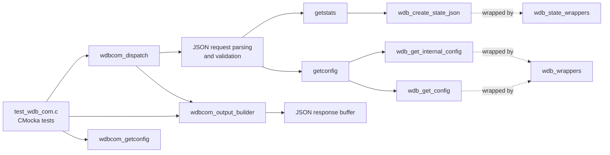
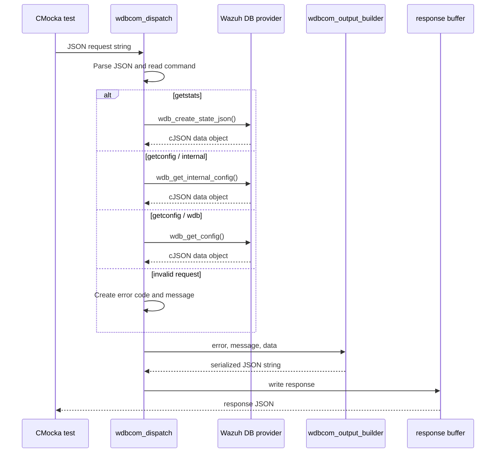
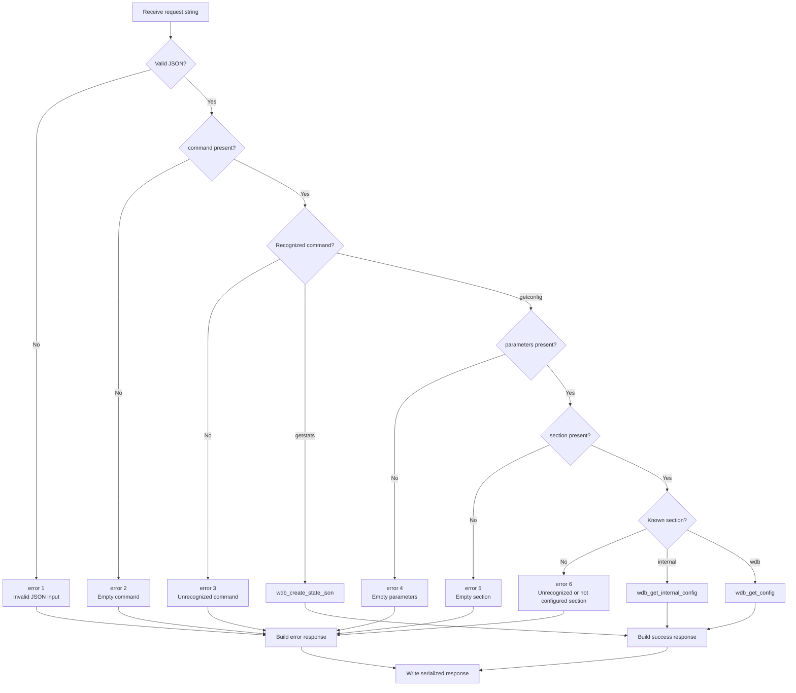
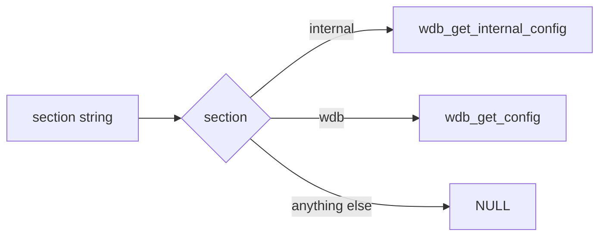
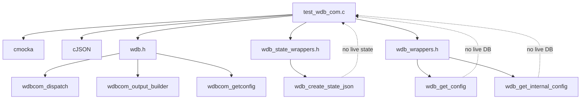
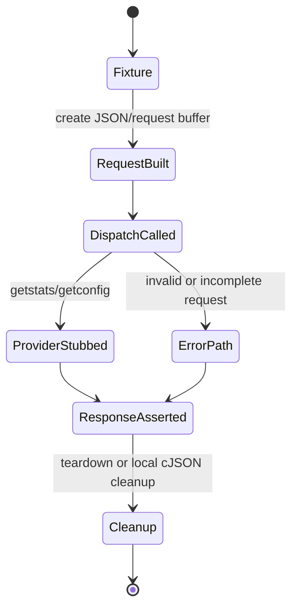

# `test_wdb_com` module

`test_wdb_com` is the CMocka unit-test module for the JSON control interface of the Wazuh DB daemon. It verifies request dispatch, command and parameter validation, configuration selection, statistics retrieval, and the normalized JSON response envelope produced by `wdbcom_output_builder()`.

The module tests the communication boundary rather than SQLite internals. For the broader daemon protocol and production implementation, see [wazuh_db_command_parser.md](wazuh_db_command_parser.md) and [wazuh_db_daemon_core.md](wazuh_db_daemon_core.md). Database execution and state serialization are documented in [wazuh_db.md](wazuh_db.md), [test_wdb.md](test_wdb.md), and [wazuh_db_state.md](wazuh_db_state.md).

## Scope and role

The tested interface accepts a JSON request and writes a JSON response into a caller-provided buffer. The current command surface exercised by this module is:

| Command | Parameters | Production dependency | Success data |
| --- | --- | --- | --- |
| `getstats` | none | `wdb_create_state_json()` | Wazuh DB runtime counters and timings |
| `getconfig` | `section: "internal"` | `wdb_get_internal_config()` | Internal Wazuh DB configuration |
| `getconfig` | `section: "wdb"` | `wdb_get_config()` | Wazuh DB configuration |

The tests also define the expected error behavior for invalid JSON, missing commands, unknown commands, missing parameters, missing sections, and unknown sections.

## Architecture

The module sits at the boundary between CMocka tests and the Wazuh DB command protocol. Production dependencies are replaced by linker wrappers from `wdb_state_wrappers.h` and `wdb_wrappers.h`, allowing dispatch behavior to be verified without opening a database or reading live daemon state.



### Component relationships

| Component | Responsibility in this module |
| --- | --- |
| `wdbcom_dispatch()` | End-to-end request parser and command router under test. |
| `wdbcom_getconfig()` | Maps a section name to the corresponding configuration provider. |
| `wdbcom_output_builder()` | Creates the common `{error,message,data}` response envelope. |
| `wdb_create_state_json()` | Supplies `getstats` data; mocked with a representative JSON object. |
| `wdb_get_internal_config()` | Supplies the `internal` configuration section; mocked. |
| `wdb_get_config()` | Supplies the `wdb` configuration section; mocked. |
| `cJSON` | Builds request fixtures, mocked return data, and expected serialized payloads. |
| CMocka wrappers | Control return values from production providers and isolate the unit under test. |

The daemon's worker decides whether a request is routed to the JSON dispatcher or the legacy parser. That outer decision is covered by [wazuh_db_daemon_core.md](wazuh_db_daemon_core.md); this module begins after `wdbcom_dispatch()` has been selected.

## Request and response data flow



The response contract is stable across success and failure paths:

```json
{"error":0,"message":"ok","data":{}}
```

For a failure, `data` is still an empty object in the tested cases:

```json
{"error":3,"message":"Unrecognized command","data":{}}
```

When data is available, it is embedded without changing the envelope:

```json
{"error":0,"message":"ok","data":{"test1":18,"test2":"wazuhdb"}}
```

## Dispatch process



The error precedence is significant: malformed input is rejected before command inspection; a missing command is distinguished from an unknown command; and `getconfig` validates parameters before section selection.

## Test inventory

### Response construction

`test_wdbcom_output_builder` creates a cJSON object containing numeric and string fields and verifies exact serialization. It also registers `test_teardown` as the CMocka teardown function so the allocated response string is released with `os_free()` after the test.

Assertions establish that:

- the returned message is non-null;
- `error`, `message`, and `data` are serialized in the expected envelope;
- nested data preserves both number and string values;
- the resulting string is suitable for the control-socket response path.

### Successful dispatch

- `test_wdbcom_dispatch_getstats` sends `{"command":"getstats"}` and configures `__wrap_wdb_create_state_json` to return a representative object. It expects error `0` and message `ok`.
- `test_wdbcom_dispatch_getconfig` sends a request for the `internal` section and configures `__wrap_wdb_get_internal_config` to return data.

### Dispatch validation and errors

| Test | Input condition | Expected error | Expected message |
| --- | --- | ---: | --- |
| `test_wdbcom_dispatch_invalid_json` | Raw string `unknown` | 1 | `Invalid JSON input` |
| `test_wdbcom_dispatch_empty_command` | JSON object without `command` | 2 | `Empty command` |
| `test_wdbcom_dispatch_unknown_command` | `command: "unknown"` | 3 | `Unrecognized command` |
| `test_wdbcom_dispatch_getconfig_empty_parameters` | `getconfig` without `parameters` | 4 | `Empty parameters` |
| `test_wdbcom_dispatch_getconfig_empty_section` | Empty `parameters` object | 5 | `Empty section` |
| `test_wdbcom_dispatch_getconfig_unknown_section` | Unknown section name | 6 | `Unrecognized or not configured section` |

Every error test verifies both the response buffer is populated and the complete response string matches the contract, including an empty `data` object.

### Configuration selection

The direct `wdbcom_getconfig()` tests isolate section dispatch from JSON parsing:



- `test_wdb_parse_get_config_internal` verifies the `internal` mapping.
- `test_wdb_parse_get_config_wdb` verifies the `wdb` mapping.
- `test_wdb_parse_get_config_arg_null` verifies unknown input returns `NULL` and does not invoke a provider.

## Dependency and isolation model



The `will_return()` calls make provider behavior deterministic. The test therefore checks the protocol's transformation and routing logic, while provider correctness remains the responsibility of the Wazuh DB engine and state modules. See [test_wazuh_db_state.md](test_wazuh_db_state.md) for state JSON tests and [test_wdb.md](test_wdb.md) for engine-level DB behavior.

## Process and lifecycle considerations



Most tests use stack-allocated request and response buffers and initialize the response with a null terminator before dispatch. The output-builder test is the explicit heap-allocation case: it stores the returned string in the CMocka state pointer and releases it in `test_teardown`.

## Maintenance guidance

When adding a JSON command or configuration section:

1. Add a success test with a representative mocked cJSON payload.
2. Add direct mapping coverage if the command delegates through a selector such as `wdbcom_getconfig()`.
3. Add validation tests for absent, empty, unknown, and malformed inputs where applicable.
4. Assert the complete serialized response so changes to error codes, messages, or envelope shape are intentional.
5. Update this document's command and error tables.

Keep provider behavior tested in its owning module. For example, changes to state counters belong with [wazuh_db_state.md](wazuh_db_state.md), while SQL, transactions, statement caching, and database lifecycle belong with [wazuh_db_engine.md](wazuh_db_engine.md) and [test_wdb.md](test_wdb.md).

## Test execution

The source is a standalone CMocka test entry point. Its `main()` registers the response-builder test with teardown, the dispatch tests, and the direct configuration-selector tests, then calls `cmocka_run_group_tests()`.

A repository build normally exposes the test through the project test target. The exact binary name and build directory are build-system dependent; use the project’s unit-test target and filter for `test_wdb_com` when running the suite.

## Related documentation

- [wazuh_db_command_parser.md](wazuh_db_command_parser.md) — production `wdbcom_dispatch()` and command parsing.
- [wazuh_db_daemon_core.md](wazuh_db_daemon_core.md) — daemon worker, control socket, and protocol selection.
- [wazuh_db_state.md](wazuh_db_state.md) — `wdb_create_state_json()` and runtime statistics.
- [wazuh_db.md](wazuh_db.md) — Wazuh DB architecture and responsibilities.
- [test_wdb.md](test_wdb.md) — Wazuh DB engine tests and related configuration behavior.
- [test_wazuh_db_state.md](test_wazuh_db_state.md) — serializer-focused unit tests.
