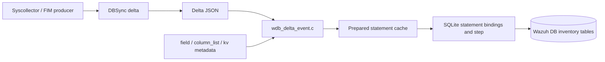
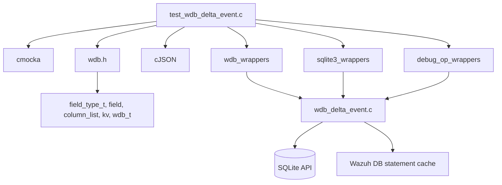
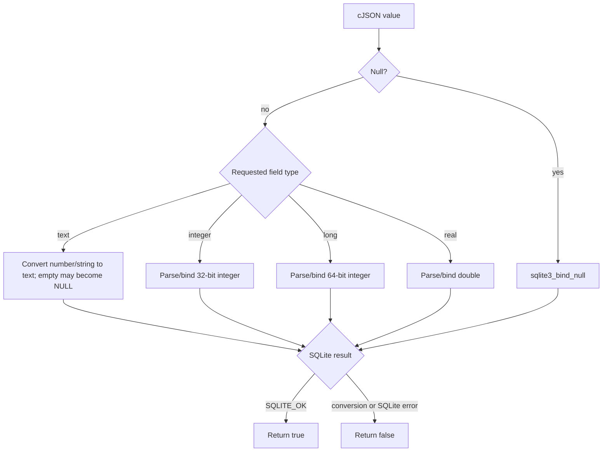
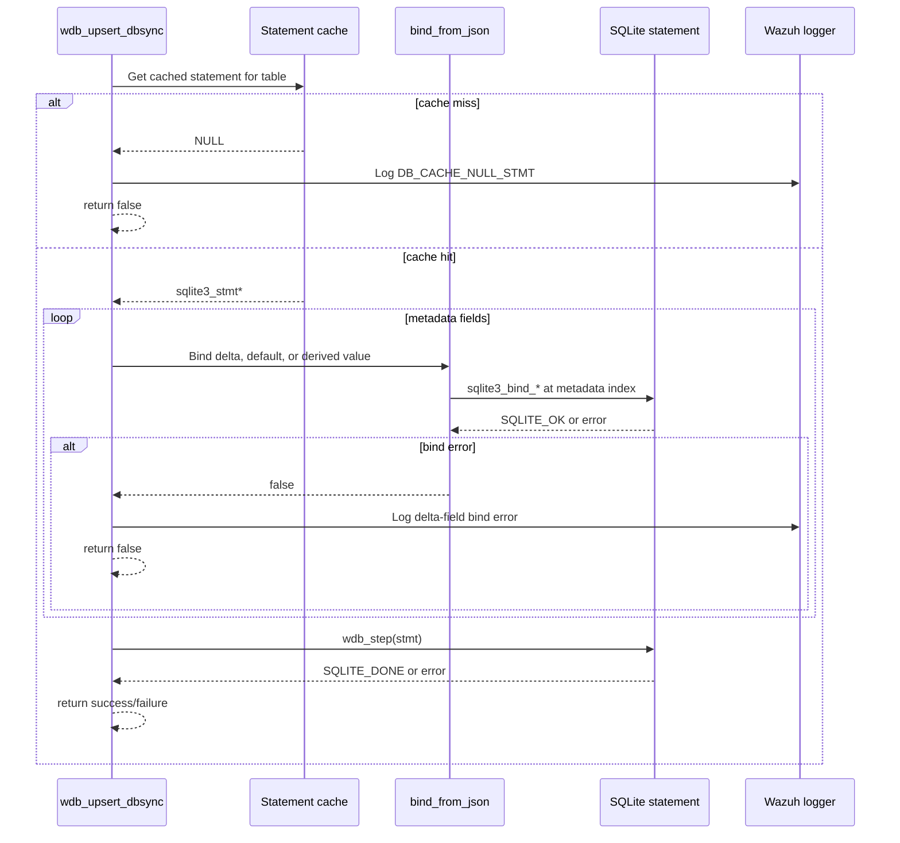
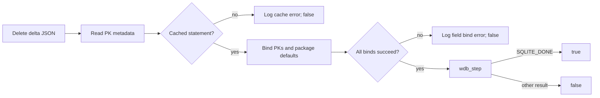

# `test_wdb_delta_event`

`test_wdb_delta_event.c` is a CMocka unit-test module for the Wazuh DB delta-event implementation. It verifies how DBSync delta JSON is converted into SQLite statement bindings, how field metadata supplies defaults and source/target-name translation, and how upsert/delete operations handle cached statements, binding failures, and SQLite step results.

The tests sit at the boundary between the Wazuh DB engine and inventory synchronization. They do not exercise a live database: SQLite and Wazuh DB calls are replaced by wrappers, allowing each conversion and failure path to be asserted deterministically.

## Scope and system context

The production code under test is `src/wazuh_db/wdb_delta_event.c`. The test itself is under `src/unit_tests/wazuh_db/test_wdb_delta_event.c` and uses structures declared by `wdb.h`, notably `field`, `column_list`, `kv`, `field_type_t`, and `wdb_t`.

At system level, a DBSync event supplies a JSON delta for an inventory table. Wazuh DB metadata describes the destination columns and their SQLite positions. The delta-event layer binds values to a prepared statement and executes either an upsert or a delete. This connects the native inventory producers and DBSync layer to the Wazuh DB SQLite backend; see [dbsync](dbsync.md), [dbsync_public_api](dbsync_public_api.md), [dbsync_sqlite_backend](dbsync_sqlite_backend.md), and [wazuh_db_fim_syscollector](wazuh_db_fim_syscollector.md).

## Architecture

### Components

| Component | Responsibility in this module | Evidence in tests |
| --- | --- | --- |
| `wdb_dbsync_stmt_bind_from_json` | Validates inputs, converts cJSON values to the requested field type, applies table/field constraints, and invokes the matching SQLite bind function. | Null, text, integer, long, real, special-table, and bind-error tests. |
| `wdb_dbsync_get_field_default` | Converts a field metadata default into a newly allocated cJSON value. | Text, integer, real, long, null, and invalid-type tests. |
| `wdb_dbsync_translate_field` | Chooses the delta/source field name when present, otherwise the database/target name. | Translated and non-translated tests. |
| `wdb_upsert_dbsync` | Gets a cached prepared statement, binds primary keys and regular fields, supplies defaults, binds auxiliary/old-value fields, and executes the statement. | Cache, bind, step, default, package-key, and success tests. |
| `wdb_delete_dbsync` | Gets a cached delete statement, binds the required key values/defaults, and executes it. | Cache, bind, step, package-key, and success tests. |
| CMocka/SQLite wrappers | Control return codes and assert bind indexes and values without opening SQLite. | `sqlite3_bind_*`, `wdb_get_cache_stmt`, `wdb_step`, and logging expectations. |

### Dependency relationships

The wrappers are part of the test seam, not production dependencies. In particular, `__wrap_wdb_get_cache_stmt` controls whether a prepared statement exists; `__wrap_sqlite3_bind_int`, `__wrap_sqlite3_bind_int64`, `__wrap_sqlite3_bind_double`, `__wrap_sqlite3_bind_text`, and `__wrap_sqlite3_bind_null` expose conversion behavior; and `__wrap_wdb_step` determines execution success.

## Data model and binding behavior

### Field metadata

Each `struct field` describes at least:

- the logical type: `FIELD_TEXT`, `FIELD_INTEGER`, `FIELD_INTEGER_LONG`, or `FIELD_REAL`;
- the SQLite parameter position;
- whether the field is an auxiliary/old-value field;
- whether it is a primary key;
- optional source and target names;
- a default value;
- whether a missing value may be null.

`struct column_list` chains these fields, while `struct kv` identifies the origin table, target table, and field metadata. The tests construct small metadata lists to isolate each branch rather than relying on a complete production schema.

### JSON-to-SQLite conversion

The tests establish these contracts:

- Null JSON values bind with `sqlite3_bind_null`.
- Empty strings can be converted to SQL `NULL` when `convert_empty_string_as_null` is enabled.
- Text fields accept strings and numeric JSON values, using their textual representation.
- Integer fields accept numeric values and numeric strings; malformed strings such as `10Hz` fail before binding.
- Long fields use `sqlite3_bind_int64`; real fields use `sqlite3_bind_double`.
- A failed SQLite bind returns `false`.
- A null statement or null JSON value pointer is rejected. A JSON null object is handled as a valid SQL NULL value.

### Domain constraints

The implementation normalizes invalid inventory numeric values to SQL NULL for selected tables:

| Table | Fields covered | Accepted test value | Normalized values |
| --- | --- | --- | --- |
| `sys_hwinfo` | `cpu_mhz` | positive real | zero or negative → NULL |
| `sys_hwinfo` | `cpu_cores`, `ram_free`, `ram_total` | non-negative integer | zero or negative → NULL |
| `sys_hwinfo` | `ram_usage` | 1–100 | zero, negative, or greater than 100 → NULL |
| `sys_users` | password dates, IDs, login data, process data, and timestamps | field-specific numeric ranges | invalid sentinel/range values → NULL |
| `sys_groups` | `group_id`, `group_id_signed` | integer-long | `group_id` rejects negative values; signed field permits them |

The users test iterates over `-1`, `0`, and `1` for fifteen fields, covering integer, 64-bit integer, and real metadata classes. The groups test similarly distinguishes unsigned-like `group_id` behavior from `group_id_signed` behavior.

## Upsert process

`wdb_upsert_dbsync` is tested as a metadata-driven prepared-statement operation:

The test metadata contains primary keys, regular fields, and an old-value/auxiliary field. The expected bindings show that:

1. Primary-key fields are bound first.
2. Present regular delta fields are bound using their declared type.
3. Missing regular fields use the field default. Nullable fields bind SQL NULL; non-nullable text fields use their empty default.
4. Auxiliary/old-value fields are derived from the delta where required and are bound after the ordinary fields.
5. A bind failure logs error `5216` with the database ID, source table, and field name.
6. `SQLITE_DONE` makes the operation succeed; any other step result makes it fail.

Package-specific tests use origin table `packages` and target table `sys_programs`. If a package primary key is absent or JSON null, the implementation binds the declared empty text default, allowing the statement to proceed. This captures the compatibility behavior required by the package inventory schema.

## Delete process

`wdb_delete_dbsync` follows the same cache → bind → step pattern but focuses on identifying values needed by the delete statement.

Delete tests cover null inputs, a missing statement cache, bind failure, step failure, successful deletion, and the same missing/null package primary-key cases as upsert. Non-key regular fields are not used to identify the row; the test expectations therefore concentrate on key bindings and their defaults.

## Defaults and field translation

`wdb_dbsync_get_field_default` maps metadata to cJSON values:

| Field type | Returned cJSON value |
| --- | --- |
| `FIELD_TEXT` | JSON string |
| `FIELD_INTEGER` | JSON number containing the integer |
| `FIELD_INTEGER_LONG` | JSON number representing the long value |
| `FIELD_REAL` | JSON number containing the real value |
| Unknown type | `NULL`, with a debug message |
| Null field metadata | `NULL` |

`wdb_dbsync_translate_field` returns `source_name` when it exists; otherwise it returns `target_name`. This allows an incoming DBSync field name to differ from the SQLite column name while preserving a fallback for fields with no translation.

## Test organization

The CMocka suite registers tests in these groups:

1. Field defaults and invalid metadata.
2. Field-name translation.
3. Generic JSON-to-SQLite binding and conversion failures.
4. `sys_hwinfo`, `sys_users`, and `sys_groups` domain rules.
5. Upsert cache, bind, default, package-key, step, and success paths.
6. Delete cache, bind, package-key, step, and success paths.

Most tests use `ANY_PTR_VALUE` for opaque statement/database pointers and assert only observable behavior: wrapper calls, bind indexes, converted values, log messages, and boolean return values. This keeps the tests unit-level and avoids filesystem, socket, or real SQLite state.

The supplied source also contains `test_wdb_dbsync_get_field_default_invalid_type`, although it is not listed in the provided core-component summary. The `main` registration includes it. There is also a duplicated registration of `test_wdb_dbsync_stmt_bind_from_json_string_to_integer_ok`; this causes that test to run twice but does not change the covered behavior.

## Failure semantics and maintainership notes

- Null API inputs fail fast.
- Conversion errors fail before a SQLite call where parsing is impossible.
- SQLite bind errors propagate as `false`.
- Cache misses and field-binding errors are logged, with field/table context.
- SQLite step errors propagate as `false`.
- Invalid inventory sentinel values are deliberately persisted as SQL NULL rather than as misleading numeric data.
- Tests depend on wrapper parameter names such as `index`, `pos`, `value`, and `buffer`; changes to wrapper signatures or bind selection should update expectations together with production code.
- When adding a new inventory field type or special-table constraint, add tests at all three layers: default construction, direct binding, and upsert/delete integration.

For broader database lifecycle, statement caching, and parser behavior, see [test_wdb](test_wdb.md), [test_wdb_com](test_wdb_com.md), and [test_wazuh_db_config](test_wazuh_db_config.md). For the producer-side inventory model and synchronization pipeline, see [syscollector_module](syscollector_module.md), [dbsync_core_implementation](dbsync_core_implementation.md), and [dbsync_sqlite_backend](dbsync_sqlite_backend.md).

## Summary

This module documents and verifies the narrow but important contract at the Wazuh DB delta-event boundary: metadata-driven conversion from cJSON to SQLite bindings, safe defaults and name translation, inventory-specific numeric validation, and reliable upsert/delete error propagation. Its wrapper-based design makes both normal data flow and low-level database failures explicit and reproducible.
