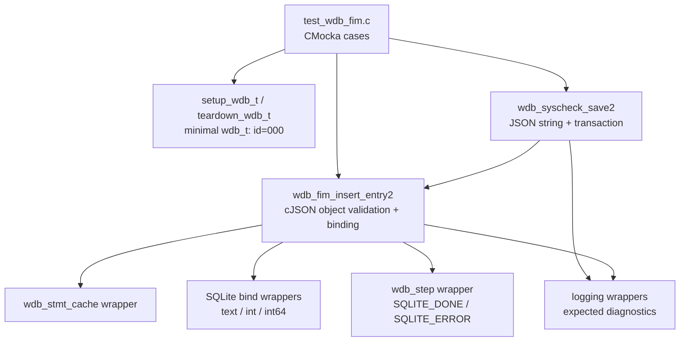
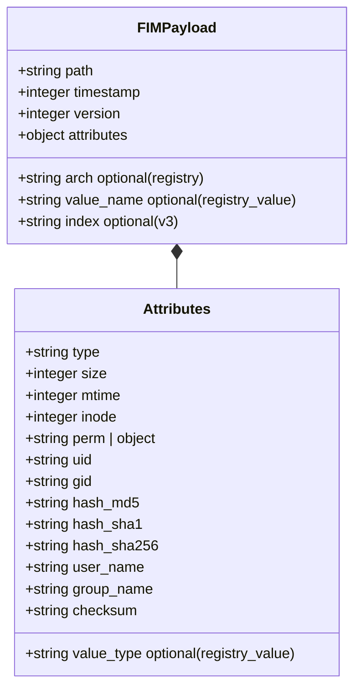
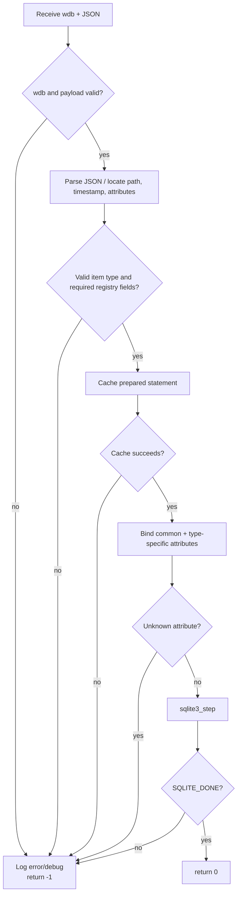
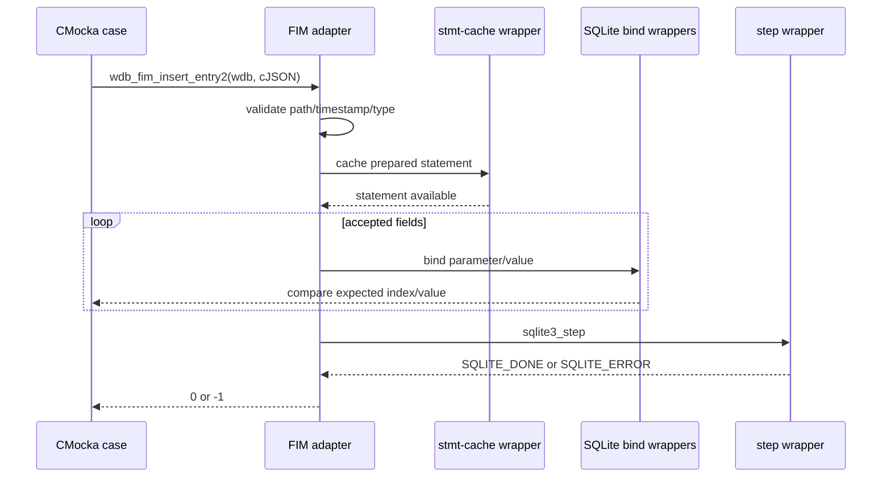
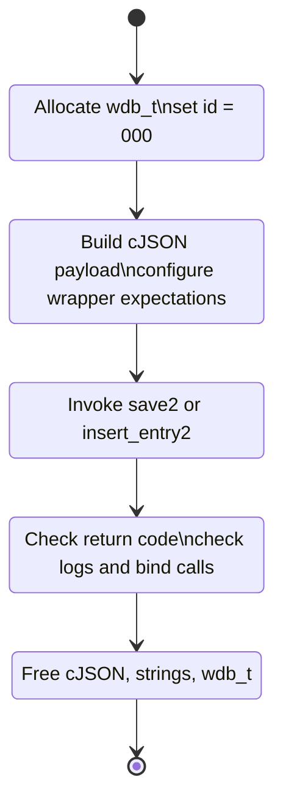

# `test_wdb_fim` — Wazuh DB FIM Persistence Tests

## Introduction

`test_wdb_fim` is a CMocka unit-test suite for the Wazuh DB File Integrity Monitoring (FIM) persistence path. It verifies the JSON entry adapter exposed by `wdb_fim_insert_entry2` and the higher-level `wdb_syscheck_save2` transaction wrapper without starting `wazuh-db` or opening a real SQLite database.

The production behavior covered here is described in [wazuh_db_fim_syscollector.md](wazuh_db_fim_syscollector.md). This document focuses on the test contract: input validation, registry/file variants, SQLite binding expectations, error propagation, and fixture isolation.

## Scope and boundaries

The suite covers the `src/unit_tests/wazuh_db/test_wdb_fim.c` target and its direct collaborators:

| Boundary | Test double / role |
|---|---|
| Wazuh DB object | `setup_wdb_t` allocates a minimal `wdb_t` with agent/database ID `000`. |
| Statement cache | `__wrap_wdb_stmt_cache`; controls cache success and failure. |
| SQLite binding | `sqlite3_bind_text`, `sqlite3_bind_int`, and `sqlite3_bind_int64` wrappers; assertions verify parameter values and nullability. |
| SQLite execution | `__wrap_wdb_step`; returns `SQLITE_DONE` or `SQLITE_ERROR`. |
| Transaction start | `__wrap_wdb_begin2`; controls implicit transaction behavior in `wdb_syscheck_save2`. |
| JSON construction | cJSON creates baseline file/registry payloads and Windows permission objects. |
| Logging | CMocka expectations on Wazuh error/debug logging wrappers. |

The suite intentionally does not test SQL schema creation, socket command parsing, daemon lifecycle, or the FIM scanner itself. Those responsibilities are covered by the implementation and neighboring modules such as [test_syscheck.md](test_syscheck.md), [test_fim_scan.md](test_fim_scan.md), and [test_wdb.md](test_wdb.md).

## Architecture



The test harness replaces external effects with deterministic expectations. A successful case is therefore an interaction contract: cache the prepared statement, bind the expected fields in the expected slots, step successfully, and return zero.

## Components under test

### `wdb_syscheck_save2`

This is the payload-facing wrapper. The tests establish that it:

1. Rejects a null `wdb_t`.
2. Rejects a null or unparsable payload.
3. Starts a transaction when required.
4. Delegates a valid parsed JSON object to `wdb_fim_insert_entry2`.
5. Reports missing file-path data and propagates insertion failure.

The successful path uses `prepare_valid_entry(2)`, serializes it with `cJSON_PrintUnformatted`, and expects the same low-level bindings as a direct `wdb_fim_insert_entry2` call.

### `wdb_fim_insert_entry2`

This is the low-level JSON-to-FIM-row adapter. The tests verify required top-level fields (`path`, `timestamp`, `attributes`), the `attributes.type` discriminator, registry-specific metadata, supported attribute names, permission serialization, large inode handling, and SQLite failure behavior.

The detailed database-row semantics and registry indexing rules are documented in [wazuh_db_fim_syscollector.md](wazuh_db_fim_syscollector.md#key-design-details).

### Fixture helpers

`setup_wdb_t` allocates and zero-initializes a `wdb_t`, then sets `id` to `"000"`. `teardown_wdb_t` releases both the ID and the object after every test. This keeps logging assertions stable (`DB(000) ...`) and prevents state leakage between cases.

`_prepare_valid_entry` starts from:

```json
{"path":"/test","timestamp":10,"version":2,"attributes":{"type":"file"}}
```

It replaces `attributes` with a complete file attribute object containing size, mtime, inode, permission, ownership, hashes, symbolic path, checksum, and generic attributes. The helper supports both string permissions and JSON permissions.

## Input and data model



The suite exercises these item types:

| Item type | Required/derived data exercised |
|---|---|
| `file` | Path, timestamp, attributes, string permissions, JSON permissions, inode including `2311061769`. |
| `registry` | Converted to a registry-key row; architecture is embedded in the path form used by the test. |
| `registry_key` | Requires `arch`; binds registry key type and architecture; includes v2-style full path behavior. |
| `registry_value` | Requires `arch` and `value_name`; binds `value_type`; includes v2 and v3 payloads. |

The v3 fixtures use `KEY_V3_ENTRY` and `VALUE_V3_ENTRY`. They verify that supplied `index` values are used as the persisted identity while attributes such as checksum, hashes, mtime, size, and registry value type are bound correctly.

## Validation and failure behavior



Explicitly tested invalid inputs include:

- null WDB object, null payload, null cJSON object, missing path, empty timestamp, and invalid/missing attributes;
- missing `attributes.type`;
- unknown scalar or object attributes;
- unsupported ordinary and registry item types;
- registry entries without architecture;
- registry values without `value_name`;
- statement-cache failure and SQLite step failure;
- transaction-start failure and malformed/incomplete `wdb_syscheck_save2` payloads.

The tests assert both the `-1` return value and the diagnostic message where the production code emits one. This makes validation behavior observable and protects error messages used by operators and maintainers during troubleshooting.

## Interaction and binding flow



For a normal file entry, the expectation helper verifies the common identity bindings (`path`, type, timestamp, and full path), followed by attributes such as size, permission, UID/GID, hashes, mtime, inode, symbolic path, checksum, and read-only attributes. Registry cases assert the additional architecture, value name, and value type bindings where applicable.

## Coverage matrix

| Area | Representative tests | Contract protected |
|---|---|---|
| Wrapper input handling | `test_wdb_syscheck_save2_wbs_null`, `_payload_null`, `_data_null` | Null and malformed payloads fail safely. |
| Transaction handling | `test_wdb_syscheck_save2_fail_transaction`, `_success` | Transaction state and delegation are correct. |
| Required FIM fields | `..._path_null`, `..._timestamp_null`, `..._attributes_null`, `..._item_type_null` | Required data is rejected before SQL execution. |
| Attribute allowlist | `..._fail_element_string`, `..._fail_element_number`, `..._invalid_json_object` | Unknown fields do not enter the statement. |
| Statement/SQL errors | `..._fail_cache`, `..._fail_sqlite3_stmt` | Low-level failures return `-1` and log context. |
| Registry validation | `..._registry_arch_null`, `..._registry_value_name_null`, invalid type cases | Registry-specific prerequisites and type names are enforced. |
| Registry persistence | `..._registry_succesful`, key/value v2 and v3 cases | Correct row type, index/full path, and metadata binding. |
| Filesystem persistence | `..._success`, `..._large_inode` | File attributes and 64-bit inode values are preserved. |
| Windows permissions | `..._json_perms` | Permission objects are serialized before binding. |

## Test lifecycle and execution model



`cmocka_run_group_tests` runs all registered cases with the shared setup and teardown callbacks. The source currently registers two cases for `test_wdb_fim_insert_entry2_invalid_json_object`; this duplicate registration should be retained in documentation as an implementation detail, but it is worth reviewing if the test count or execution time changes unexpectedly.

## Maintenance guidance

When the FIM JSON schema or prepared-statement parameter layout changes:

1. Update the baseline payload helpers and v2/v3 fixtures.
2. Update `_expect_wdb_fim_insert_entry2_success` and the registry-specific binding expectations together with the production parameter order.
3. Add a focused success case for new item types or attributes, plus a failure case for missing required metadata.
4. Preserve wrapper-based isolation; these tests should remain independent of filesystem state, sockets, daemon processes, and an installed database.
5. Run the neighboring Wazuh DB and syscheck suites to detect integration regressions: [test_wdb.md](test_wdb.md), [test_syscheck.md](test_syscheck.md), and [test_fim_scan.md](test_fim_scan.md).

## References

- [wazuh_db_fim_syscollector.md](wazuh_db_fim_syscollector.md) — production FIM persistence and database interaction.
- [test_wdb.md](test_wdb.md) — broader Wazuh DB engine and parser tests.
- [test_syscheck.md](test_syscheck.md) — syscheck daemon-facing tests.
- [test_fim_scan.md](test_fim_scan.md) — FIM scan, realtime, and transaction callback tests.
- Source: `src/unit_tests/wazuh_db/test_wdb_fim.c`.
