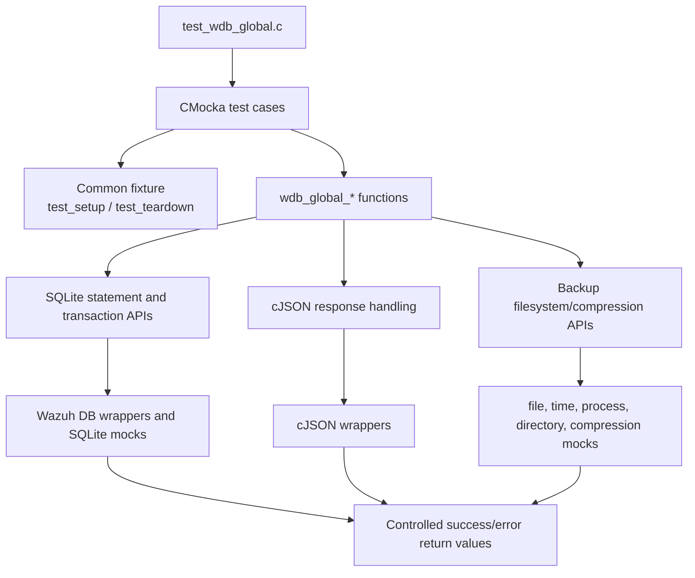
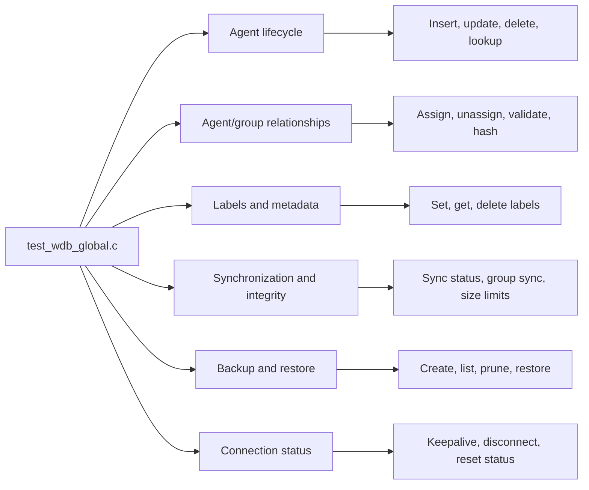

# `test_wdb_global`

## Purpose

`test_wdb_global` is a CMocka unit-test module for the Wazuh global database operations implemented in [`src/wazuh_db/wdb_global.c`](../../wazuh_db/wdb_global.c). It validates agent, group, label, synchronization, integrity, backup, and connection-management workflows.

The tests primarily exercise success paths and failure handling for transactions, statement caching, SQLite parameter binding/execution, JSON processing, response-size limits, and filesystem-based backup operations. Each test uses a common setup/teardown fixture that creates a minimal `wdb_t` context and initializes the Wazuh DB configuration.

## Architecture

### Test harness and dependency isolation

The module uses linker-wrapped functions defined in the Wazuh DB test configuration to isolate the implementation from real SQLite, filesystem, compression, time, and JSON dependencies.

### Functional coverage

## Core component references

- Implementation under test: [`src/wazuh_db/wdb_global.c`](../../wazuh_db/wdb_global.c)
- Public declarations and database types: [`src/wazuh_db/wdb.h`](../../wazuh_db/wdb.h)
- Global database schema: [`src/wazuh_db/schema_global.sql`](../../wazuh_db/schema_global.sql)
- Global DB helper functions: [`src/wazuh_db/helpers/wdb_global_helpers.c`](../../wazuh_db/helpers/wdb_global_helpers.c)
- Global DB helper declarations: [`src/wazuh_db/helpers/wdb_global_helpers.h`](../../wazuh_db/helpers/wdb_global_helpers.h)
- Wazuh DB command/parser integration: [`src/wazuh_db/wdb_parser.c`](../../wazuh_db/wdb_parser.c)
- Test build and linker-wrapper configuration: [`src/unit_tests/wazuh_db/CMakeLists.txt`](CMakeLists.txt)
- Shared Wazuh DB test wrappers: [`src/unit_tests/wrappers/wazuh/wazuh_db/wdb_wrappers.h`](../wrappers/wazuh/wazuh_db/wdb_wrappers.h)