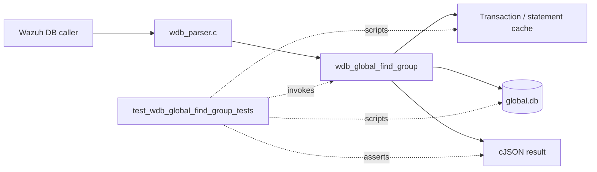
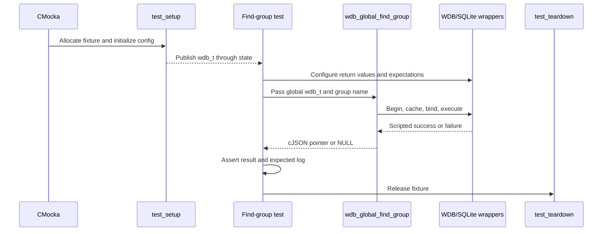
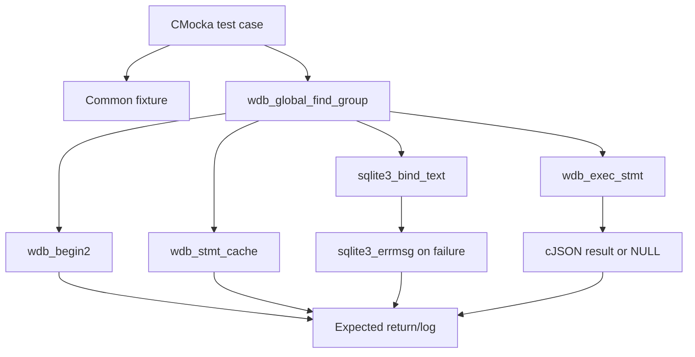
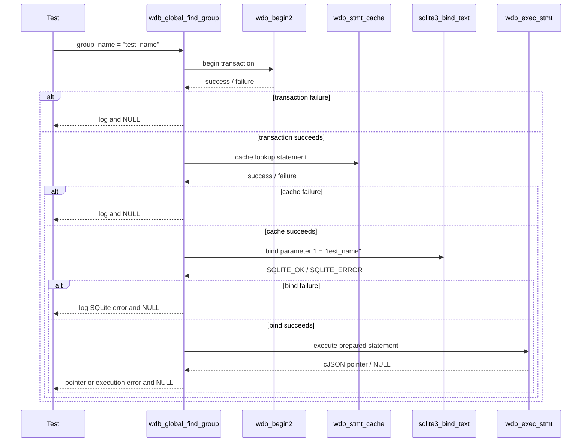

# `test_wdb_global_find_group_tests`

## Introduction

`test_wdb_global_find_group_tests` documents the CMocka coverage for `wdb_global_find_group()`, the Wazuh DB operation that looks up a group by name in the global database and returns its JSON representation.

The module is a focused subset of [`test_wdb_global.c`](../../src/unit_tests/wazuh_db/test_wdb_global.c). It verifies the complete database-call pipeline—transaction start, statement caching, parameter binding, statement execution, and result propagation—without opening a real SQLite database. The shared fixture and wrapper conventions are documented in [`test_wdb_global_test_infrastructure`](test_wdb_global_test_infrastructure.md); the complete parent test module is described in [`test_wdb_global`](test_wdb_global.md).

## Position in the system

The function under test belongs to the core global-database layer executed by `wazuh-db`. Higher-level callers request group information through the Wazuh DB command/parser and client helper layers; those broader request paths are covered by [`wazuh_db_global`](wazuh_db_global.md) and [`wazuh_db_command_parser`](wazuh_db_command_parser.md).



This leaf does not test group creation, assignment, deletion, validation, or group synchronization. Those behaviors remain in the neighboring group-focused sections of [`test_wdb_global`](test_wdb_global.md).

## Function contract exercised

At a behavioral level, the tests exercise this sequence:

1. Begin a transaction through `wdb_begin2()` when the supplied `wdb_t` is not already in a transaction.
2. Obtain or cache the prepared statement for the global group lookup.
3. Bind the caller’s group name as SQLite parameter 1.
4. Execute the statement through `wdb_exec_stmt()`.
5. Return the resulting `cJSON *`, or return `NULL` after logging an error.

```mermaid
flowchart TD
    Start([wdb_global_find_group(wdb, group_name)]) --> Begin{Transaction starts?}
    Begin -- no --> TxErr[Log "Cannot begin transaction"] --> Null[Return NULL]
    Begin -- yes --> Cache{Statement cached?}
    Cache -- no --> CacheErr[Log "Cannot cache statement"] --> Null
    Cache -- yes --> Bind{Bind group_name?}
    Bind -- no --> BindErr[Log SQLite bind error] --> Null
    Bind -- yes --> Exec{Execute query}
    Exec -- error --> ExecErr[Log wdb_exec_stmt error] --> Null
    Exec -- success --> Result[Return cJSON result]
```

The production implementation owns the exact SQL statement and JSON shape. This test module verifies the observable control flow and wrapper interactions rather than duplicating SQL details.

## Test fixture and isolation

Each case is registered with `cmocka_unit_test_setup_teardown`, using the common `test_setup` and `test_teardown` functions from the same source file.

The setup creates a minimal `test_struct_t` containing:

- A synthetic `wdb_t` whose identifier is `"global"`.
- Storage for a synthetic SQLite handle pointer.
- A 256-byte output buffer, shared by other `test_wdb_global.c` cases.
- Initialized Wazuh DB configuration.

The teardown frees these allocations and releases the Wazuh DB configuration. No test persists state to `global.db`; all database behavior is supplied by linker-wrapped Wazuh DB and SQLite functions.



See [`test_wdb_global_test_infrastructure`](test_wdb_global_test_infrastructure.md) for the reusable fixture lifecycle and wrapper helper details.

## Components and dependencies

| Component | Role in this module |
|---|---|
| `test_wdb_global.c` | Defines and registers the five focused test cases. |
| `wdb_global_find_group()` | Production operation under test. |
| `wdb_t` / `wdb.h` | Supplies the global database context and public declarations. |
| `wdb_begin2` wrapper | Controls transaction-start success or failure. |
| `wdb_stmt_cache` wrapper | Controls prepared-statement cache success or failure. |
| `sqlite3_bind_text` wrapper | Verifies parameter position 1 and the exact group name; controls bind failure. |
| `wdb_exec_stmt` wrapper | Supplies either a JSON result or an execution failure. |
| `sqlite3_errmsg` wrapper | Supplies deterministic SQLite error text for diagnostics. |
| CMocka | Records expectations and performs assertions. |
| cJSON | Represents the successful query result; the success case uses a sentinel pointer rather than inspecting fields. |



The wrapper implementation and linker-boundary conventions are maintained in [`wazuh_db_wrappers_global`](wazuh_db_wrappers_global.md) and the wider [`wazuh_db_wrappers`](wazuh_db_wrappers.md) documentation.

## Test scenarios

| Test case | Stimulated condition | Expected behavior |
|---|---|---|
| `test_wdb_global_find_group_transaction_fail` | `wdb_begin2()` returns `-1`. | Logs `Cannot begin transaction`; returns `NULL`. No statement cache or bind is attempted. |
| `test_wdb_global_find_group_cache_fail` | Transaction succeeds; `wdb_stmt_cache()` returns `-1`. | Logs `Cannot cache statement`; returns `NULL`. No bind or execution is attempted. |
| `test_wdb_global_find_group_bind_fail` | Cache succeeds; binding parameter 1 returns `SQLITE_ERROR`. | Supplies `ERROR MESSAGE` through `sqlite3_errmsg`, expects the `DB(global) sqlite3_bind_text(): ERROR MESSAGE` log, and returns `NULL`. |
| `test_wdb_global_find_group_exec_fail` | Transaction, cache, and bind succeed; `wdb_exec_stmt()` returns `NULL`. | Supplies `ERROR MESSAGE`, expects `wdb_exec_stmt(): ERROR MESSAGE`, and returns `NULL`. |
| `test_wdb_global_find_group_success` | All database stages succeed; execution returns `(cJSON *)1`. | Returns the exact sentinel pointer unchanged. |

The cases intentionally stop at the first failed stage. This proves short-circuit behavior and prevents a later wrapper call from masking the failure being tested.

## Interaction flow



## Assertions and maintenance guidance

The tests validate both return values and diagnostics. The exact expected group name, parameter position, database identifier, and error messages are part of the contract captured by this module.

When changing the production lookup path:

- Preserve one test for each pipeline boundary: transaction, cache, bind, and execute.
- Update wrapper expectations if the statement API or bind order changes.
- Keep the success case’s sentinel-pointer assertion if the operation is still expected to return the execution result directly.
- Add JSON-content assertions if the function begins transforming the query result rather than forwarding it.
- Keep broader group-management and synchronization behavior in the parent [`test_wdb_global`](test_wdb_global.md) documentation.

## Related documentation

- [`test_wdb_global`](test_wdb_global.md) — complete CMocka coverage for `wdb_global.c`.
- [`test_wdb_global_test_infrastructure`](test_wdb_global_test_infrastructure.md) — fixture lifecycle and reusable wrapper helpers.
- [`wazuh_db_global`](wazuh_db_global.md) — production global database architecture and group-management responsibilities.
- [`wazuh_db_engine`](wazuh_db_engine.md) — generic transaction and statement-cache infrastructure used by the operation.
- [`wazuh_db_command_parser`](wazuh_db_command_parser.md) — command dispatch into global database operations.
- [`wazuh_db_wrappers_global`](wazuh_db_wrappers_global.md) — global-database wrapper boundaries used by unit tests.

## Source references

- [`src/unit_tests/wazuh_db/test_wdb_global.c`](../../src/unit_tests/wazuh_db/test_wdb_global.c)
- [`src/wazuh_db/wdb_global.c`](../../src/wazuh_db/wdb_global.c)
- [`src/wazuh_db/wdb.h`](../../src/wazuh_db/wdb.h)
