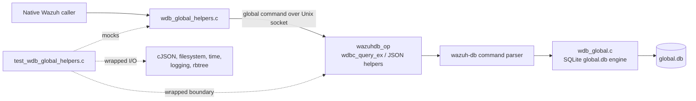
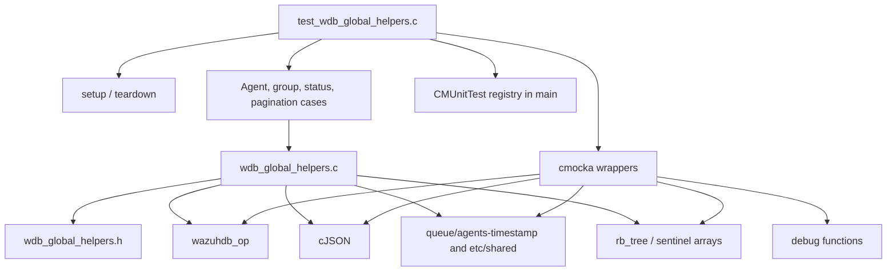
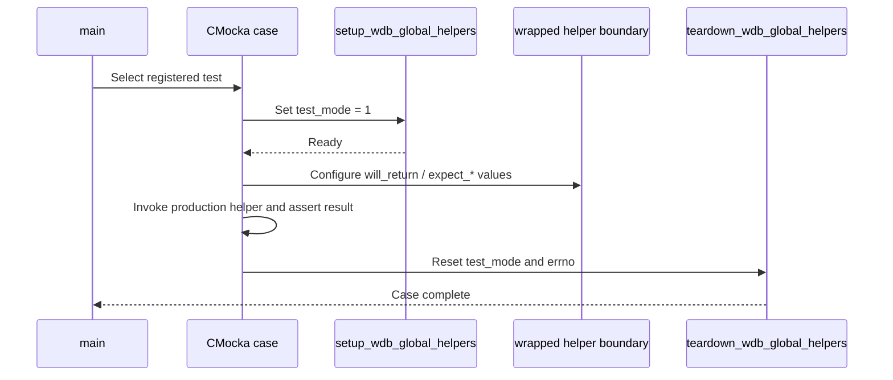
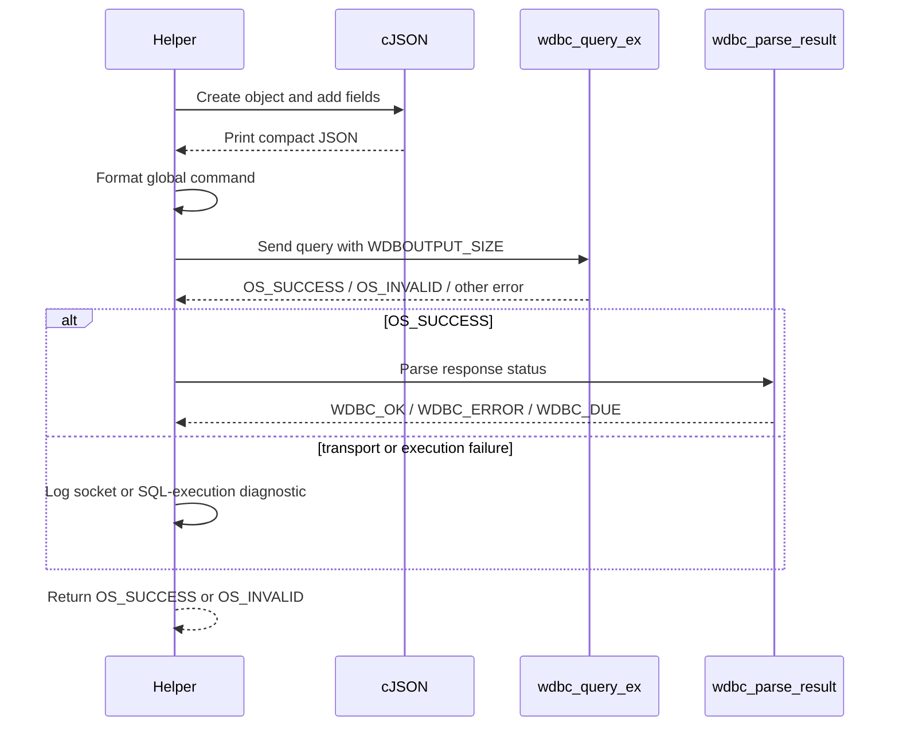
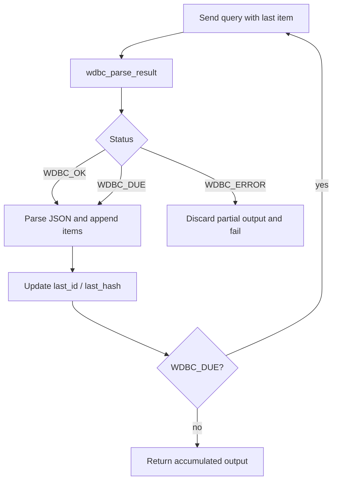

# `test_wdb_global_helpers`

`test_wdb_global_helpers` is the CMocka unit-test module for Wazuh's global database client helpers. It verifies that helpers in `wdb_global_helpers.c` construct the expected `global ...` commands, serialize and parse cJSON payloads, handle paginated Wazuh DB responses, translate failures into the public return conventions, and release temporary resources.

The tests exercise the client boundary only; they do not open SQLite or require a running `wazuh-db` daemon. The global database engine and command dispatch are documented in [wazuh_db_global](wazuh_db_global.md), while the shared daemon, socket, and query protocol are covered by [wazuh_db](wazuh_db.md), [wazuh_db_engine](wazuh_db_engine.md), and [wazuh_db_command_parser](wazuh_db_command_parser.md).

## Position in the system

The module tests the layer used by processes such as remoted, agent registration, cluster synchronization, and other native daemons when they need global agent or group data without linking SQLite directly.



At runtime, the helper produces a request, sends it through `wazuhdb_op`, and interprets a response beginning with a Wazuh DB result status such as `ok` or `due`. In the unit test, those boundaries are wrapped so each branch can be reproduced deterministically.

## Components and dependencies

| Component | Role in this module |
|---|---|
| `src/unit_tests/wazuh_db/test_wdb_global_helpers.c` | CMocka cases, fixtures, wrapper implementations, and the test registry. |
| `src/wazuh_db/helpers/wdb_global_helpers.h` | Public declarations, `global_db_access` command identifiers, and ownership/return contracts. |
| `src/wazuh_db/helpers/wdb_global_helpers.c` | Production helper implementation under test. |
| `wazuhdb_op.h` and Wazuh DB wrappers | Mocked transport, result parsing, and socket behavior. |
| cJSON wrappers | Control object creation, field insertion, serialization, parsing, field lookup, and deletion. |
| POSIX/file wrappers | Control `opendir`, `readdir`, `wfopen`, `fgets`, `fclose`, `time`, and path-related behavior. |
| rbtree wrappers | Observe and isolate red-black-tree output for agent IDs. |
| debug wrappers | Assert error and diagnostic messages for each failure category. |



The helper may receive a caller-owned socket. When the test passes `NULL`, the implementation uses an auxiliary socket and closes it before returning. This distinction is part of the tested contract even though the socket itself is mocked.

## Test lifecycle and isolation

Every registered case uses `cmocka_unit_test_setup_teardown`.



The regular fixture sets `test_mode = 1`, then restores it to `0` and clears `errno`. The agent-group fixture additionally allocates a `test_struct_t`, splits `default,Group1,Group2` into an array, stores the expected mode and synchronization status, and frees all allocations during teardown. `set_payload` and `test_payload` provide controlled Wazuh DB response bodies for chunk-parser tests.

The wrappers keep tests independent of external state:

- `__wrap_time` makes timestamps deterministic.
- cJSON wrappers control allocation, field insertion, printing, parsing, lookup, and deletion.
- `wdbc_query_ex`, `wdbc_query_parse_json`, and `wdbc_parse_result` model transport and protocol outcomes.
- directory and file wrappers model `etc/shared` and `queue/agents-timestamp` without touching the host filesystem.
- logging wrappers verify the diagnostic path and exact message category.
- rbtree wrappers allow ID collection to be asserted without a real database.

## Command and response contract

The implementation keeps command templates in `global_db_commands`:

| Helper family | Command shape exercised by tests |
|---|---|
| Agent creation and updates | `global insert-agent ...`, `update-agent-name ...`, `update-agent-data ...`, `update-keepalive ...`, `update-connection-status ...`, `update-status-code ...` |
| Agent lookup | `global get-agent-info <id>`, `get-labels <id>`, `select-agent-name <id>`, `select-agent-group <id>`, `find-agent <json>` |
| Agent collections | `global get-all-agents last_id <n>`, `get-agents-by-connection-status <last_id> <status>`, and the node-qualified form |
| Agent removal/state | `global delete-agent <id>`, `reset-agents-connection <sync>`, `disconnect-agents <last_id> <keepalive> <sync>` |
| Groups | `global insert-agent-group <name>`, `find-group <name>`, `delete-group <name>`, `set-agent-groups <json>`, `get-distinct-groups <last_hash>` |

The common write path is:



The tests deliberately separate three failure classes:

1. **Request construction**: cJSON allocation fails or input parameters are invalid.
2. **Transport/execution**: the socket returns `OS_INVALID`, `OS_TIMEOUT`, or another negative result.
3. **Database response**: transport succeeds but `wdbc_parse_result` returns `WDBC_ERROR`.

Successful writes require both `wdbc_query_ex == OS_SUCCESS` and `wdbc_parse_result == WDBC_OK`.

## Functional coverage

### Agent records and metadata

The first portion of the suite covers:

- `wdb_insert_agent`: JSON fields for ID, name, IP, registration IP, internal key, group, and `date_add`; both current-time and preserved-date modes.
- `wdb_update_agent_name`: serialized ID/name update.
- `wdb_update_agent_data`: validation of `agent_info_data`, OS metadata, version, checksums, manager/node identity, labels, connection status, synchronization status, and group configuration status.
- `wdb_update_agent_keepalive`, `wdb_update_agent_connection_status`, and `wdb_update_agent_status_code`: status payloads and failure handling. The status-code tests also cover `INVALID_VERSION` and the `Wazuh ` version prefix.
- `wdb_get_agent_info` and `wdb_get_agent_labels`: successful JSON ownership and NULL on query failure.
- `wdb_get_agent_name` and `wdb_get_agent_group`: field extraction, not-found behavior for names, and cleanup.
- `wdb_find_agent`: rejects missing name/IP, builds a lookup JSON object, and extracts the returned numeric ID.
- `wdb_remove_agent`: delete command and result handling.

For successful JSON-returning functions, the test supplies a real cJSON tree and verifies the returned value. For failed lookups, it verifies the helper logs the error and returns NULL or an allocated empty string according to the header contract.

### Group management and filesystem reconciliation

The group tests cover `wdb_find_group`, `wdb_insert_group`, `wdb_remove_group_db`, `wdb_set_agent_groups`, `wdb_set_agent_groups_csv`, and `wdb_update_groups`.

`wdb_update_groups` reconciles the names known by global.db with directories under the supplied shared-configuration directory. The tests cover:

- no initial JSON response;
- a path exceeding `PATH_MAX`;
- failure to open the shared directory;
- removal of an obsolete group database;
- insertion of a directory-backed group not yet present in global.db;
- the successful scan path.

```mermaid
flowchart TD
    Start[wdb_update_groups(dirname)] --> Existing[wdb query: select groups]
    Existing --> JsonOK{JSON response?}
    JsonOK -->|no| Fail[Log and return OS_INVALID]
    JsonOK -->|yes| Scan[Open dirname]
    Scan --> Path{Path within PATH_MAX?}
    Path -->|no| Fail
    Path -->|yes| Reconcile[Compare DB names with directory entries]
    Reconcile --> Stale[Remove stale group DBs]
    Reconcile --> New[Find directory groups missing in DB]
    New --> Insert[find-group, then insert-agent-group]
    Stale --> Done[Return OS_SUCCESS]
    Insert --> Done
```

`wdb_set_agent_groups_csv` is specifically verified to convert the CSV fixture into a JSON array. The array form is tested for missing mode, socket failure, database result failure, and success.

### Dates and agent connection state

`get_agent_date_added` reads `queue/agents-timestamp`. The cases cover file-open failure, incomplete rows, missing date, invalid date format, and a valid `YYYY-MM-DD HH:MM:SS` value converted with `mktime`. The file is always closed in the modeled successful read paths.

`wdb_reset_agents_connection` tests the global reset command. `wdb_get_agents_by_connection_status`, `wdb_get_agents_ids_of_current_node`, and `wdb_disconnect_agents` test status filtering, node lookup through `get_node_name`, keepalive thresholds, pagination, and returned ID arrays.

ID arrays are heap allocated and terminated with `-1`; callers must free them. The tests assert both the values and sentinel. The RB-tree variant returns a tree that callers destroy with `rbtree_destroy`.

## Pagination and chunk parsers

Wazuh DB can return more rows than fit in one socket response. The helper layer therefore repeats a query when the response status is `WDBC_DUE`, using the last numeric ID or string hash as the continuation value.



The parser-specific cases are:

| Function | Output | Assertions |
|---|---|---|
| `wdb_parse_chunk_to_int` | Resizable `int` array | Appends numeric `id` fields, updates `last_item`/`last_size`, preserves output across `WDBC_DUE`, and returns `WDBC_ERROR` for invalid JSON. |
| `wdb_parse_chunk_to_rbtree` | Existing `rb_tree` | Rejects NULL tree or item, inserts formatted numeric IDs, and updates the last ID. |
| `wdb_parse_chunk_to_json_by_string_item` | cJSON array | Requires an array output and item name, appends non-empty response arrays, and optionally copies the last string item value. |

`wdb_get_all_agents` and `wdb_get_all_agents_rbtree` consume the integer parser. `wdb_get_distinct_agent_groups` consumes the JSON/string parser and demonstrates a two-request `WDBC_DUE` sequence: first with an empty hash, then with the last returned `group_hash`.

## Error behavior matrix

| Failure point | Representative cases | Expected behavior |
|---|---|---|
| Invalid input | `wdb_find_agent`, `wdb_set_agent_groups` | Emit a debug message and return `OS_INVALID`. |
| cJSON construction | Agent insert/update and group setters | Emit “Error creating data JSON for Wazuh DB.” and return `OS_INVALID`. |
| Query/socket failure | Most write helpers and collection helpers | Log socket or execution diagnostics; return `OS_INVALID` or NULL. |
| Result parse failure | `*_error_result` cases | Log the global DB result error and reject the operation. |
| Malformed JSON | Chunk parsers and JSON lookup helpers | Delete partial trees where appropriate and return `WDBC_ERROR`, NULL, or `OS_INVALID`. |
| Missing field/row | Agent name/group and parser cases | Return an empty string, NULL, or continue without a cursor depending on the API contract. |
| Filesystem failure | `wdb_update_groups`, `get_agent_date_added` | Log the path/file error and return failure or zero date. |

The suite also checks cleanup expectations, including cJSON deletion, auxiliary socket handling through the wrapped Wazuh DB operation, temporary string ownership, and teardown of fixture allocations.

## Test registration

`main` builds one `CMUnitTest` array and runs it with `cmocka_run_group_tests`. Tests are grouped in source order by helper family: agent CRUD and metadata, group operations, date parsing, connection state, chunk parsing, agent-group assignment, distinct groups, and string-keyed JSON parsing. The registration uses the regular fixture except for agent-group cases, which use the allocation-bearing fixture.

There is a duplicate registration of `test_wdb_remove_group_db_success` in the current `main` array. It does not alter the helper contract, but it causes that case to execute twice and should be considered when interpreting test counts or making future registry changes.

## Maintenance guidance

When changing a helper:

1. Update the command-template expectation if the wire command or JSON field changes.
2. Preserve separate tests for request construction, transport/execution, and parsed DB-result failures.
3. For paginated helpers, test both a single `WDBC_OK` response and a `WDBC_DUE` followed by `WDBC_OK`.
4. Assert ownership: successful cJSON results and heap arrays belong to the caller; partial results must be released on failure.
5. Keep filesystem, clock, socket, and database access behind wrappers so the unit test remains deterministic.
6. If the global DB protocol changes, update the related command-parser and engine documentation rather than duplicating those details here.

## References

- Production header: [`wdb_global_helpers.h`](/home/anhnh/CodeWiki-journal/repos/wazuh/src/wazuh_db/helpers/wdb_global_helpers.h)
- Production implementation: [`wdb_global_helpers.c`](/home/anhnh/CodeWiki-journal/repos/wazuh/src/wazuh_db/helpers/wdb_global_helpers.c)
- Test source: [`test_wdb_global_helpers.c`](/home/anhnh/CodeWiki-journal/repos/wazuh/src/unit_tests/wazuh_db/test_wdb_global_helpers.c)
- [Wazuh DB global engine](wazuh_db_global.md)
- [Wazuh DB core](wazuh_db.md)
- [Wazuh DB engine and transactions](wazuh_db_engine.md)
- [Wazuh DB command parser](wazuh_db_command_parser.md)
- [Agent helper tests](test_wdb_agents_helpers.md)
- [Wazuh DB agent tests](test_wdb_agents.md)
