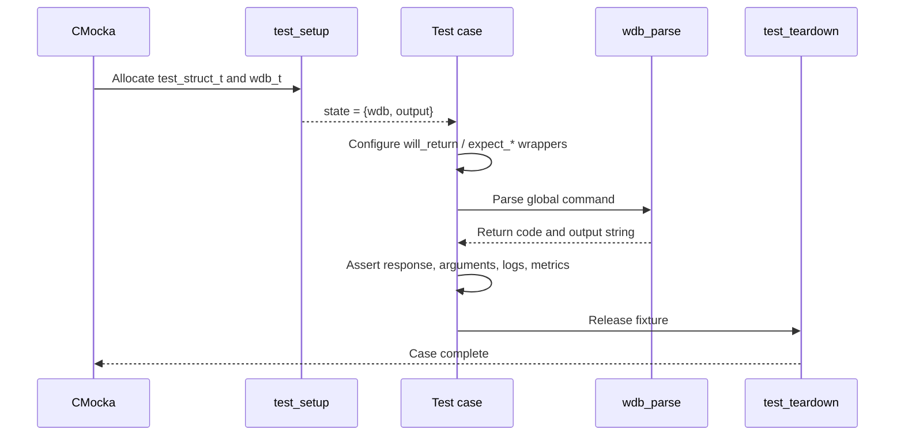
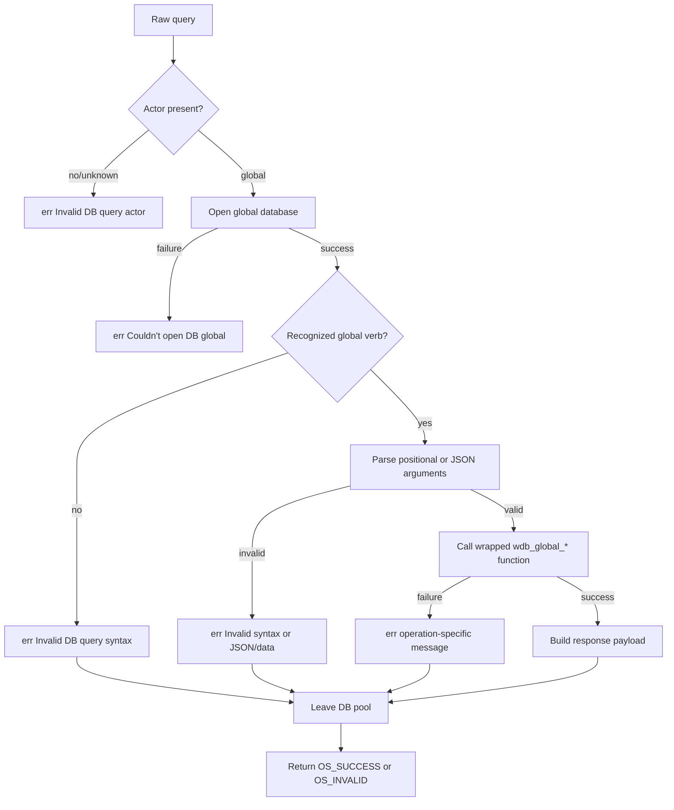
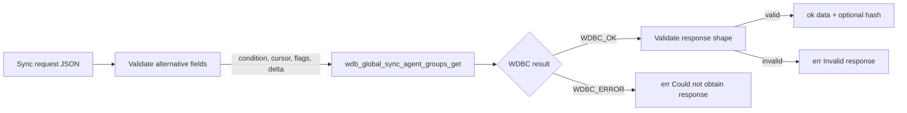
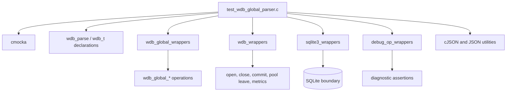

# `test_wdb_global_parser`

## Introduction

`test_wdb_global_parser` is a CMocka test module for the `global` command branch of `wdb_parse()`, the text-protocol dispatcher in `wazuh-db`. It verifies that raw commands targeting `global.db` are parsed, validated, dispatched to the corresponding `wdb_global_*` operation, serialized into the expected `ok`/`err` response, and released from the database pool correctly.

The module tests the parser boundary rather than SQLite implementation details. Production global-database behavior is documented in [`wazuh_db_global.md`](wazuh_db_global.md); parser-wide dispatch is covered by [`wazuh_db_command_parser.md`](wazuh_db_command_parser.md).

## Position in the system

At runtime, clients send a line-oriented command through the `wazuh-db` socket. The daemon invokes `wdb_parse()`, which identifies the `global` actor and routes the remainder of the command to a global operation. This test substitutes the database, logging, timing, JSON, and filesystem boundaries with CMocka wrappers.

```mermaid
flowchart LR
    Client[Wazuh client or helper] --> Socket[wazuh-db Unix socket]
    Socket --> Parser[wdb_parse()]
    Parser --> Global[global command dispatcher]
    Global --> Ops[wdb_global_* operation]
    Ops --> DB[(global.db)]

    Test[test_wdb_global_parser.c] -. exercises .-> Parser
    Test -. mocks .-> Ops
    Test -. mocks .-> DB
    Test -. observes .-> Metrics[query and latency metrics]
```

The client-facing command construction and response parsing layer is documented in [`test_wdb_global_helpers.md`](test_wdb_global_helpers.md). The wrapped global operation contracts are documented in [`wazuh_db_wrappers_global.md`](wazuh_db_wrappers_global.md), and reusable global-database fixture infrastructure is documented in [`test_wdb_global_test_infrastructure.md`](test_wdb_global_test_infrastructure.md).

## Test fixture and lifecycle

`test_struct_t` is the per-test state object:

| Field | Purpose |
|---|---|
| `wdb` | Synthetic `wdb_t` representing the global database connection. |
| `output` | `OS_MAXSTR` buffer receiving the parser response. |

`test_setup()` allocates the fixture, creates a `wdb_t`, sets its identifier to `global`, allocates storage for its SQLite pointer, marks it enabled, and publishes it through CMocka's `state` pointer. `test_teardown()` frees the output buffer, database identifier, SQLite-pointer storage, database object, and fixture.



Every test is registered with `cmocka_unit_test_setup_teardown`, so parser state and output buffers are isolated between cases. The production database is never required.

## Parser flow under test

The cases collectively establish the following common flow:



The tests also verify the cross-cutting behavior expected around most commands: query counters are incremented, global-operation counters and timing counters are invoked, diagnostic messages are emitted on failure, and `wdb_pool_leave()` is called when the database file remains available. `test_wdb_parse_delete_db_file` covers the special recovery branch where `queue/db/global.db` has disappeared and the handle is closed so the database can be recreated.

## Command coverage

### Generic parser and SQL paths

The initial cases cover:

- opening failure for `global `;
- missing actor arguments (`global`) and an unknown actor;
- unknown global subcommands;
- raw SQL execution through `global sql <statement>`, including successful JSON-array output and SQLite failure propagation.

Successful SQL results are formatted as `ok <JSON>`. SQL failures preserve the SQLite error in the diagnostic response, while malformed command syntax is reported before execution.

### Agent lifecycle and metadata

The parser tests exercise the following commands and their failure classes:

| Command family | Representative validated behavior |
|---|---|
| `insert-agent <JSON>` | JSON syntax, database-schema compliance, field extraction, and insert failure/success. |
| `update-agent-name <JSON>` | Required `id`/`name`, JSON validation, update failure/success. |
| `update-agent-data <JSON>` | OS/version, manager/node, IP, connection, synchronization, and group-config fields; sync-status normalization; label cleanup after success. |
| `update-keepalive <JSON>` | Required connection and sync state, sync-status validation, and update result. |
| `update-connection-status <JSON>` | Connection status, sync status, and numeric status code validation. |
| `update-status-code <JSON>` | Status code, version, and sync status validation. |
| `delete-agent <id>` | Numeric ID parsing and deletion result. |
| `get-labels <id>` | Label lookup and JSON-array response. |
| `select-agent-name <id>` / `select-agent-group <id>` | Single-object lookup and error response when no object is returned. |
| `find-agent <JSON>` | IP/name input validation and ID-object response. |
| `get-agent-info <id>` | Agent object lookup and serialization. |

For JSON commands, the tests distinguish malformed JSON from syntactically valid but incomplete or type-invalid data. This distinction is important because the parser must reject bad input before invoking the database operation.

### Groups and membership

Coverage includes group lookup, creation, deletion, listing, and membership retrieval:

- `find-group <name>` and `insert-agent-group <name>`;
- `delete-group <name>` and `select-groups`;
- `select-group-belong <agent_id>`;
- `get-group-agents <group> last_id <id>`;
- `set-agent-groups <JSON>`;
- `recalculate-agent-group-hashes`.

The `get-group-agents` cases verify missing group, missing cursor key, missing cursor value, database failure, and successful paginated JSON output. `set-agent-groups` verifies malformed JSON, missing mandatory fields, invalid mode, operation failure, and the `append`/`override` mode mapping to `WDB_GROUP_APPEND`/`WDB_GROUP_OVERRIDE`.

### Synchronization and integrity

Synchronization-oriented cases cover:

- `sync-agent-info-get`, with the default cursor, an explicit `last_id`, and the maximum response-size boundary;
- `sync-agent-info-set`, including malformed JSON, SQL failure, invalid agent IDs, label deletion failure, label insertion failure, and success;
- `sync-agent-groups-get`, including optional/default fields, cursor validation, condition selection, `set_synced`, global-hash retrieval, registration delta, null responses, and structurally invalid responses;
- `get-groups-integrity <SHA-1 hash>`, including hash-length validation, database failure, and `syncreq`, `synced`, and mismatch responses;
- `get-distinct-groups [last_hash]`, including both cursor forms and null-result failure.

The optional `sync-agent-groups-get` fields are validated as typed alternatives. Negative cursors/deltas and string values where numbers or booleans are required must produce `err Invalid JSON data, invalid alternative fields data`.



### Connection management and agent selection

The module covers:

- `disconnect-agents <last_id> <keepalive> <sync_status>` with missing argument branches and successful paginated output;
- `get-all-agents last_id <id>` and the `context` variant;
- `get-agents-by-connection-status <last_id> <status> [node] [limit]`, including missing status/cursor/limit, default and node-qualified calls, limit `-1`, and database failure;
- `reset-agents-connection <sync_status>`.

These tests verify that positional arguments are forwarded exactly, including optional node and limit values.

### Backup, restore, and maintenance

Backup and maintenance commands are covered without touching the filesystem:

| Command | Expected behavior tested |
|---|---|
| `backup get` | List backup snapshots or report that the backup directory cannot be opened. |
| `backup restore [JSON]` | Parse optional snapshot and `save_pre_restore_state`; omitted flag defaults to `false`. |
| `vacuum` | Commit, finalize statements, vacuum, read fragmentation, update metadata, and return fragmentation JSON. Each stage has a dedicated failure case. |
| `get_fragmentation` | Read database state and free-page percentage, rejecting either failed metric. |

The vacuum success response is `ok {"fragmentation_after_vacuum":10}` in the fixture scenario. Fragmentation reads return `ok {"fragmentation":50,"free_pages_percentage":10}` for the scripted values.

## Response and error contract

The tests consistently assert both the C return value and the response buffer:

| Outcome | Return | Response pattern |
|---|---:|---|
| Successful command without payload | `OS_SUCCESS` | `ok` |
| Successful command with JSON payload | `OS_SUCCESS` | `ok <JSON>` |
| Invalid actor, syntax, or data | `OS_INVALID` | `err <specific validation message>` |
| Wrapped operation failure | `OS_INVALID` | `err <operation/database message>` |

The exact error text is part of the tested protocol. Tests also assert wrapper arguments and expected log messages, making regressions visible even when a broad success/failure result remains unchanged.

## Dependencies and mocking strategy



Important mocked seams include:

- `__wrap_wdb_open_global`, `__wrap_wdb_pool_leave`, and `__wrap_wdb_close` for connection lifecycle;
- `__wrap_wdb_exec` and `__wrap_sqlite3_errmsg` for raw SQL and database errors;
- `__wrap_wdb_global_*` functions for agent, group, synchronization, backup, and maintenance results;
- `__wrap_w_inc_*` and `__wrap_gettimeofday` for operation metrics and deterministic timing;
- debug wrappers for exact error and warning messages;
- JSON objects created in tests to model result payloads.

The wrapper API and argument-checking conventions are maintained in [`wazuh_db_wrappers_global.md`](wazuh_db_wrappers_global.md), so this document records only the parser-level usage.

## Test registration and maintenance guidance

`main()` constructs a `CMUnitTest` array and registers each case with the shared setup and teardown functions before calling `cmocka_run_group_tests`. The registry is grouped by parser command family, which makes it the authoritative map of current `global` protocol coverage.

When extending this module:

1. Add success, malformed syntax/data, and wrapped-operation failure cases where applicable.
2. Configure wrapper expectations before calling `wdb_parse()`.
3. Assert the forwarded command arguments, response text, return code, and important diagnostics.
4. Verify pool release and special database-file handling on every relevant branch.
5. Register the test in the matching section of `main()`.

For production changes, update the implementation documentation in [`wazuh_db_global.md`](wazuh_db_global.md) or [`wazuh_db_command_parser.md`](wazuh_db_command_parser.md) as appropriate; keep this document focused on observable parser behavior and test boundaries.
