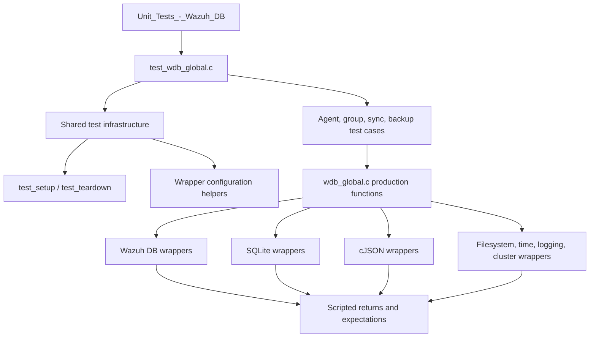
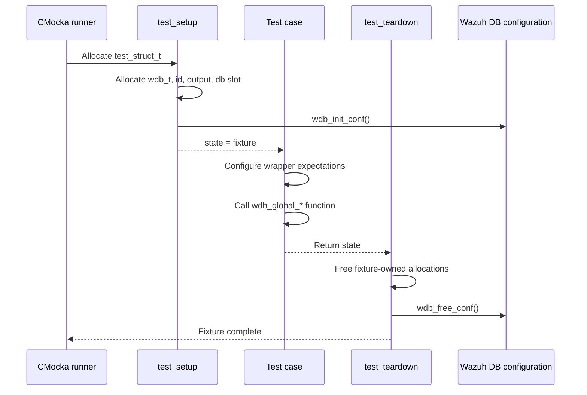
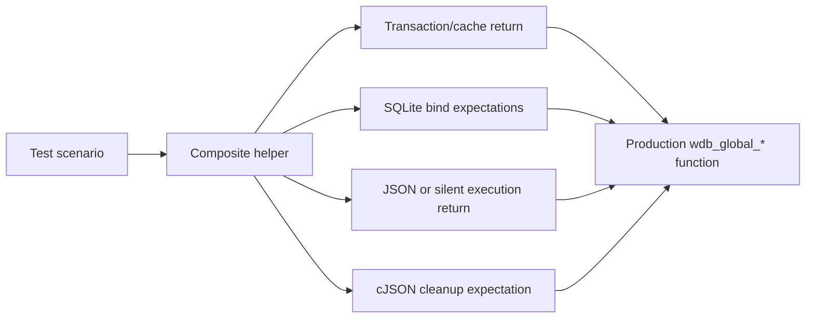
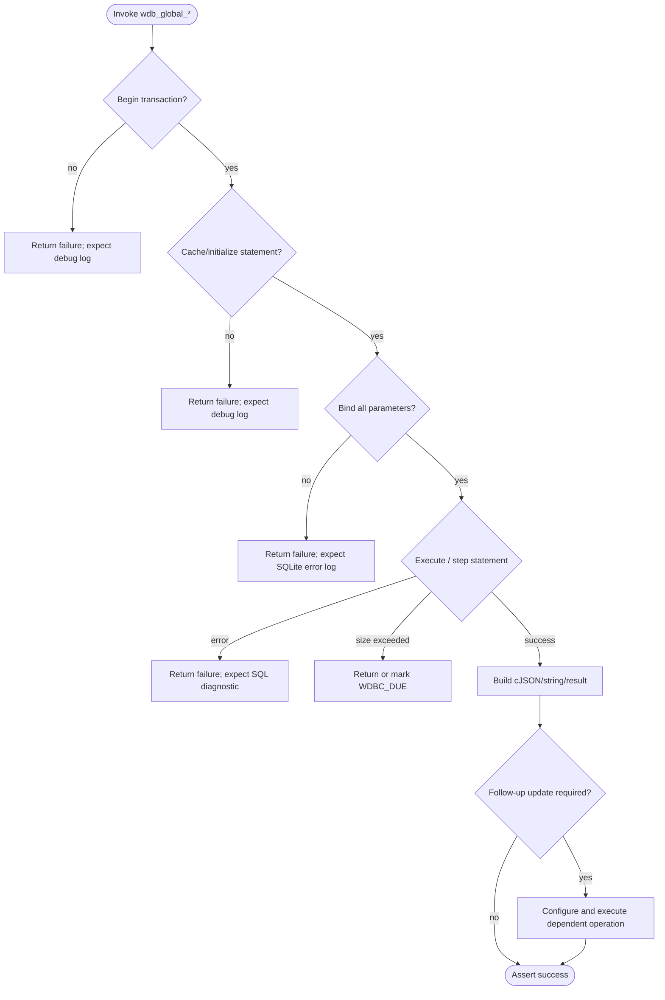
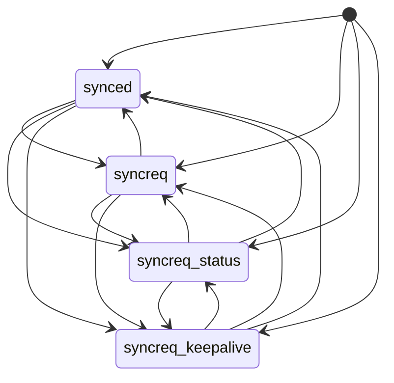
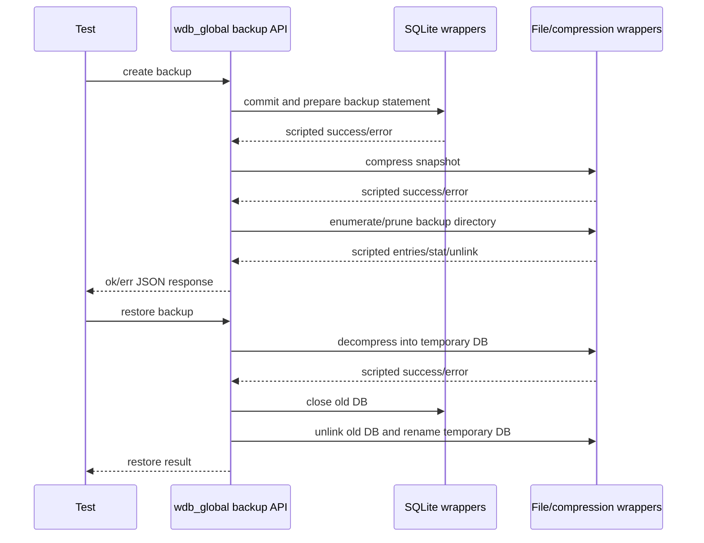

# `test_wdb_global_test_infrastructure`

## Introduction

`test_wdb_global_test_infrastructure` documents the reusable test harness embedded in `src/unit_tests/wazuh_db/test_wdb_global.c`. The harness supplies a minimal global-database context, resets Wazuh DB configuration between tests, and provides CMocka helper functions for scripting SQLite and Wazuh DB wrapper behavior.

The infrastructure is consumed by the individual global-database test groups documented in [`test_wdb_global.md`](test_wdb_global.md). It does not implement production database behavior; it creates the controlled execution boundary around `wdb_global_*` functions so tests can independently exercise success, SQLite failure, transaction failure, response-size limits, synchronization, and backup flows.

## Scope and role in the test system

The module belongs to the `Unit_Tests_-_Wazuh_DB` suite and sits between CMocka test cases and the production global database implementation. The parent suite provides the overall test organization, while the wrapper module documents the linker-wrapped seams used here; see [`Unit_Tests_-_Wazuh_DB.md`](Unit_Tests_-_Wazuh_DB.md) and [`wazuh_db_wrappers_global.md`](wazuh_db_wrappers_global.md).

## Fixture lifecycle

Every registered test uses `cmocka_unit_test_setup_teardown`, so the fixture is recreated for each case. This prevents state from one failure-path test from affecting the next test.

### `test_setup`

`test_setup` allocates a `test_struct_t` containing:

- A `wdb_t` object representing the global database connection.
- The database identifier `"global"`.
- A 256-byte output buffer used by backup and restore APIs.
- Storage for the `sqlite3 *` member; the handle itself is intentionally synthetic.

It then calls `wdb_init_conf()` and publishes the fixture through CMocka’s `state` pointer. Production functions therefore receive structurally valid context without opening a real database.

### `test_teardown`

`test_teardown` releases the output buffer, database identifier, synthetic SQLite storage, `wdb_t`, and outer fixture. It finally calls `wdb_free_conf()` to release/reset global Wazuh DB configuration.

## Wrapper configuration helpers

The helpers convert a high-level test scenario into the low-level expectations required by the wrapped implementation. They are especially useful when a production operation calls several database layers in sequence.

### Response-size helpers

The following helpers configure `__wrap_wdb_exec_stmt_sized`:

| Helper | Simulated result | Intended branch |
|---|---|---|
| `wrap_wdb_exec_stmt_sized_success_call` | `SQLITE_DONE` plus supplied JSON | Normal response within `WDB_MAX_RESPONSE_SIZE` |
| `wrap_wdb_exec_stmt_sized_failed_call` | `SQLITE_ERROR` and `NULL` | SQL execution failure |
| `wrap_wdb_exec_stmt_sized_socket_full_call` | `SQLITE_ROW` plus supplied JSON | Response exceeds socket capacity / `WDBC_DUE` handling |

All three assert the production call uses `WDB_MAX_RESPONSE_SIZE` and the expected `STMT_SINGLE_COLUMN` or `STMT_MULTI_COLUMN` mode.

### Composite success helpers

The composite helpers model common multi-step workflows:

- `create_wdb_global_get_agent_max_group_priority_success_call` configures statement lookup, agent-ID binding, JSON execution, and response cleanup.
- `create_wdb_global_validate_groups_success_call` configures the existing-group-count lookup used by group-limit validation.
- `create_wdb_global_delete_agent_belong_success_call` configures transaction/cache setup, agent binding, and silent deletion.
- `create_wdb_global_unassign_agent_group_success_call` chains group lookup with deletion of the `(group_id, agent_id)` relationship.
- `create_wdb_global_calculate_agent_group_csv_success_call` configures the transaction and agent binding needed to calculate a CSV group context.
- `create_wdb_global_set_agent_group_context_success_call` verifies CSV, hash, synchronization status, and agent-ID bindings before the update.
- `create_wdb_global_assign_agent_group_success_call` chains group lookup and insertion into the belongs table.

These helpers configure only the dependency interactions relevant to the scenario. The production function remains responsible for ordering, branching, error propagation, and cleanup; the helper makes those interactions deterministic.

## Dependency boundaries

The test file includes wrappers for the following categories:

| Boundary | Examples of behavior controlled by tests |
|---|---|
| Wazuh DB | Transactions, statement cache, prepared statements, execution, commit, close, finalization |
| SQLite | Integer/text binding, named-parameter lookup, stepping, columns, preparation, finalization, error text |
| cJSON | Array/object creation, deletion, and real JSON construction for readable assertions |
| Filesystem | Directory enumeration, `stat`, `unlink`, and `rename` for backup retention and restore |
| Time and formatting | Current time and timestamp generation for deterministic backup names and keepalive updates |
| Compression | Gzip compression/decompression success and failure |
| Logging and cluster state | Expected diagnostics and single-node behavior |

The detailed wrapper contracts are maintained in [`wazuh_db_wrappers_global.md`](wazuh_db_wrappers_global.md); this document describes how the infrastructure composes them rather than restating every wrapper.

## Standard mocked database flow

Most database tests follow the same staged process. Failure tests stop at the stage under examination and assert both the return value and diagnostic message.

This pattern is visible across label operations, agent metadata updates, group relationships, paginated agent queries, and synchronization APIs. The corresponding behavior-level coverage is documented in [`test_wdb_global.md`](test_wdb_global.md).

## State and synchronization coverage

The infrastructure supports tests for the synchronization states `synced`, `syncreq`, `syncreq_status`, and `syncreq_keepalive`. The validation tests provide old status values through wrapped SQLite column reads and verify whether the requested new status is accepted or normalized.

Synchronization batch tests also control cursor values, registration-time filtering, optional group hashes, `set_synced` behavior, JSON response accumulation, and `WDB_MAX_RESPONSE_SIZE` boundary behavior.

The diagram represents the transition combinations exercised by the test matrix; the production validator remains the authority for the exact transition policy.

## Backup and restore infrastructure

Backup tests use mocked time, timestamp formatting, SQLite preparation/execution, compression, directory traversal, and file operations. They verify deterministic paths such as `backup/db/global.db-backup-<timestamp><tag>` without creating files on disk.

The scenarios include commit, prepare, bind, execution, and compression failures; successful backup creation; old-backup pruning; listing and most-recent/oldest selection; and restore replacement.

## Test registration and execution

`main()` builds a CMocka `CMUnitTest` array. Each entry binds one test function to `test_setup` and `test_teardown`, then calls `cmocka_run_group_tests`. The registry is organized by production capability: labels, synchronization, agents, groups, connection state, backups, group hashing, and group-setting modes.

When adding a test:

1. Use the common fixture unless a separate fixture is required.
2. Configure wrapper expectations before calling the production function.
3. Assert return code/status and externally visible JSON or string results.
4. Assert important diagnostic messages for failure branches.
5. Free real cJSON trees and other allocations created by the test.
6. Register the test with `cmocka_unit_test_setup_teardown`.

## Failure-model conventions

The module consistently distinguishes:

- `OS_SUCCESS` / `WDBC_OK`: operation completed and the response is valid.
- `OS_INVALID`, `WDBC_ERROR`, or `NULL`: dependency or validation failure.
- `WDBC_DUE`: a valid operation exceeded the configured response limit and must be continued or handled by the caller.

Tests also verify that SQLite failures use wrapped `sqlite3_errmsg()` text in Wazuh logging calls, validating both control flow and operational diagnosability.

## Related documentation

- [`test_wdb_global.md`](test_wdb_global.md) — behavior-level coverage of the production global database tests.
- [`wazuh_db_wrappers_global.md`](wazuh_db_wrappers_global.md) — wrapper implementation boundaries and mocked data contracts.
- [`wazuh_db.md`](wazuh_db.md) — Wazuh DB subsystem overview.
- [`Unit_Tests_-_Wazuh_DB.md`](Unit_Tests_-_Wazuh_DB.md) — suite-level architecture and neighboring test modules.
- [`wazuh_db_integrity.md`](wazuh_db_integrity.md) — related integrity and synchronization concepts.

## Source references

- `src/unit_tests/wazuh_db/test_wdb_global.c`
- `src/wazuh_db/wdb_global.c`
- `src/wazuh_db/wdb.h`
- `src/unit_tests/wrappers/wazuh/wazuh_db/wdb_wrappers.h`
- `src/unit_tests/wrappers/externals/sqlite/sqlite3_wrappers.h`
- `src/unit_tests/wrappers/externals/cJSON/cJSON_wrappers.h`
