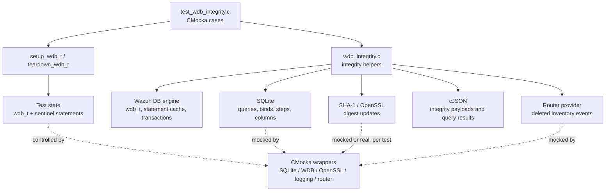
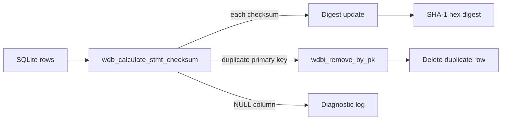
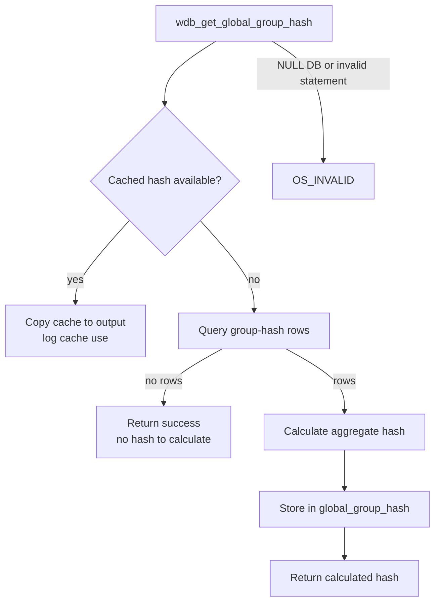
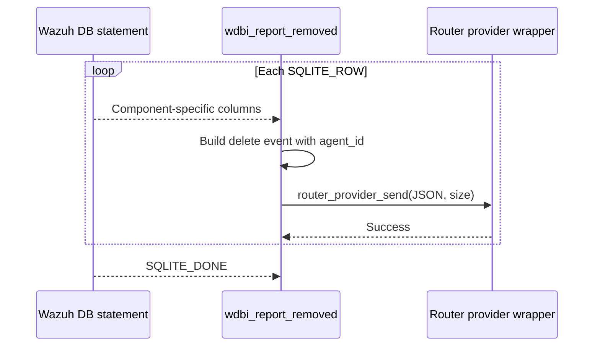
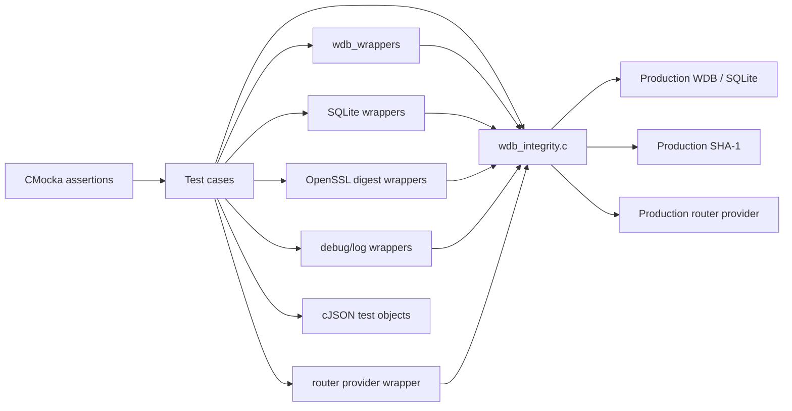

# `test_wdb_integrity` — Wazuh DB integrity tests

`test_wdb_integrity` is the CMocka unit-test suite for the Wazuh DB integrity helpers in `src/wazuh_db/wdb_integrity.c`. It verifies checksum calculation, synchronization state transitions, integrity-command parsing, global group-hash caching, duplicate-record cleanup, and inventory-removal notifications without requiring a live Wazuh DB process or router.

The production algorithms and their role in agent/manager synchronization are documented in [wazuh_db_integrity.md](wazuh_db_integrity.md). This document focuses on how the test module isolates and validates those algorithms.

## Position in the system

The test file sits below the Wazuh DB unit-test layer. It calls production integrity functions directly, while wrappers replace external effects and provide deterministic SQLite rows, return codes, hashes, timestamps, and log messages.



### Scope and related modules

| Area | Relationship |
| --- | --- |
| `src/wazuh_db/wdb_integrity.c` | System under test: checksum, sync, deletion, cache, and reporting functions. See [wazuh_db_integrity.md](wazuh_db_integrity.md). |
| `src/wazuh_db/wdb.c` and `wdb.h` | Supplies `wdb_t`, statement-cache, transaction, and database interfaces used by the integrity helpers. The broader engine test pattern is described in [test_wdb.md](test_wdb.md). |
| SQLite | Provides prepared-statement behavior. The suite uses SQLite wrappers to simulate `SQLITE_ROW`, `SQLITE_DONE`, bind errors, and execution errors. |
| OpenSSL SHA-1 | Digest updates are mocked for database-flow tests; the hash-helper tests switch to the real digest implementation. |
| cJSON | Represents integrity command payloads and database result objects. |
| Router provider | Receives deletion notifications for Syscollector inventory components. Router concepts are covered in [router_pubsub.md](router_pubsub.md). |
| Test wrappers and CMocka | Replace process-wide dependencies and assert calls, parameters, messages, and return values. See [test_infrastructure.md](test_infrastructure.md). |

## Test fixture and execution model

Most tests use `setup_wdb_t` and `teardown_wdb_t`. The setup allocates a zeroed `wdb_t`, places a non-null sentinel in every statement slot, enables `test_mode`, and exposes the object through CMocka state. Teardown frees the optional database ID, releases the structure, and restores normal mode.

Tests that only exercise global state or router reporting are registered without the fixture. The global group-hash tests intentionally operate on the external `global_group_hash` buffer, while reporting tests configure router handles directly.

```mermaid
sequenceDiagram
    participant C as CMocka runner
    participant Fx as setup_wdb_t
    participant T as Test case
    participant SUT as Integrity function
    participant W as Wrappers
    participant Tx as teardown_wdb_t

    C->>Fx: Allocate wdb_t
    Fx->>Fx: Initialize stmt[] sentinels
    Fx->>Fx: test_mode = 1
    C->>T: Pass fixture state
    T->>W: Register return values and expectations
    T->>SUT: Call production helper
    SUT->>W: Execute mocked DB, digest, log, or router operation
    W-->>SUT: Deterministic result
    SUT-->>T: Return code / output hash / side effect
    T->>T: Assert result and expected calls
    C->>Tx: Tear down fixture
    Tx->>Tx: Free id and wdb_t; test_mode = 0
```

The wrapper contract is part of the test’s meaning. For example, a sequence of `sqlite3_step` return values normally represents statement preparation followed by a row or completion; a `sqlite3_column_text` expectation supplies the checksum or component field consumed by the production loop.

## Functional coverage

### Checksum calculation and duplicate cleanup

The `wdb_calculate_stmt_checksum` and `wdbi_checksum` cases cover null-argument assertions, statement-cache failure, empty result sets, null checksum columns, and successful digest processing. The Syscollector packages duplicate test verifies that repeated primary-key data is detected, logged, and passed to `wdbi_remove_by_pk`.

`wdbi_array_hash` and `wdbi_strings_hash` validate the common SHA-1 representation. They include empty input behavior: a null array or a null-terminated list with no strings produces the SHA-1 of the empty input (`da39a3ee...`). These tests use the real digest path rather than the OpenSSL wrapper.



### Range checks, deletion, and sync metadata

The range and deletion cases validate nullable range boundaries, prepared-statement failures, bind failures, SQLite step failures, and successful completion. `wdbi_update_attempt`, `wdbi_update_completion`, and `wdbi_set_last_completion` verify that the integrity metadata is bound with the expected component, agent checksum, manager checksum, IDs, and timestamps.

The suite tests both direct helpers and the orchestration performed by `wdbi_query_clear` and `wdbi_query_checksum`:

```mermaid
flowchart TD
    P["JSON payload"] --> V["Parse required fields"]
    V -->|invalid / missing id, begin, end, checksum| E["INTEGRITY_SYNC_ERR or -1\nlog parse error"]
    V --> C["wdbi_checksum_range"]
    C --> D{ "Range has data?" }
    D -->|no| N["INTEGRITY_SYNC_NO_DATA"]
    D -->|yes| K["Compare calculated and supplied checksum"]
    K -->|equal| OK["INTEGRITY_SYNC_CKS_OK"]
    K -->|different| BAD["INTEGRITY_SYNC_CKS_FAIL"]
    P -->|clear action| CL["wdbi_delete + metadata update"]
    CL --> CR["clear result"]
```

`wdbi_check_sync_status` covers the metadata decision table: no database result, incomplete metadata, never-synced state, synchronized timestamps, checksum calculation failure, and a valid checksum that causes completion time to be updated.

| Condition exercised | Expected behavior |
| --- | --- |
| Statement cache or query execution fails | `OS_INVALID`; diagnostic is expected where applicable. |
| `last_completion == 0` and checksum is empty | Not synchronized (`0`). |
| `last_attempt == last_completion` with an agent checksum | Synchronized (`1`). |
| Attempt is newer than completion and calculated checksum is unavailable | Error (`-1`). |
| Attempt is newer, calculated checksum matches, completion update succeeds | Synchronized (`1`). |

### Integrity payload and manager-checksum paths

`wdbi_get_last_manager_checksum` verifies extraction of `last_manager_checksum` from a CJSON query result and its cache/statement errors. The manager-checksum cases in `wdbi_query_checksum` verify both shortcuts and recalculation: an equal stored manager checksum can avoid a range query, while a different or empty manager checksum leads to range-check processing.

Null database, statement, or digest arguments are tested with CMocka `expect_assert_failure`, documenting the precondition boundary of the low-level checksum API. Invalid action values are also tested to ensure they do not produce a successful integrity result.

### Global group-hash cache

The cache tests cover the `READ`, `WRITE`, and `CLEAR` operations, empty-cache reads, and invalid operation values. `wdb_get_global_group_hash` then verifies the higher-level policy:



The cache is process-global test state, so each test explicitly clears it after use where necessary. This prevents order-dependent results when the suite is run as a group.

### Removed-inventory reporting

`wdbi_report_removed` translates rows removed from Syscollector tables into router-provider JSON events. Tests cover unavailable router handles, each supported component, and multi-row iteration. The expected message shape is stable across components:



The component-to-event mapping tested by the suite is:

| DB component | Event action | Data fields checked |
| --- | --- | --- |
| Packages | `deletePackage` | `name`, `version`, `architecture`, `format`, `location`, `item_id` |
| Hotfixes | `deleteHotfix` | `hotfix` |
| Network protocols | `deleteNetProto` | `item_id` |
| Network interfaces | `deleteNetIface` | `item_id` |
| Users | `deleteUser` | `user_name` |
| OS information | `deleteOs` | `os_name` |
| Groups | `deleteGroup` | `group_name` |

## Dependency and mocking boundaries



The suite therefore tests control flow and contract boundaries, not SQLite query plans, filesystem persistence, inter-process sockets, or actual router delivery. Those integration concerns belong to the production module and related integration tests.

## Running and maintaining the suite

`main` builds one CMocka test array and invokes `cmocka_run_group_tests`. Tests are grouped by the production helper they exercise and use either a plain registration or `cmocka_unit_test_setup_teardown`. The project’s test build and wrapper conventions are documented in [test_infrastructure.md](test_infrastructure.md).

When changing integrity behavior, update the corresponding expectations for:

- SQLite bind positions and `sqlite3_step` sequences;
- return-code constants such as `INTEGRITY_SYNC_*` and `OS_INVALID`;
- diagnostic messages and database IDs;
- checksum input ordering and SHA-1 output;
- component-to-router event mappings;
- global cache cleanup and fixture ownership.

Changes to Syscollector schemas or component identifiers should be reviewed with [wazuh_db_fim_syscollector.md](wazuh_db_fim_syscollector.md), while changes to router event delivery should be reviewed with [router_pubsub.md](router_pubsub.md).

## References

- [Wazuh DB integrity production module](wazuh_db_integrity.md)
- [Wazuh DB engine tests](test_wdb.md)
- [Wazuh unit-test infrastructure](test_infrastructure.md)
- [Wazuh DB FIM and Syscollector integration](wazuh_db_fim_syscollector.md)
- [Router publish/subscribe behavior](router_pubsub.md)
