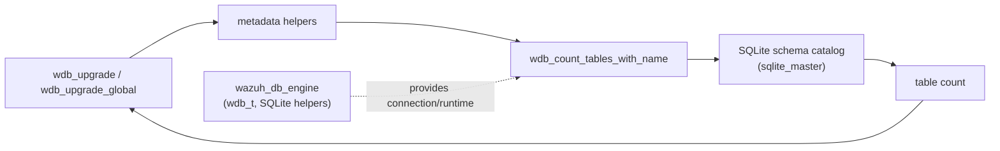
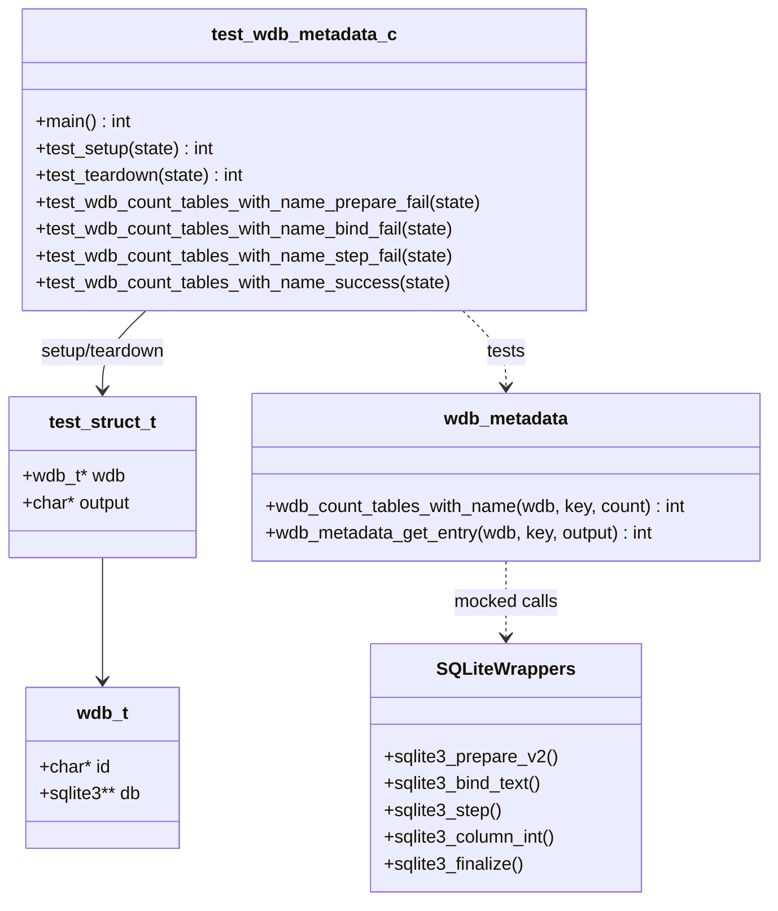
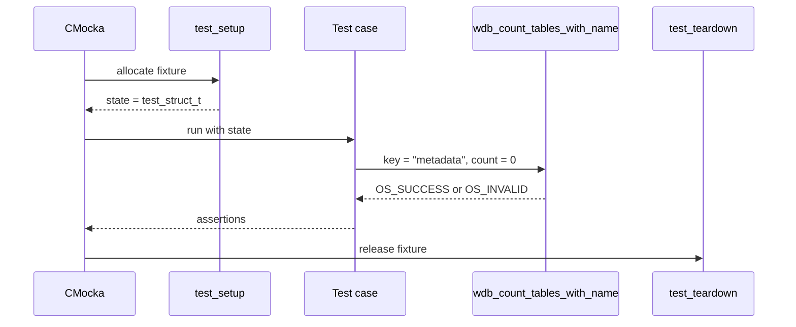
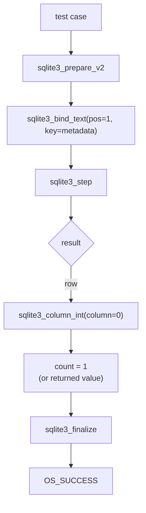
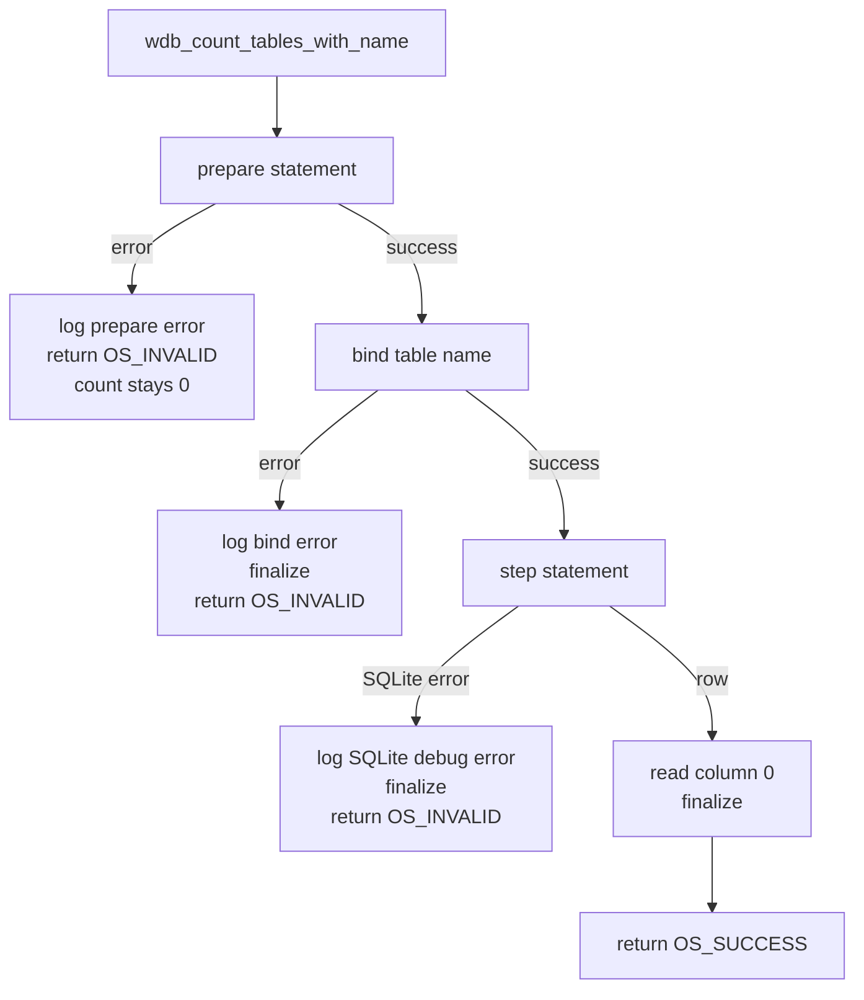
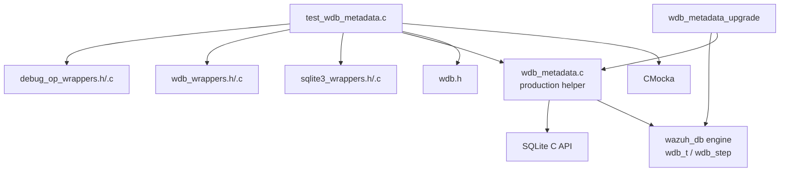

# `test_wdb_metadata` — Wazuh DB Metadata Tests

## Introduction

`test_wdb_metadata` is a CMocka unit-test module for the Wazuh DB metadata helpers. Its current scope is the table-existence/count query implemented by `wdb_count_tables_with_name()`. The test verifies the complete SQLite statement lifecycle—prepare, bind, step, read the result, and finalize—without opening a real database.

The production metadata and schema-upgrade context is documented in [wazuh_db_metadata_upgrade.md](wazuh_db_metadata_upgrade.md), while shared database connection and SQLite execution behavior is covered by [wazuh_db_engine.md](wazuh_db_engine.md).

## Purpose and system position

Wazuh DB uses SQLite metadata to identify database schema state. Before an upgrade path reads a metadata key such as `db_version`, it may first check whether the metadata table exists. `wdb_count_tables_with_name()` performs that probe by querying SQLite’s schema catalog and returning the number of matching tables through an output parameter.



The test does not exercise the migration loop, backup/restore, or metadata-value reads. Those behaviors belong to [wazuh_db_metadata_upgrade.md](wazuh_db_metadata_upgrade.md).

## Components

| Component | Role |
|---|---|
| `CMUnitTest` | CMocka test descriptor used to register the four cases. |
| `main()` | Registers the cases and runs them as one CMocka group. |
| `test_struct_t` | Per-test state containing a synthetic `wdb_t` and output buffer. |
| `test_setup()` | Allocates and initializes a minimal database handle for agent ID `000`. |
| `test_teardown()` | Releases the output buffer, database ID, database pointer, handle, and state object. |
| `test_wdb_count_tables_with_name_*` | Exercises prepare, bind, step, and success paths. |
| SQLite wrappers | Inject SQLite return values and inspect arguments. |
| Wazuh debug wrappers | Verify errors/debug messages emitted by failure paths. |



## Test fixture lifecycle

Each test receives a fresh fixture through `cmocka_unit_test_setup_teardown()`.

1. `test_setup()` allocates `test_struct_t` and a zeroed `wdb_t`.
2. The database ID is set to `"000"`, allowing production error messages to identify the synthetic database as `DB(000)`.
3. A 256-byte output buffer is allocated. It is not the primary result of the tested helper, but is part of the shared fixture shape.
4. A `sqlite3 *` storage slot is allocated and assigned to `wdb->db`.
5. The test function configures wrapper expectations and calls the production helper.
6. `test_teardown()` frees all allocations, isolating cases from one another.



## Tested operation and contract

The test calls:

```c
int count = 0;
ret = wdb_count_tables_with_name(data->wdb, "metadata", &count);
```

The expected contract is:

- bind the requested table name at parameter position `1`;
- step through the statement until a row or terminal/error result is reached;
- read column `0` as the table count when a row is returned;
- return `OS_SUCCESS` and update `count` on success;
- return `OS_INVALID` and leave `count` at `0` when preparation, binding, or stepping fails;
- finalize the statement on the bind and step failure paths, and on success.

The test uses `"metadata"`, matching the table checked by the database upgrade code. The helper’s broader relationship to `wdb_metadata_get_entry()` and schema-version detection is described in [wazuh_db_metadata_upgrade.md](wazuh_db_metadata_upgrade.md).

## Test cases

| Test | Injected condition | Assertions and observable behavior |
|---|---|---|
| `test_wdb_count_tables_with_name_prepare_fail` | `sqlite3_prepare_v2()` returns `SQLITE_ERROR` and no statement. | Returns `OS_INVALID`; count remains `0`; logs `DB(000) sqlite3_prepare_v2(): ERROR MESSAGE`. |
| `test_wdb_count_tables_with_name_bind_fail` | Preparation succeeds, but `sqlite3_bind_text()` returns `SQLITE_ERROR`. | Position `1` and value `metadata` are checked; statement is finalized; returns `OS_INVALID`; count remains `0`; logs the bind error. |
| `test_wdb_count_tables_with_name_step_fail` | Binding succeeds; first step yields `0`, then a later step yields `SQLITE_ERROR`. | Returns `OS_INVALID`; count remains `0`; statement is finalized; emits a debug message containing `DB(000) SQLite: ERROR MESSAGE`. |
| `test_wdb_count_tables_with_name_success` | Binding succeeds; first step yields `0`, next yields `SQLITE_ROW`; column `0` returns `1`. | Returns `OS_SUCCESS`; count becomes `1`; statement is finalized. |

The wrapper sequence `0` followed by `SQLITE_ROW` models the helper’s use of the shared stepping behavior: an initial non-row result is tolerated before the row containing the count is consumed.

## Detailed process flows

### Successful query



### Failure handling



The prepare-failure test does not expect finalization because no usable statement is returned. Bind and step failures explicitly expect finalization, which verifies cleanup after a statement has been created.

## Dependency map



Important boundaries:

- [wazuh_db_engine.md](wazuh_db_engine.md) documents the `wdb_t` runtime, SQLite execution helpers, statement handling, and database lifecycle.
- [wazuh_db_metadata_upgrade.md](wazuh_db_metadata_upgrade.md) documents how table existence and metadata values feed agent/global schema upgrades.
- The SQLite and debug wrappers are test-only seams; this module does not contact a live daemon, filesystem, or production database.

## Isolation and verification strategy

The test is deliberately narrower than an integration test:

- `sqlite3_prepare_v2`, `sqlite3_bind_text`, `sqlite3_step`, `sqlite3_column_int`, `sqlite3_finalize`, and error-message access are mocked.
- `expect_value` verifies the bind position and result-column index.
- `expect_string` verifies that the exact table name and expected diagnostics are used.
- `will_return` controls SQLite results and error messages deterministically.
- The synthetic `wdb_t` supplies only the fields needed by the helper, so no SQLite file is created.

This gives maintainers direct coverage of resource cleanup and error propagation while leaving SQL engine behavior to SQLite and broader database tests.

## Running the tests

Build the repository’s native unit-test targets using the normal Wazuh build configuration, then run the generated `test_wdb_metadata` binary or its corresponding CTest target. The exact binary path depends on the build directory. The test requires CMocka and the repository’s wrapper objects, but no running `wazuh-db` daemon or prepared database.

## Related documentation

- [wazuh_db_metadata_upgrade.md](wazuh_db_metadata_upgrade.md) — metadata access, schema detection, and migrations.
- [wazuh_db_engine.md](wazuh_db_engine.md) — Wazuh DB handles, SQLite execution, and statement lifecycle.
- [wazuh_db_daemon_core.md](wazuh_db_daemon_core.md) — daemon lifecycle and runtime entry point.
- [test_create_agent_db.md](test_create_agent_db.md) — neighboring Wazuh DB unit test focused on database-file creation.
