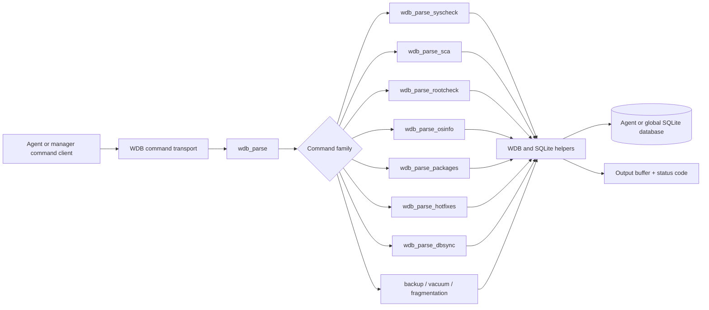
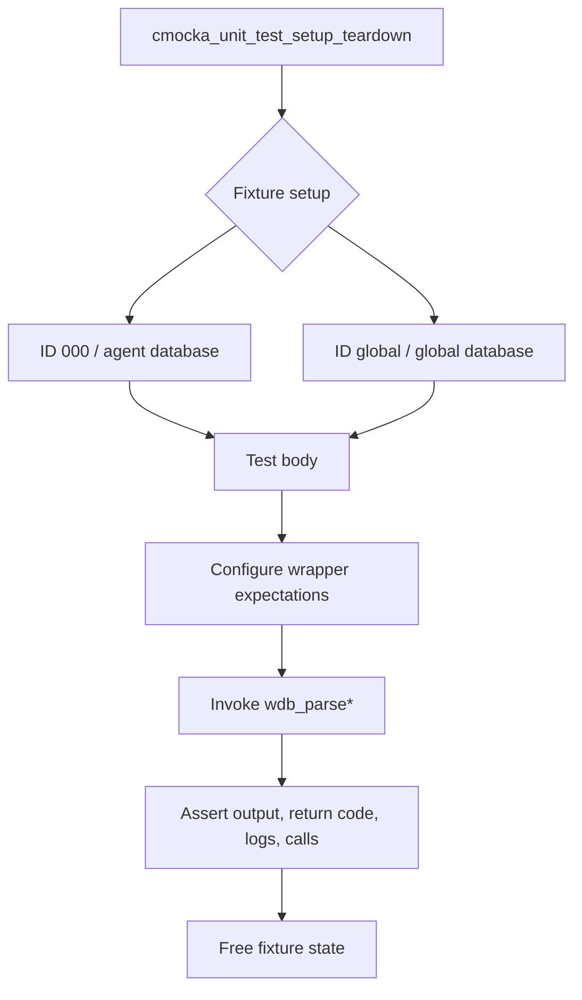
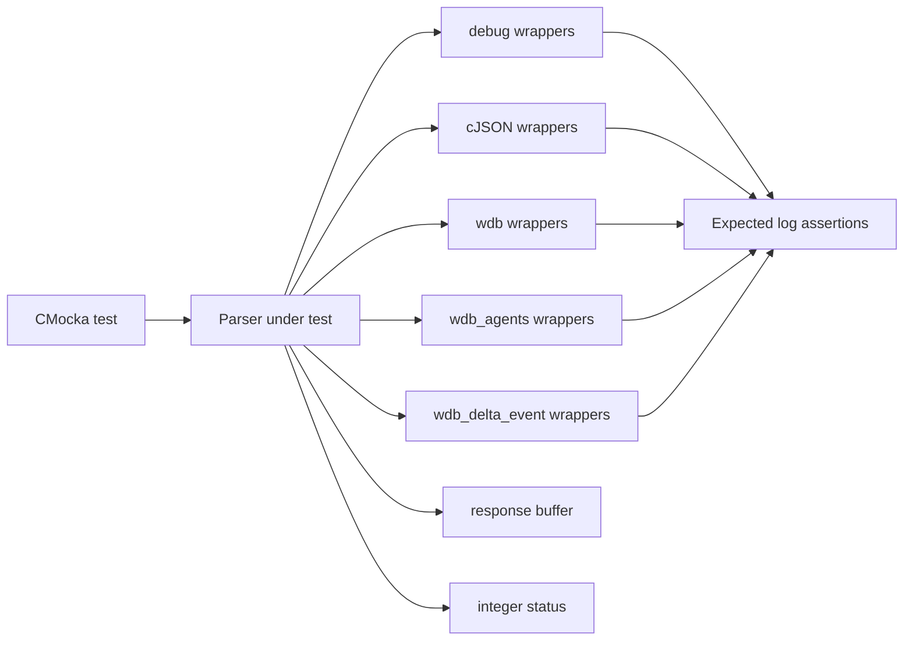
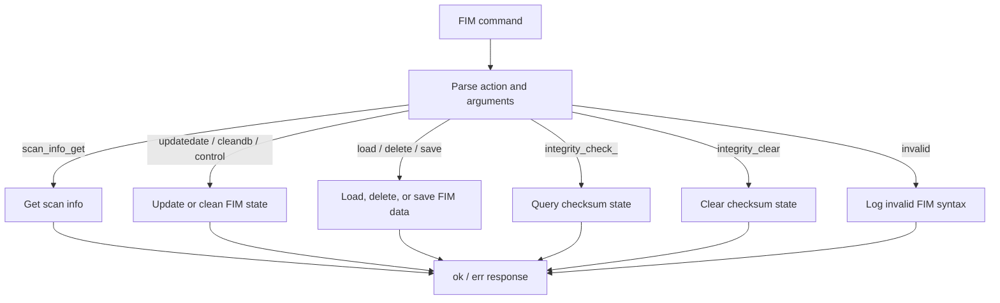
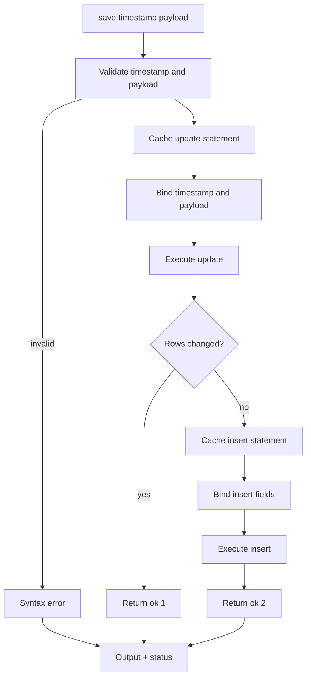
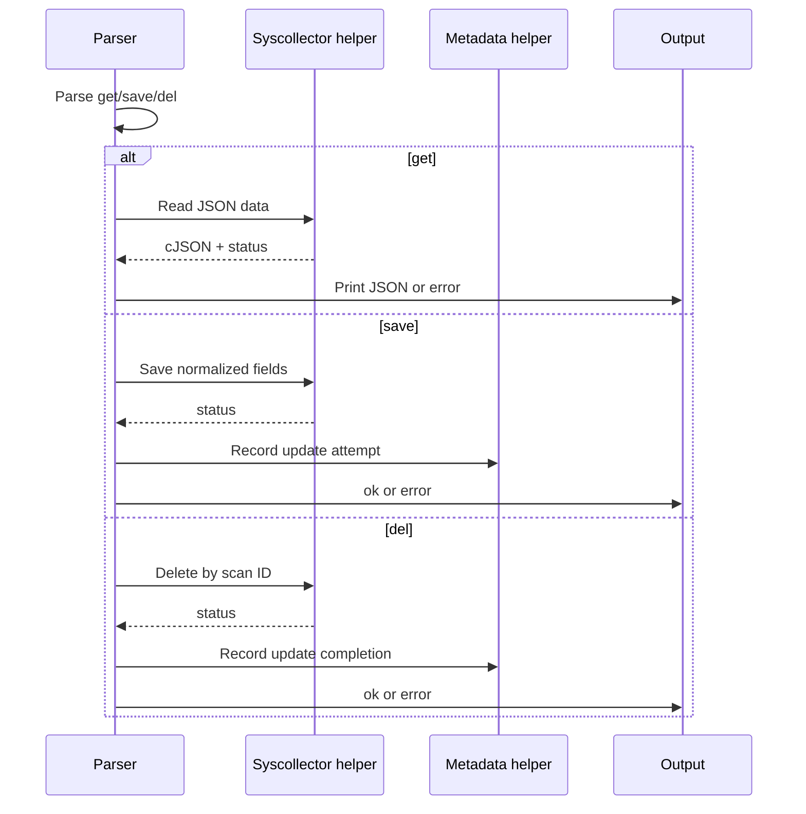
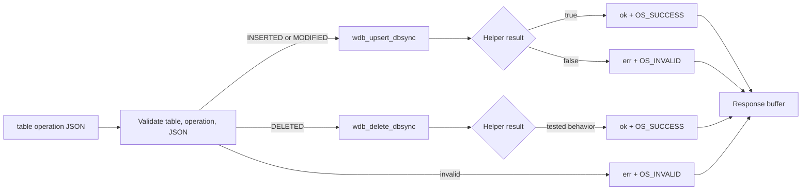
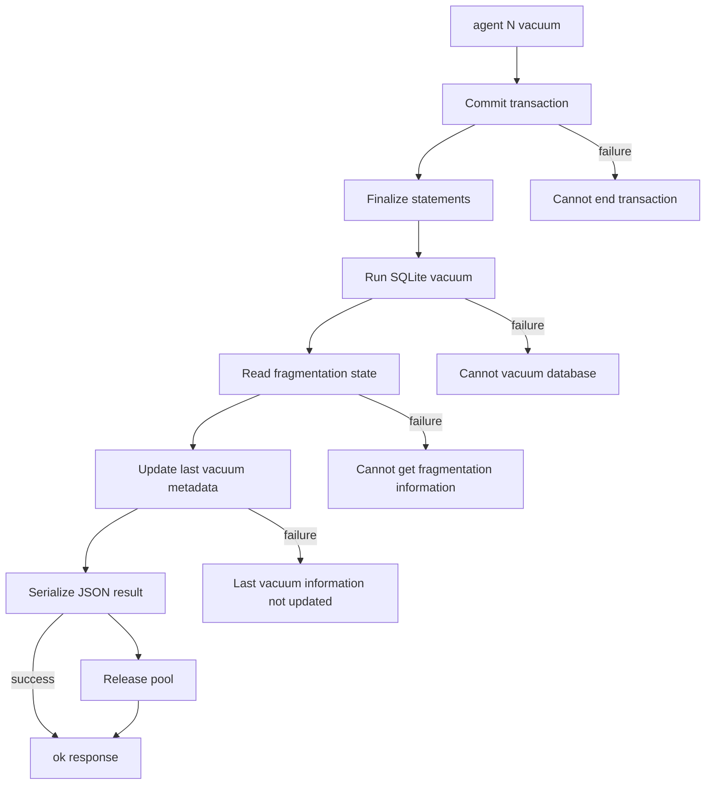

# `test_wdb_parser`

`test_wdb_parser` is the CMocka unit-test suite for the Wazuh database command parser. It verifies how textual WDB commands are validated, dispatched to database helpers, and converted into response strings and status codes. The suite covers agent databases, the global database, legacy FIM/Syscheck operations, Syscollector data, DBSync deltas, and database-maintenance commands.

The file under test is `src/unit_tests/wazuh_db/test_wdb_parser.c`; the parser implementations are declared by `src/unit_tests/wazuh_db/wdb.h` and exercised through wrapper seams. For broader database architecture, see [wazuh_db_command_parser.md](wazuh_db_command_parser.md), [test_wdb.md](test_wdb.md), [wazuh_db_fim_syscollector.md](wazuh_db_fim_syscollector.md), and [wazuh_db_integrity.md](wazuh_db_integrity.md).

## Purpose and scope

The suite treats each parser as a protocol boundary. A test supplies a command string, configures mocked helper behavior, invokes a parser, and asserts both observable outputs:

- the integer return value (`OS_SUCCESS`, `OS_INVALID`, `OS_SOCKTERR`, or parser-specific values);
- the contents of the caller-provided output buffer;
- expected logging for malformed syntax or helper failures;
- calls, arguments, and ordering at the database/helper boundary.

It is therefore both a regression suite and an executable description of the WDB command grammar.

## Position in the system

WDB receives commands from Wazuh services and routes them to agent or global SQLite-backed databases. The tested parser layer sits between the command transport and lower-level persistence functions.



The tests do not exercise the real transport or SQLite files. They isolate the parser and verify its contract at the helper boundary.

## Test harness architecture

### Fixtures

`test_struct_t` is the CMocka state object:

```c
typedef struct test_struct {
    wdb_t *wdb;
    wdb_t *wdb_global;
    char *output;
} test_struct_t;
```

`test_setup` creates an agent-like database context with ID `000`, peer `1234`, enabled state, and a 256-byte output buffer. `test_setup_global` creates the equivalent global context with ID `global`. `test_teardown` releases the output buffer, IDs, database objects, and fixture state.



### Wrapper and assertion boundary

The suite includes wrappers for cJSON, debug logging, WDB core operations, agent Syscollector operations, and DBSync operations. CMocka `will_return`, `expect_*`, and `expect_function_call` statements replace external behavior and make the parser's decisions observable.



## Parser families and behavioral coverage

### FIM / Syscheck

`wdb_parse_syscheck` is tested with `WDB_FIM_FILE`. Covered commands include `scan_info_get`, `updatedate`, `cleandb`, `scan_info_update`, `control`, `load`, `delete`, `save`, `save2`, `integrity_check_`, and `integrity_clear`.

The tests cover malformed commands, missing arguments, helper failures, and successful responses. The legacy `save`/`save2` cases that depend on the old Analysisd FIM path remain in the source but are disabled in `main` under `TODO-LEGACY-ANALYSISD-FIM`.



Notable contracts include `ok 0` for a successful scan-info read, `ok` for most successful mutations, and integrity results of `ok no_data`, `ok checksum_fail`, or `ok ` for helper return values `0`, `1`, or `2`.

### SCA

`wdb_parse_sca` validates the Security Configuration Assessment command grammar. Tests cover malformed input, `query` returning found/not-found/error, and malformed `insert` JSON including nonnumeric and negative IDs. The suite verifies that invalid JSON and invalid IDs are rejected before the database helper is called.

### Rootcheck

`wdb_parse_rootcheck` covers invalid commands, `delete`, and `save`. Save tests verify timestamp validation, SQLite statement caching, parameter binding, stepping, change counts, and the update-then-insert behavior when no existing tuple is changed.



### OS information

OS information is tested through both the outer `wdb_parse` route (`agent 000 osinfo`) and the direct `wdb_parse_osinfo` parser. `get` serializes the helper's cJSON result. `set` requires a pipe-delimited sequence of fields; the progressively incomplete cases document the required positional grammar. A complete set command passes platform data to `wdb_osinfo_save` with the legacy checksum and `replace == FALSE`.

### Packages and hotfixes

`wdb_parse_packages` and `wdb_parse_hotfixes` share a Syscollector-oriented command shape:

- `get` returns serialized JSON, including null-result, database-error, and socket-error behavior;
- `save` validates fields and calls the corresponding save helper;
- `del` removes records and updates completion metadata;
- empty fields and `NULL` tokens are tested explicitly;
- invalid and missing actions produce syntax errors.

Package tests additionally verify numeric size conversion and all package fields. Both families verify legacy checksum handling and update-attempt/completion calls.



### DBSync

`wdb_parse_dbsync` accepts a table, operation, and JSON delta. The tests cover `osinfo`, `groups`, and `users`; operations are `INSERTED`, `MODIFIED`, and `DELETED`. Missing table/operation/data, unknown tables, malformed JSON, and unknown operations are rejected. Insert and modify route to `wdb_upsert_dbsync`; delete routes to `wdb_delete_dbsync`.



The delete-failure tests intentionally preserve the current compatibility behavior: a false delete helper result is asserted as `ok ` with `OS_SUCCESS`. This is an important regression expectation when changing DBSync error handling.

### Global backup

Global commands are routed through `wdb_parse`, with `global backup create` reaching `wdb_parse_global_backup`. Tests cover missing and invalid actions, snapshot creation failure, and successful snapshot responses. The global fixture distinguishes `queue/db/global.db` from agent database paths.

### Agent vacuum and fragmentation

The maintenance tests exercise `agent 000 vacuum` and `agent 000 get_fragmentation`. Vacuum must commit, finalize statements, vacuum the database, read fragmentation, update last-vacuum metadata, serialize the result, and release the database pool. Separate tests fail each stage. Fragmentation queries validate both database state and free-page percentage.



## Expected result conventions

The tests establish these conventions for maintainers:

| Situation | Typical output | Return value |
|---|---|---|
| Successful command | `ok` or `ok <payload>` | `OS_SUCCESS`, `1`, or parser-specific success |
| Invalid syntax | `err Invalid ... query syntax...` | `OS_INVALID` or `-1` |
| Helper/database failure | `err <description>` | `OS_INVALID` or `-1` |
| Socket failure while serializing data | empty output in covered cases | `OS_SOCKTERR` |
| Integrity status | `ok no_data`, `ok checksum_fail`, or `ok ` | `0` |

Exact capitalization, punctuation, trailing spaces, and return codes are part of the tested API contract.

## Test registration and maintenance notes

`main` builds one static `CMUnitTest` array. Every registered test uses setup/teardown, so tests are isolated through fresh WDB objects and output buffers. Wrapper expectations must match both call order and arguments; a parser change can fail even when the final response remains unchanged.

When extending this module:

1. Add a focused test beside the parser family it exercises.
2. Configure wrapper returns and argument expectations before invoking the parser.
3. Assert the output buffer and integer return value together.
4. Assert diagnostic logs for syntax and persistence failures.
5. Register the test in `main` with the appropriate fixture.
6. Preserve compatibility tests that document legacy or unusual behavior unless the protocol is intentionally changed.

Related implementation and test documentation:

- [wazuh_db_command_parser.md](wazuh_db_command_parser.md) — command routing and parser structure.
- [test_wdb.md](test_wdb.md) — broader WDB parser and database tests.
- [wazuh_db_fim_syscollector.md](wazuh_db_fim_syscollector.md) — FIM and Syscollector persistence.
- [wazuh_db_integrity.md](wazuh_db_integrity.md) — integrity and checksum behavior.
- [test_syscheck.md](test_syscheck.md) — Syscheck-related test coverage.
