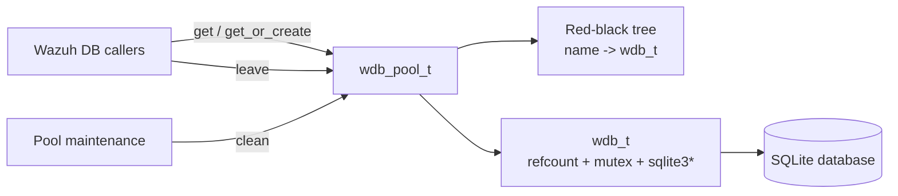
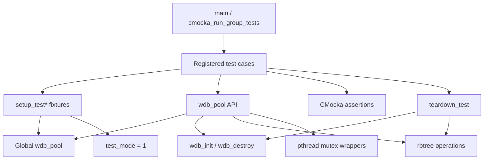
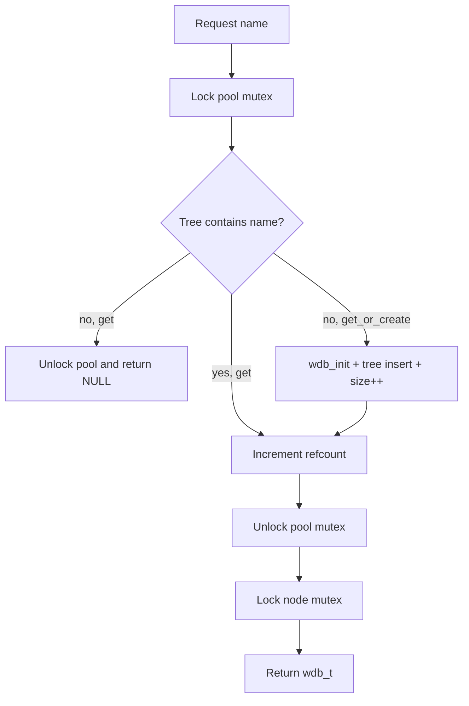
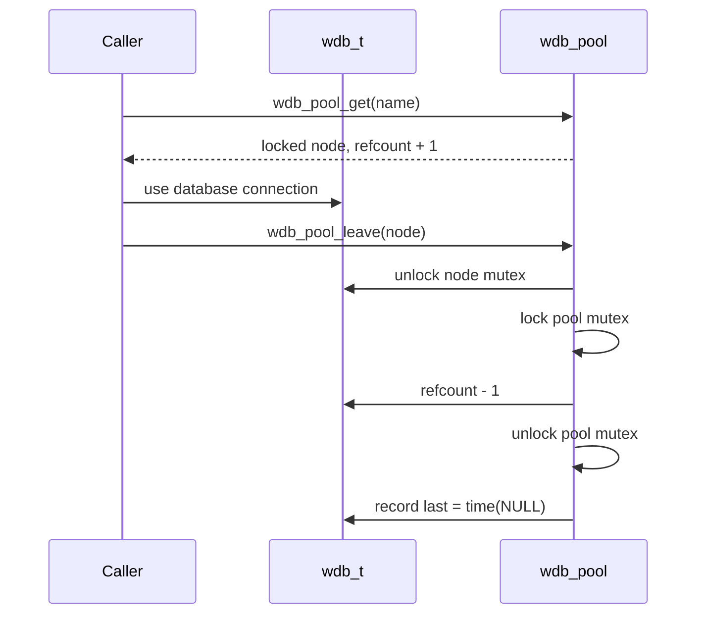
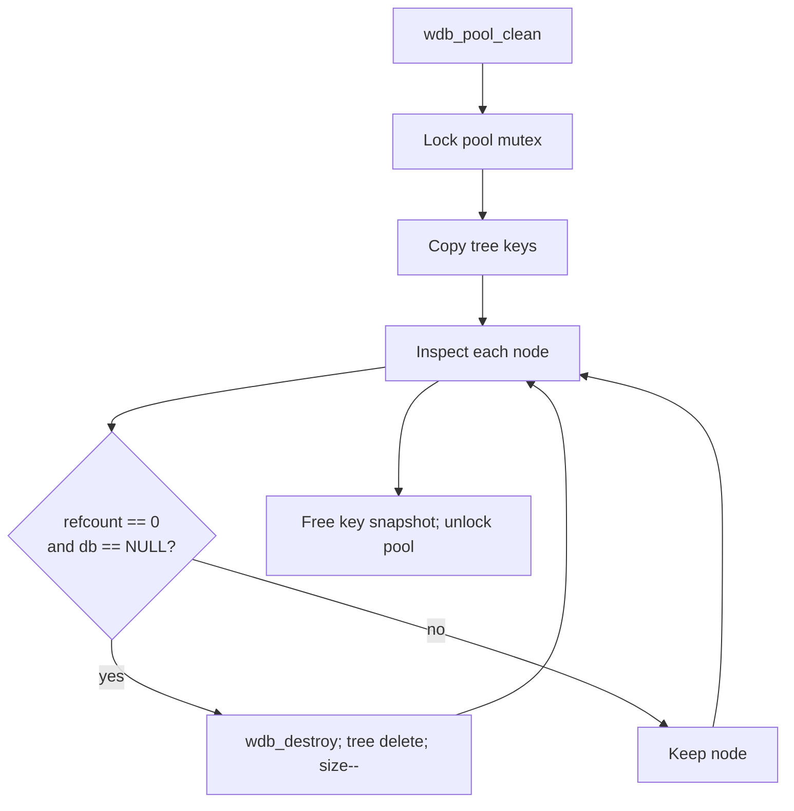

# `test_wdb_pool` — Wazuh DB connection-pool unit tests

`test_wdb_pool.c` is the CMocka unit-test suite for the Wazuh DB pool declared in
`src/wazuh_db/wdb_pool.h` and implemented in `src/wazuh_db/wdb_pool.c`. The pool is a
process-wide registry of `wdb_t` nodes keyed by database identifier. It provides synchronized
lookup/creation, per-node locking, reference counting, key snapshots, and removal of closed
connections.

The suite validates the pool contract in isolation. It does not exercise SQL execution or the
Wazuh DB command protocol; those concerns are covered by [`test_wdb`](test_wdb.md) and the
engine behavior is described in [`wazuh_db_engine`](wazuh_db_engine.md).

## Role in the Wazuh DB subsystem

Higher-level Wazuh DB operations acquire a node through the pool, perform work while its mutex is
held, and return it with `wdb_pool_leave()`. The pool therefore sits between the daemon/database
engine and individual `wdb_t` connections.



See [`wazuh_db_command_parser`](wazuh_db_command_parser.md) for the acquire/use/release pattern
from the command parser, and [`wazuh_db_daemon_core`](wazuh_db_daemon_core.md) for daemon startup
and maintenance context.

## Production contract under test

`wdb_pool_t` contains three pieces of shared state:

| Field | Meaning |
|---|---|
| `nodes` | Red-black tree containing each pooled node, indexed by its identifier. |
| `mutex` | Pool-wide lock protecting tree operations, reference-count changes, and `size`. |
| `size` | Atomic count of entries currently in the tree; it includes open and closed nodes. |

The public operations have these semantics:

| Operation | Behavior |
|---|---|
| `wdb_pool_init()` | Creates the tree and initializes the pool mutex. |
| `wdb_pool_get(name)` | Locks the pool, finds an existing node, increments `refcount`, unlocks the pool, then locks the node. Returns `NULL` when absent. |
| `wdb_pool_get_or_create(name)` | Same acquisition behavior, creating and inserting a `wdb_t` and incrementing `size` when absent. |
| `wdb_pool_leave(node)` | For a non-`NULL` node, unlocks its mutex, locks the pool, decrements `refcount`, unlocks the pool, and records the leave time. `NULL` is ignored. |
| `wdb_pool_keys()` | Returns a snapshot of sorted tree keys while briefly holding the pool mutex. The caller owns the returned string array. |
| `wdb_pool_clean()` | Removes and destroys nodes only when `refcount == 0` and `db == NULL`. |
| `wdb_pool_size()` | Returns the current number of tree entries. |

The important safety rule is that a node cannot be cleaned while it is referenced, and callers
must release a node while its node mutex is still held. The tests use mocked mutex calls to verify
the intended ordering.

## Test architecture



The test file includes `wdb_pool.h`, `wdb.h`, shared definitions, and common wrapper helpers. The
pool is declared `extern` in the test because unit-testing builds remove the implementation's
`static` qualifier, allowing the fixture to seed and inspect the global tree directly.

### Fixtures and lifecycle

`setup_test()` initializes the pool and inserts `node1`, `node2`, and `node3` with zero reference
counts. The three cleanup-specific fixtures create the same nodes but mark two of them as active
by setting `refcount++` and assigning a non-`NULL` sentinel `db` pointer. The remaining node is
left closed and unreferenced, making it eligible for cleanup.

```mermaid
sequenceDiagram
    participant C as CMocka
    participant F as setup_test*
    participant P as wdb_pool
    participant T as test case
    participant D as teardown_test

    C->>F: initialize pool and seed nodes
    F->>P: wdb_pool_init()
    F->>P: insert node1..node3; size = 3
    F-->>C: test_mode enabled
    C->>T: execute one test
    T->>P: invoke pool API
    T-->>C: assertions
    C->>D: teardown
    D->>P: enumerate keys
    D->>P: destroy and delete every remaining node
    D->>P: destroy tree; disable test_mode
```

The teardown deliberately performs explicit destruction rather than calling `wdb_pool_clean()`:
it is responsible for restoring a clean global state after every test, including tests that leave
active sentinel database pointers in place.

## Test groups and expected behavior

### Lookup and creation

`test_wdb_pool_get_or_create_get` verifies that requesting `node3` returns the existing node and
does not add a fourth key. `test_wdb_pool_get_or_create_create` requests `node4` and verifies that
the node is initialized, inserted, and visible in the key snapshot.

`test_wdb_pool_get_known` confirms that an existing lookup returns `node3`; the corresponding
`test_wdb_pool_get_unknown` confirms that `node4` returns `NULL` when the non-creating API is used.



Both successful acquisition tests set expectations for two pool-mutex calls followed by a node
mutex lock. This captures the implementation's synchronization boundary without requiring real
threads.

### Release and inspection

`test_wdb_pool_leave_node_null` verifies the defensive no-op for `NULL`. The non-`NULL` case creates
a standalone node with `refcount == 1`, expects node unlock → pool lock → pool unlock, and verifies
that the reference count reaches zero.

`test_wdb_pool_keys` checks that the returned snapshot contains `node1`, `node2`, and `node3` in
tree order. `test_wdb_pool_size` checks the count before and after cleanup.



### Cleanup

The four cleanup tests cover the eligibility predicate and its boundary cases:

| Test | Fixture state | Expected remaining keys |
|---|---|---|
| `test_wdb_pool_clean_all` | All nodes closed and unreferenced | none |
| `test_wdb_pool_clean_1` | `node1` is active; `node2` and `node3` eligible | `node2`, `node3` |
| `test_wdb_pool_clean_2` | `node2` is active; `node1` and `node3` eligible | `node1`, `node3` |
| `test_wdb_pool_clean_3` | `node3` is active; `node1` and `node2` eligible | `node1`, `node2` |



This is also a useful distinction for maintainers: `size` counts pool entries, not open SQLite
handles. A closed node may remain counted until a cleanup pass removes it.

## Test runner

`main()` registers twelve tests with CMocka setup/teardown pairs and runs them as one group. The
registered coverage is:

- two `get_or_create` cases;
- two `get` cases;
- two `leave` cases;
- one key-snapshot case;
- four cleanup cases; and
- one size case.

The exact executable name and build target are supplied by the repository's CMake test build. Run
the generated `test_wdb_pool` target/binary from the project build directory; CMocka reports each
case and the aggregate result. The suite uses the same wrapper/test-mode conventions as the other
Wazuh DB tests; see [`test_infrastructure`](test_infrastructure.md) for the shared test harness.

## Maintenance guidance

When changing pool behavior, update both the production contract and the relevant fixture:

- changes to acquisition locking should update the `expect_function_call` order;
- changes to eligibility should update the cleanup fixtures and expected key sets;
- changes to ownership of `wdb_pool_keys()` should update teardown/cleanup expectations; and
- changes to node lifetime should be checked against [`wazuh_db_engine`](wazuh_db_engine.md), where
  pool operations are integrated with database opening, transactions, and daemon maintenance.

