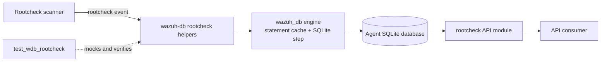
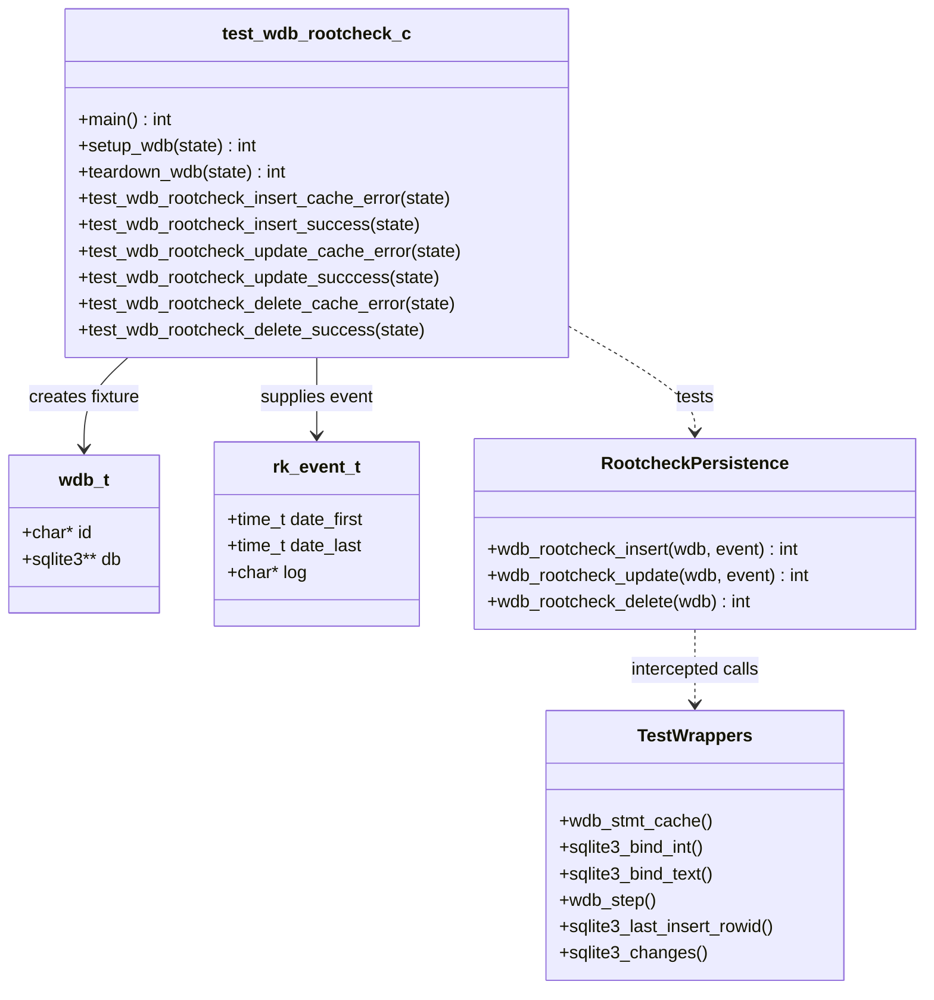
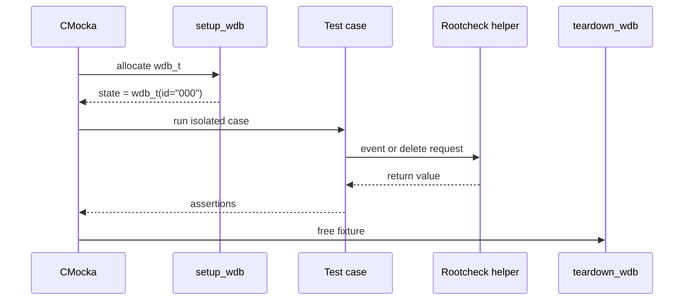
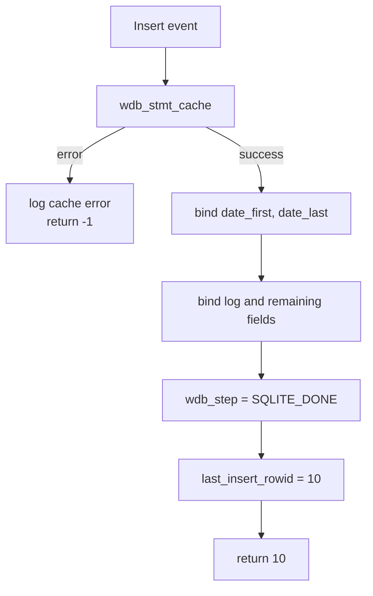
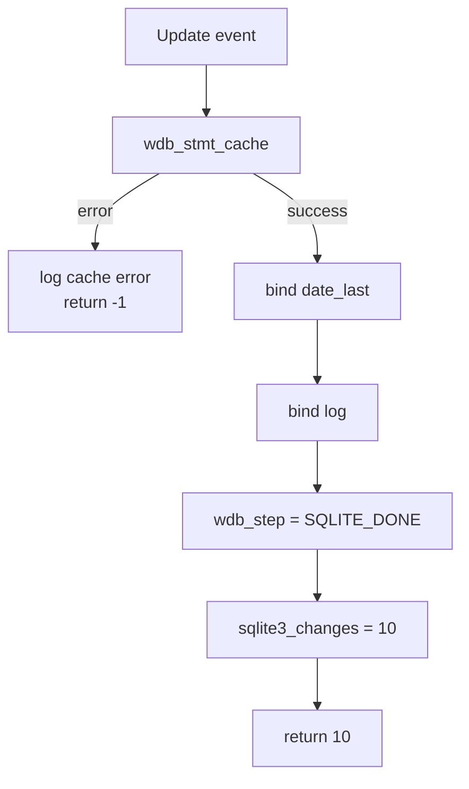

# `test_wdb_rootcheck` — Wazuh DB Rootcheck Persistence Tests

## Introduction

`test_wdb_rootcheck` is a CMocka unit-test module for the Wazuh DB rootcheck persistence helpers. It validates insertion, update, and deletion of a rootcheck event through the `wdb_t` database handle, while replacing statement-cache, SQLite, stepping, and logging functions with deterministic wrappers.

Rootcheck findings originate in the native rootcheck scanner and are exposed later through the Python API. The broader producer and consumer paths are documented in [rootcheck.md](rootcheck.md) and [rootcheck_module.md](rootcheck_module.md). This document focuses on the database-write test seam and does not duplicate those modules’ scan or REST behavior.

## Purpose and system position

The production functions under test are `wdb_rootcheck_insert()`, `wdb_rootcheck_update()`, and `wdb_rootcheck_delete()`. They belong to the Wazuh DB command/business-logic layer and use the shared SQLite engine’s prepared-statement cache and step helpers.



The module tests persistence boundaries only. Scan scheduling, rootkit checks, message dispatch, and API query semantics belong to [rootcheck.md](rootcheck.md), [rootcheck_core_utils.md](rootcheck_core_utils.md), and [rootcheck_module.md](rootcheck_module.md).

## Components

| Component | Responsibility |
|---|---|
| `CMUnitTest` | CMocka test descriptor type used to register each case. |
| `main()` | Registers six setup/teardown-wrapped tests and runs the CMocka group. |
| `setup_wdb()` | Allocates a minimal `wdb_t`, assigns database ID `"000"`, and allocates the SQLite handle slot. |
| `teardown_wdb()` | Frees the ID, database slot, and `wdb_t` fixture. |
| `test_wdb_rootcheck_insert_*` | Verifies insert cache failure and successful insert behavior. |
| `test_wdb_rootcheck_update_*` | Verifies update cache failure and successful update behavior. |
| `test_wdb_rootcheck_delete_*` | Verifies delete cache failure and successful delete behavior. |
| SQLite wrappers | Control and inspect bind, step, last-insert-rowid, and changes results. |
| Wazuh DB/debug wrappers | Control statement-cache and step behavior and verify diagnostics. |



## Fixture lifecycle

Each test is registered with `cmocka_unit_test_setup_teardown()`, so every operation receives an isolated database fixture.

1. `setup_wdb()` allocates and zeroes `wdb_t`.
2. The fixture ID is set to `"000"`; this makes cache-error messages deterministic (`DB(000)`).
3. A storage slot for `sqlite3 *` is allocated and assigned to `wdb->db`.
4. The test creates an `rk_event_t` with timestamps and the log text `"Test log"`.
5. Wrapper expectations are installed before calling the production helper.
6. `teardown_wdb()` releases all fixture allocations.



## Production contract exercised by the tests

The tests establish the observable contracts below:

| Operation | Inputs | Successful result |
|---|---|---|
| Insert | `date_first`, `date_last`, `log` | Binds event fields, steps to `SQLITE_DONE`, returns mocked row ID `10`. |
| Update | `date_last`, `log` | Binds the last-scan timestamp and log, steps to `SQLITE_DONE`, returns mocked affected-row count `10`. |
| Delete | Database handle | Caches and executes the delete statement, then returns mocked affected-row count `10`. |

The cache-error variants inject `wdb_stmt_cache == -1`, expect the exact message `DB(000) Cannot cache statement`, and assert `-1`. These cases verify that statement-cache failures are propagated before SQLite binding or stepping occurs.

## Test cases

### Insert

`test_wdb_rootcheck_insert_success` supplies equal `date_first` and `date_last` values and checks the complete binding contract:

- integer parameter `1` receives `event.date_first`;
- integer parameter `2` receives `event.date_last`;
- text parameter `3` receives `"Test log"`;
- text parameters `4` and `5` are also bound successfully, with no content assertion;
- `wdb_step()` returns `SQLITE_DONE`;
- `sqlite3_last_insert_rowid()` returns `10`, which is returned by the helper.

`test_wdb_rootcheck_insert_cache_error` verifies the early failure path and does not configure any SQLite bind or step calls.



### Update

`test_wdb_rootcheck_update_success` (spelled `test_wdb_rootcheck_update_succcess` in the source) sets `date_last = date_first + 1` and verifies:

- integer parameter `1` receives `event.date_last`;
- text parameter `2` receives `"Test log"`;
- `wdb_step()` returns `SQLITE_DONE`;
- `sqlite3_changes()` returns and therefore causes the helper to return `10`.

`test_wdb_rootcheck_update_cache_error` verifies the same cache-failure contract as insert.



### Delete

`test_wdb_rootcheck_delete_success` supplies only the `wdb_t` handle. It verifies that the helper obtains the cached statement, receives `SQLITE_DONE` from `wdb_step()`, reads `sqlite3_changes() == 10`, and returns `10`. No event payload is needed because deletion removes the rootcheck records associated with the database handle.

`test_wdb_rootcheck_delete_cache_error` verifies that a cache failure logs `DB(000) Cannot cache statement` and returns `-1`.

## Dependency and interaction map

```mermaid
graph TD
    Test[src/unit_tests/wazuh_db/test_wdb_rootcheck.c] --> CMocka[CMocka]
    Test --> WDBH[src/wazuh_db/wdb.h]
    Test --> Shared[src/headers/shared.h\n rk_event_t / allocation helpers]
    Test --> SQLiteW[src/unit_tests/wrappers/externals/sqlite]
    Test --> WDBW[src/unit_tests/wrappers/wazuh/wazuh_db/wdb_wrappers]
    Test --> DebugW[src/unit_tests/wrappers/wazuh/shared/debug_op_wrappers]
    Test ..> Impl[wdb_rootcheck_insert/update/delete]
    Impl --> Cache[wdb_stmt_cache]
    Impl --> Step[wdb_step]
    Impl --> SQLite[SQLite bind / changes / rowid]
    Engine[wazuh_db_engine] --> Cache
    Engine --> Step
    Rootcheck[rootcheck scanner] --> Impl
    Impl --> DB[(per-agent SQLite DB)]
    API[rootcheck_module] --> DB
```

The shared database engine and statement lifecycle are documented in [wazuh_db_engine.md](wazuh_db_engine.md). Native rootcheck production behavior is covered by [rootcheck.md](rootcheck.md); the C database parser and persistence context are related to [wazuh_db_command_parser.md](wazuh_db_command_parser.md). The wrappers are test-only dependencies and do not represent runtime network or filesystem dependencies.

## Isolation and verification strategy

This is a unit test rather than an integration test:

- no SQLite file is opened;
- no `wazuh-db` daemon is required;
- `wdb_t` contains only the fields initialized by the fixture;
- wrapper return values model cache, step, row-ID, and affected-row outcomes;
- `expect_value` checks exact SQLite parameter positions and timestamp values;
- `expect_string` checks the persisted log and diagnostic text;
- CMocka setup/teardown prevents state leakage between cases.

The test therefore verifies the persistence helper’s control flow and return-value mapping, but not SQL schema correctness, SQLite transaction durability, or the rootcheck scanner’s event-generation logic.

## Running the tests

Build the repository’s native unit-test targets with the normal Wazuh build configuration, then run the generated `test_wdb_rootcheck` binary or its corresponding CTest target. The exact binary path depends on the build directory. Required test dependencies include CMocka and the repository wrapper objects; a running Wazuh manager, agent, `wazuh-db` daemon, or populated database is not required.

## Related documentation

- [rootcheck.md](rootcheck.md) — rootcheck scanning, configuration, and result flow.
- [rootcheck_module.md](rootcheck_module.md) — Python API layer for rootcheck results and controls.
- [wazuh_db_engine.md](wazuh_db_engine.md) — `wdb_t`, statement caching, SQLite execution, and database lifecycle.
- [wazuh_db_command_parser.md](wazuh_db_command_parser.md) — Wazuh DB command dispatch and persistence context.
