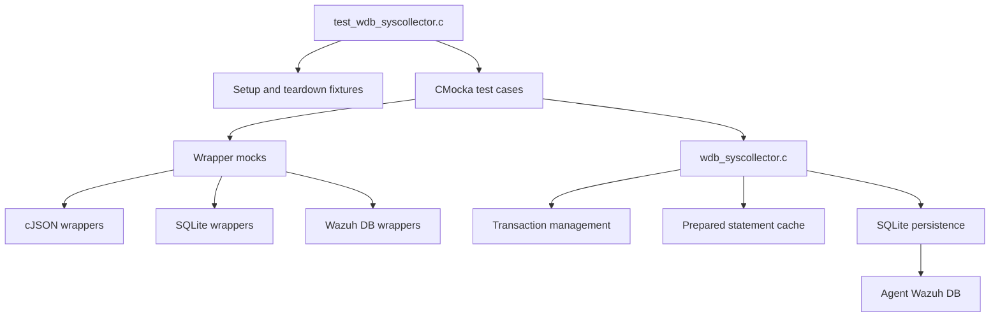
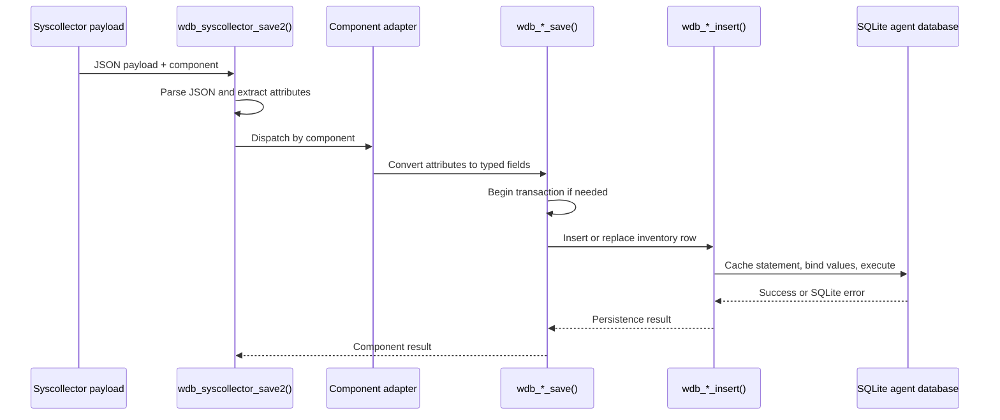

# `test_wdb_syscollector`

## Purpose

`test_wdb_syscollector` is a CMocka unit-test module for the Wazuh DB syscollector persistence layer. It validates parsing, transaction handling, SQLite statement caching, inserts, updates/replacements, deletions, constraint behavior, null values, and error paths for system-inventory data.

Covered inventory domains include:

- Processes
- Packages and hotfixes
- Network interfaces, protocols, and addresses
- Hardware and operating-system information
- Ports
- Users and groups
- JSON-based `wdb_syscollector_save2()` ingestion

## Architecture

### Test architecture



The test fixture creates a lightweight `wdb_t` instance and injects mocked cJSON, SQLite, logging, transaction, and statement-cache behavior. Tests then assert return codes, bound values, transaction failures, SQL constraints, and cleanup behavior.

### Syscollector persistence flow



## Repository structure

```text
src/unit_tests/wazuh_db/
└── test_wdb_syscollector.c
    ├── test infrastructure
    ├── groups tests
    ├── hardware tests
    ├── hotfix tests
    ├── netaddr tests
    ├── netinfo tests
    ├── netproto tests
    ├── osinfo tests
    ├── package tests
    ├── port tests
    ├── process tests
    ├── syscollector_save2 tests
    └── users tests
```

## Core component references

- [Syscollector DB implementation](src/wazuh_db/wdb_syscollector.c)
- [Wazuh DB public interfaces and component types](src/wazuh_db/wdb.h)
- [Wazuh DB SQLite statements and schema integration](src/wazuh_db/wdb.c)
- [Agent database schema](src/wazuh_db/schema_agents.sql)
- [Python syscollector API](framework/wazuh/syscollector.py)
- [Python syscollector query and element types](framework/wazuh/core/syscollector.py)
- [System information provider](src/data_provider/include/sysInfo.hpp)
- [DBsync shared infrastructure](src/shared_modules/dbsync)
- [Inventory harvester module](src/wazuh_modules/inventory_harvester)