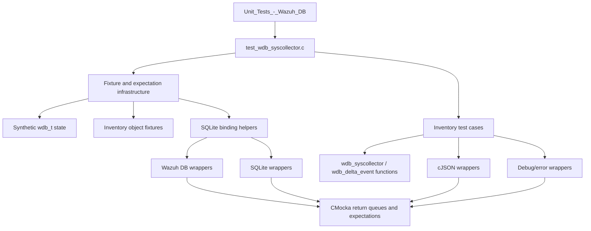
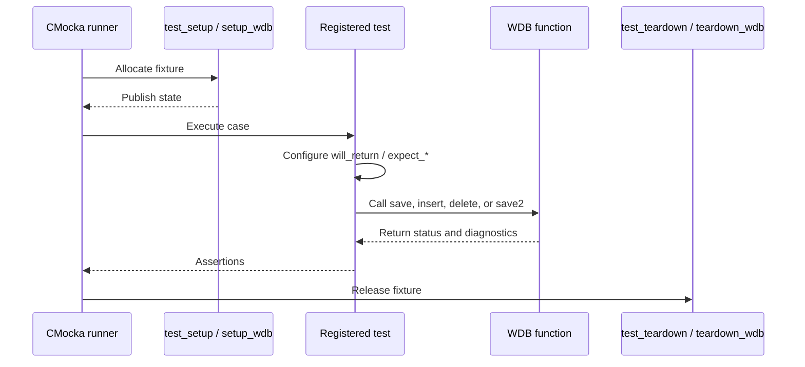
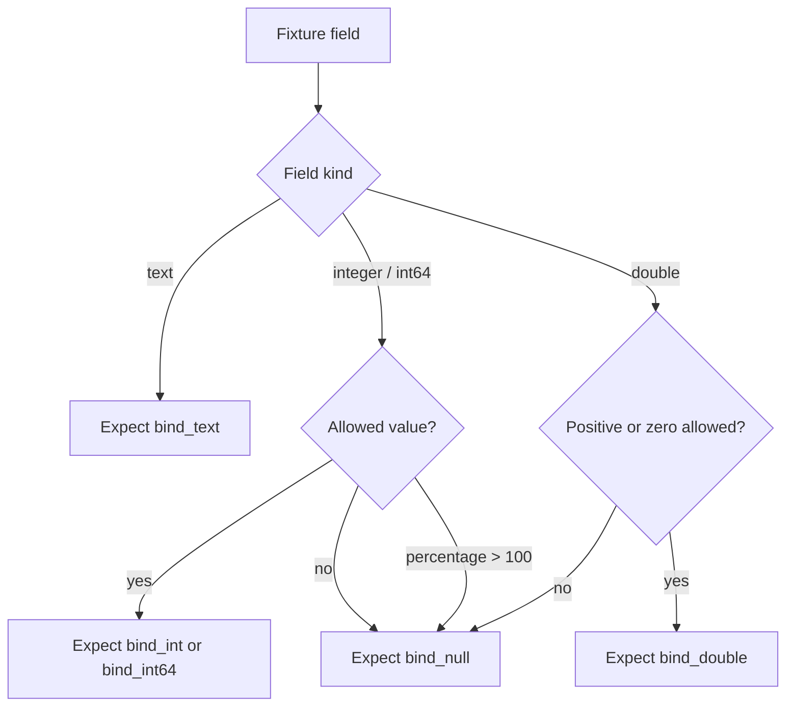
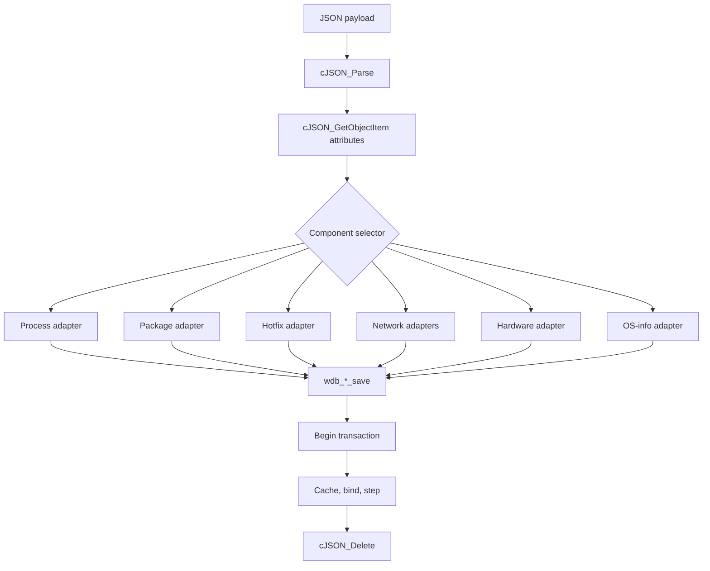
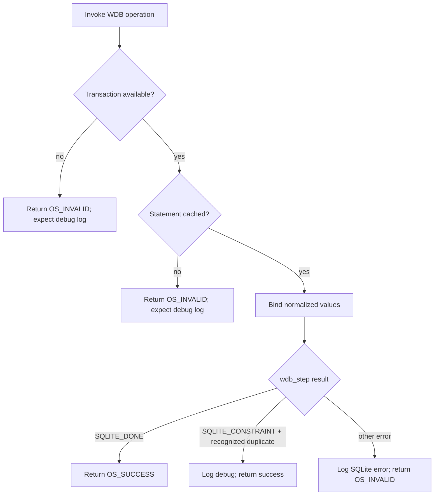

# `test_wdb_syscollector_test_infrastructure`

## Introduction

`test_wdb_syscollector_test_infrastructure` documents the reusable CMocka infrastructure embedded in `src/unit_tests/wazuh_db/test_wdb_syscollector.c`. The infrastructure creates synthetic `wdb_t` contexts, releases them after each test, supplies representative inventory fixtures, and translates high-level inventory objects into expectations for Wazuh DB and SQLite wrappers.

It is a test-support module, not production persistence logic. The behavior covered by the complete syscollector suite is described in [`test_wdb_syscollector.md`](test_wdb_syscollector.md); production database execution is described in [`wazuh_db_fim_syscollector.md`](wazuh_db_fim_syscollector.md) and [`wazuh_db_engine.md`](wazuh_db_engine.md).

## Position in the test system

The module is the infrastructure child of `test_wdb_syscollector` in the `Unit_Tests_-_Wazuh_DB` suite. It sits between CMocka cases and the Wazuh DB inventory functions under test.

## Responsibilities and boundaries

| Responsibility | Infrastructure elements | Boundary |
|---|---|---|
| Per-test state | `test_struct_t`, `test_setup`, `test_teardown` | No real SQLite connection is opened |
| Extended fixture state | `setup_wdb`, `teardown_wdb` | Creates a synthetic ID, output buffer, DB slot, and statement sentinel |
| Inventory input data | `netinfo_object`, `netproto_object`, `netaddr_object`, `osinfo_object`, `package_object`, `hotfix_object`, `hardware_object`, `port_object`, `process_object` | Values model production argument shapes |
| Binding expectations | `configure_sqlite3_bind_text`, `configure_sqlite3_bind_int`, `configure_sqlite3_bind_int64`, `configure_sqlite3_bind_int_ex`, `configure_sqlite3_bind_double` | Decides whether invalid values become SQLite `NULL` |
| Operation scripts | `configure_wdb_*_insert` helpers | Configures statement caching, bindings, and `wdb_step()` result |
| JSON dispatch scripts | `wdb_syscollector_*_save2_*` helpers | Controls cJSON extraction and transaction behavior |
| Test registration | `CMUnitTest`, `main()` | Connects cases to setup/teardown functions |

The implementation under test remains responsible for transaction ordering, validation, SQL statement selection, error propagation, replacement/removal behavior, and JSON cleanup. The infrastructure only makes those dependencies deterministic.

## Fixture lifecycle

The source contains two compatible fixture styles because the test file combines older direct-function tests with a newer fixture-driven test set.

### Minimal fixture: `test_setup` / `test_teardown`

`test_setup()` allocates a zeroed `wdb_t` and publishes it directly through CMocka state. `test_teardown()` frees it. This fixture is used by tests that only need to inject transaction, statement-cache, SQLite, cJSON, or logging outcomes.

### Extended fixture: `setup_wdb` / `teardown_wdb`

`setup_wdb()` allocates `test_struct_t` and initializes:

- `wdb`, with database ID `"000"`;
- a 256-byte output buffer;
- storage for the `sqlite3 *` member;
- `stmt[0]` as a non-null statement sentinel;
- `transaction = 0`.

`teardown_wdb()` frees these allocations in reverse ownership order. The SQLite handle and statement are deliberately synthetic; wrappers supply their behavior.

## Representative inventory fixtures

The fixture objects make argument order and nullability visible without duplicating production model definitions. Each contains a scan identifier, inventory fields, checksum, replacement flag, and where applicable an `item_id` used for replacement/removal behavior.

| Fixture | Persistence domain | Notable fields |
|---|---|---|
| `netinfo_object` | Interface statistics | MTU, MAC, packet/byte/error/drop counters |
| `netproto_object` | Routing/protocol metadata | Interface, IPv4/IPv6 type, gateway, DHCP, metric |
| `netaddr_object` | Interface addresses | Protocol, address, netmask, broadcast |
| `osinfo_object` | Operating-system identity | Hostname, architecture, release/build fields, reference |
| `package_object` | Installed software | Format, name, priority, size, vendor, version, location |
| `hotfix_object` | Installed hotfixes | Hotfix identifier and checksum |
| `hardware_object` | Hardware inventory | CPU cores/frequency, RAM totals/free/usage |
| `port_object` | Open network ports | Local/remote endpoint, queues, inode, state, PID |
| `process_object` | Running processes | PID, users/groups, command, scheduling and memory fields |

These fixtures are consumed by the `configure_wdb_*_insert()` helpers and by the corresponding success, null-value, constraint, and error tests. User and group records are built inline as `user_record_t` or scalar arguments rather than through a shared object fixture.

## SQLite binding policy helpers

The binding helpers encode the test suite's expected normalization rules:

1. Text values are bound with `sqlite3_bind_text`; a null pointer is accepted as a null text input.
2. Positive integer values are bound as integers or 64-bit integers.
3. Zero is bound only when `allow_zero` is true; otherwise the position is expected to use `sqlite3_bind_null`.
4. Negative values generally become SQL `NULL` through the same policy.
5. `configure_sqlite3_bind_int_ex()` additionally treats values above 100 as null when the field is a percentage, such as hardware RAM usage.
6. Floating-point values use `sqlite3_bind_double` when valid and `sqlite3_bind_null` otherwise.

The policy is a test oracle for the production insert functions. It does not perform conversion itself; it configures the wrapper calls that the production code must make.

## Composite operation helpers

Each `configure_wdb_*_insert()` helper scripts one complete insert boundary:

The helpers cover `netinfo`, `netproto`, `netaddr`, `osinfo`, packages, hotfixes, hardware, ports, and processes. Their expectations verify both parameter positions and values, including protocol translation (`ipv4`/`ipv6`) and replacement keys. Tests can pass `SQLITE_DONE`, `SQLITE_ERROR`, or `SQLITE_CONSTRAINT` to exercise success, database failure, and duplicate-row handling.

## JSON `save2` support

The `wdb_syscollector_save2_*` helper family models the JSON ingestion path. It scripts `cJSON_GetObjectItem`, `cJSON_GetStringValue`, transaction begin, statement caching, SQLite bindings, stepping, and the expected `cJSON_Delete` call.

The tests cover four dispatcher-level failures: no parsed payload, missing attributes, an invalid component selector, and component persistence failure. Each supported component has a success and transaction/persistence-failure script. The process path also checks invalid or missing numeric attributes and large 64-bit values.

## Error and result conventions

Tests assert both status and diagnostics. Common outcomes are:

- `OS_SUCCESS` / `0` for successful inserts, saves, deletes, and tolerated duplicate constraints;
- `OS_INVALID` / `-1` for transaction, statement-cache, binding, or SQLite execution failures;
- `SQLITE_CONSTRAINT` is treated as success only when the production function recognizes a duplicate as an idempotent replacement case;
- expected `__wrap__mdebug1` and `__wrap__merror` messages document which stage failed;
- null or invalid primary fields may trigger `wdbi_remove_by_pk` before a replacement insert.

## Test registration and maintenance

`main()` builds a `CMUnitTest` array and runs it with `cmocka_run_group_tests()`. Cases using only a `wdb_t` receive `test_setup`/`test_teardown`; cases using `test_struct_t` receive `setup_wdb`/`teardown_wdb`; a few statement-cache or invalid-input tests deliberately use no fixture because the production function exits before dereferencing the database state.

When a Wazuh DB signature or SQL field order changes, update the production declaration and wrapper contracts first, then review the corresponding fixture and `configure_wdb_*` helper. Ordered binding expectations are intentionally strict: a mismatch usually indicates a changed schema/argument contract rather than a flaky test. Behavior-specific coverage is organized under the sibling modules listed in [`test_wdb_syscollector.md`](test_wdb_syscollector.md).

## Related documentation

- [`test_wdb_syscollector.md`](test_wdb_syscollector.md) — behavior-level overview and test scope.
- [`wazuh_db_fim_syscollector.md`](wazuh_db_fim_syscollector.md) — production FIM/syscollector persistence architecture.
- [`wazuh_db_engine.md`](wazuh_db_engine.md) — Wazuh DB connection, transaction, statement, and SQLite engine context.
- [`wazuh_db_wrappers.md`](wazuh_db_wrappers.md) — shared wrapper design and CMocka contract.
- [`wazuh_db_wrappers_tasks_inventory.md`](wazuh_db_wrappers_tasks_inventory.md) — inventory-related wrapper seams.
