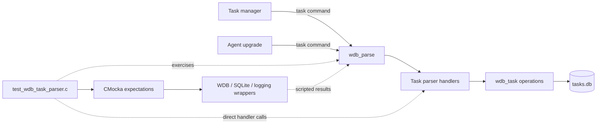
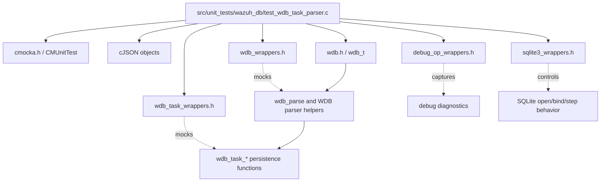
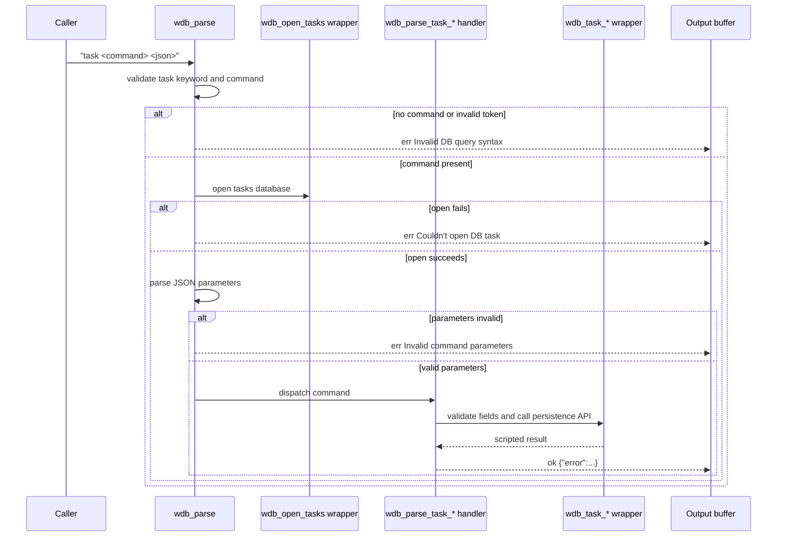
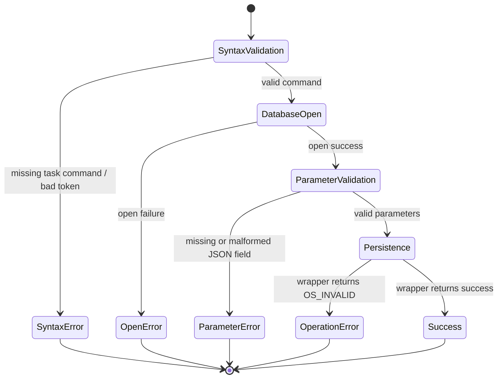
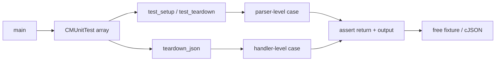

# `test_wdb_task_parser` — Wazuh DB task-command parser tests

`test_wdb_task_parser.c` is a CMocka unit-test module for the task-command branch of
`wdb_parse()` and its JSON-backed task handlers. It verifies command syntax, parameter
validation, delegation to task persistence functions, return codes, and the `ok`/`err` response
strings used by `wazuh-db`.

The module is deliberately isolated from SQLite and the live tasks database. WDB task functions,
database opening, logging, and selected SQLite operations are replaced with wrappers so each test
can prescribe a success or failure at a specific boundary. The production task lifecycle is
covered by [task_module.md](task_module.md), with lower-level persistence tests in
[test_wdb_task.md](test_wdb_task.md); the broader parser is covered by
[wazuh_db_command_parser.md](wazuh_db_command_parser.md).

## Position in the system

Task requests originate in the task manager and agent-upgrade workflows, reach `wazuh-db` through
its local command protocol, and are dispatched by `wdb_parse()`. This suite tests the parser edge
and its adapter functions, not the underlying SQL implementation.



## Architecture and dependencies

The test has two execution modes:

1. Parser-level tests call `wdb_parse()` with a textual `task ...` query. These tests verify
   opening the task database, command tokenization, and malformed JSON/parameter handling.
2. Handler-level tests construct a `cJSON` object and call a `wdb_parse_task_*` function directly.
   These tests verify required fields, wrapper arguments, serialized output, and propagation of
   the mocked operation result.



`test_struct_t` is the parser fixture. `test_setup()` allocates a minimal `wdb_t`, assigns the
database id `"000"`, allocates a 256-byte output buffer, and allocates storage for a SQLite handle
pointer. `test_teardown()` frees these allocations. Handler tests use a larger stack output buffer
and `teardown_json()` to delete the `cJSON` parameter object retained in the CMocka state.

## Command families under test

| Command or handler | Required data | Success response | Main failure behavior |
|---|---|---|---|
| `task upgrade` / `wdb_parse_task_upgrade` | `agent`, `node`, `module` | Error plus generated `task_id` | Missing field returns a parsing error; persistence failure returns `error:-1`. |
| `task upgrade_get_status` | `agent`, `node` | Error plus `status` | Missing field is a parsing error; lookup failure returns `error:-1`. |
| `task upgrade_update_status` | `agent`, `node`, `status`; optional `error_msg` | `{"error":0}` | Missing field is a parsing error; operation failure returns `error:-1`. |
| `task upgrade_result` | `agent` | Full task record | Missing agent is a parsing error; missing task id is represented as `error:-1`. |
| `task upgrade_cancel_tasks` | `node` | `{"error":0}` | Missing node is a parsing error; cancellation failure returns `error:-1`. |
| `task set_timeout` | `now`, `interval` | Error plus next `timestamp` | Missing value is a parsing error; timeout operation failure returns `error:-1`. |
| `task delete_old` | `timestamp` | `{"error":0}` | Missing timestamp is a parsing error; cleanup failure returns `error:-1`. |

The source also tests malformed parser-level parameter payloads for every command family using
`no_json`. These cases confirm the common response `err Invalid command parameters, near 'no_json'`.

## Parser flow



The test cases `test_wdb_parse_task_no_space`, `test_wdb_parse_task_open_tasks_fail`, and
`test_wdb_parse_task_invalid_command` cover the parser gates before handler dispatch. The
`*_invalid_parameters` cases cover JSON decoding and command-specific parameter rejection.

## Handler interaction and data flow

```mermaid
flowchart TD
    In[cJSON parameters] --> V[Extract required fields]
    V -->|missing field| PE[Build contextual err response]
    V -->|valid fields| F[Call wrapped wdb_task_* function]
    F -->|success| OK[Build ok JSON response]
    F -->|OS_INVALID / no task| ER[Build ok {"error":-1}]
    F -->|allocated task fields| OBJ[Build task result object]
    OK --> Out[output buffer]
    ER --> Out
    OBJ --> Out
    PE --> Out
```

The wrapper expectations make the adapter contract explicit:

- `wdb_parse_task_upgrade()` forwards agent id, node, module, and command and serializes the
  returned task id.
- `wdb_parse_task_upgrade_get_status()` forwards agent id and node and serializes the returned
  status string.
- `wdb_parse_task_upgrade_update_status()` forwards agent id, node, status, and error text.
- `wdb_parse_task_upgrade_result()` requests a record by agent id and serializes node, module,
  command, status, error message, creation time, update time, and task id.
- `wdb_parse_task_upgrade_cancel_tasks()` forwards the node.
- `wdb_parse_task_set_timeout()` forwards `now` and `interval`, then serializes the next timeout.
- `wdb_parse_task_delete_old()` forwards the timestamp.

These calls correspond to the persistence APIs tested in [test_wdb_task.md](test_wdb_task.md).
This file does not duplicate transaction, statement-cache, or task-state details from that module.

## Error and response contract



The suite distinguishes two classes of failures:

- **Parsing failures** return `OS_INVALID` and an `err ...` message naming the failed field or
  syntax location, for example `parsing node error` or `parsing timestamp error`.
- **Operation failures** return `OS_INVALID` but generally use an `ok {"error":-1}` payload,
  preserving the task protocol's response shape after a valid request reached the persistence
  layer.

Successful responses use `ok { ... }`, while malformed requests use `err ...`. Tests assert both
the return code and the exact output string, making formatting part of the compatibility contract.

## Test registration and lifecycle

`main()` registers the cases with CMocka in these groups:

1. `wdb_parse()` routing, database-open, syntax, and invalid-parameter cases.
2. Upgrade task creation.
3. Upgrade status lookup.
4. Upgrade status update.
5. Upgrade result retrieval.
6. Upgrade cancellation.
7. Timeout scheduling.
8. Historical task deletion.

Parser-level cases use `cmocka_unit_test_setup_teardown()` with `test_setup` and
`test_teardown`. Direct handler cases use `cmocka_unit_test_teardown()` with `teardown_json`,
because their CMocka state is the allocated `cJSON` object rather than `test_struct_t`.



## Scope and limitations

- The suite verifies parser dispatch and adapter behavior; it does not validate real SQLite
  schemas, migrations, file permissions, or a live `tasks.db`.
- Wrapper return values model database and task-layer outcomes. They do not prove that the real
  implementation produces the same result for every SQLite version or corrupted database state.
- The source content includes malformed-parameter tests such as
  `test_wdb_parse_task_upgrade_invalid_parameters`; these are present in the supplied file even
  though the condensed module tree lists only the broader named test categories.
- Cross-module scheduling, agent-upgrade execution, and API exposure are outside this unit. See
  [task_module.md](task_module.md) and [agent_upgrade_module.md](agent_upgrade_module.md) for those
  flows.

## Related documentation

- [test_wdb_task.md](test_wdb_task.md) — lower-level task persistence operations and tests.
- [wazuh_db_command_parser.md](wazuh_db_command_parser.md) — Wazuh DB command parsing and dispatch.
- [wazuh_db_engine.md](wazuh_db_engine.md) — WDB handles, transactions, SQLite, and statement caching.
- [task_module.md](task_module.md) — task-manager API and runtime context.
- [agent_upgrade_module.md](agent_upgrade_module.md) — agent-upgrade workflows that consume task records.
- [test_infrastructure.md](test_infrastructure.md) — common CMocka fixtures and wrapper conventions.
