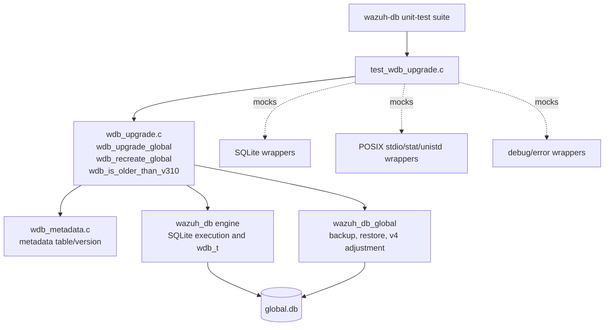
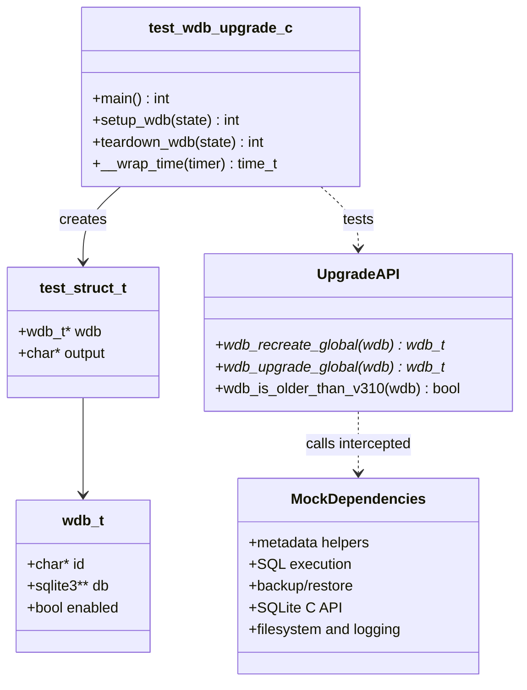
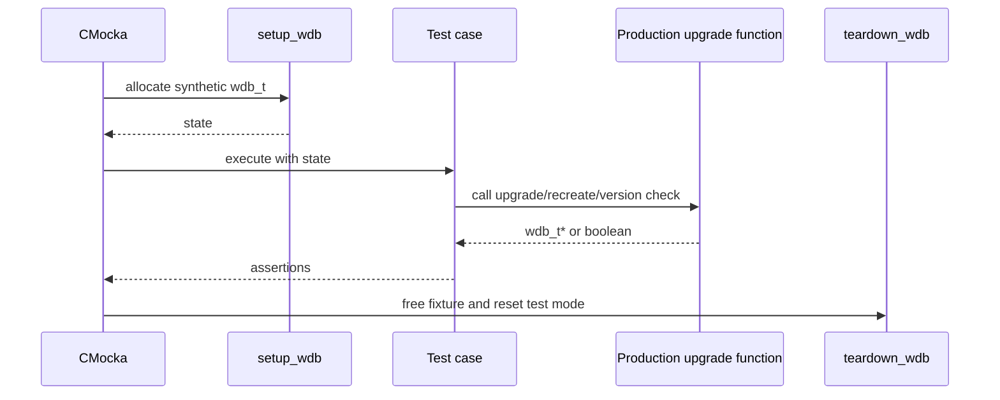
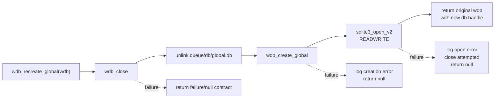
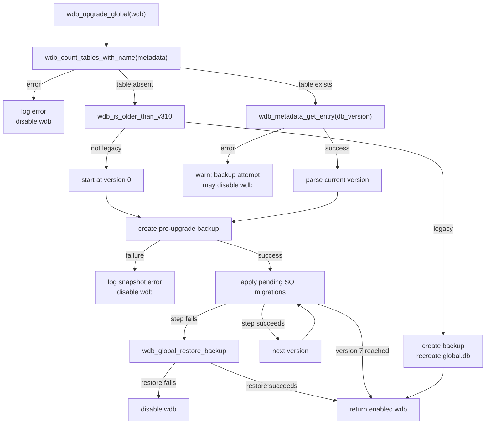
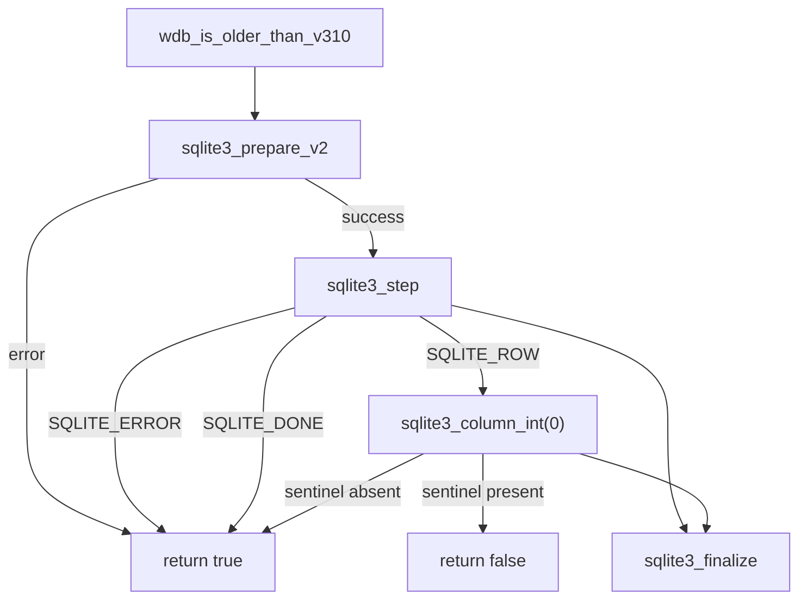
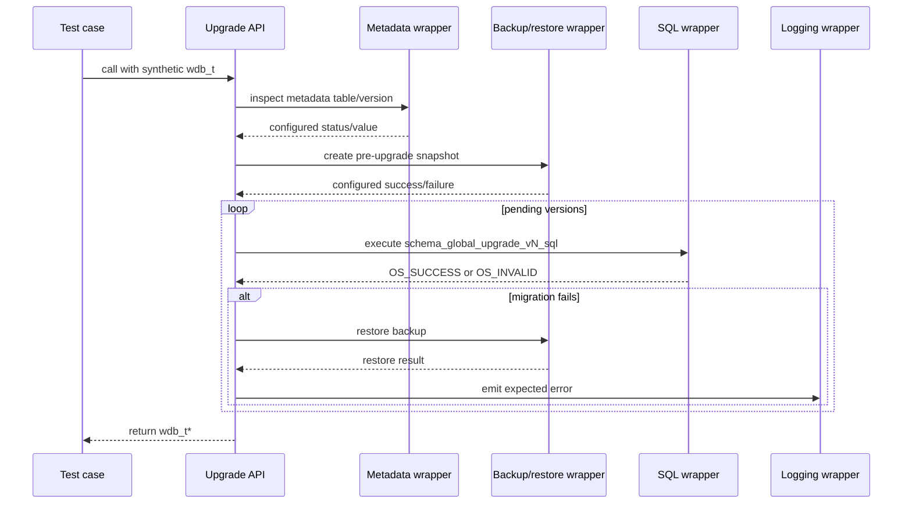

# `test_wdb_upgrade` — Wazuh DB Upgrade Tests

## Introduction

`test_wdb_upgrade` is a CMocka unit-test module for the upgrade and recovery paths of the Wazuh DB `global.db` database. It validates legacy-schema detection, backup creation and restoration, database recreation, and ordered migrations from versions 1–6 to version 7.

The tests isolate production code from SQLite and the filesystem with linker wrappers. Production behavior is documented in [wazuh_db_metadata_upgrade.md](wazuh_db_metadata_upgrade.md); connection and SQLite behavior is covered by [wazuh_db_engine.md](wazuh_db_engine.md), and global-database backup/restore behavior by [wazuh_db_global.md](wazuh_db_global.md).

## Scope and system position

The module belongs to the `wazuh_db` unit-test suite and targets `src/wazuh_db/wdb_upgrade.c` through the database interfaces declared by `wdb.h`.

The test does not exercise the API, cluster, agent framework, or a live SQLite file. It verifies the database upgrade contract at the boundary between the upgrade orchestrator and its dependencies.

## Components

| Component | Responsibility |
|---|---|
| `CMUnitTest` | CMocka descriptor type used to register each test. |
| `main()` | Registers all tests and runs them as one CMocka group. |
| `test_struct_t` | Per-test state containing a synthetic `wdb_t *` and output buffer. |
| `setup_wdb()` | Enables test mode and allocates a minimal `global` database handle. |
| `teardown_wdb()` | Restores test mode and releases every fixture allocation. |
| `__wrap_time()` | Returns a deterministic timestamp (`1`) for time-dependent code. |
| SQLite wrappers | Control prepare, step, column, finalize, open, close, and error results. |
| Wazuh DB wrappers | Control metadata, SQL, backup, restore, recreate, and v4-adjustment calls. |
| Filesystem wrappers | Observe and control deletion of `queue/db/global.db`. |
| Logging wrappers | Assert expected error and debug messages. |

## Fixture lifecycle

Every test is registered with `cmocka_unit_test_setup_teardown()`, so no state is shared between cases.

1. `setup_wdb()` sets the global `test_mode` flag.
2. It allocates `test_struct_t`, `wdb_t`, the `"global"` ID, a 256-byte output buffer, and a SQLite pointer slot.
3. The handle is marked enabled and passed through CMocka state.
4. The test configures wrapper expectations and invokes production code.
5. `teardown_wdb()` frees all allocations, then clears `test_mode`.

## Production interactions under test

### `wdb_recreate_global`

The recreate tests model the recovery path for `queue/db/global.db`:

The four recreate cases cover close failure, database creation failure, opening the new database failure, and success. The successful case verifies both object identity and replacement of `wdb->db`.

### `wdb_upgrade_global`

The global upgrade path determines whether version metadata exists. If metadata is present, it reads `db_version`; if absent, it distinguishes an old legacy database from an unversioned database. A pre-upgrade snapshot is required before migrations begin.

The tested migration sequence is:

| Current version | Expected SQL steps |
|---:|---|
| 1 | v2, v3, v4, v5, v6, v7 |
| 2 | v3, v4, v5, v6, v7 |
| 3 | v4, v5, v6, v7 |
| 4 | v5, v6, v7 |
| 5 | v6, v7 |
| 6 | v7 |

The v4 transition also invokes `wdb_global_adjust_v4`. Each other transition is represented by its corresponding `schema_global_upgrade_vN_sql` string.

### `wdb_is_older_than_v310`

This helper uses a prepared SQLite query to classify a metadata-less database. The tests cover preparation failure, a step error, no returned row, and a returned row containing the manager sentinel.

The implementation treats query errors and missing data conservatively as “older than v3.10,” allowing the caller to choose legacy recovery.

## Test categories

### Recreate and legacy recovery

- `test_wdb_recreate_global_error_closing_wdb_struct`
- `test_wdb_recreate_global_error_creating_global_db`
- `test_wdb_recreate_global_error_opening_global_db`
- `test_wdb_recreate_global_success`
- `test_wdb_upgrade_global_success_regenerating_legacy_db`

These validate deletion/recreation and the legacy database branch.

### Upgrade setup and safety

- `test_wdb_upgrade_global_error_checking_metadata_table`
- `test_wdb_upgrade_global_error_backingup_legacy_db`
- `test_wdb_upgrade_global_error_getting_database_version`
- `test_wdb_upgrade_global_error_creating_pre_upgrade_backup`
- `test_wdb_upgrade_global_fail_backup_fail`
- `test_wdb_upgrade_global_database_restored`
- `test_wdb_upgrade_global_error_restoring_database_and_getting_backup_name`
- `test_wdb_upgrade_global_intermediate_upgrade_error`

These cases assert that failures are logged, backups are attempted before migration, restore is attempted after a failed step, and `wdb->enabled` reflects whether the database remains usable.

### Full and incremental migrations

- `test_wdb_upgrade_global_full_upgrade_success`
- `test_wdb_upgrade_global_full_upgrade_success_from_unversioned_db`
- `test_wdb_upgrade_global_update_v1_to_latest_success/fail`
- `test_wdb_upgrade_global_update_v2_to_latest_success/fail`
- `test_wdb_upgrade_global_update_v3_to_latest_success/fail`
- `test_wdb_upgrade_global_update_v4_to_latest_success/fail`
- `test_wdb_upgrade_global_update_v5_to_latest_success/fail`
- `test_wdb_upgrade_global_update_v6_to_latest_success/fail`

Success cases verify every expected migration and adjustment call. Failure cases inject an SQL error at the first pending step and assert the resulting log, restore behavior, and returned handle.

## Mocked dependency flow

Wrapper expectations also verify arguments such as `"metadata"`, `"db_version"`, `"queue/db/global.db"`, the selected migration SQL, and `save_pre_restore_state == false`.

## Assertions and observable contracts

| Contract | How the tests verify it |
|---|---|
| Recoverable upgrade failure returns the fixture | `assert_ptr_equal(ret, data->wdb)` |
| Successful recreate replaces the SQLite handle | `assert_ptr_equal(new_db, ret->db)` |
| Fatal setup or backup failure disables the handle | `assert_false(ret->enabled)` |
| Successful restore leaves the handle enabled | `assert_true(ret->enabled)` |
| Correct migration SQL is selected | `expect_string(__wrap_wdb_sql_exec, sql_exec, schema_global_upgrade_vN_sql)` |
| Correct version is logged | `expect_string(__wrap__mdebug2, formatted_msg, ...)` |
| Restore is attempted after migration failure | `expect_value(__wrap_wdb_global_restore_backup, save_pre_restore_state, false)` |
| SQLite opens read/write | `expect_value(__wrap_sqlite3_open_v2, flags, SQLITE_OPEN_READWRITE)` |

## Execution model

`main()` builds a static `CMUnitTest` array and associates every case with `setup_wdb` and `teardown_wdb`. It then calls `cmocka_run_group_tests()`. Each case therefore runs independently with deterministic time and all external effects controlled by wrappers.

The exact build and invocation command is supplied by the repository’s Wazuh DB unit-test build system. When diagnosing a failure, start with the specific test name and inspect its wrapper expectations before inspecting migration implementation details.

## Related documentation

- [wazuh_db_metadata_upgrade.md](wazuh_db_metadata_upgrade.md) — production upgrade algorithms, metadata handling, and failure policy.
- [wazuh_db_engine.md](wazuh_db_engine.md) — `wdb_t`, SQLite execution, transactions, and database creation.
- [wazuh_db_global.md](wazuh_db_global.md) — `global.db` persistence, backup, restore, and group-state operations.
- [test_wdb_metadata.md](test_wdb_metadata.md) — mocked metadata-table existence tests that complement this module.
- [test_wdb.md](test_wdb.md) — broader Wazuh DB engine and SQLite wrapper tests.
- [test_wdb_global_helpers.md](test_wdb_global_helpers.md) — tests for the client-side global database helper layer.
