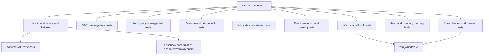
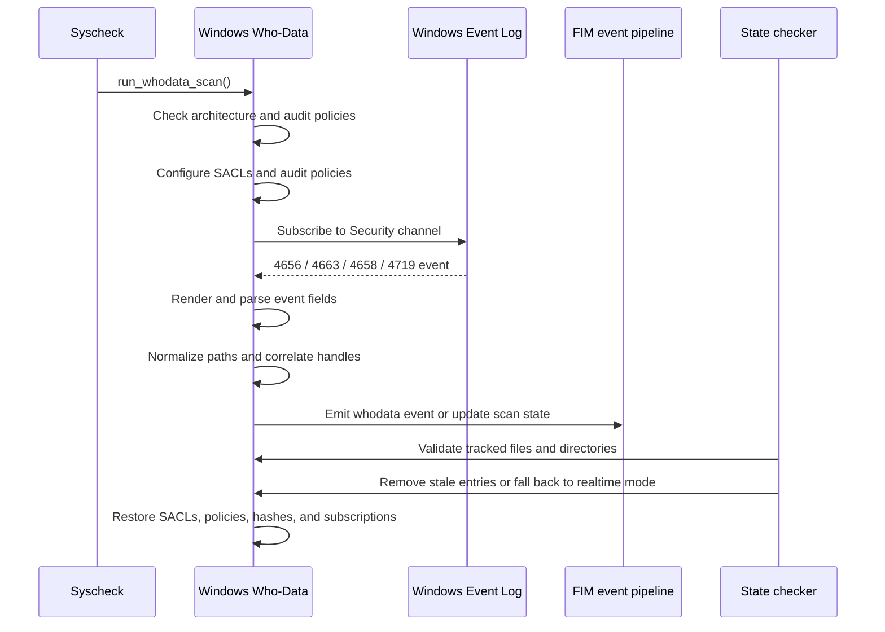

# `test_win_whodata`

## Purpose

`test_win_whodata` is a CMocka unit-test module for the Windows Who-Data implementation of Syscheck/FIM. It validates security audit configuration, SACL management, Windows Event Log parsing, event correlation, monitored-directory state handling, policy checks, resource cleanup, and error paths.

The tests exercise [`win_whodata.c`](../../../../syscheckd/src/whodata/win_whodata.c), using Windows API wrappers and Syscheck fixtures to isolate platform interactions.

## Architecture

### Test organization



The module runs four CMocka groups:

- General Windows Who-Data tests
- Event callback tests
- State checker tests
- Directory-hash cleanup tests

### Runtime behavior under test



## Covered components

The test suite covers:

- SACL creation, validation, update, restoration, and privilege management
- Windows architecture detection and volume/device path conversion
- Audit policy verification, backup, restoration, and policy-change handling
- Event rendering through `EvtRender`
- Extraction of event IDs, handle IDs, access masks, paths, process data, and user identities
- Handling of Windows event types 4656, 4663, 4658, and 4719
- Hash-table tracking of open handles and monitored directories
- Scan startup, callback processing, state checking, and resource release

## Core component references

- Test module: [`test_win_whodata.c`](../../../../unit_tests/syscheckd/whodata/test_win_whodata.c)
- Windows Who-Data implementation: [`win_whodata.c`](../../../../syscheckd/src/whodata/win_whodata.c)
- Syscheck public interfaces and data types: [`syscheck.h`](../../../../syscheckd/include/syscheck.h)
- FIM event processing: [`fim_scan.c`](../../../../syscheckd/src/fim_scan.c)
- FIM audit-event serialization: [`events.c`](../../../../syscheckd/src/file/events.c)
- Syscheck runtime orchestration: [`run_check.c`](../../../../syscheckd/src/run_check.c)
- Syscheck configuration and event cleanup: [`config.c`](../../../../syscheckd/src/config.c)
- Shared test wrappers: [`src/unit_tests/wrappers`](../../../../unit_tests/wrappers)

## Repository structure

```text
src/unit_tests/syscheckd/whodata/test_win_whodata.c
├── test infrastructure
├── sacl management tests
├── policy management tests
├── volume/device path tests
├── whodata scan startup tests
├── whodata callback tests
├── whodata event parsing tests
├── whodata hash tests
├── state checker tests
└── whodata utility tests
```