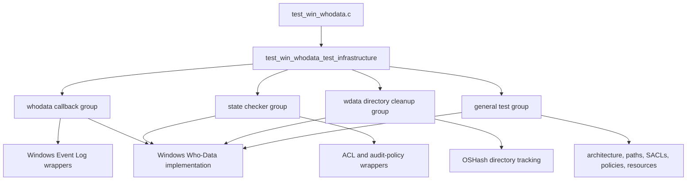
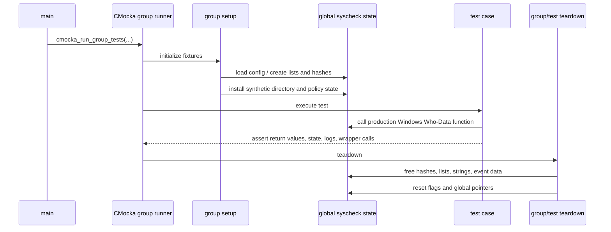
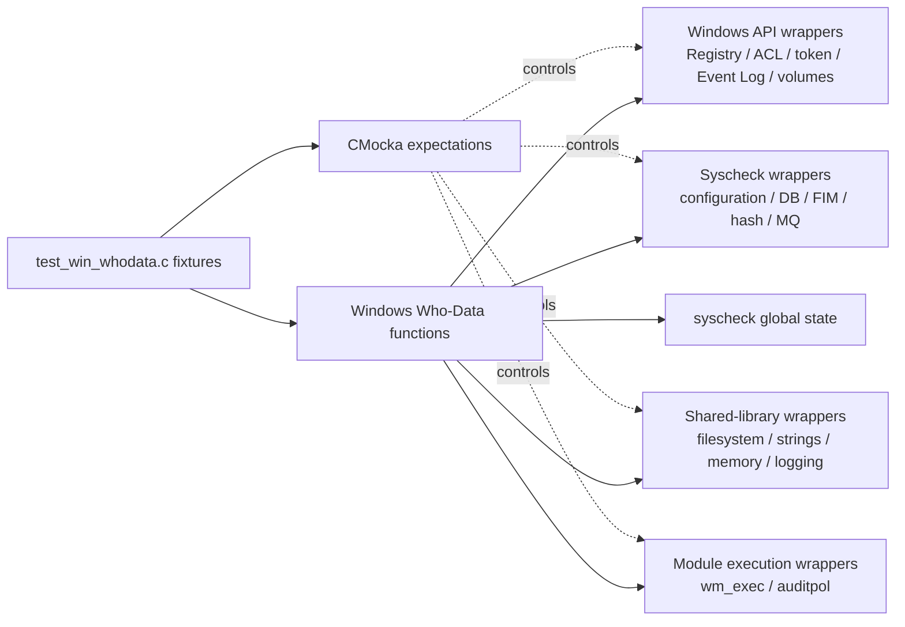
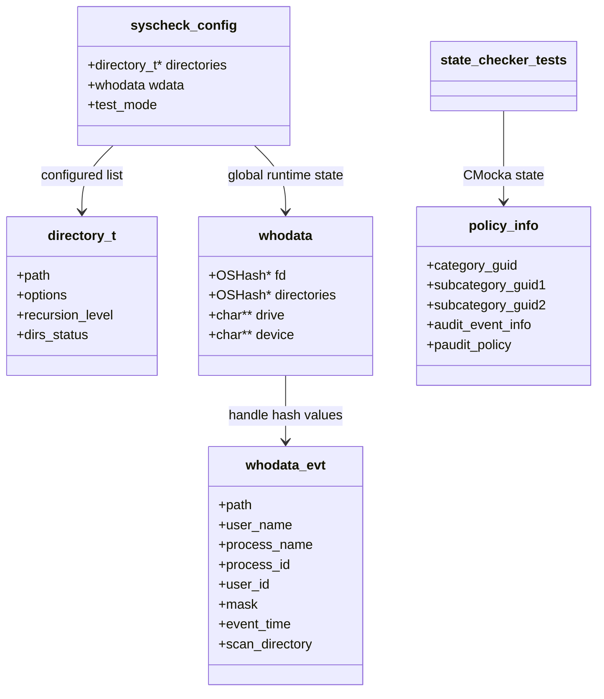
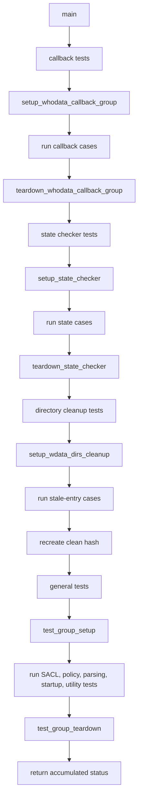
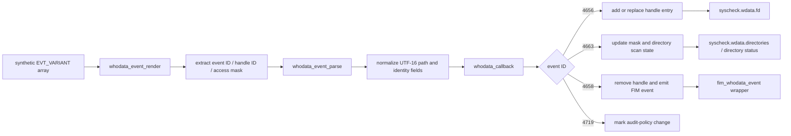
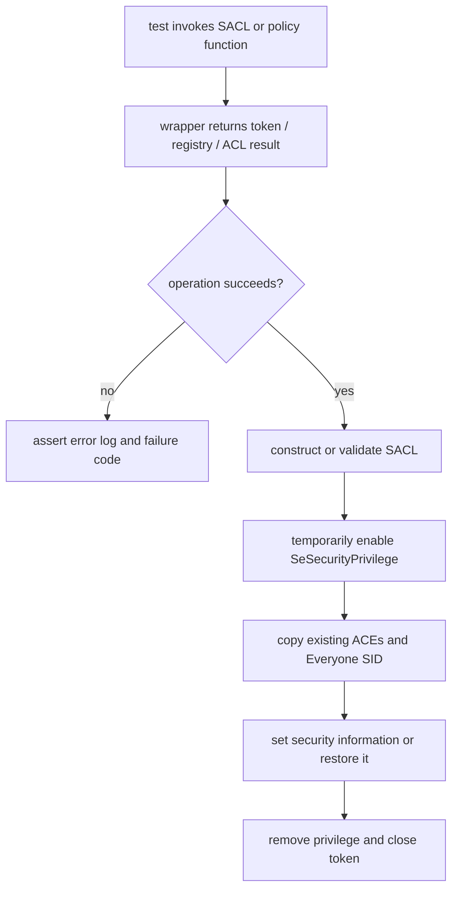

# `test_win_whodata_test_infrastructure`

## Introduction

`test_win_whodata_test_infrastructure` documents the shared CMocka fixtures and suite orchestration used by the Windows Who-Data tests in `src/unit_tests/syscheckd/whodata/test_win_whodata.c`. It is not production Who-Data logic. Its purpose is to create deterministic Syscheck state, model Windows security and Event Log responses, isolate operating-system effects behind wrappers, and restore global state between tests.

The behavioral scope of the complete test module is documented in [`test_win_whodata.md`](test_win_whodata.md). Production behavior is described in [`syscheckd_whodata.md`](syscheckd_whodata.md), while Windows-specific audit/SACL implementation details belong to the corresponding production source and its parent FIM documentation.

## Position in the test hierarchy

The infrastructure is a logical child of the [`test_win_whodata`](test_win_whodata.md) test module. It supports four CMocka execution groups: callback processing, state checking, directory-hash cleanup, and the general Windows Who-Data suite.



## Responsibilities

| Infrastructure component | Responsibility |
|---|---|
| `CMUnitTest` arrays | Declare test cases and associate setup/teardown callbacks. |
| `test_group_setup` / `test_group_teardown` | Load the shared Syscheck configuration, enable wrapper test mode, and release global state. |
| `setup_whodata_callback_group` | Create the handle-event hash, configure a whodata-enabled directory, and establish callback prerequisites. |
| `setup_state_checker` | Create a monitored directory and whodata directory hash, and provide synthetic audit-policy data. |
| `setup_wdata_dirs_cleanup` | Isolate tests that exercise stale/non-stale directory entries in `syscheck.wdata.directories`. |
| `setup_policy_check` / `teardown_policy_check` | Allocate GUIDs, audit-policy arrays, and category metadata used by policy validation tests. |
| Specialized teardown helpers | Free event objects, path/device arrays, policy structures, hash tables, and reset `errno` or global flags. |
| `main` | Run all groups in a defined order and return the accumulated CMocka status. |

## Fixture lifecycle

The test file uses process-wide `syscheck` state because the production code also uses the global Syscheck configuration. Setups therefore establish only the state needed by a group, and teardowns explicitly rebuild or clear shared containers before another group runs.



### General group

`test_group_setup` expects the Syscheck configuration parser to read `../test_syscheck.conf`. It configures the ignore and no-diff regular expressions, sets `test_mode`, initializes the event-buffer size, and establishes the lock expectations required by configuration and cleanup code.

`test_group_teardown` disables test mode and delegates to `syscheck_teardown`. The teardown frees whodata handle/directory hashes, volume-device arrays, the configured directory list, and the broader `syscheck` configuration before clearing pointers that production cleanup may otherwise retain.

### Callback group

`setup_whodata_callback_group` creates `syscheck.wdata.directories`, assigns `free` as its data destructor, creates a configured `c:\windows` directory, enables the full FIM metadata option set plus `WHODATA_ACTIVE`, and marks the directory as `WD_CHECK_WHODATA`.

This fixture supports event IDs 4656, 4663, 4658, and 4719. The tests mutate recursion depth, monitoring status, scan state, and hash contents; `teardown_whodata_callback_group` restores the common Syscheck state and re-enables hash insertion checks.

### State-checker group

`setup_state_checker` creates a `c:\a\path` whodata directory with existence and directory-type status, allocates the whodata directory hash, and attaches synthetic policy metadata. The tests then model file deletion, directory re-addition, invalid/valid SACLs, policy mismatch, and fallback from whodata to realtime monitoring.

`teardown_state_checker` releases policy metadata and the complete Syscheck fixture. Additional teardown logic recreates directory entries when individual tests intentionally modify global status bits.

### Directory-cleanup group

`setup_wdata_dirs_cleanup` creates only the directory hash and policy fixture. Tests insert timestamped `whodata_directory` records using real hash operations, then verify that `state_checker` preserves current entries and removes stale entries. The hash is destroyed and recreated after tests so the next case starts empty.

## Dependency and wrapper architecture

The infrastructure calls the real Windows Who-Data functions but replaces external effects with wrapper functions. CMocka expectations determine return values, output buffers, error codes, and required call ordering.



The included wrapper families cover:

- Windows Event Log calls such as `EvtRender`, `EvtSubscribe`, `EvtCreateRenderContext`, and `EvtClose`;
- registry and volume discovery calls used for architecture and device-path handling;
- token privilege and ACL calls such as `OpenProcessToken`, `LookupPrivilegeValue`, `AdjustTokenPrivileges`, `GetNamedSecurityInfo`, `SetNamedSecurityInfo`, `GetAce`, `AddAce`, and `DeleteAce`;
- Wazuh hash, filesystem, string, random, message-queue, logging, configuration, and FIM operations;
- `auditpol` backup/restore through the module execution wrapper.

This boundary prevents tests from depending on the host Windows installation, real Security-channel events, actual ACLs, or real audit policy files.

## Data model established by the fixtures



The central fixture is the `syscheck` global. `directory_t` entries provide monitoring options, recursion limits, path identity, and status bits. `syscheck.wdata.fd` correlates Windows handle IDs with `whodata_evt` objects, while `syscheck.wdata.directories` tracks directories awaiting or requiring scans. `policy_info` is test-only state that supplies the GUID and audit-policy arrays expected by `policy_check` and `state_checker`.

## Execution and behavioral flows

### Suite execution



### Callback fixture data flow



The fixture deliberately uses event-field positions and Windows variant types expected by the implementation. Cases cover 32-bit and 64-bit handle/process representations, invalid types, missing identities, recycled paths, duplicate handles, non-monitored paths, recursion limits, and scan-abort states.

### SACL and audit-policy fixture flow



The SACL tests are intentionally granular: they inject failures at privilege lookup, token opening, security descriptor retrieval, ACL sizing, allocation, ACL initialization, ACE retrieval/copy/addition, and final security-info update. This makes cleanup behavior and the return-value contract observable at each boundary.

## Cleanup and isolation rules

The test source has several important isolation conventions:

1. Hash tables that own values receive `free` through `OSHash_SetFreeDataPointer`.
2. `syscheck_teardown` frees both whodata-specific state and the broader Syscheck configuration.
3. Tests that return allocated paths or rendered event buffers register a teardown such as `teardown_memblock` or `teardown_win_whodata_evt`.
4. Tests that mutate directory status, recursion, or options restore those fields in teardown callbacks.
5. `errno`, `test_mode`, `restore_policies`, `policies_checked`, and hash insertion controls are reset before later groups execute.
6. Windows handles returned by wrappers are explicitly closed in the expected call sequence.

These rules are necessary because a failure to reset one global hash or status bit can change the branch taken by later callback or state-checker tests.

## References

- [Windows Who-Data test module](test_win_whodata.md) — complete functional test coverage and production call relationships.
- [Syscheckd Whodata](syscheckd_whodata.md) — production Whodata responsibilities and relationships to FIM.
- [Syscheckd core](syscheckd_core.md) — FIM orchestration and runtime state consumed by the tests.
- [Syscheckd realtime](syscheckd_core_realtime.md) — fallback behavior when whodata monitoring is disabled.
- [FIM realtime Whodata tests](fim_realtime_whodata_tests.md) — related realtime/whodata behavioral coverage.
- [Syscheckd wrappers](syscheckd_wrappers.md) — shared wrapper boundary used by the test harness.
- [Syscheck configuration](Syscheck_Config.md) — `directory_t`, `whodata`, and status structures referenced by fixtures.

## Source location

```text
src/unit_tests/syscheckd/whodata/test_win_whodata.c
```

The infrastructure symbols documented here are the CMocka test descriptor type, `main`, `test_group_setup`, group-specific setup/teardown callbacks, policy fixture helpers, and cleanup helpers defined in that translation unit.
