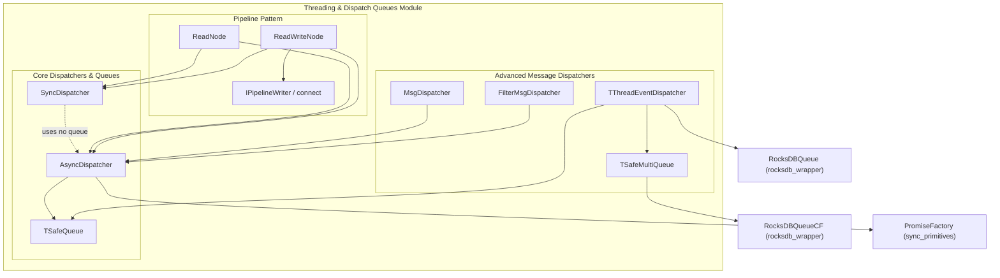
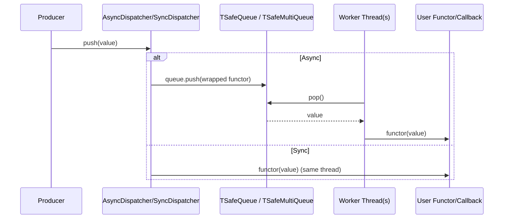

# Threading & Dispatch Queues Module

## Introduction

The **Threading & Dispatch Queues** module is a header-only C++ template library, part of the broader `shared_utils` infrastructure (see [shared_utils](shared_utils.md)), that provides the fundamental **concurrency and message-dispatching primitives** used throughout the Wazuh C++ codebase (FIM/Syscheck, Inventory Harvester, Vulnerability Scanner, Router, Content Manager, DBSync, RSync, etc.).

Its purpose is to offer a small set of reusable, composable building blocks that let other modules:

- Execute work **synchronously or asynchronously** using a uniform interface (`push`, `rundown`, `cancel`).
- Buffer messages safely between producer and consumer threads (in-memory or persisted to disk via RocksDB).
- Route (dispatch) incoming messages to the correct callback based on a **key**, or **filter** messages before they are processed.
- Compose multiple processing stages into a **pipeline** where each stage runs on its own dispatcher/thread pool.

All components live under `src/shared_modules/utils/` and are consumed as templates (no linkable `.cpp` translation unit), which keeps the module dependency-light and easily testable in isolation.

## Architecture Overview

The module is organized into three conceptual layers that build on top of each other:

1. **Core Dispatchers & Queues** — the foundational primitives: synchronous/asynchronous execution engines and thread-safe queue containers (in-memory and disk-backed).
2. **Advanced Message Dispatchers** — higher-level dispatchers built on top of the core layer that add key-based routing, filtering, and persistent (RocksDB-backed) event dispatching.
3. **Pipeline Pattern** — a composition layer that lets independent dispatcher-backed nodes be wired together into a producer/consumer processing pipeline.

## Sub-modules

This module is documented in three dedicated sub-module pages, each covering a cohesive group of components:

### 1. Core Dispatchers & Queues
Covers the fundamental execution engines (`AsyncDispatcher`, `SyncDispatcher`) and the in-memory thread-safe queue (`TSafeQueue`) that underpins asynchronous dispatching.

📄 See [threading_dispatch_queues_core.md](threading_dispatch_queues_core.md)

### 2. Advanced Message Dispatchers
Covers the higher-level dispatchers that route messages by key (`MsgDispatcher`), filter messages before processing (`FilterMsgDispatcher`), and dispatch persisted events from RocksDB-backed queues (`TThreadEventDispatcher`, `TSafeMultiQueue`).

📄 See [threading_dispatch_queues_advanced.md](threading_dispatch_queues_advanced.md)

### 3. Pipeline Pattern
Covers the composition primitives (`IPipelineWriter`, `connect`, `ReadNode`, `ReadWriteNode`) that allow chaining dispatcher-backed processing stages into multi-threaded pipelines.

📄 See [threading_dispatch_queues_pipeline.md](threading_dispatch_queues_pipeline.md)

## How the Layers Interact

- **`AsyncDispatcher`** owns a pool of worker threads and an internal `TSafeQueue`; `push()` enqueues a closure that invokes the user functor, and worker threads continuously pop and execute.
- **`SyncDispatcher`** has the identical interface but simply invokes the functor immediately on the caller's thread — useful for tests or when concurrency is undesired.
- **`MsgDispatcher`** and **`FilterMsgDispatcher`** wrap an `AsyncDispatcher` (or `SyncDispatcher`) instance, adding decoding/routing (`MsgDispatcher`) or predicate-based filtering (`FilterMsgDispatcher`) before invoking the final callback.
- **`TThreadEventDispatcher`** and **`TSafeMultiQueue`** replace the in-memory `std::queue` backing store with a persistent RocksDB-backed queue (see [rocksdb_wrapper](rocksdb_wrapper.md)), enabling crash-resilient message processing with bulk retrieval and per-prefix (multi-queue) support.
- **`ReadNode`** and **`ReadWriteNode`** (Pipeline Pattern) embed a dispatcher (sync or async) to receive input, process it, and — in the case of `ReadWriteNode` — forward its output to downstream readers via `IPipelineWriter::send()`, enabling multi-stage concurrent pipelines.

## Key Design Characteristics

- **Header-only templates**: All components are C++ templates defined entirely in headers, allowing compile-time specialization of queue backing stores, functors, and thread counts without virtual-call overhead (except where polymorphism is explicitly needed, e.g., `IPipelineWriter`).
- **Uniform dispatcher interface**: `AsyncDispatcher` and `SyncDispatcher` expose the same `push`, `rundown`, `cancel`, `cancelled`, `numberOfThreads`, and `size` methods, making them interchangeable template parameters for higher-level components (`MsgDispatcher`, `FilterMsgDispatcher`, `ReadNode`, `ReadWriteNode`).
- **Bounded/unbounded queueing**: Queue size limits (`UNLIMITED_QUEUE_SIZE` sentinel) are supported to apply back-pressure and avoid unbounded memory growth.
- **Graceful shutdown**: All dispatchers support `cancel()` (immediate stop) and `rundown()` (drain pending work before stopping) semantics.
- **Persistence option**: `TThreadEventDispatcher`/`TSafeMultiQueue` allow swapping the queue implementation for a RocksDB-backed queue, enabling durable, resumable message processing across process restarts — used heavily by modules like `content_manager`, `router`, and `inventory_harvester_module`.

## Relationship to Other Modules

- **[rocksdb_wrapper](rocksdb_wrapper.md)** — Provides `RocksDBQueue` / `RocksDBQueueCF`, the disk-backed queue implementations used by `TThreadEventDispatcher` and `TSafeMultiQueue` for persistent dispatch.
- **[sync_primitives](sync_primitives.md)** — Provides `PromiseFactory`, used internally by `AsyncDispatcher::rundown()` to block until pending work completes.
- **[design_patterns](design_patterns.md)** — Contains related composability primitives (`Builder`, `Subject`/`Subscriber`, `RoundRobinSelector`) that are conceptually adjacent to the Pipeline Pattern described here.
- **Consumers**: Higher-level daemons and services such as the FIM/Syscheck daemon ([syscheckd_core](syscheckd_core.md)), the Router shared module ([router_core](router_core.md), [router_pubsub](router_pubsub.md)), the Content Manager ([content_manager_orchestration](content_manager_orchestration.md)), and the Inventory Harvester / Vulnerability Scanner modules rely on these dispatch primitives to process events concurrently.
