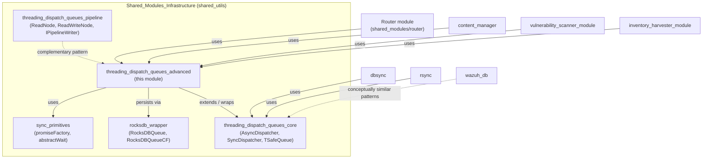
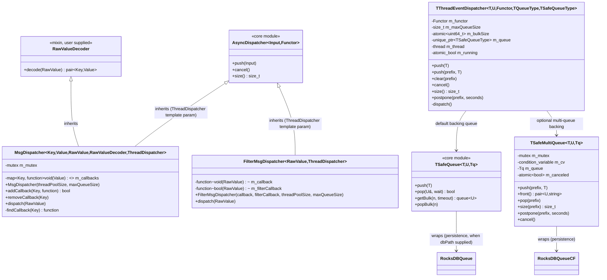
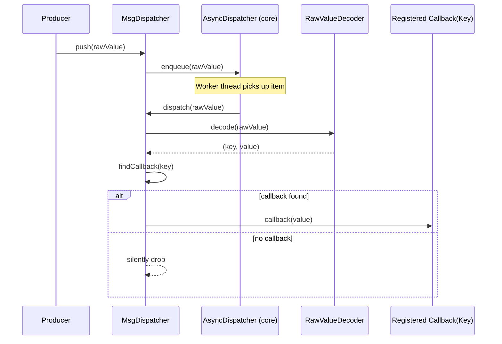
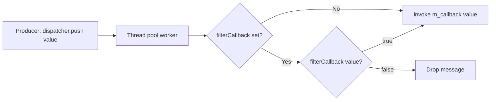
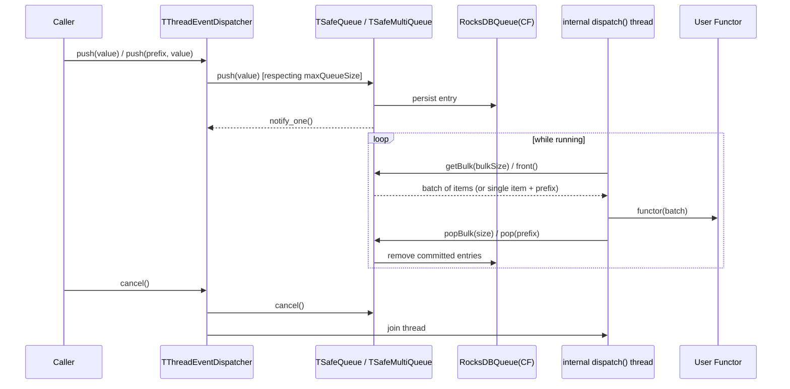
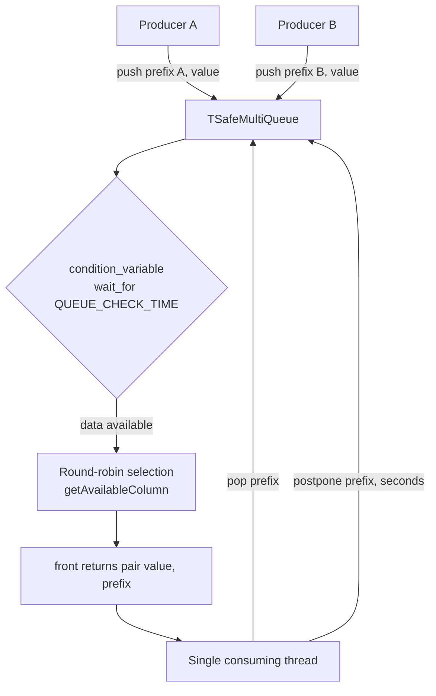
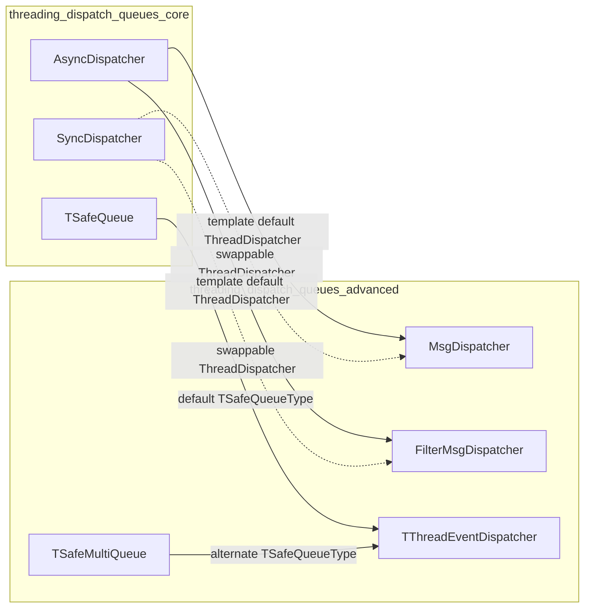

# Threading Dispatch Queues — Advanced (`threading_dispatch_queues_advanced`)

## Introduction

This module provides the **advanced, higher-level building blocks** of Wazuh's
generic C++ threading/dispatch framework (`shared_utils`). While the
[`threading_dispatch_queues_core`](threading_dispatch_queues_core.md) module
supplies the fundamental primitives — a generic thread pool dispatcher
(`AsyncDispatcher`/`SyncDispatcher`) and an in-memory thread-safe queue
(`TSafeQueue`) — this module composes those primitives into **specialized,
production-ready dispatchers** that are used throughout the Wazuh agent,
manager, and shared daemons (`wazuh-modulesd`, `wazuh-db`, the vulnerability
scanner, the inventory harvester, the content manager, the router, etc.) to
decouple message *production* from message *consumption*.

The four core components covered by this module are:

| Component | File | Purpose |
|---|---|---|
| `MsgDispatcher` | `msgDispatcher.h` | Decodes a raw message into a `(key, value)` pair and routes the `value` to a callback registered for that `key`. |
| `FilterMsgDispatcher` | `filterMsgDispatcher.hpp` | Dispatches a raw message to a single callback only if an (optional) filter predicate approves it. |
| `TThreadEventDispatcher` | `threadEventDispatcher.hpp` | A self-contained, persistent (RocksDB-backed), bulk-capable producer/consumer pipeline running on its own dedicated thread. |
| `TSafeMultiQueue` | `threadSafeMultiQueue.hpp` | A thread-safe queue abstraction over multiple named ("column family") sub-queues with round-robin consumption and postponement support, used as the backing store for `TThreadEventDispatcher` in multi-tenant scenarios. |

These components are template-based, engine-agnostic utilities: they don't
know anything about agents, syscheck, or vulnerabilities — they only know how
to move typed data from producers to consumers safely and efficiently. Higher
level modules (e.g. `router`, `content_manager`, `dbsync`, `rsync`,
`vulnerability_scanner_module`) instantiate these templates with their own
domain types and decoders/functors.

## Position in the System

For the base thread-pool and single in-memory queue primitives that this
module builds upon, see
[`threading_dispatch_queues_core.md`](threading_dispatch_queues_core.md).
For the pipeline/node composition pattern that complements these dispatchers
(useful when chaining multiple processing stages), see
[`threading_dispatch_queues_pipeline.md`](threading_dispatch_queues_pipeline.md).
The persistent storage engine used by `TThreadEventDispatcher` and
`TSafeMultiQueue` is documented in
[`rocksdb_wrapper.md`](rocksdb_wrapper.md).

## Architecture Overview

## Component Details

### 1. `MsgDispatcher` — Keyed Callback Routing

`MsgDispatcher` combines a thread-pool dispatcher (by default
`AsyncDispatcher` from the core module) with a user-supplied `RawValueDecoder`
mixin. Raw messages pushed into the dispatcher are decoded into a
`(Key, Value)` pair, and the `Value` is routed to whichever callback was
registered under `Key` via `addCallback`. This is the classic **pub/sub by
topic** pattern used, for example, to route decoded router/DBSync events to
per-subscriber handlers.

Key characteristics:
- Thread-safe callback registry protected by `std::mutex`.
- `addCallback` returns `false` if a callback is already registered for the
  given key (no silent overwrite).
- Inherits queueing/threading behavior entirely from the `ThreadDispatcher`
  template parameter (defaults to `AsyncDispatcher`, but `SyncDispatcher` can
  be substituted for synchronous/test scenarios — see
  [`threading_dispatch_queues_core.md`](threading_dispatch_queues_core.md)).

### 2. `FilterMsgDispatcher` — Single Callback with Optional Filtering

`FilterMsgDispatcher` is a simpler sibling of `MsgDispatcher`: instead of
routing to multiple callbacks by key, it always calls **one** callback, but
only if an optional filter predicate approves the raw value first. This is
useful for scenarios like discarding events that don't match a namespace,
severity threshold, or subscription criteria before doing expensive
processing.

Key characteristics:
- Constructor throws `std::invalid_argument` if no callback is supplied
  (fail-fast configuration validation).
- Filter is optional (`nullptr` = always dispatch).
- Like `MsgDispatcher`, threading behavior is inherited from the
  `ThreadDispatcher` template parameter.

### 3. `TThreadEventDispatcher` — Persistent, Bulk-Capable Pipeline

`TThreadEventDispatcher` is the most sophisticated component in this module.
Unlike `MsgDispatcher`/`FilterMsgDispatcher` (which delegate their threading
to `AsyncDispatcher`'s internal thread pool), `TThreadEventDispatcher` owns
**its own single dedicated thread** and a **persistent backing queue**
(RocksDB-based by default), enabling:

- **Durability**: events survive process restarts because they are persisted
  to disk (`RocksDBQueue` / `RocksDBQueueCF`) rather than kept purely in
  memory.
- **Bulk processing**: consumers can process `bulkSize()` items at a time via
  `getBulk`/`popBulk`, amortizing per-call overhead (important for database
  writes, indexer bulk requests, etc.).
- **Two backing-queue flavors**, selected via template parameters:
  - `TSafeQueue<T,U,RocksDBQueue<T,U>>` (default): a single ordered queue.
  - `TSafeMultiQueue<T,U,RocksDBQueueCF<T,U>>`: multiple named sub-queues
    (one RocksDB column family per prefix), consumed round-robin via
    `front()`, with support for **postponing** a specific sub-queue for a
    period of time (`postpone(prefix, seconds)`) — useful for per-agent or
    per-tenant rate limiting/backoff.

Key characteristics:
- **Construction modes**: either supply the `Functor` at construction time
  (thread starts immediately) or defer it via `startWorker(functor)`.
- `push`/`size`/`postpone`/`clear` are compile-time gated with
  `if constexpr` + `static_assert` depending on whether the backing queue is
  `TSafeQueue` (single-queue API: `push(value)`, `size()`) or
  `TSafeMultiQueue` (multi-queue API: `push(prefix, value)`,
  `size(prefix)`, `postpone(prefix, time)`, `clear(prefix)`). This produces
  **compile errors** rather than runtime errors if the wrong API is used for
  a given queue type — an important design detail for maintainers.
- `dispatch()` (the worker loop) catches exceptions thrown by the functor,
  logs them to `stderr`, and backs off for one second before retrying —
  preventing a single bad event from crashing the dispatch thread or causing
  a tight failure loop.
- Destructor calls `cancel()`, which stops the queue, signals the loop to
  exit, and joins the thread — ensuring clean shutdown.
- The convenience alias `ThreadEventDispatcher<Type, Functor>` instantiates
  `TThreadEventDispatcher<Type, Type, Functor>` for the common case where the
  raw and processed types are identical.

### 4. `TSafeMultiQueue` — Multi-Tenant Thread-Safe Queue

`TSafeMultiQueue` is the thread-safety wrapper that `TThreadEventDispatcher`
uses when it needs **independent named queues** (e.g., one per agent ID, one
per module) sharing a single dispatch thread, instead of a single FIFO. It
mirrors the API shape of `TSafeQueue` (from the core module) but adds a
`prefix` (column-family name) dimension to every operation.

Key characteristics:
- `front()` blocks (with a `QUEUE_CHECK_TIME` = 5 second polling wait) until
  data is available in **any** sub-queue or the queue is cancelled; it
  returns the value together with the sub-queue's prefix so the caller knows
  which `pop`/`postpone` to issue afterward.
- `postpone(prefix, time)` temporarily removes a sub-queue from round-robin
  rotation — used to implement backoff for a misbehaving or rate-limited
  producer/consumer pair without blocking other sub-queues.
- All public methods are protected by a single `std::mutex`, with a
  `std::condition_variable` used to wake up waiting consumers.
- Copy constructor performs a locked, shallow copy of the underlying queue
  (primarily useful for testing/snapshotting).

## Composition Diagram: How the Advanced Components Relate to the Core Module

The design intentionally decouples **"how work is threaded"** (handled by
`AsyncDispatcher`/`SyncDispatcher` in the core module, or by
`TThreadEventDispatcher`'s dedicated thread) from **"how work is
routed/filtered/persisted"** (handled by the classes in this module). This
allows the same routing/filtering logic to run either asynchronously (thread
pool) or synchronously (single-threaded, e.g. in unit tests) simply by
changing a template parameter.

## Typical Usage Patterns

1. **Topic-based pub/sub** (`MsgDispatcher`): A component receives raw
   serialized messages (e.g., from a socket or queue), decodes them into
   `(topic, payload)`, and multiple independent subscribers register
   callbacks per topic — commonly used in router/subscriber-style
   integrations.
2. **Conditional single-consumer processing** (`FilterMsgDispatcher`): A
   component wants exactly one downstream handler for all messages matching
   some filter (e.g., only messages for a given agent group or namespace).
3. **Durable, batched event processing** (`TThreadEventDispatcher` +
   `TSafeQueue`): A component needs guaranteed-delivery semantics across
   restarts (e.g., syncing local changes to a remote indexer), and wants to
   batch several events per write to reduce I/O overhead.
4. **Durable, per-tenant fair processing** (`TThreadEventDispatcher` +
   `TSafeMultiQueue`): A component manages many independent producers (e.g.,
   per-agent event streams) that must not starve each other and may need
   individual backoff/postponement — while still sharing one background
   worker thread and one on-disk store.

## Related Documentation

- [`threading_dispatch_queues_core.md`](threading_dispatch_queues_core.md) —
  `AsyncDispatcher`, `SyncDispatcher`, and the base `TSafeQueue` primitive
  that this module extends.
- [`threading_dispatch_queues_pipeline.md`](threading_dispatch_queues_pipeline.md) —
  Complementary pipeline/node composition pattern (`ReadNode`,
  `ReadWriteNode`, `IPipelineWriter`) for chaining multiple processing
  stages.
- [`rocksdb_wrapper.md`](rocksdb_wrapper.md) — The persistence engine
  (`RocksDBQueue`, `RocksDBQueueCF`) used internally by
  `TThreadEventDispatcher` and `TSafeMultiQueue`.
- [`sync_primitives.md`](sync_primitives.md) — Lower-level synchronization
  helpers (`promiseFactory`, `abstractWait`) occasionally used alongside
  these dispatchers.
- [`router.md`](router.md), [`content_manager.md`](content_manager.md),
  [`dbsync.md`](dbsync.md), [`rsync.md`](rsync.md) — Higher-level shared
  modules that are typical consumers of these dispatch primitives.
