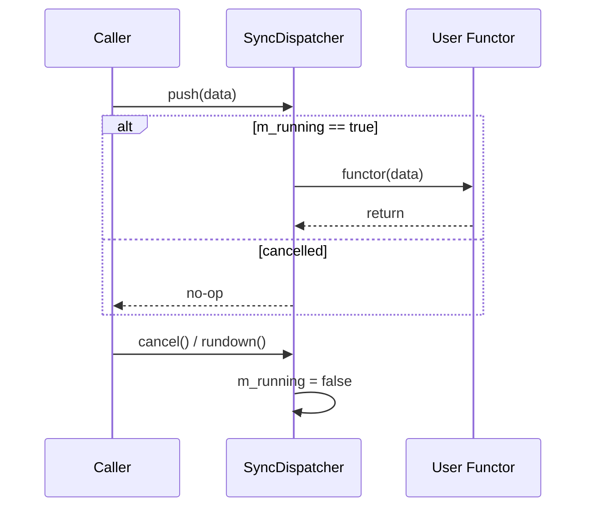
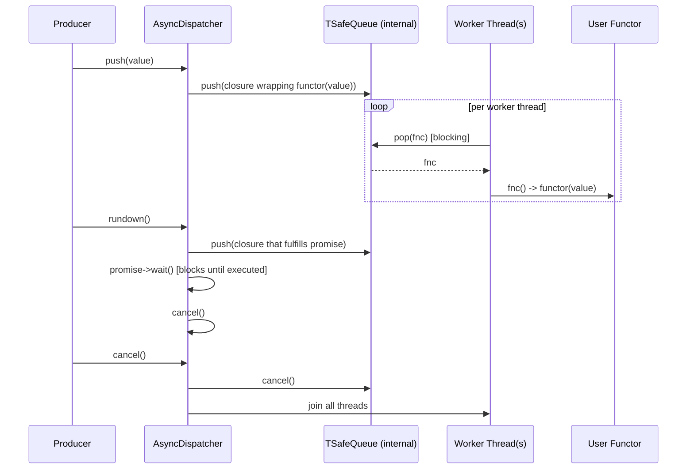
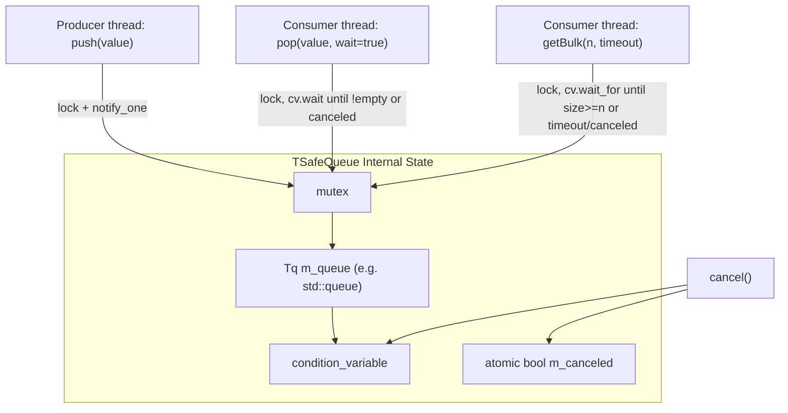
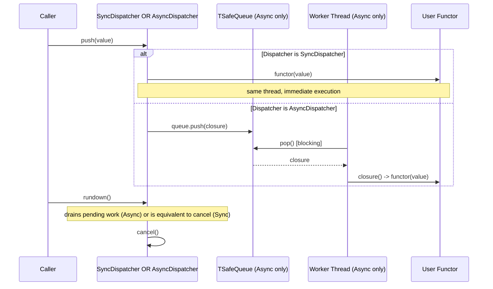

# Threading & Dispatch Queues — Core

## Introduction

**Threading & Dispatch Queues — Core** is the foundational sub-module of the [Threading & Dispatch Queues](threading_dispatch_queues.md) module, itself part of the broader **Shared Modules Infrastructure (C++)** utilities layer (`shared_utils`). It provides the two most basic — yet most widely used — concurrency primitives in the Wazuh C++ codebase:

- **`SyncDispatcher`** — a synchronous, same-thread "dispatcher" that simply invokes a functor immediately when a value is pushed.
- **`TSafeQueue`** — a generic, mutex/condition-variable-protected thread-safe queue supporting blocking/non-blocking pop, bulk retrieval, and cancellation.

These two components are deliberately minimal and header-only (no `.cpp` translation unit), so they can be freely templated and inlined into any consumer without adding link-time dependencies. They form the base layer on top of which the sibling sub-modules build richer behavior:

- [threading_dispatch_queues_advanced](threading_dispatch_queues_advanced.md) — `MsgDispatcher`, `FilterMsgDispatcher`, `TThreadEventDispatcher`, `TSafeMultiQueue` (key-based routing, filtering, persistence).
- [threading_dispatch_queues_pipeline](threading_dispatch_queues_pipeline.md) — `ReadNode`, `ReadWriteNode`, `IPipelineWriter`/`connect` (multi-stage pipelines).

> Note: The file `threadDispatcher.h` also defines `AsyncDispatcher`, the asynchronous counterpart to `SyncDispatcher`. It is described here for completeness since it lives in the same header, is `SyncDispatcher`'s direct architectural sibling, and depends directly on `TSafeQueue` — the other component documented on this page.

## Purpose

The core layer exists to answer a single question that recurs throughout the codebase: *"How do I push a unit of work to be processed, without the caller having to know or care whether that processing happens synchronously (same call stack) or asynchronously (background thread pool)?"*

By exposing **`SyncDispatcher`** and **`AsyncDispatcher`** with an identical public interface (`push`, `rundown`, `cancel`, `cancelled`, `numberOfThreads`, `size`), higher-level components can be written once, parameterized on the dispatcher type, and instantiated either way depending on runtime configuration or unit-test needs (synchronous dispatch is trivial to reason about and assert on in tests, while asynchronous dispatch is used in production for concurrency).

**`TSafeQueue`** exists to provide the safe hand-off mechanism `AsyncDispatcher` (and other components, such as `TThreadEventDispatcher` in the advanced layer) need between producer and consumer threads, including advanced features like bulk dequeue with timeout, which is useful for batch-oriented consumers.

## Architecture

```mermaid
classDiagram
    class SyncDispatcher~Input, Functor~ {
        -Functor m_functor
        -bool m_running
        +push(data)
        +rundown()
        +cancel()
        +cancelled() bool
        +size() size_t
        +numberOfThreads() unsigned int
    }

    class AsyncDispatcher~Type, Functor~ {
        -Functor m_functor
        -SafeQueue~function~void()~~ m_queue
        -vector~thread~ m_threads
        -atomic_bool m_running
        -unsigned int m_numberOfThreads
        -size_t m_maxQueueSize
        +push(value)
        +rundown()
        +cancel()
        +cancelled() bool
        +size() size_t
        +numberOfThreads() unsigned int
        -dispatch()
        -joinThreads()
    }

    class TSafeQueue~T, U, Tq~ {
        -mutex m_mutex
        -condition_variable m_cv
        -Tq m_queue
        -atomic~bool~ m_canceled
        +push(value)
        +pop(value, wait) bool
        +pop(wait) shared_ptr~U~
        +getBulk(elementsQuantity, timeout) queue~U~
        +popBulk(elementsQuantity)
        +empty() bool
        +size() size_t
        +cancel()
        +cancelled() bool
    }

    AsyncDispatcher --> TSafeQueue : owns (SafeQueue alias)
    AsyncDispatcher ..> "std::thread" : spawns pool
    SyncDispatcher ..> Functor : invokes directly (no queue)
```

### File-to-component map

| File | Components | Responsibility |
|------|------------|-----------------|
| `threadDispatcher.h` | `SyncDispatcher`, `AsyncDispatcher` | Uniform `push`/`rundown`/`cancel` execution-engine interface, sync (same-thread) vs. async (thread-pool + internal queue) |
| `threadSafeQueue.h` | `TSafeQueue` (aliased as `SafeQueue<T, Tq>` when `T == U`) | Generic, cancellable, thread-safe FIFO container with blocking/non-blocking/bulk pop |

## Component Details

### `SyncDispatcher<Input, Functor>`

The simplest possible dispatcher. It stores a copy of the user-supplied `Functor` and a `bool m_running` flag. `push(data)` calls `m_functor(data)` **synchronously, on the caller's thread**, provided the dispatcher hasn't been cancelled. There is no internal queue, no worker thread, and `size()` always returns `0` and `numberOfThreads()` always returns `0`, since no concurrency is actually employed.

Key characteristics:

- **Two constructors**: one that mimics the `AsyncDispatcher` signature (accepting — and ignoring — `numberOfThreads` and `maxQueueSize` parameters) so that `SyncDispatcher` and `AsyncDispatcher` can be used **interchangeably as template parameters** in higher-level generic code (e.g., `MsgDispatcher<Key, Value, SyncDispatcher>` vs. `MsgDispatcher<Key, Value, AsyncDispatcher>`), and a simpler single-argument constructor.
- **`rundown()`** is equivalent to `cancel()` since there is no pending queued work to drain — the call is already synchronous.
- **`cancel()`** simply flips `m_running` to `false`; subsequent `push()` calls become no-ops.
- Used heavily in **unit tests** (to make dispatch deterministic and avoid flaky multi-threaded assertions) and in any production scenario where introducing a background thread is undesirable (e.g., low-latency paths, or single-threaded daemons).



### `AsyncDispatcher<Type, Functor>`

The asynchronous counterpart. On construction it spawns `numberOfThreads` (defaulting to `std::thread::hardware_concurrency()`, minimum 1) worker threads, each running the private `dispatch()` loop. `push(value)` wraps the value in a `std::function<void()>` closure that calls `m_functor(value)`, and enqueues that closure into an internal `SafeQueue<std::function<void()>>` (a `TSafeQueue` specialization). Each worker thread continuously calls `m_queue.pop(fnc)` (blocking) and executes the retrieved closure.

Key characteristics:

- **Bounded queue support**: an optional `maxQueueSize` parameter (default `UNLIMITED_QUEUE_SIZE`) causes `push()` to silently drop new items once the queue is full, providing simple back-pressure/load-shedding.
- **`rundown()`**: pushes a special closure that fulfills a `PromiseFactory<PROMISE_TYPE>` promise (see [sync_primitives](sync_primitives.md)) and blocks the calling thread on `promise->wait()` until that closure has actually been dequeued and executed — i.e., all previously-queued work has drained — after which it calls `cancel()`. This provides a graceful, "finish what's already queued, then stop" shutdown semantic.
- **`cancel()`**: sets `m_running = false`, cancels the internal queue (unblocking any threads waiting in `pop()`), and joins all worker threads. This is the **immediate stop** semantic (pending un-processed items are discarded).
- **Exception safety**: the `dispatch()` loop catches and logs (`std::cerr`) any exception thrown by the functor, ensuring one failing task does not crash a worker thread or leave the thread pool with a permanently blocked/dead thread.
- The destructor calls `cancel()` automatically (RAII), so dispatchers clean up their thread pools even if the caller forgets to.



### `TSafeQueue<T, U, Tq>`

A generic thread-safe queue template parameterized on:

- `T` — the type pushed into the queue.
- `U` — the type returned when popping (usually the same as `T`; the distinction exists to allow, e.g., popping by value vs. by wrapped/converted type).
- `Tq` — the underlying container type (defaults to `std::queue<T>`), allowing specialized backing stores (e.g., a RocksDB-backed queue as used by `TThreadEventDispatcher` in the advanced layer) to be swapped in transparently as long as they expose a compatible `push`/`pop`/`empty`/`size` surface, including a `frontQueue()` method used by `getBulk()`.

A convenience alias, `SafeQueue<T, Tq> = TSafeQueue<T, T, Tq>`, is provided for the common case where the pushed and popped types are identical (this is the alias used internally by `AsyncDispatcher`).

Key operations:

| Method | Behavior |
|--------|----------|
| `push(value)` | Locks the mutex, pushes `value` if not cancelled, and notifies one waiting consumer via the condition variable. |
| `pop(value, wait=true)` | If `wait` is true, blocks until the queue is non-empty or cancelled; otherwise checks immediately. Returns `true` and moves the front element into `value` if available. |
| `pop(wait=true)` | Overload returning a `std::shared_ptr<U>` (or `nullptr` if empty/cancelled) instead of using an out-parameter. |
| `getBulk(elementsQuantity, timeout)` | Waits (with timeout, default 5s) until at least `elementsQuantity` items are available or the queue is cancelled, then returns up to that many items as a `std::queue<U>` via the container's `frontQueue()`. Used by consumers that prefer to process work in batches (e.g., bulk database writes). |
| `popBulk(elementsQuantity)` | Removes up to `elementsQuantity` items from the front of the queue without returning them (used after `getBulk` has already consumed the data by reference/copy, to advance the underlying persistent store). |
| `empty()` / `size()` | Simple, mutex-protected introspection. |
| `cancel()` | Sets `m_canceled = true` and notifies all waiting threads, causing any blocked `pop()`/`getBulk()` calls to return immediately with no data. |
| `cancelled()` | Read-only check of the cancellation flag. |



### Interaction Between `AsyncDispatcher` and `TSafeQueue`

`AsyncDispatcher` is the primary consumer of `TSafeQueue` within this file: it declares `SafeQueue<std::function<void()>> m_queue;` as a private member, meaning every enqueued unit of work is type-erased into a `std::function<void()>` closure before being stored. This design decouples the queue's storage type from the dispatcher's `Type` template parameter, at the (acceptable) cost of one heap allocation/indirection per `std::function` construction.

## Data Flow



## Usage in the Wider Codebase

Although this sub-module only documents two components directly, they underpin virtually every other threading/dispatch primitive in the codebase:

- **[threading_dispatch_queues_advanced](threading_dispatch_queues_advanced.md)**: `MsgDispatcher` and `FilterMsgDispatcher` are templated on a dispatcher type (`SyncDispatcher` or `AsyncDispatcher`) and delegate the actual concurrency decision to it. `TThreadEventDispatcher` and `TSafeMultiQueue` reuse the `TSafeQueue` template with a RocksDB-backed container type (see [rocksdb_wrapper](rocksdb_wrapper.md)) instead of the default `std::queue`, to persist messages across process restarts.
- **[threading_dispatch_queues_pipeline](threading_dispatch_queues_pipeline.md)**: `ReadNode` and `ReadWriteNode` each embed a dispatcher (sync or async) internally to process incoming pipeline data, again relying on the identical dispatcher interface established here.
- **Consumers across the codebase**: Daemons and services such as the FIM/Syscheck daemon ([syscheckd_core](syscheckd_core.md)), the shared Router module ([router_core](router_core.md), [router_pubsub](router_pubsub.md)), the Content Manager ([content_manager_orchestration](content_manager_orchestration.md)), and modules under `inventory_harvester_module` and `vulnerability_scanner_module` all use dispatchers (directly or via the advanced/pipeline layers) built on top of `SyncDispatcher`/`AsyncDispatcher`/`TSafeQueue` to process events concurrently and safely hand off work between threads.

## Key Design Characteristics

- **Uniform interface, swappable concurrency model**: `SyncDispatcher` and `AsyncDispatcher` are drop-in replacements for one another wherever a dispatcher template parameter is expected, which is extensively exploited by unit tests (using `SyncDispatcher` to make assertions deterministic) versus production code (using `AsyncDispatcher` for real concurrency).
- **RAII lifecycle**: Both dispatcher types clean up automatically in their destructors (`AsyncDispatcher::~AsyncDispatcher()` calls `cancel()`, joining all threads; `SyncDispatcher` requires no special cleanup since it holds no OS resources).
- **Graceful vs. immediate shutdown**: `rundown()` drains pending work before stopping (best-effort ordering guarantee); `cancel()` stops immediately, discarding anything still queued.
- **Generic, container-agnostic queue**: `TSafeQueue`'s templated container parameter (`Tq`) is what allows the advanced layer to substitute a persistent, disk-backed queue implementation without rewriting any of the thread-safety logic.
- **Exception isolation**: `AsyncDispatcher::dispatch()` catches exceptions per-task so that a single failing callback cannot terminate a worker thread or destabilize the pool.
- **Header-only**: No compiled `.cpp` unit; both files are pure templates, included wherever needed, which keeps the dependency footprint minimal for consumers.

## Relationship to Other Modules

- **[threading_dispatch_queues](threading_dispatch_queues.md)** — Parent module page; provides the overall architecture and links to the sibling advanced/pipeline sub-modules that build directly on the components documented here.
- **[threading_dispatch_queues_advanced](threading_dispatch_queues_advanced.md)** — `MsgDispatcher`, `FilterMsgDispatcher` wrap a core dispatcher (`SyncDispatcher`/`AsyncDispatcher`); `TThreadEventDispatcher`/`TSafeMultiQueue` reuse `TSafeQueue`'s template shape with a persistent backing container.
- **[threading_dispatch_queues_pipeline](threading_dispatch_queues_pipeline.md)** — `ReadNode`/`ReadWriteNode` embed a core dispatcher to drive pipeline stage execution.
- **[sync_primitives](sync_primitives.md)** — Supplies `PromiseFactory`/`IWait`, used internally by `AsyncDispatcher::rundown()` to block until the queue has drained.
- **[rocksdb_wrapper](rocksdb_wrapper.md)** — Supplies `RocksDBQueue`/`RocksDBQueueCF`, alternative backing containers that can be plugged into `TSafeQueue`'s `Tq` template parameter for persistence (used by the advanced layer, not directly by this core layer).
- **[design_patterns](design_patterns.md)** — Sibling utility sub-module containing conceptually related composability primitives (`Builder`, `Subject`/`Subscriber`) that are sometimes combined with these dispatch primitives in higher-level components.
- **[shared_utils](shared_utils.md)** — The umbrella parent module grouping all C++ shared utility sub-modules, including this one.
