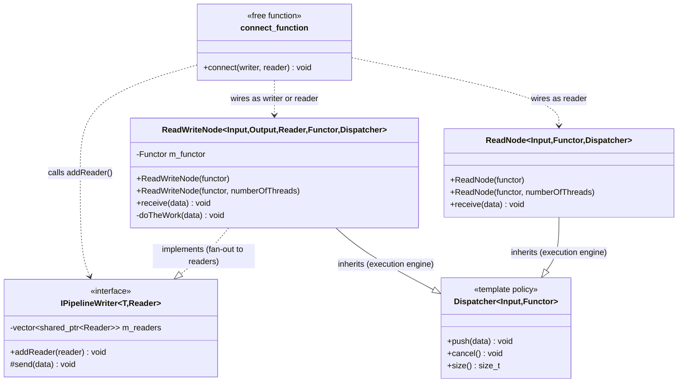
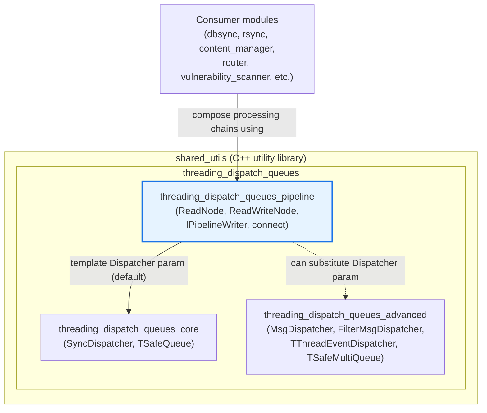
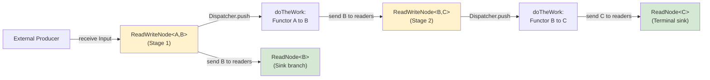
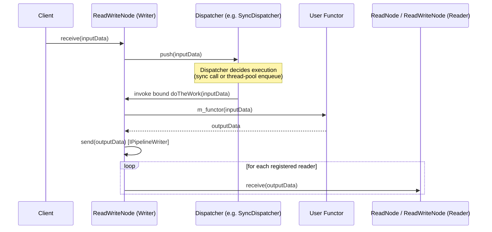
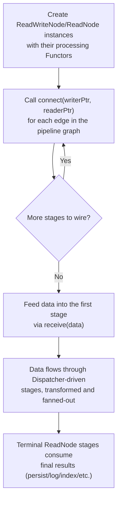
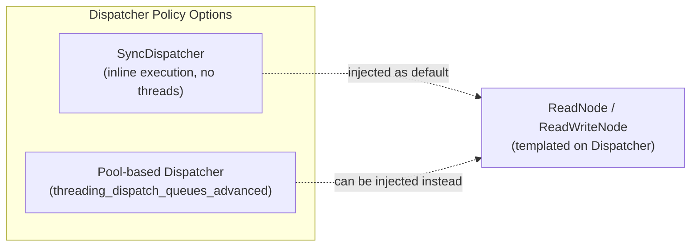

# Threading Dispatch Queues — Pipeline Module

## Introduction

The **Pipeline** module is a small but foundational C++ header-only library that lives inside Wazuh's shared utilities (`src/shared_modules/utils/`). It provides the generic building blocks needed to assemble **multi-stage, producer/consumer processing pipelines** on top of the thread-dispatch primitives defined in the sibling `threading_dispatch_queues_core` module.

Two header files make up the module:

| File | Purpose |
|------|---------|
| `pipelinePattern.h` | Defines the `IPipelineWriter` interface (the "fan-out" side of a pipeline stage) and the `connect()` helper used to wire stages together. |
| `pipelineNodesImp.h` | Defines the concrete pipeline node types — `ReadNode` (a pure sink/consumer) and `ReadWriteNode` (a transform stage that consumes input, processes it, and forwards results downstream). |

Together these components let developers compose a chain of asynchronous processing stages (each potentially backed by its own thread pool) without hand-writing thread management, queuing, or fan-out/broadcast logic for every new pipeline.

This module is part of the broader **Shared Modules Infrastructure (C++)** area of the codebase. It is one of three siblings under `threading_dispatch_queues`:

* `threading_dispatch_queues_core` — the low-level dispatcher (`SyncDispatcher`) and thread-safe queue (`TSafeQueue`) primitives.
* `threading_dispatch_queues_advanced` — higher-level dispatchers built on the core primitives: `MsgDispatcher`, `FilterMsgDispatcher`, `TThreadEventDispatcher`, `TSafeMultiQueue`.
* `threading_dispatch_queues_pipeline` (this module) — pipeline composition utilities that use a `Dispatcher` (by default `SyncDispatcher`, but any dispatcher-compatible type from the advanced module can be substituted) as the internal execution engine of each pipeline stage.

---

## Purpose and Core Functionality

The Pipeline module solves a recurring problem in Wazuh's C++ daemons and shared modules: **chaining several stages of data transformation/processing where each stage may run concurrently and independently**, while keeping the code:

- **Decoupled** — a stage does not need to know how many downstream consumers exist, or how they process data; it simply "sends" its output.
- **Composable** — stages of different types (`ReadNode`, `ReadWriteNode`) can be freely combined into arbitrarily long or branching (fan-out) chains.
- **Thread-model agnostic** — the actual concurrency strategy (synchronous, thread-pool based, etc.) is injected through a template `Dispatcher` policy parameter, defaulting to `SyncDispatcher` but interchangeable with the dispatchers from `threading_dispatch_queues_advanced`.

### Key Responsibilities

1. **`IPipelineWriter<T, Reader>`** (in `pipelinePattern.h`)
   - Maintains a list of downstream `Reader` shared pointers.
   - Exposes `addReader()` to register a downstream consumer.
   - Exposes a protected `send()` method used internally by writer-type nodes to broadcast a produced value of type `T` to **all** registered readers (fan-out/broadcast semantics).

2. **`connect(writer, reader)`** (in `pipelinePattern.h`)
   - A free helper function that performs compile-time-checked wiring between a writer node and a reader node, delegating to `IPipelineWriter::addReader`.
   - Provides null-safety (no-op if either pointer is null).

3. **`ReadNode<Input, Functor, Dispatcher>`** (in `pipelineNodesImp.h`)
   - A terminal (sink) pipeline stage. It only *receives* data (`receive()`), delegates the work to a user-supplied `Functor`, and executes that functor via the templated `Dispatcher` (thread pool or synchronous).
   - Does not produce further output — this is the terminal point of a pipeline branch (e.g., persisting to disk, logging, indexing).

4. **`ReadWriteNode<Input, Output, Reader, Functor, Dispatcher>`** (in `pipelineNodesImp.h`)
   - A middle-of-pipeline transform stage. It both **implements `IPipelineWriter<Output, Reader>`** (so it can have its own downstream readers) **and inherits from `Dispatcher`** (so incoming `Input` data is processed asynchronously/synchronously per the dispatcher policy).
   - When new input arrives via `receive()`, it is queued/dispatched to the `Dispatcher`, which eventually calls the internal `doTheWork()` method. This applies the user `Functor` to transform `Input` → `Output`, then calls `send()` (inherited from `IPipelineWriter`) to forward the `Output` to all connected downstream readers.

### Design Patterns Employed

- **Pipes-and-Filters / Pipeline architectural pattern** — each node is a filter; `connect()` builds the pipes.
- **Observer-like fan-out** — `IPipelineWriter::send()` mirrors a broadcast/observer notification to multiple subscribers (readers).
- **Policy-based design (Strategy pattern via templates)** — the `Dispatcher` template parameter allows swapping the concurrency strategy without touching node logic.
- **CRTP-adjacent binding** — `ReadWriteNode` binds its own `doTheWork` method as the `Dispatcher`'s functor via `std::bind`, effectively acting as both the data source into the dispatcher and the sink that receives dispatched callbacks.

---

## Architecture

### Component Relationships



### Module Position in the Overall System



> The pipeline module does not itself depend on any specific higher-level daemon; instead, higher-level shared modules (documented separately, see `dbsync.md`, `rsync.md`, `content_manager.md`, `router.md`) are expected to leverage this pattern when they need multi-stage asynchronous processing chains. See also the sibling documentation for the underlying dispatch primitives: `threading_dispatch_queues_core.md` and `threading_dispatch_queues_advanced.md`.

---

## Data Flow

The typical data flow through a pipeline built with this module follows a **push-based, fan-out chain**:



Key characteristics:

1. **Push model**: Producers call `receive(data)` on the first stage; there is no pull/backpressure mechanism built into the pattern itself — backpressure, if needed, is the responsibility of the chosen `Dispatcher` (e.g., a bounded `TSafeQueue`-backed dispatcher).
2. **Fan-out (broadcast) at each `ReadWriteNode`**: A single `ReadWriteNode` can have multiple registered readers; `send()` iterates the reader list and calls `receive()` on each, meaning the same transformed output is delivered to every connected downstream node.
3. **Per-stage concurrency**: Because each node embeds its own `Dispatcher` instance, different stages can have different concurrency levels (e.g., stage 1 single-threaded via `SyncDispatcher`, stage 2 multi-threaded via a pool-based dispatcher from `threading_dispatch_queues_advanced`).
4. **Termination**: `ReadNode` instances act as pipeline sinks — they consume data via their functor but produce no further output, ending a branch of the pipeline graph.

---

## Component Interaction — Sequence Diagram



---

## Building and Wiring a Pipeline — Process Flow



Typical usage pattern (conceptual, illustrating the API surface documented above):

```cpp
using namespace Utils;

// Stage 2: terminal sink
auto sink = std::make_shared<ReadNode<std::string>>(
    [](const std::string& s) { /* persist or log s */ });

// Stage 1: transform int -> string, fans out to `sink`
auto transformer = std::make_shared<
    ReadWriteNode<int, std::string, ReadNode<std::string>>>(
        [](const int& value) { return std::to_string(value); });

connect(transformer, sink);

// Feed data into the pipeline
transformer->receive(42);
```

---

## Relationship to the `Dispatcher` Template Parameter

Both `ReadNode` and `ReadWriteNode` are parameterized by a `Dispatcher` template template-parameter (default `SyncDispatcher`, defined in `threading_dispatch_queues_core`). This design allows:

- **Zero-overhead synchronous pipelines** for simple/low-volume use cases (`SyncDispatcher` executes the functor inline, no threads involved).
- **Thread-pool backed pipelines** by substituting a dispatcher such as those documented in `threading_dispatch_queues_advanced.md` (e.g., a pool dispatcher with bounded/unbounded `TSafeQueue` from `threading_dispatch_queues_core.md`) — enabling true parallel processing per pipeline stage without any change to `ReadNode`/`ReadWriteNode` code.



### Reference: default `Dispatcher` (`SyncDispatcher`) contract

`SyncDispatcher` (from `threading_dispatch_queues_core`) is the default policy used by both `ReadNode` and `ReadWriteNode`. It exposes the minimal contract expected of any `Dispatcher` policy:

| Method | Behavior in `SyncDispatcher` |
|--------|-------------------------------|
| `push(const Input&)` | Immediately/synchronously invokes the bound functor with the given data (no queuing, no threads). |
| `size()` | Returns `0` (no internal queue). |
| `cancel()` / `rundown()` | Marks the dispatcher as not running; subsequent `push()` calls become no-ops. |
| `cancelled()` | Returns whether the dispatcher has been cancelled. |
| `numberOfThreads()` | Returns `0`, reflecting that `SyncDispatcher` does not own any threads. |

Alternative dispatchers (e.g., pool-based ones built on `TSafeQueue`, documented in `threading_dispatch_queues_core.md` and `threading_dispatch_queues_advanced.md`) implement the same `push`/`cancel`/`size` contract but back it with a real thread pool and an internal thread-safe queue, enabling asynchronous, parallel execution of pipeline stage functors.

---

## Summary of Public API

| Component | Type | Key Methods |
|-----------|------|--------------|
| `Utils::IPipelineWriter<T, Reader>` | Class template (base) | `addReader(shared_ptr<Reader>&)`, protected `send(const T&)` |
| `Utils::connect<Writer, Reader>` | Free function template | `connect(shared_ptr<Writer>, shared_ptr<Reader>)` |
| `Utils::ReadNode<Input, Functor, Dispatcher>` | Class template | Constructors `(Functor)`, `(Functor, numberOfThreads)`; `receive(const Input&)` |
| `Utils::ReadWriteNode<Input, Output, Reader, Functor, Dispatcher>` | Class template | Constructors `(Functor)`, `(Functor, numberOfThreads)`; `receive(const Input&)`; private `doTheWork(const Input&)` |

All types live in the `Utils` namespace and are header-only (no separate `.cpp` compilation unit), making them trivially includable from any C++ module in the Wazuh codebase (agent, manager daemons, shared modules, engine, etc.).

---

## Related Documentation

- `threading_dispatch_queues_core.md` — `SyncDispatcher` and `TSafeQueue`, the default execution engine and queue primitive used by pipeline nodes.
- `threading_dispatch_queues_advanced.md` — `MsgDispatcher`, `FilterMsgDispatcher`, `TThreadEventDispatcher`, `TSafeMultiQueue`; alternative/richer dispatcher policies that can be plugged into `ReadNode`/`ReadWriteNode`.
- `design_patterns.md` — Other generic design-pattern utilities in `shared_utils` (`Builder`, `Observer`, `Subscriber`, `Provider`, `RoundRobinSelector`) that complement the pipeline pattern.
- `dbsync.md`, `rsync.md`, `content_manager.md`, `router.md` — Higher-level Shared Modules Infrastructure components that represent typical consumers of asynchronous multi-stage processing patterns like this one.
