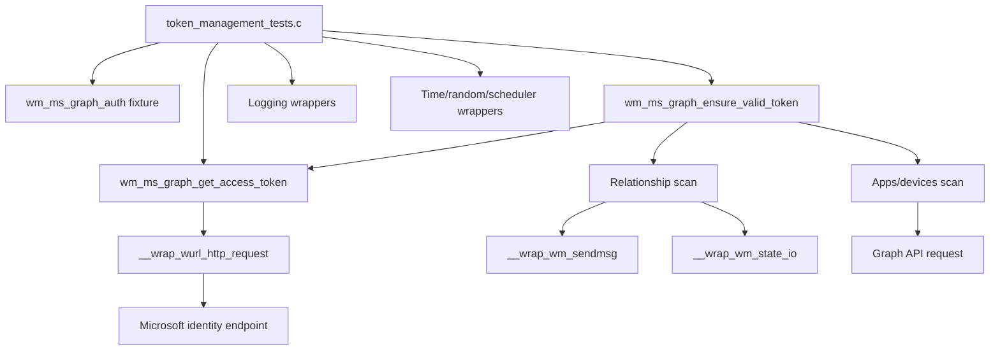
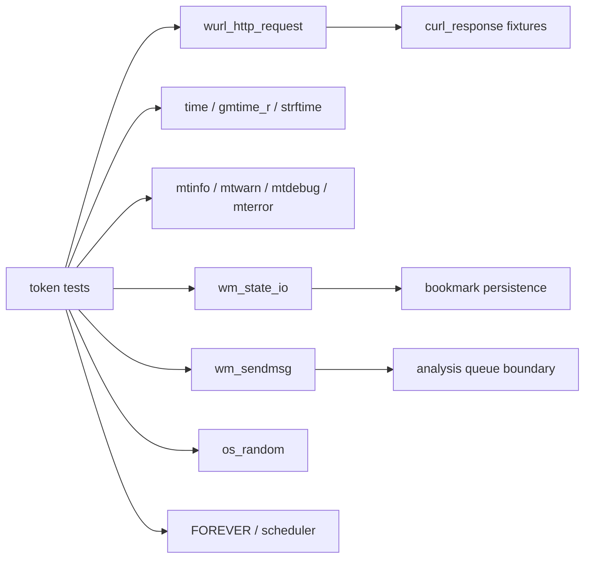
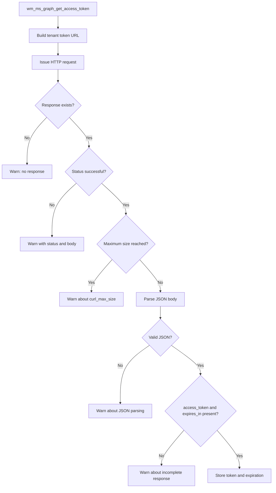
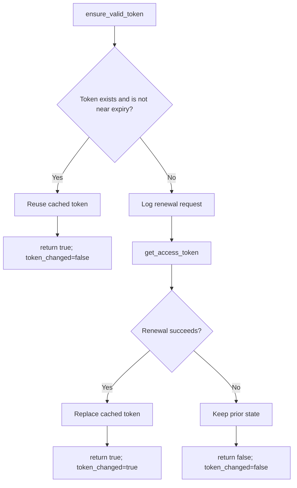
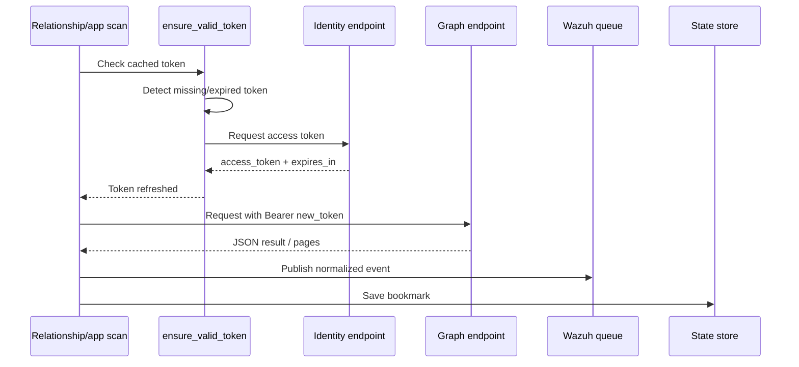
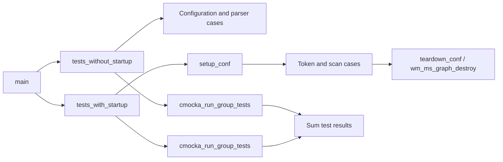

# Token Management Tests

## Introduction

`token_management_tests` documents the CMocka tests that validate Microsoft Graph access-token acquisition, validation, renewal, and propagation through the Wazuh Microsoft Graph module. The tests isolate HTTP, time, logging, state, and message-queue boundaries so token behavior can be verified deterministically without contacting Microsoft Graph.

The broader module and its configuration, relationship scanning, pagination, and queue behavior are covered by the [Microsoft Graph module documentation](wazuh_modules_core_cloud_integrations_ms_graph.md) and the [Microsoft Graph test infrastructure documentation](wm_ms_graph_tests_test_infrastructure.md). This page focuses on the token-specific subset of `test_wm_ms_graph.c`.

## Source and scope

| Item | Location / role |
|---|---|
| Test source | `src/unit_tests/wazuh_modules/ms_graph/test_wm_ms_graph.c` |
| Implementation under test | `src/wazuh_modules/ms_graph/wm_ms_graph.c` |
| Test framework | CMocka (`cmocka_unit_test_setup_teardown`, `cmocka_run_group_tests`) |
| Primary state type | `wm_ms_graph_auth` |
| Token functions | `wm_ms_graph_get_access_token`, `wm_ms_graph_ensure_valid_token` |
| Main downstream consumers | Relationship scans and app/device scans |
| External protocol | Microsoft identity token endpoint and Microsoft Graph REST API |

The source file also contains configuration and relationship-scan tests. They are included here only where they demonstrate how a token is consumed or renewed.

## Purpose and architecture

The test module exercises the token subsystem at three levels:

1. Direct token acquisition: HTTP response handling, JSON parsing, expiration calculation, and error reporting.
2. Token validity policy: reuse a valid token, renew an expired or missing token, and preserve failure semantics.
3. Consumer integration: relationship and app/device scans must use the renewed bearer token or abort safely when renewal fails.



The implementation is included directly by the test translation unit. This exposes internal functions while replacing system and network dependencies with CMocka wrappers.

## Token data model and protocol contract

`wm_ms_graph_auth` stores both credentials and the mutable token cache:

| Field | Use in the tests |
|---|---|
| `client_id` | Client credential included in token-request setup |
| `tenant_id` | Builds the tenant-specific token URL |
| `secret_value` | Client secret included in token-request setup |
| `login_fqdn` | Identity endpoint base URL |
| `query_fqdn` | Graph API endpoint base URL |
| `access_token` | Cached bearer token; `NULL` represents no usable token |
| `token_expiration_time` | Absolute expiration used by validity checks |

The token response expected by the implementation is:

```json
{"access_token":"token_value","expires_in":123}
```

The tests verify the following endpoint and header shapes:

```text
https://login.microsoftonline.com/<tenant>/oauth2/v2.0/token
Authorization: Bearer <access_token>
```

On successful acquisition, the implementation stores the returned token and computes its expiration. The test explicitly accounts for the platform-specific expiration representation: non-Windows builds compare against current time plus `expires_in`, while Windows compares the expected raw value used by that build.

## Dependency and mocking boundaries



The wrappers define observable behavior rather than testing transport implementations:

- `__wrap_wurl_http_request` returns `NULL` or crafted `curl_response` objects for status, body, headers, and maximum-size conditions.
- Logging wrappers assert exact severity and message text, making failure diagnostics part of the contract.
- Time wrappers and controlled timestamps make expiration and bookmark behavior repeatable.
- State and queue wrappers verify that successful scans persist progress and publish logs without requiring daemon sockets.
- Random and scheduler wrappers prevent nondeterministic scan IDs, delays, or infinite loops.

## Test inventory

### Access-token acquisition

| Test | Scenario | Expected result |
|---|---|---|
| `test_wm_ms_graph_get_access_token_no_response` | HTTP helper returns `NULL` | Warning is logged; token remains unset |
| `test_wm_ms_graph_get_access_token_unsuccessful_status_code` | HTTP status `400` with error body | Warning includes status/body; token remains unset |
| `test_wm_ms_graph_get_access_token_curl_max_size` | Response reaches configured maximum size | Warning recommends increasing `curl_max_size`; token remains unset |
| `test_wm_ms_graph_get_access_token_parse_json_fail` | Successful HTTP status with invalid JSON | Parse warning; token remains unset |
| `test_wm_ms_graph_get_access_token_no_access_token` | JSON lacks `access_token` | Incomplete-response warning; no usable token is produced |
| `test_wm_ms_graph_get_access_token_no_expire_time` | JSON lacks `expires_in` | Incomplete-response warning; no usable token is produced |
| `test_wm_ms_graph_get_access_token_success` | Valid status and complete JSON | Token is stored and expiration is calculated |

### Validity and renewal

| Test | Scenario | Expected result |
|---|---|---|
| `test_wm_ms_graph_ensure_valid_token_token_valid` | Token expires well in the future | Returns true, reuses token, `token_changed == false` |
| `test_wm_ms_graph_ensure_valid_token_token_expired_and_renewed` | Existing token is expired | Requests a new token, returns true, replaces token, `token_changed == true` |
| `test_wm_ms_graph_ensure_valid_token_token_missing_and_renewed` | No cached token | Requests and stores a new token, reports a change |
| `test_wm_ms_graph_ensure_valid_token_token_renewal_failed` | Renewal request fails | Returns false, reports no token change, preserves the old token value |

### Consumer integration

| Test | Consumer behavior verified |
|---|---|
| `test_wm_ms_graph_scan_relationships_renew_token` | Relationship scan renews an expiring token and sends the subsequent Graph request with `Authorization: Bearer new_token` |
| `test_wm_ms_graph_scan_relationships_renew_token_failed` | Failed renewal logs the error and aborts the relationship scan |
| `test_wm_ms_graph_scan_apps_devices_renew_token` | App/device helper refreshes the caller-owned authorization header and returns results |
| `test_wm_ms_graph_scan_apps_devices_renew_token_failed` | Failed renewal returns an empty JSON result and logs an abort condition |
| `test_main_token` | Module startup reaches token acquisition through the normal module entry point |

## Access-token acquisition flow



All failure branches leave the authentication object without a newly usable token. The tests assert both the observable warning and the resulting state where applicable.

## Valid-token decision flow



The scan tests demonstrate that “near expiry” is treated as unusable for a request. In `test_wm_ms_graph_scan_relationships_renew_token`, the token expiration is set to `WM_MS_GRAPH_DEFAULT_TIMEOUT - 30` seconds from the current time, forcing renewal before the Graph request.

## Component interaction during a renewed scan



When token renewal fails, the interaction terminates before the Graph request. Relationship scans log an abort and app/device scans return an empty JSON result, allowing callers to handle the failure without dereferencing a missing token.

## Observable failure semantics

The tests establish these invariants:

- Transport failure, unsuccessful status, response truncation, and malformed JSON do not create a valid token.
- A response missing either required token field is rejected.
- A valid cached token is not unnecessarily replaced.
- A failed renewal does not falsely set `token_changed`.
- A relationship scan does not continue with an invalid credential.
- A successful renewal updates authorization headers before the next Graph request.
- Token-related logs identify the endpoint or scan context without exposing the client secret in the asserted messages.

## Test lifecycle and registration



The token tests are registered in `tests_with_startup`. Each uses `setup_conf` and `teardown_conf`; direct token tests allocate a minimal `wm_ms_graph_auth` configuration and return the fixture to the test teardown. The two CMocka groups run sequentially and their result codes are added before `main` returns.

## Maintenance and debugging guidance

When changing token behavior, update the tests at the narrowest relevant layer:

1. Change response parsing or expiration calculation: update the acquisition tests.
2. Change expiry thresholds or renewal decisions: update the `ensure_valid_token` tests and at least one scan integration test.
3. Change authorization-header ownership or formatting: update both relationship and app/device renewal tests.
4. Change failure logging: update the exact wrapper expectations together with the behavior assertion.
5. Change persistence or queue behavior: use the broader Microsoft Graph scan tests rather than duplicating those checks here.

Run the repository’s CMocka target for `test_wm_ms_graph.c` (or the Wazuh Modules unit-test target) to execute this module. The tests are intentionally deterministic; unexpected network access, wall-clock dependence, or daemon-socket access indicates a missing wrapper or fixture.

## Related documentation

- [Microsoft Graph module](wazuh_modules_core_cloud_integrations_ms_graph.md) — production module behavior and configuration.
- [Microsoft Graph test infrastructure](wm_ms_graph_tests_test_infrastructure.md) — shared fixtures and test harness details.
- [Wazuh Modules Daemon](Wazuh_Modules_Daemon_(C).md) — module lifecycle and daemon integration context.
- [Shared Modules Infrastructure](Shared_Modules_Infrastructure_(C++).md) — shared queue, logging, and utility concepts used by module tests.
