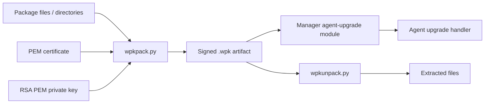
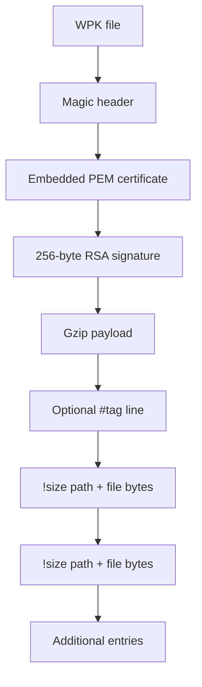
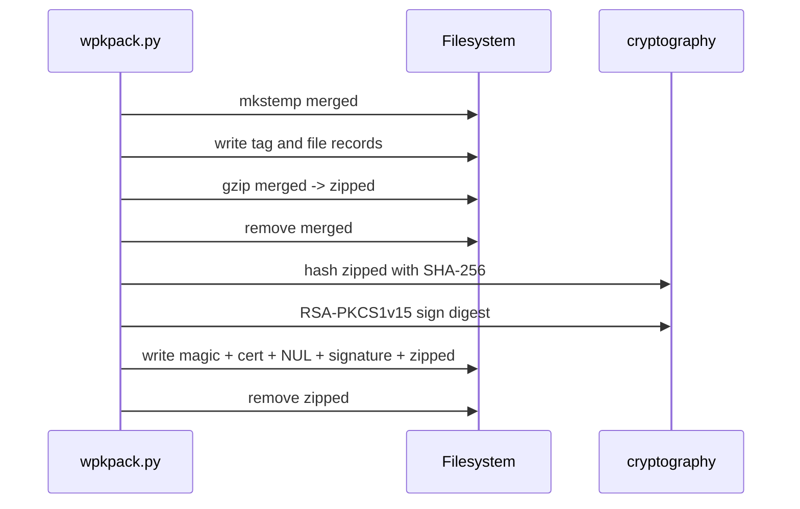
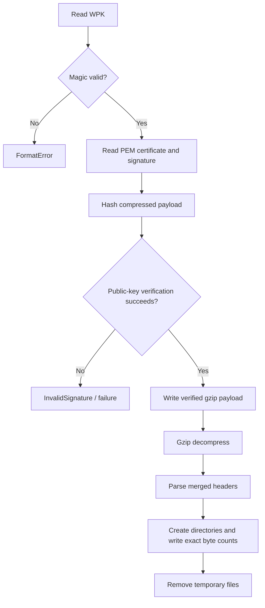
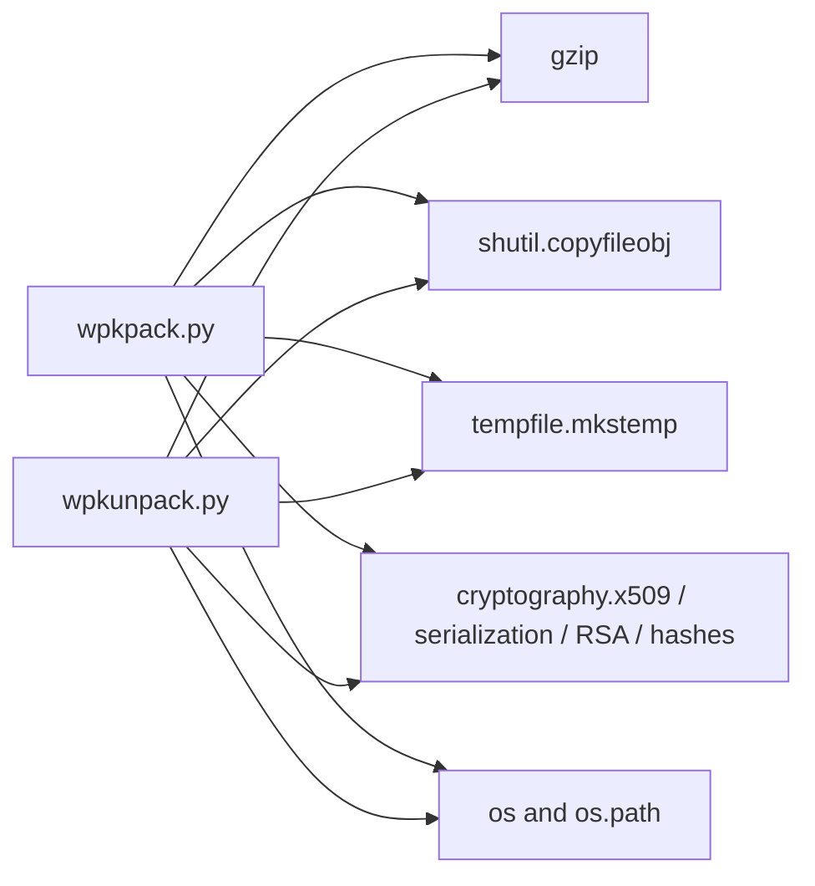

# tools_agent_upgrade

`tools_agent_upgrade` contains the Python utilities that build and unpack Wazuh agent-upgrade packages (`.wpk`). The builder assembles a tagged file stream, gzip-compresses it, and signs the compressed bytes with an RSA private key. The unpacker reverses those stages, validating the embedded certificate signature before extracting the original files.

This page documents the artifact format and local tool behavior. The manager-side upgrade workflow, task persistence, and agent command protocol are documented separately in [agent_upgrade_module.md](agent_upgrade_module.md), [agent_upgrade_tasks.md](agent_upgrade_tasks.md), and [agent_upgrade_commands.md](agent_upgrade_commands.md).

## Scope and role in the system

The tools are packaging and inspection primitives, not the upgrade scheduler. A typical production path is:

1. A release or build process uses `wpkpack.py` to create a signed WPK.
2. The manager-side agent-upgrade module validates and transfers the package to an agent.
3. The agent-side upgrade handler receives package commands and installs the content.
4. `wpkunpack.py` can verify and extract a package for inspection, testing, or installation tooling.



See [Wmodules_Config_agent_upgrade.md](Wmodules_Config_agent_upgrade.md) for package repository and manager configuration, and [agent_upgrade_upgrades.md](agent_upgrade_upgrades.md) for transfer and upgrade orchestration.

## Source layout

| File | Responsibility | Main components |
| --- | --- | --- |
| `tools/agent-upgrade/wpkpack.py` | Build a WPK from files/directories | `mergecreate`, `mergeappend`, `compress`, `sign` |
| `tools/agent-upgrade/wpkunpack.py` | Verify and extract a WPK | `unsign`, `uncompress`, `unmerge` |

The supplied core components omit the private helper `_mergeappend` and the unpacker’s `uncompress`, but both are part of the active pipeline and are described below because the public functions depend on them.

## WPK format

A WPK is not simply a gzip file. Its outer format is:

```text
WPK256\0
<PEM certificate bytes, terminated by NUL>
<RSA signature, 256 bytes>
<gzip-compressed merged payload>
```

The signature is calculated over the gzip-compressed payload, not over the merged text stream or the individual source files. The implementation uses SHA-256, RSA PKCS#1 v1.5 padding, and a fixed 2048-bit signature length during unpacking.

The certificate is carried inside the package so the verifier can obtain the public key from the artifact. Trust policy is therefore supplied by the certificate/key relationship used by the caller; `wpkunpack.py` verifies cryptographic consistency but does not implement a certificate-chain or issuer trust store.

### Merged payload format

The uncompressed payload is a line-oriented stream:

```text
<optional package tag line: #<tag>\n>
!<byte-count> <source-path>\n
<exactly byte-count bytes from source>
!<byte-count> <next-source-path>\n
<exactly byte-count bytes from next source>
```

`mergecreate(path, tag)` creates the stream and writes `#<tag>` when a tag is provided. `mergeappend()` recursively walks directories and writes one `!size path` header plus raw bytes for every regular file. Directory traversal uses `listdir()` order and does not encode permissions, timestamps, symlinks, or empty directories.



## Packaging workflow (`wpkpack.py`)

### `mergecreate(path, tag=None)`

Creates or truncates the intermediate merged file in text mode. If `tag` is truthy, it writes a single comment-like line in the form `#<tag>` followed by a newline. The builder invokes it with the package name passed on the command line.

### `mergeappend(merged, sources)` and `_mergeappend`

Appends each source to the merged stream in binary mode.

- Regular files are read in binary mode.
- The header records the file size obtained with `seek()`/`tell()`.
- File content is copied without transformation.
- Directories are traversed recursively.
- Missing paths or unsupported filesystem objects raise a generic `Exception`.

Because extraction trusts the recorded size to delimit each entry, the size header is part of the package’s structural integrity. A malformed or truncated stream can cause extraction to fail or produce incomplete output.

### `compress(source, target)`

Reads the merged stream and writes a gzip member to the target temporary file using `shutil.copyfileobj`. No explicit compression level or metadata policy is configured; the standard library defaults apply.

### `sign(source_path, target_path, cert_path, priv_path)`

The function:

1. Loads an unencrypted PEM private key.
2. Hashes the compressed source in 4096-byte chunks with SHA-256.
3. Signs the resulting digest using RSA PKCS#1 v1.5 with `Prehashed(SHA256)`.
4. Writes the magic value, certificate bytes, NUL separator, signature, and compressed source into the final target.

The CLI creates temporary files with `mkstemp()`, closes their descriptors, removes the merged stream after compression, and removes the compressed temporary file in a `finally` block after signing. If assembly fails, the intermediate merged file is removed before the exception is re-raised.

### CLI contract

The script expects at least four arguments after the executable, although its usage string describes the effective form as:

```text
wpkpack.py <pack> <cert> <key> <content> [<content> ...]
```

Here `pack` is the output WPK, `cert` is the PEM certificate embedded in the package, `key` is the PEM private key, and the remaining arguments are source files or directories. The argument-count check is slightly permissive (`len(argv) < 4`), while the implementation accesses `argv[4:]`; callers should provide at least one content path.



## Verification and extraction workflow (`wpkunpack.py`)

### `unsign(source, target)`

`unsign()` opens the package and performs these checks:

1. The first seven bytes must equal `WPK256\0`; otherwise it raises `FormatError`.
2. It reads certificate bytes until a NUL byte and parses them as a PEM X.509 certificate.
3. It reads exactly 256 signature bytes; a short signature raises `FormatError`.
4. It hashes the remaining bytes in 4096-byte chunks with SHA-256.
5. It verifies the signature with the certificate public key using RSA PKCS#1 v1.5 and `Prehashed(SHA256)`.
6. It copies the verified compressed payload to `target`.

An invalid signature propagates `cryptography.exceptions.InvalidSignature`. The current CLI initializes `force = False`, so its warning-and-retry branch is not reachable through the shown command-line path.

### `uncompress(source, target)`

The verified payload is decompressed as gzip into a second temporary file. Decompression occurs only after signature verification succeeds.

### `unmerge(source, target)`

The extractor scans the merged stream line by line. Lines that do not begin with `!` are skipped, which allows the optional `#tag` line to remain non-operational. For each file record it:

- Splits the header into a decimal byte count and source path.
- Builds the output path beneath the requested target using the recorded path.
- Creates parent directories, tolerating `EEXIST`.
- Copies exactly the declared number of bytes in chunks no larger than 4096 bytes.

The extractor preserves file contents and relative path text, but does not restore file metadata. Implementations that expose extraction to untrusted packages should additionally constrain or sanitize recorded paths; the shown code does not explicitly reject traversal components or special path forms.

### CLI contract and cleanup

The unpacker expects:

```text
wpkunpack.py <wpk> <dest>
```

It creates temporary files for the verified compressed payload and merged payload. The first is removed after decompression; the second is removed in a `finally` block after extraction. Structural, certificate, decompression, filesystem, and signature errors generally propagate to the caller after temporary cleanup.



## Component relationships and dependencies



The tools rely on Python’s standard-library filesystem, temporary-file, gzip, and stream-copy APIs, plus the `cryptography` package for key loading, certificate parsing, hashing, and signature operations. They do not call Wazuh sockets, `wazuh-db`, the REST API, or the task manager directly.

## Operational and security considerations

- Keep the private key outside the package repository and protect its filesystem permissions. `load_pem_private_key()` is called with `password=None`, so encrypted private keys are not accepted by this implementation.
- The signed bytes are the compressed bytes. Any change to gzip output, certificate/signature fields, or payload content changes the artifact; only the payload is covered by the signature, while the magic/certificate/signature framing is structurally parsed.
- The verifier uses the public key embedded in the package certificate. Deployment trust decisions must be enforced by the surrounding agent-upgrade implementation and certificate configuration; see [agent_upgrade_validate.md](agent_upgrade_validate.md) and [os_crypto.md](os_crypto.md).
- The fixed `SIGLEN = 2048 // 8` makes the unpacker specific to 2048-bit RSA signatures. Packages signed with a different RSA modulus size are incompatible without code changes.
- Temporary artifacts are removed on normal error paths, but callers should still use controlled working directories and monitor interrupted processes.
- Extraction path handling deserves particular care for untrusted WPK files because the recorded source path is incorporated into the destination path without an explicit traversal check.
- The package format omits permissions, ownership, timestamps, symlinks, and empty directories. Installers must apply any required metadata separately.

## Testing and maintenance guide

Changes to these tools should be tested across the complete round trip:

```text
source tree -> merge -> gzip -> sign -> unsign -> gunzip -> unmerge -> compare files
```

Important cases include empty files, nested directories, binary content, malformed magic, missing certificate terminator, short signatures, invalid signatures, truncated payloads, gzip failures, duplicate directories, and unsafe recorded paths.

The native agent-upgrade tests cover the consumer-side package validation and transfer behavior rather than these Python utilities directly. Start with [Unit_Tests_-_Agent_Upgrade_Module.md](Unit_Tests_-_Agent_Upgrade_Module.md), then follow the focused pages [agent_upgrade_validate.md](agent_upgrade_validate.md), [agent_upgrade_upgrades.md](agent_upgrade_upgrades.md), and [send_wpk_to_agent_tests.md](send_wpk_to_agent_tests.md). The WPK signing/un-signing boundary is also referenced from [os_crypto.md](os_crypto.md).

## Related documentation

- [agent_upgrade_module.md](agent_upgrade_module.md) — end-to-end agent-upgrade architecture and lifecycle.
- [agent_upgrade_validate.md](agent_upgrade_validate.md) — manager-side validation of agent, platform, version, WPK, and integrity conditions.
- [agent_upgrade_upgrades.md](agent_upgrade_upgrades.md) — package transfer and upgrade sequencing.
- [agent_upgrade_commands.md](agent_upgrade_commands.md) — command parsing and agent-side command contracts.
- [agent_upgrade_tasks.md](agent_upgrade_tasks.md) — asynchronous upgrade task storage and cluster/task-manager interaction.
- [Wmodules_Config_agent_upgrade.md](Wmodules_Config_agent_upgrade.md) — agent-upgrade module configuration.
- [os_crypto.md](os_crypto.md) — cryptographic package verification boundary used by the native implementation.
