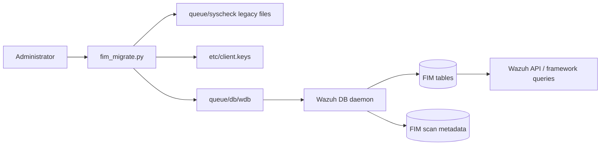
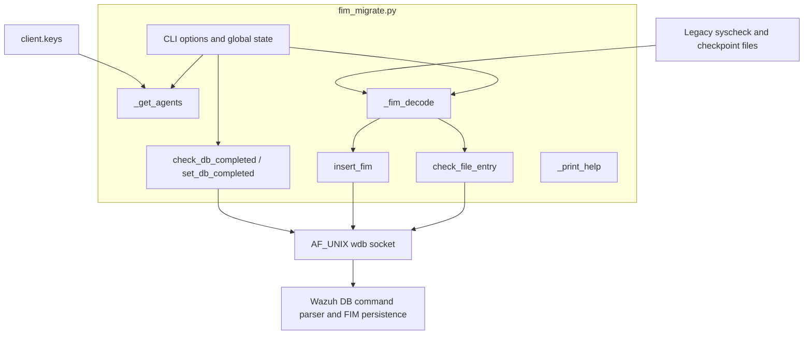
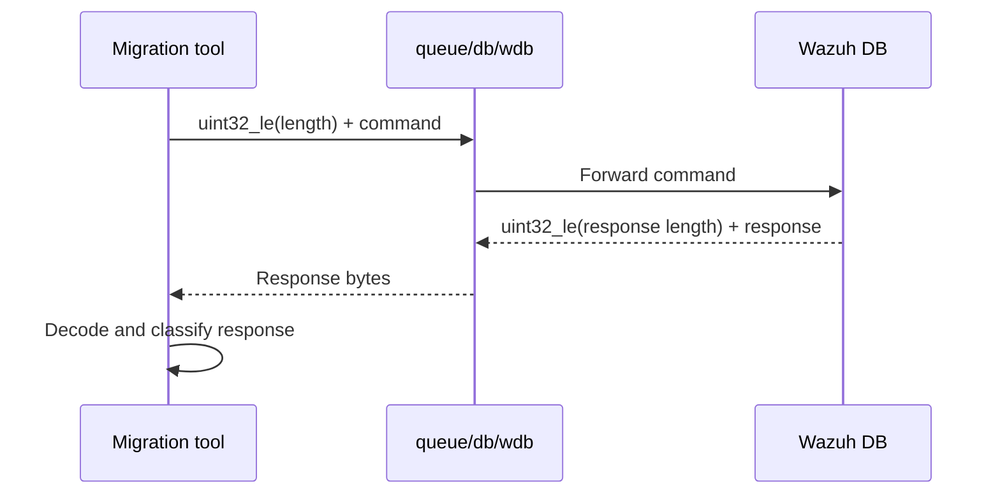
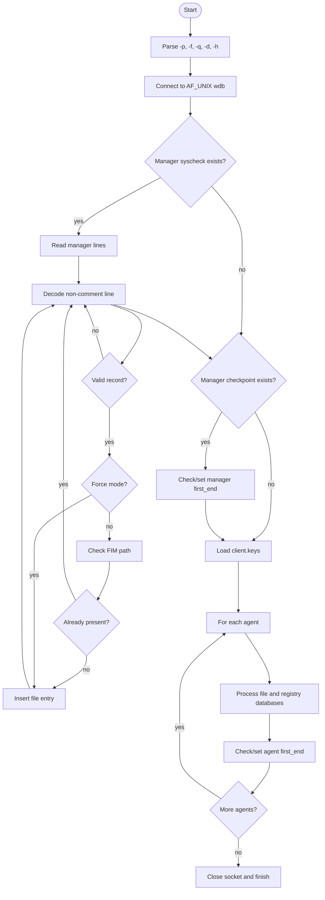

# `tools_migration`

`tools_migration` contains the legacy FIM database migration utility in `tools/migration/fim_migrate.py`. It converts manager and agent `syscheck` flat-file records into the current Wazuh DB FIM tables through the Unix-domain Wazuh DB socket. The tool supports manager and agent file entries, Windows registry entries, duplicate avoidance, forced insertion, and migration of the scan-completed marker.

The utility is an offline/administrative command-line tool: it does not run FIM scans and does not own the database schema. Database persistence and query semantics are provided by Wazuh DB; see [wazuh_db_engine.md](wazuh_db_engine.md) and the related FIM documentation for those implementation details.

## Position in the system



The migration tool sits below the API and framework layers. It reads files produced by the legacy syscheck implementation, then uses the same length-prefixed request channel used by Wazuh DB clients. It does not directly open SQLite files.

## Architecture



### Components

| Component | Responsibility |
|---|---|
| `_get_agents()` | Reads `etc/client.keys`, skips comments, disabled agents, malformed records, and non-numeric IDs, and returns `[id, name, ip]` entries. |
| `_fim_decode(fline)` | Parses one binary line from a legacy syscheck file into `(FIM data, timestamp, path)`. Invalid lines are logged and skipped by the caller. |
| `check_file_entry(agent, cfile, wdb_socket)` | Sends a SQL count query for an existing FIM file path. Used for idempotency unless `-f` is selected. |
| `insert_fim(agent, fim_array, stype, wdb_socket)` | Sends a `syscheck save` command for either `file` or `registry` data and returns `(success, response)`. |
| `check_db_completed(agent, wdb_socket)` | Reads the existing `end_scan` value from FIM scan metadata. |
| `set_db_completed(agent, mtime, wdb_socket)` | Sets `first_end` to the checkpoint file modification time. |
| `_print_help()` | Prints command usage and options. |

## Input file model

The default installation root is `/var/ossec`; `-p` changes it. The tool derives these paths:

```text
<root>/queue/db/wdb                         Wazuh DB Unix socket
<root>/queue/syscheck/syscheck              Manager file FIM database
<root>/queue/syscheck/.syscheck.cpt         Manager checkpoint
<root>/queue/syscheck/(name) ip->syscheck   Agent file FIM database
<root>/queue/syscheck/(name) ip->syscheck-registry
<root>/queue/syscheck/.(name) ip->syscheck.cpt
<root>/etc/client.keys                       Agent inventory
```

The legacy record parser expects a line with a three-byte prefix and trailing newline. After stripping those boundaries, it expects two sections separated by ` !`: a FIM payload and a timestamp/path section separated by the first space. The payload is truncated at the first `!`, which removes the legacy invalid-content suffix described in the source.

## Wazuh DB protocol

Every request is encoded as a little-endian unsigned 32-bit length followed by an ASCII command. Responses use the same four-byte length prefix followed by a textual response. The socket is opened once and reused for manager and all agents.



Representative commands are:

```text
agent 000 sql select count(*) from fim_entry where file='<path>';
agent 000 syscheck save <file|registry> <fim>!0:<timestamp> <path>
agent 000 syscheck scan_info_get end_scan
agent 000 syscheck scan_info_update first_end <checkpoint_mtime>
```

Agent IDs are zero-padded to three digits in commands. `check_file_entry()` treats a successful count of zero as absent; a nonzero count is already present. A non-`ok` SQL response is treated as an existing entry, which prevents an insertion on that error path. `insert_fim()` reports success only when the response begins with `ok`.

## Migration flow



For each source database, the tool counts successful insertions and failures and emits progress every 10,000 successful entries. Missing agent databases produce warnings; missing checkpoint files are silently ignored because the corresponding migration marker cannot be inferred.

## Detailed processing rules

1. The manager database is processed first, using agent ID `0` and type `file`.
2. The manager checkpoint is then used to update `first_end`, unless the marker is already nonzero and force mode is disabled.
3. Agents are discovered from `client.keys`; their list order determines progress numbering.
4. Each agent’s file database is migrated with type `file`.
5. Each agent’s registry database is migrated with type `registry`.
6. The agent checkpoint is used to update its scan metadata.
7. The socket is closed after all agents have been processed.

By default, the tool is intended to be repeatable: it checks for an existing path before insertion. `-f` bypasses that check and sends every decoded record to Wazuh DB, so it should be used only when duplicate/replacement behavior is understood.

## Command-line interface

```text
python tools/migration/fim_migrate.py [-p <path>] [-f] [-q] [-d] [-h]
```

| Option | Effect |
|---|---|
| `-p <path>` | Changes the Wazuh installation root from `/var/ossec`. |
| `-f` | Forces insertion and bypasses the existing-path check; it also forces checkpoint updates. |
| `-q` | Suppresses informational progress output. Errors and warnings still use the logger. |
| `-d` | Enables debug logging, including socket commands and responses. |
| `-h` | Prints help and exits successfully. |

The program exits with status `1` for invalid options or failure to connect to the Wazuh DB socket. Per-record insertion failures are accumulated and logged; they do not immediately abort the complete migration. Malformed input records are logged and skipped.

## Error handling and operational considerations

- The target Wazuh DB daemon and socket must be available before starting.
- The process needs read access to `client.keys`, legacy syscheck files, and checkpoint files, plus permission to connect to the DB socket.
- Source files are opened in binary mode; comment lines beginning with `#` are skipped.
- The implementation expects complete four-byte headers and response bodies from the socket. It catches malformed/short response situations represented by `IndexError`, but callers should treat transport interruptions as migration failures.
- `TERM` is read directly from the environment during startup; minimal environments should provide it.
- Debug mode can expose database commands and paths in logs. Use it carefully because paths may contain sensitive host information.
- The code uses `logging.warn`, which is deprecated in modern Python versions but remains functionally equivalent to warning-level logging in supported runtimes.

## Relationship to other modules

The migration tool depends on the Wazuh DB command interface and the FIM schema, but it is independent of the live FIM scan engine. It prepares persisted data that can later be consumed through the normal framework/API modules.

- [wazuh_db_engine.md](wazuh_db_engine.md) — database lifecycle, SQL execution, transactions, and statement handling.
- [wazuh_db_command_parser.md](wazuh_db_command_parser.md) — command dispatch and textual request formats, where available.
- [syscheckd_db.md](syscheckd_db.md) — FIM database ownership and persistence, where available.
- [syscheckd_core_scan_engine.md](syscheckd_core_scan_engine.md) — live scanning behavior, which is outside this migration utility.

These links intentionally point to neighboring module documentation rather than duplicating database and FIM implementation details here.

## Maintenance guide

Changes to the legacy record format must be reflected in `_fim_decode()` and in the payload assembled by `insert_fim()`. Changes to Wazuh DB framing or command names require coordinated updates with the DB command parser and existing clients. When modifying migration behavior, test at least:

- manager-only migration;
- an agent with file and registry databases;
- malformed and comment records;
- an already-present path with and without `-f`;
- missing checkpoint files;
- a nonzero existing `end_scan` marker;
- partial/error responses from the Wazuh DB socket.

