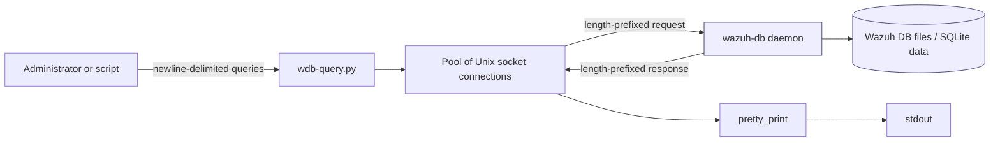
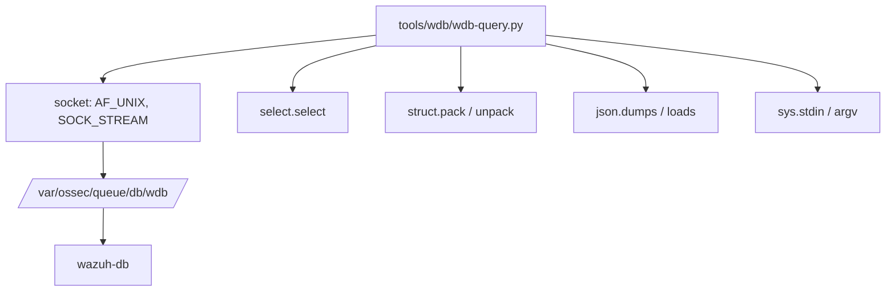
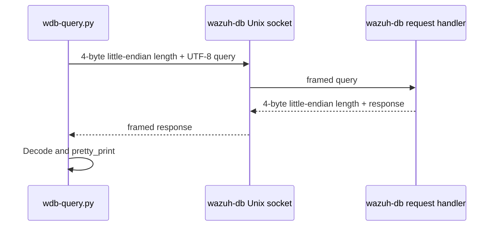
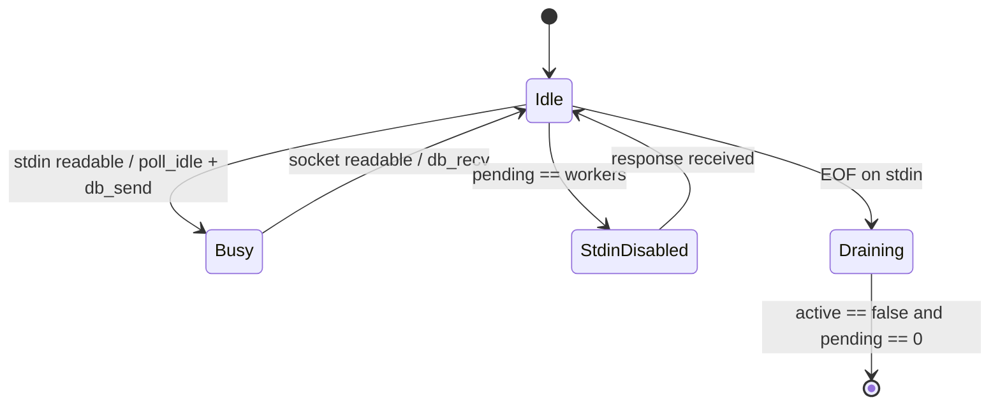
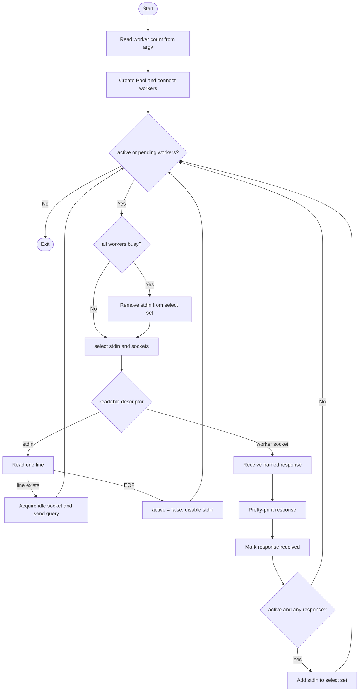

# `tools_wdb`

`tools/wdb/wdb-query.py` is a small command-line client for sending textual queries to the Wazuh database daemon (`wazuh-db`). It connects to the daemon's local Unix stream socket, reads queries from standard input, dispatches them across a configurable pool of persistent connections, and prints each response as soon as it arrives.

The tool is intended for administrator and developer workflows such as inspecting database behavior, exercising Wazuh DB commands, and issuing batches of queries. It is a client-side utility: database parsing, validation, persistence, and business behavior remain in [`wazuh_db.md`](wazuh_db.md).

## Scope and responsibilities

The module has four core responsibilities:

| Component | Responsibility |
| --- | --- |
| `db_connect()` | Opens an `AF_UNIX`/`SOCK_STREAM` connection to `/var/ossec/queue/db/wdb`. |
| `db_send()` | Encodes a query and sends a little-endian 32-bit length prefix followed by UTF-8 bytes. |
| `db_recv()` | Reads the response length prefix and decodes the response payload. |
| `pretty_print()` | Formats `ok ` responses containing JSON; otherwise prints the raw response. |
| `Pool` | Tracks persistent idle connections, selectable file descriptors, and outstanding requests. |

The executable entry point composes these pieces into a multiplexed stdin/socket event loop.

## Architecture



The client does not access database files directly. All database operations are mediated by the daemon over the local socket. For daemon internals and database responsibilities, see [`wazuh_db_engine.md`](wazuh_db_engine.md) and [`framework_core_communication.md`](framework_core_communication.md).

## Dependencies



The implementation uses only Python standard-library modules. Its runtime dependency is an available Wazuh DB socket and a caller with permission to connect to it.

## Wire protocol

Requests and responses use the same framing shape:

```text
uint32 length (little endian) | payload bytes
```

`db_send(sock, query)` UTF-8-encodes the query and sends `pack("<I...", length, payload)`. `db_recv(sock)` reads four bytes, interprets them with `unpack("<I", ...)`, then reads the indicated number of bytes and decodes them with `errors='ignore'`.



The exact query language and response semantics belong to the Wazuh DB daemon; this utility treats the query as an opaque line and the response as an opaque string except for the `ok ` JSON convention.

## Worker-pool design

`Pool(length)` creates `length` connections immediately. It maintains:

- `_idle`: sockets currently available for a new query.
- `_files`: descriptors monitored by `select`; this initially includes stdin and all sockets.
- `_pending`: declared but not used by the implementation; pending work is derived from `length - len(_idle)`.
- `_length`: configured worker count.

`poll_idle()` removes one idle socket for dispatch. A socket is returned to `_idle` when `poll_input()` observes it as readable. `pending()` reports the number of sockets currently busy. Stdin is removed from the select set while all workers are busy, which provides backpressure and prevents accepting more queries than the pool can execute concurrently.



The pool is asynchronous at the process level: one `select()` call monitors stdin and all worker sockets. Requests can complete out of order, so output order is response order rather than input order.

## Main process flow



### Input handling

The loop reads at most one line each time stdin is selected. The trailing newline is removed with `rstrip()` before transmission. A blank line is still a valid query after `rstrip()` and is sent as an empty payload. At EOF, the client stops consuming new input but continues servicing outstanding requests.

### Response handling

When a worker socket becomes readable, the client:

1. Reads and decodes one framed response.
2. Calls `pretty_print()`.
3. Marks that a socket became available.
4. Re-enables stdin if the process is still accepting input.

If a payload begins with `ok `, the text after the prefix is parsed as JSON and rendered with four-space indentation. If parsing fails, only the prefix is removed and the remaining text is printed. Responses without the prefix are printed unchanged.

```mermaid
flowchart LR
    R[Raw daemon response] --> Prefix{starts with "ok "?}
    Prefix -->|No| Raw[Print unchanged]
    Prefix -->|Yes| Parse[loads(payload after prefix)]
    Parse -->|Success| Pretty[dumps(..., indent=4)]
    Parse -->|JSONDecodeError| Text[Print payload after prefix]
    Pretty --> Out[stdout]
    Text --> Out
    Raw --> Out
```

## Configuration and invocation

```text
./tools/wdb/wdb-query.py [WORKERS]
```

- `WORKERS` is the number of persistent database connections.
- If omitted, `DEFAULT_WORKERS` is `8`.
- The socket path is fixed by `WDB_PATH` to `/var/ossec/queue/db/wdb`.
- Queries are supplied on stdin, typically one query per line.

Example:

```bash
printf '%s\n' 'global sql SELECT 1;' | ./tools/wdb/wdb-query.py 2
```

The query syntax in examples must match the command parser supported by the installed Wazuh DB daemon. Refer to [`wazuh_db.md`](wazuh_db.md) for supported daemon-side operations.

## Operational behavior and limitations

- Connections are opened eagerly during `Pool` construction. A missing socket, unavailable daemon, or permission failure causes startup to fail from `db_connect()`.
- There is no reconnect or retry path for a failed socket.
- The client uses `select()` and therefore expects descriptors supported by the host platform's select implementation.
- The framing code performs one `recv()` for the header and one for the payload. It assumes the requested byte counts are returned in full; it does not implement a read loop for fragmented stream data or explicitly handle orderly socket closure.
- Query/result correlation is implicit. Because responses are emitted when sockets become readable, concurrent requests may be printed in a different order from stdin.
- Stdin is paused only when every worker is busy. This bounds the number of in-flight requests to the configured pool size.
- UTF-8 decoding of responses ignores undecodable bytes, which favors continued display over strict data preservation.
- The script does not authenticate independently; access control is delegated to filesystem permissions and the daemon's local socket boundary.

## Maintenance guide

Changes to this module should preserve the following invariants:

1. The four-byte length prefix must remain little-endian and must describe the encoded payload byte length, not the Python string length.
2. A socket removed from `_idle` must be returned to `_idle` after its response is consumed.
3. Stdin must remain disabled while no worker is available, otherwise `poll_idle()` can return `None` and dispatch will fail.
4. After stdin reaches EOF, the loop must continue until all busy sockets have produced responses.
5. Formatting changes in `pretty_print()` should not alter daemon response contents unless the response uses the documented `ok ` JSON convention.

Related implementation areas:

- Database daemon lifecycle and request dispatch: [`wazuh_db.md`](wazuh_db.md)
- Database execution and persistence: [`wazuh_db_engine.md`](wazuh_db_engine.md)
- Python-side socket and communication abstractions used elsewhere: [`framework_core_communication.md`](framework_core_communication.md)

## Summary

`tools_wdb` is a deliberately thin, concurrent diagnostic client. Its architecture separates transport framing, output formatting, and connection scheduling while leaving query interpretation and storage to `wazuh-db`. The key design feature is a fixed pool of Unix-socket workers combined with `select()`-based backpressure and response-order output.
