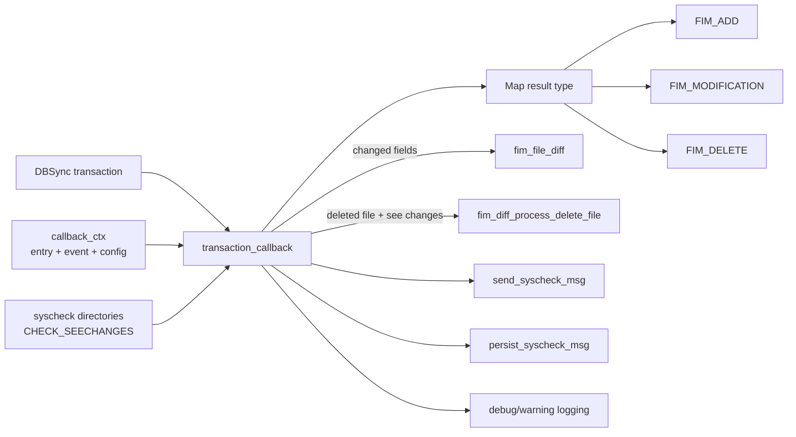
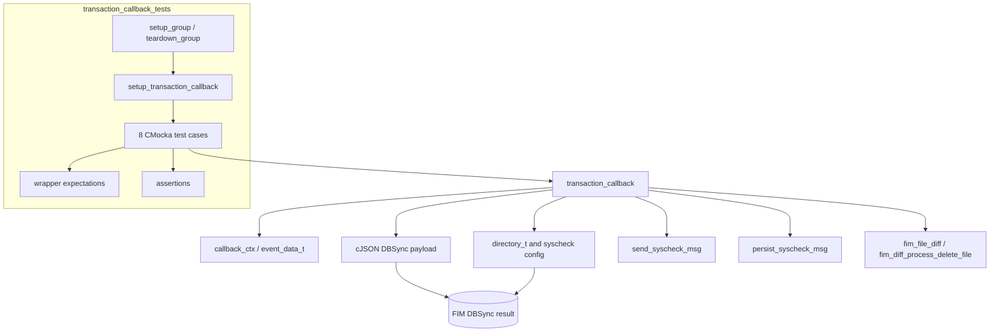
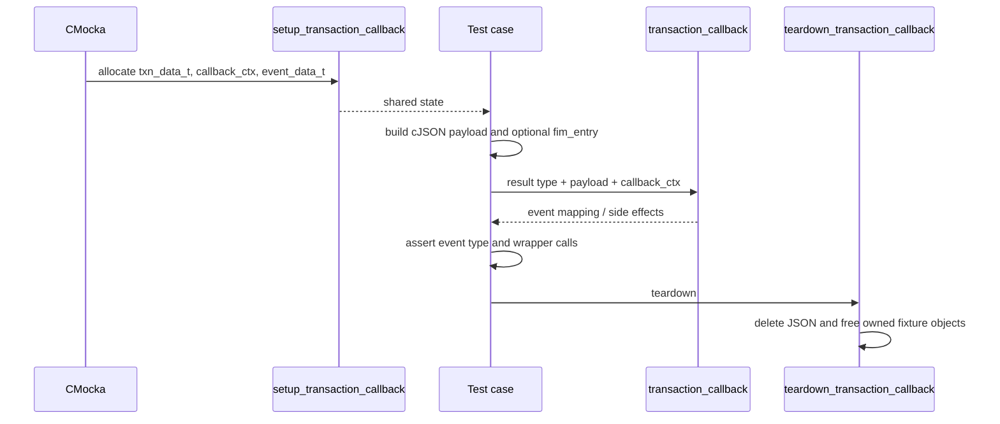
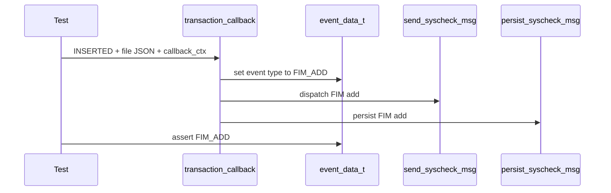
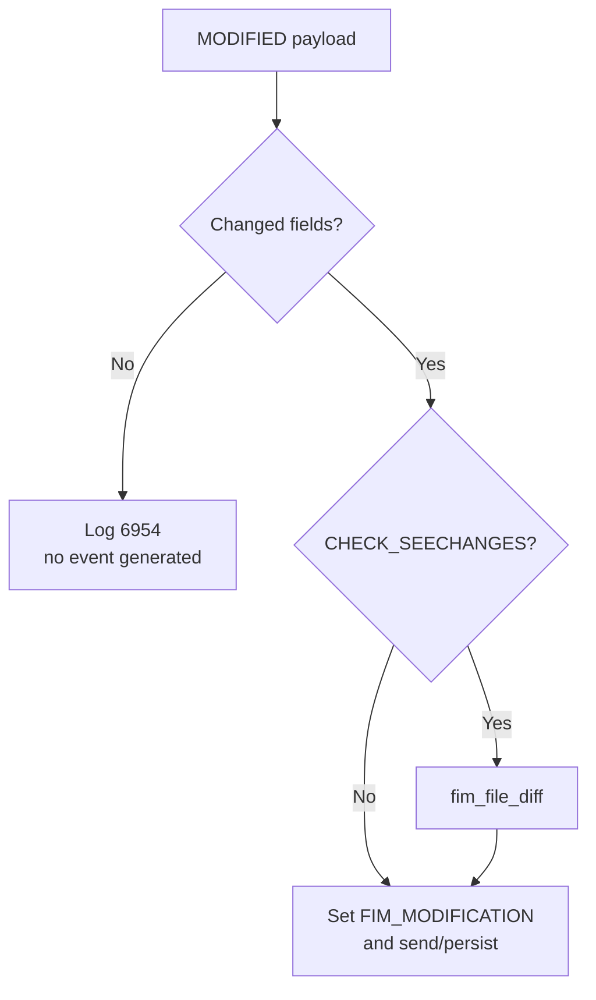
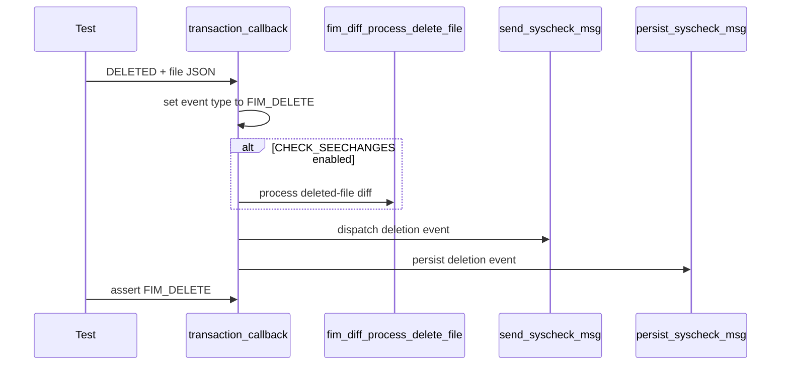

# transaction_callback_tests

## Introduction

`transaction_callback_tests` is the CMocka test slice for the Syscheck/File Integrity Monitoring (FIM) database transaction callback in `src/unit_tests/syscheckd/test_fim_scan.c`. It verifies that DBSync transaction results are converted into the correct FIM event, that alerts are dispatched and persisted when appropriate, that change-diff processing honors directory configuration, and that no-change and full-database paths are handled safely.

The tests exercise the callback through its production-facing `callback_ctx`, JSON payloads, configured FIM directories, and wrapped side effects. They do not replace the broader scan, hashing, serialization, or missing-entry tests; those responsibilities are documented in [FIM file tests](fim_file_tests.md), [FIM check database-state tests](fim_check_db_state_tests.md), [FIM missing-entry tests](fim_missing_entry_tests.md), and [FIM test infrastructure](test_fim_scan_test_infrastructure.md).

## Scope and location

| Item | Description |
|---|---|
| Module | `transaction_callback_tests` |
| Source | `src/unit_tests/syscheckd/test_fim_scan.c` |
| Production entry point | `transaction_callback(ReturnTypeCallback, const cJSON *, void *)` |
| Test framework | CMocka, with project wrapper functions for logging, locking, messaging, persistence, and diff handling |
| Test group | The primary `tests` group, using the file-level `setup_group` and `teardown_group` fixtures |
| Platforms | Unix-like builds and Windows builds selected by `TEST_WINAGENT` |

## Role in the FIM architecture

During a FIM scan or realtime update, the database layer records an inserted, modified, or deleted file entry. The transaction callback is the boundary between that database result and the FIM event pipeline. It interprets the callback result and JSON representation, updates the event context, optionally creates a human-readable change diff, and forwards the event for notification and persistence.



The callback is therefore downstream of the FIM database and upstream of the alert/persistence paths. The tested callback does not perform filesystem scanning itself; it relies on the context and directory configuration prepared by the FIM layer.

For the surrounding daemon and database responsibilities, see [Syscheck/FIM daemon](Syscheck___FIM_Daemon_(C_C++).md), [syscheckd core](syscheckd_core.md), and [syscheckd database](syscheckd_db.md).

## Components and dependencies



The test source includes FIM, Syscheck, database, filesystem, hashing, realtime, and wrapper headers. The callback tests use only a subset of those dependencies directly:

| Dependency | Purpose in this module |
|---|---|
| `cJSON` | Builds insert, modify, delete, and capacity-error payloads |
| `callback_ctx`, `event_data_t`, `fim_entry` | Supplies the callback’s event and current-entry context |
| `directory_t`, `syscheck` | Controls whether change reporting is enabled and provides the configured test directories |
| CMocka | Defines fixtures, call expectations, return values, and assertions |
| Lock wrappers | Verify that configuration/context access follows the platform-specific synchronization path |
| `send_syscheck_msg` wrapper | Verifies event dispatch for successful transactions |
| `persist_syscheck_msg` wrapper | Verifies event persistence for successful transactions |
| `fim_file_diff` wrapper | Verifies modification diff generation when `CHECK_SEECHANGES` is enabled |
| `fim_diff_process_delete_file` wrapper | Verifies deletion diff processing when `CHECK_SEECHANGES` is enabled |
| Logging wrappers | Verify no-change and database-full diagnostics |

The shared fixture and wrapper conventions are described in [FIM test infrastructure](test_fim_scan_test_infrastructure.md); this page documents only the callback-specific use of them.

## Fixture lifecycle

`setup_transaction_callback` allocates a `txn_data_t`, its `callback_ctx`, and an `event_data_t`, then initializes the event with:

```text
report_event = true
mode         = FIM_SCHEDULED
type         = FIM_DELETE
```

The fixture stores the objects in CMocka’s state pointer. Each test may replace `txn_context->entry` and `data->dbsync_event` with test-owned values. `teardown_transaction_callback` deletes the JSON event, releases the optional diff string, and frees the event/context/data objects.



The production callback receives the context through `void *user_data`; the tests intentionally keep the fixture layout close to that ABI boundary. A test that assigns `txn_context->entry` clears the pointer before returning because the entry is stack-allocated by the test and is not owned by the fixture.

## Callback contract tested here

### Result-to-event mapping

| Callback result | Expected FIM event | Test coverage |
|---|---|---|
| `INSERTED` | `FIM_ADD` | `test_transaction_callback_add` |
| `MODIFIED` | `FIM_MODIFICATION` | `test_transaction_callback_modify`, `test_transaction_callback_modify_empty_changed_attributes`, `test_transaction_callback_modify_report_changes` |
| `DELETED` | `FIM_DELETE` | `test_transaction_callback_delete`, `test_transaction_callback_delete_report_changes`, `test_transaction_callback_delete_full_db` |
| `MAX_ROWS` | No normal FIM event is emitted; reports capacity failure | `test_transaction_callback_full_db` |

Successful insert, modify, and delete cases expect both `send_syscheck_msg` and `persist_syscheck_msg`. The tests also expect the callback’s lock interactions, but the exact order differs between Unix and Windows builds because the platform implementations protect and inspect configuration differently.

### DBSync payload shapes

Insert and delete tests provide file metadata such as path, size, permissions, ownership, timestamps, inode/device values, checksum, and MD5/SHA-1/SHA-256 hashes. The modify tests provide a `new`/`old` pair:

```json
[
  {
    "new": {"path": "/etc/a_test_file.txt", "size": 11, "mtime": 1645001693},
    "old": {"path": "/etc/a_test_file.txt", "size": 0, "mtime": 1645001030}
  }
]
```

The actual tests include the complete hash and checksum fields so the callback can calculate changed attributes in the same format used by production DBSync results. Serialization and attribute-shaping behavior is covered separately by the FIM attribute tests and [DBSync documentation](dbsync.md).

## Test cases

| Test | Input and setup | Expected behavior |
|---|---|---|
| `test_transaction_callback_add` | `INSERTED`; file entry supplied; complete insert payload | Maps to `FIM_ADD`, sends and persists the event |
| `test_transaction_callback_modify` | `MODIFIED`; `new` and `old` values differ | Maps to `FIM_MODIFICATION`, sends and persists the event |
| `test_transaction_callback_modify_empty_changed_attributes` | `MODIFIED`; old data contains only the path, leaving no comparable changed field | Logs message `(6954)` and does not generate a new event notification or persistence call; event context remains a modification event |
| `test_transaction_callback_modify_report_changes` | `MODIFIED`; `CHECK_SEECHANGES` enabled on the matching directory | Generates a file diff through `fim_file_diff`, then sends and persists a modification event |
| `test_transaction_callback_delete` | `DELETED`; complete deleted-file payload | Maps to `FIM_DELETE`, sends and persists the event |
| `test_transaction_callback_delete_report_changes` | `DELETED`; `CHECK_SEECHANGES` enabled | Calls `fim_diff_process_delete_file(path, 0)`, then sends and persists the deletion event |
| `test_transaction_callback_delete_full_db` | `DELETED`; normal delete payload in the full-database scenario fixture | Keeps delete handling functional and still sends and persists the event |
| `test_transaction_callback_full_db` | `MAX_ROWS`; file entry and delete-shaped payload | Logs that insertion failed because the database is full; does not expect normal send/persist calls |

### Insert process



### Modification process



`test_transaction_callback_modify` verifies the ordinary changed-field path. `test_transaction_callback_modify_empty_changed_attributes` verifies that a modification request with no meaningful changed attributes is suppressed. `test_transaction_callback_modify_report_changes` verifies the optional diff branch and temporarily enables `CHECK_SEECHANGES` on the configured directory.

### Deletion process



The two delete-reporting tests distinguish ordinary deletion from deletion with a configured change history. `test_transaction_callback_delete_full_db` additionally protects the delete path in the database-capacity scenario represented by the surrounding FIM tests.

### Full database process

`test_transaction_callback_full_db` calls the callback with `MAX_ROWS`. It expects the diagnostic:

```text
Couldn't insert '<path>' entry into DB. The DB is full, please check your configuration.
```

This is a capacity-failure path rather than a normal file event. The absence of `send_syscheck_msg` and `persist_syscheck_msg` expectations is intentional: the callback must not publish a normal FIM event when the database rejected insertion.

## Platform-specific behavior

The source is compiled for Unix and Windows. Callback semantics are shared, but the test setup accounts for platform differences:

- Unix uses POSIX paths and expects the Unix lock/metadata access sequence.
- Windows uses normalized paths such as `c:\\windows\\a_test_file.txt`, escaped in JSON, and expects the Windows lock sequence.
- Windows file permissions are represented by serialized ACL data, while Unix tests use a mode string such as `rw-r--r--`.
- The callback tests retain both branches even where the assertion is the same, because the wrapper call order and payload encoding are not identical.

## Assertions and observability

The tests validate behavior at three levels:

1. **State conversion** — `txn_context->event->type` becomes `FIM_ADD`, `FIM_MODIFICATION`, or `FIM_DELETE`.
2. **Side effects** — successful transactions call message dispatch and persistence; configured change reporting calls the appropriate diff helper.
3. **Suppression and diagnostics** — no-change modifications log `(6954)`, and `MAX_ROWS` logs the database-full diagnostic without publishing a normal event.

The tests do not deeply compare the final serialized alert body. Changes to FIM JSON construction should be covered in the attribute/serialization tests, while changes to callback routing should update this module. See [FIM file tests](fim_file_tests.md) and [FIM missing-entry tests](fim_missing_entry_tests.md) for adjacent event-generation behavior.

## Execution and maintenance

The tests are registered in the first `tests` array in `test_fim_scan.c` using `cmocka_unit_test_setup_teardown`. They run with the file-level Syscheck configuration fixture and are included in the main CMocka group execution. The exact build target is repository/build-directory dependent; after building, the target can usually be discovered with the project’s test listing (for example, `ctest -N`) and run with the corresponding CTest or test-binary command.

When changing the callback or its contract, update the following together:

- the result-to-event mapping table and event-type assertions;
- the JSON fixtures if DBSync changes its insert/modify/delete schema;
- wrapper expectations for dispatch, persistence, locking, and diff generation;
- the `CHECK_SEECHANGES` setup and cleanup in report-change tests;
- both `TEST_WINAGENT` and non-Windows branches;
- fixture teardown if ownership of `dbsync_event`, `diff`, or `callback_ctx->entry` changes.

The most important invariant is that a successful transaction produces one correctly typed FIM event and the expected downstream side effects, while a no-change or full-database result does not produce a misleading alert.

