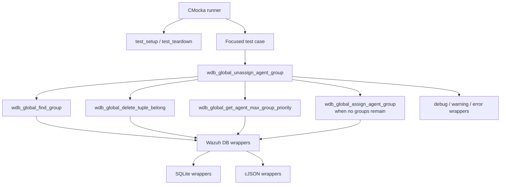
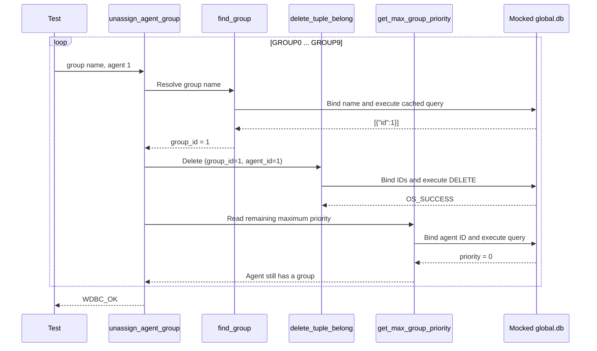
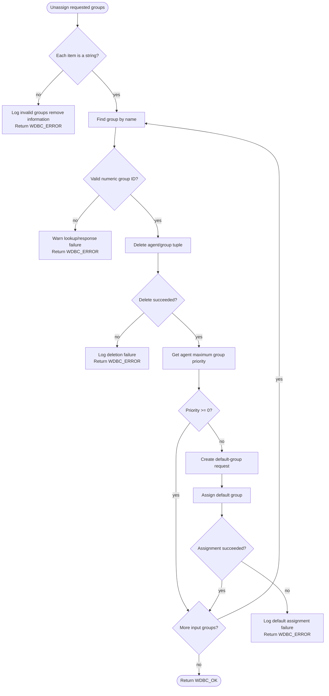

# `unassign_agent_group_tests`

## Introduction

`unassign_agent_group_tests` documents the focused CMocka coverage for
`wdb_global_unassign_agent_group()`. The operation removes one or more named
groups from an agent in Wazuh's global database and preserves the invariant
that an agent with no remaining group is reassigned to the `default` group.

The tests are implemented in `src/unit_tests/wazuh_db/test_wdb_global.c`.
They call the production function directly and replace database, SQLite,
cJSON, logging, and time boundaries with linker-wrapped mocks. The complete
fixture, wrapper conventions, and neighboring global database operations are
described in [`test_wdb_global.md`](test_wdb_global.md). The complementary
assignment behavior is covered by
[`assign_agent_group_tests.md`](assign_agent_group_tests.md).

## Scope

The supplied focused tests are:

| Test | Scenario | Expected result |
|---|---|---|
| `test_wdb_global_unassign_agent_group_success` | Remove ten valid group names; each name resolves to group ID `1`, the membership row is deleted, and the agent still has a highest priority of `0`. | `WDBC_OK` |
| `test_wdb_global_unassign_agent_group_success_assign_default_group` | Remove the only group; the priority query returns `-1`, so the operation creates a `default` group request and assigns it back to the agent. | `WDBC_OK` |

The source file also contains failure tests for this function—invalid JSON,
group lookup failures, invalid lookup responses, tuple-delete failures, and
failure while assigning `default`. Those cases are summarized below; the
focused success components above are the primary scope of this leaf.

## Position in the system

The production function belongs to the Wazuh DB global-data layer. Manager
callers normally reach it through the Wazuh DB command/parser and local socket
protocol. These unit tests bypass that transport and verify the database
operation in isolation.

```mermaid
flowchart LR
    Caller[Manager caller\nAPI / cluster / daemon] --> Protocol[wazuh-db command\nand socket protocol]
    Protocol --> Core[wdb_global_unassign_agent_group()]
    Core --> GlobalDB[(global.db)]
    Core --> Groups[group membership\nand group context]

    Test[unassign_agent_group_tests] -. direct call .-> Core
    Test -. scripted seams .-> Wrappers[CMocka linker wrappers]
    Wrappers -. mock SQLite/cJSON/logging .-> Core
```

The schema, command routing, and broader global database responsibilities are
documented in [`wazuh_db_global.md`](wazuh_db_global.md), rather than repeated
here.

## Test-harness architecture

Every case is registered using `cmocka_unit_test_setup_teardown()`. The shared
fixture creates a minimal `wdb_t` whose database ID is `global`, allocates a
placeholder SQLite handle, initializes Wazuh DB configuration, and releases
all state after the test. See
[`test_wdb_global_test_infrastructure.md`](test_wdb_global_test_infrastructure.md)
for the common fixture details.



The tests never open a real database. CMocka expectations determine statement
initialization, bind arguments, returned JSON, SQLite status, and execution
results. This makes each branch deterministic and checks both call order and
observable return status.

## Operation contract

The tested operation is conceptually:

```c
wdbc_result wdb_global_unassign_agent_group(
    wdb_t *wdb,
    int agent_id,
    cJSON *groups);
```

`groups` is expected to be a cJSON array of strings. For each group name, the
function:

1. validates that the array element is a string;
2. resolves the name with `wdb_global_find_group()`;
3. extracts the numeric group ID from the lookup response;
4. removes the `(group_id, agent_id)` row using
   `wdb_global_delete_tuple_belong()`;
5. checks the agent's maximum remaining group priority; and
6. assigns `default` if the agent no longer belongs to any group.

The function returns `WDBC_OK` when all requested removals and any required
fallback assignment succeed. A malformed input, failed lookup, invalid lookup
response, failed delete, or failed fallback assignment produces
`WDBC_ERROR`.

## Normal removal flow

`test_wdb_global_unassign_agent_group_success` builds an array containing
`GROUP0` through `GROUP9`. Every lookup returns `[{"id":1}]`; the test then
expects deletion of group ID `1` for agent `1` and a successful priority query.
The operation therefore exercises the per-element loop ten times.



The repeated expectations are important: they verify that the implementation
does not stop after the first group and that each deletion uses the resolved
group ID and the requested agent ID.

## Default-group fallback

`test_wdb_global_unassign_agent_group_success_assign_default_group` removes
`random_group`. Its priority response is `[{"id":-1}]`, which represents no
remaining membership. The function creates a one-element JSON array containing
`default`, invokes the assignment path, and logs that the agent was reassigned.



This fallback is a business invariant, not merely test scaffolding: removing
the last explicit group must not leave the agent without a group. The test
also verifies that the fallback uses the normal assignment machinery, rather
than inserting a membership row through an unrelated path.

## Dependencies and mocked boundaries

| Dependency | Role in the tested behavior | Mocked assertion |
|---|---|---|
| `wdb_global_find_group()` | Maps a group name to its database ID. | Name binding and JSON response `[{"id":1}]`. |
| `wdb_global_delete_tuple_belong()` | Deletes the agent/group relationship. | `WDB_STMT_GLOBAL_DELETE_TUPLE_BELONG`, group ID `1`, agent ID `1`, successful execution. |
| `wdb_global_get_agent_max_group_priority()` | Detects whether any group remains. | Agent ID binding and priority response `0` or `-1`. |
| `wdb_global_assign_agent_group()` | Reassigns `default` after the last removal. | Group lookup, membership insertion, and debug message. |
| cJSON | Represents input groups and lookup/priority responses. | Real JSON objects are supplied while allocation/deletion boundaries are wrapped. |
| SQLite/Wazuh DB wrappers | Isolate statement cache, bind, and execution behavior. | CMocka `expect_*` and `will_return` expectations. |
| Logging wrappers | Verify diagnostics on failure and fallback. | Expected debug, warning, and error strings. |

The shared wrapper API is documented in [`wazuh_db_wrappers.md`](wazuh_db_wrappers.md).
The adjacent tuple-deletion tests are available in
[`delete_tuple_belong_tests.md`](delete_tuple_belong_tests.md), and priority
lookup coverage in [`get_agent_max_group_priority_tests.md`](get_agent_max_group_priority_tests.md).

## Failure behavior covered by the source

Although the two named core components are success cases, neighboring tests
establish the following diagnostic contract:

| Failure point | Expected behavior |
|---|---|
| Input element is not a string | Log `Invalid groups remove information`; return `WDBC_ERROR`. |
| Transaction/cache or group lookup fails | Warn that the group ID could not be found; return `WDBC_ERROR`. |
| Lookup JSON does not contain a numeric ID | Warn `Invalid response from wdb_global_find_group.`; return `WDBC_ERROR`. |
| Tuple-delete statement cannot initialize or execute | Log inability to delete the group for the agent; return `WDBC_ERROR`. |
| Default assignment fails after the last removal | Log `There was an error assigning the agent ... to default group`; return `WDBC_ERROR`. |

The tests use wrapped SQLite error messages to ensure failures are reported at
the correct boundary. They also explicitly expect cJSON cleanup for lookup
responses, which protects ownership behavior in the loop.

## Maintenance guidance

When changing `wdb_global_unassign_agent_group()` or its prepared statements:

- preserve coverage for string validation, group-ID extraction, tuple deletion,
  remaining-priority evaluation, and default-group recovery;
- update `WDB_STMT_GLOBAL_DELETE_TUPLE_BELONG` expectations if statement IDs or
  parameter order change;
- keep the distinction between `WDBC_OK` and `WDBC_ERROR` intact;
- update the repeated ten-item expectations if the implementation changes its
  iteration or cleanup behavior; and
- keep broad fixture and wrapper changes in the shared documents linked above.

## Source references

- Implementation under test: `src/wazuh_db/wdb_global.c`
- Test source: `src/unit_tests/wazuh_db/test_wdb_global.c`
- Public Wazuh DB declarations: `src/wazuh_db/wdb.h`
- Global DB overview: [`wazuh_db_global.md`](wazuh_db_global.md)
- Broader test suite: [`test_wdb_global.md`](test_wdb_global.md)
- Related assignment tests: [`assign_agent_group_tests.md`](assign_agent_group_tests.md)
