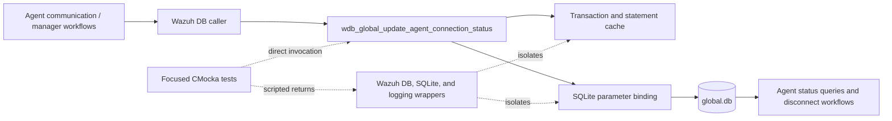
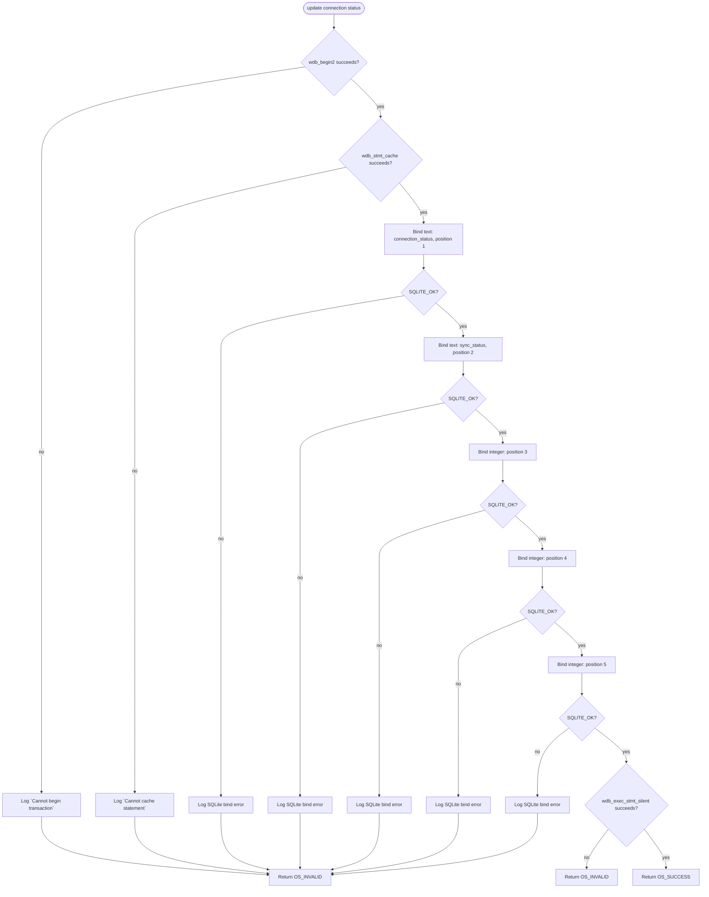
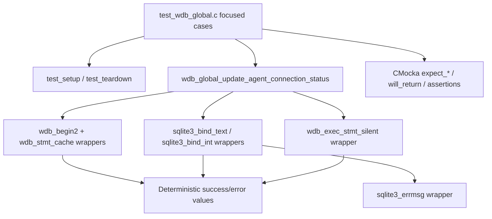
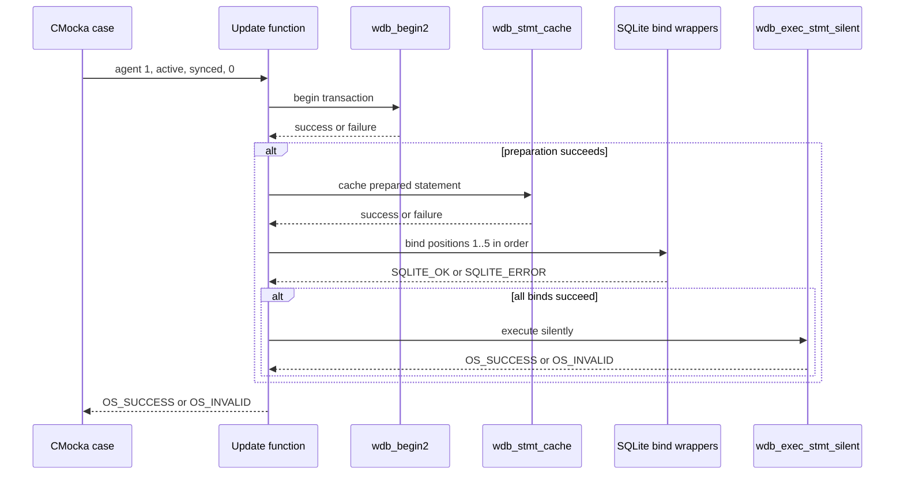

# `update_agent_connection_status_tests`

## Introduction

`update_agent_connection_status_tests` documents the focused CMocka tests for
`wdb_global_update_agent_connection_status()`. The operation updates an agent's connection-related state in the Wazuh global database, using a transaction, a cached SQLite statement, two text values, and three integer parameters.

The nine cases are a focused slice of `src/unit_tests/wazuh_db/test_wdb_global.c`. They verify transaction startup, statement caching, every bind position, statement execution, and the successful update path. The broader global-database test suite is documented in [`test_wdb_global.md`](test_wdb_global.md); shared fixture and wrapper conventions should be read there rather than repeated here.

## Position in the system

The production operation belongs to the Wazuh DB global-data layer. Agent communication components determine or report connection state, while the global database persists it for subsequent queries, disconnect handling, synchronization, and API/cluster consumers.



This module tests the persistence boundary directly. It does not test the upstream decision that selects a status, nor the callers that later read the status. Those responsibilities belong to their respective modules; related global operations are covered by [`get_agents_by_connection_status_tests.md`](get_agents_by_connection_status_tests.md), [`get_agents_to_disconnect_tests.md`](get_agents_to_disconnect_tests.md), [`wazuh_db_global.md`](wazuh_db_global.md), and the broader [`test_wdb_global.md`](test_wdb_global.md).

## Contract under test

The exercised call has the following shape:

```c
int wdb_global_update_agent_connection_status(
    wdb_t *wdb,
    int agent_id,
    const char *connection_status,
    const char *sync_status,
    time_t timestamp);
```

For the supplied cases, the inputs are `agent_id = 1`, `connection_status = "active"`,
`sync_status = "synced"`, and `timestamp = 0`. The prepared statement receives integer values for the update time, the `NO_KEEPALIVE` marker, and the agent ID at positions `3`, `4`, and `5`, respectively. The test source verifies the following ordered interaction:

1. Start a transaction with `wdb_begin2()`.
2. Obtain/cache the statement with `wdb_stmt_cache()`.
3. Bind `connection_status` as text at position `1`.
4. Bind `sync_status` as text at position `2`.
5. Bind the update time, `NO_KEEPALIVE`, and agent ID at positions `3`, `4`, and `5`.
6. Execute the update through `wdb_exec_stmt_silent()`.
7. Return `OS_SUCCESS` only when all stages succeed; otherwise return `OS_INVALID`.

The exact SQL column mapping is intentionally not reconstructed in this leaf: the tests specify the prepared-statement interface and parameter positions, while the production implementation and global schema own the SQL contract.

## Control flow



Every failure is short-circuiting. For example, a failure at bind position `3` means positions `4` and `5` and statement execution must not be invoked; the CMocka expectations make that ordering observable.

## Test harness architecture



The shared fixture allocates a minimal `test_struct_t`, a `wdb_t` whose ID is `"global"`, a placeholder database pointer, and an output buffer. It initializes global Wazuh DB configuration with `wdb_init_conf()`. Teardown frees those objects and calls `wdb_free_conf()`. No SQLite file or live database connection is used.

The production function is reached directly. Linker-wrapped Wazuh DB and SQLite functions replace transaction, statement-cache, bind, execution, and error-message boundaries. Logging wrappers verify exact diagnostics such as `DB(global) sqlite3_bind_text(): ERROR MESSAGE`.

## Component interactions



## Test scenarios

| Test case | Injected condition | Expected result |
|---|---|---|
| `test_wdb_global_update_agent_connection_status_transaction_fail` | `wdb_begin2()` returns `-1`. | Logs `Cannot begin transaction`; returns `OS_INVALID`. |
| `test_wdb_global_update_agent_connection_status_cache_fail` | `wdb_stmt_cache()` returns `-1`. | Logs `Cannot cache statement`; returns `OS_INVALID`. |
| `test_wdb_global_update_agent_connection_status_bind1_fail` | Text bind for `connection_status` at position `1` returns `SQLITE_ERROR`. | Logs the SQLite bind error; returns `OS_INVALID`. |
| `test_wdb_global_update_agent_connection_status_bind2_fail` | Text bind for `sync_status` at position `2` returns `SQLITE_ERROR`. | Logs the SQLite bind error; returns `OS_INVALID`. |
| `test_wdb_global_update_agent_connection_status_bind3_fail` | Integer bind at position `3` returns `SQLITE_ERROR`. | Stops before later binds; returns `OS_INVALID`. |
| `test_wdb_global_update_agent_connection_status_bind4_fail` | Integer bind at position `4` returns `SQLITE_ERROR`. | Stops before position `5`; returns `OS_INVALID`. |
| `test_wdb_global_update_agent_connection_status_bind5_fail` | Integer bind at position `5` returns `SQLITE_ERROR`. | Does not execute the statement; returns `OS_INVALID`. |
| `test_wdb_global_update_agent_connection_status_step_fail` | All binds succeed; `wdb_exec_stmt_silent()` returns `OS_INVALID`. | Returns `OS_INVALID`. |
| `test_wdb_global_update_agent_connection_status_success` | Transaction, cache, all five binds, and execution succeed. | Returns `OS_SUCCESS`. |

## Failure behavior and diagnostics

The tests establish these invariants:

- transaction and statement-cache failures are reported with debug diagnostics and a uniform `OS_INVALID` return;
- bind failures are reported with the database identifier (`global`), the SQLite API name, and wrapper-supplied error text;
- bind order and parameter positions are part of the tested interface;
- execution failure is distinct from bind failure but has the same invalid return contract;
- no partial success is exposed to the caller when any preparation or execution stage fails.

## Maintenance guidance

When modifying `wdb_global_update_agent_connection_status()` or its prepared SQL statement:

1. Preserve coverage for transaction, cache, all five bind positions, execution, and success.
2. Update position/value expectations if the SQL parameter order changes.
3. Treat changes to `OS_SUCCESS`/`OS_INVALID` or the exact log messages as observable contract changes.
4. Keep this leaf focused on persistence mechanics; document caller behavior and status-query semantics in the related modules and [`test_wdb_global.md`](test_wdb_global.md).
5. Run the complete `test_wdb_global` target after changes because neighboring tests share the same fixture, wrappers, and production translation unit.

## Source references

- Production test source: `src/unit_tests/wazuh_db/test_wdb_global.c`
- Focused section: `/* Tests wdb_global_update_agent_connection_status */`
- Production implementation: `src/wazuh_db/wdb_global.c`
- Public declarations and Wazuh DB types: `src/wazuh_db/wdb.h`
- Broader suite and global architecture: [`test_wdb_global.md`](test_wdb_global.md)
- Shared wrapper conventions: [`wazuh_db_wrappers.md`](wazuh_db_wrappers.md)
