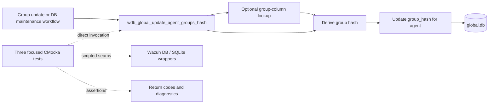
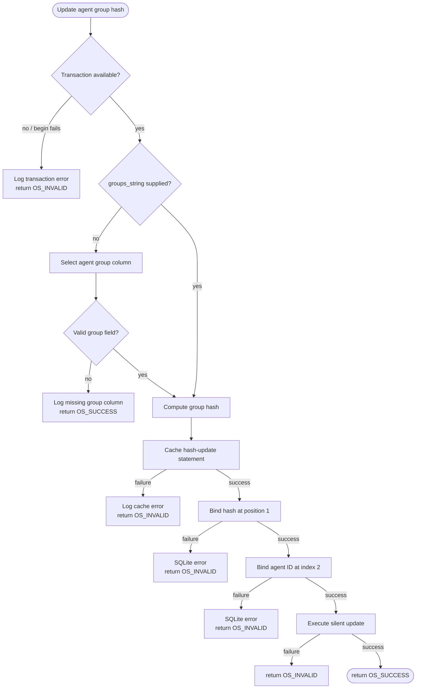
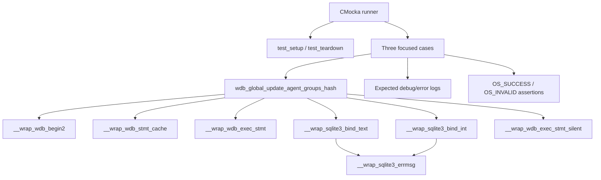
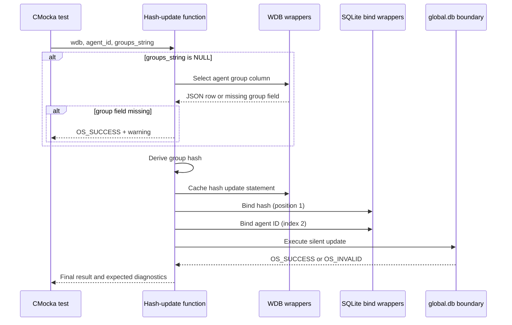

# `update_agent_groups_hash_tests`

## Introduction

`update_agent_groups_hash_tests` documents the focused CMocka coverage for
`wdb_global_update_agent_groups_hash()` in
[`src/unit_tests/wazuh_db/test_wdb_global.c`](../../src/unit_tests/wazuh_db/test_wdb_global.c).
The operation maintains the derived `group_hash` value for one agent in
Wazuh's global database. It accepts an agent ID and, when available, the
agent's comma-separated group string; if the string is absent, it reads the
stored group column first and then updates the hash.

This is a narrow leaf of the broader [`test_wdb_global`](test_wdb_global.md)
suite. Global database architecture, group membership orchestration, and
hash consumers are described in [`wazuh_db_global`](wazuh_db_global.md).
Fixture and linker-wrapper conventions are shared with
[`test_wdb_global_test_infrastructure`](test_wdb_global_test_infrastructure.md).

## Purpose and system position

The function keeps a per-agent derived hash synchronized with the canonical
group membership representation. Group-management operations can change the
agent/group relationship; recalculation and context-setting workflows then
use this operation or its neighboring helpers to restore derived state.



The test module does not validate command parsing, socket transport, the
database schema, or the callers that decide when recalculation is needed.
Those concerns remain in the linked parent and production documentation.

## Contract under test

The exercised interface is conceptually:

```c
int wdb_global_update_agent_groups_hash(wdb_t *wdb,
                                        int agent_id,
                                        char *groups_string);
```

For a non-NULL group string, the expected path is:

1. Ensure a transaction is available. The tests model a transaction already
   active with `wdb->transaction = 1`; the begin-failure case models the
   function attempting `wdb_begin2()` when no transaction exists.
2. Cache the group-hash update statement.
3. Derive the hash from the supplied group string.
4. Bind the hash at SQLite position 1 and the agent ID at index 2.
5. Execute the update through `wdb_exec_stmt_silent()`.
6. Return `OS_SUCCESS` or `OS_INVALID`.

When `groups_string == NULL`, the function first invokes the agent-group
lookup, extracts the `group` property from the returned JSON row, and follows
the same hash-update path. If the lookup returns a row without that property,
the function logs a diagnostic and returns success without modifying the
hash, because no valid group column was available.



The exact hashing implementation and statement SQL are owned by the
production global database module; these tests verify the observable call
sequence and persistence boundary rather than duplicating that implementation.

## Test architecture and dependencies

Each case is registered with `cmocka_unit_test_setup_teardown` and receives a
fresh synthetic `wdb_t` from the common fixture. The fixture sets the DB ID to
`"global"`, allocates a SQLite-handle slot, and initializes Wazuh DB
configuration. No real database is opened.



| Dependency | Role in this module |
|---|---|
| `wdb.h` | Declares the target function and Wazuh DB types/constants. |
| `test_setup()` / `test_teardown()` | Creates and destroys the isolated global DB fixture. |
| `__wrap_wdb_begin2` | Simulates transaction acquisition failure. |
| `__wrap_wdb_stmt_cache` | Controls statement-cache success or failure. |
| `__wrap_wdb_exec_stmt` | Supplies the optional group-column JSON response. |
| `__wrap_sqlite3_bind_text` | Verifies the calculated hash binding at position 1. |
| `__wrap_sqlite3_bind_int` | Verifies the agent ID binding at index 2. |
| `__wrap_wdb_exec_stmt_silent` | Controls the final update result. |
| CMocka/logging wrappers | Verify short-circuit behavior and diagnostics. |

## Core test scenarios

| Test | Setup and injected behavior | Expected contract |
|---|---|---|
| `test_wdb_global_update_agent_groups_hash_begin_failed` | `groups_string` is non-NULL; no transaction is active; `wdb_begin2()` returns `OS_INVALID`. | Logs `Cannot begin transaction` and returns `OS_INVALID`. No cache or bind operation follows. |
| `test_wdb_global_update_agent_groups_hash_success` | Active transaction; cache succeeds; group string is `group1,group2`; hash binding receives `ef48b4cd`; agent ID `1` binds successfully; execution returns `OS_SUCCESS`. | Returns `OS_SUCCESS`. The test verifies hash-first/agent-ID-second binding. |
| `test_wdb_global_update_agent_groups_hash_groups_string_null_success` | Active transaction; lookup returns `[{"group":"group1,group2"}]`; the derived hash is then bound and persisted successfully. | Returns `OS_SUCCESS`; verifies the fallback lookup path. |
| `test_wdb_global_update_agent_groups_hash_empty_group_column_success` | Active transaction; lookup returns an object without `group`. | Logs `Unable to get group column for agent '1'. The groups_hash column won't be updated` and returns `OS_SUCCESS`; no hash update is attempted. |

The source also contains adjacent bind, execution, setter, and recalculation
tests for related global DB operations. They are intentionally referenced
rather than repeated here.

## Component interaction flow



## Failure and maintenance guidance

The focused tests establish these observable rules:

- transaction acquisition failure is fatal and short-circuits the operation;
- the hash is bound before the agent ID;
- a NULL input triggers a database lookup rather than an immediate failure;
- a lookup row without a usable `group` column is treated as a no-op success;
- successful persistence returns `OS_SUCCESS`, while statement/cache failures
  use `OS_INVALID`.

Update this page if the production function changes its transaction ownership,
fallback lookup shape, hash/update statement, parameter order, no-op policy,
or return-code semantics. Link broader behavior to
[`set_agent_group_context_hash_tests`](set_agent_group_context_hash_tests.md),
[`recalculate_all_agent_groups_hash_tests`](recalculate_all_agent_groups_hash_tests.md),
and [`adjust_v4_tests`](adjust_v4_tests.md) instead of duplicating their
workflow descriptions.

## References

- Test source: [`src/unit_tests/wazuh_db/test_wdb_global.c`](../../src/unit_tests/wazuh_db/test_wdb_global.c)
- Parent test suite: [`test_wdb_global`](test_wdb_global.md)
- Production global DB module: [`wazuh_db_global`](wazuh_db_global.md)
- Shared fixture and wrappers: [`test_wdb_global_test_infrastructure`](test_wdb_global_test_infrastructure.md)
- Related context/hash setters: [`set_agent_group_context_hash_tests`](set_agent_group_context_hash_tests.md)
- Related full recalculation: [`recalculate_all_agent_groups_hash_tests`](recalculate_all_agent_groups_hash_tests.md)
- Related migration path: [`adjust_v4_tests`](adjust_v4_tests.md)
