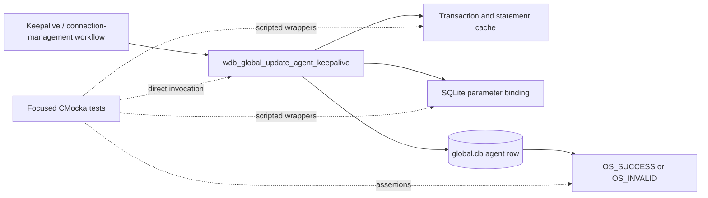
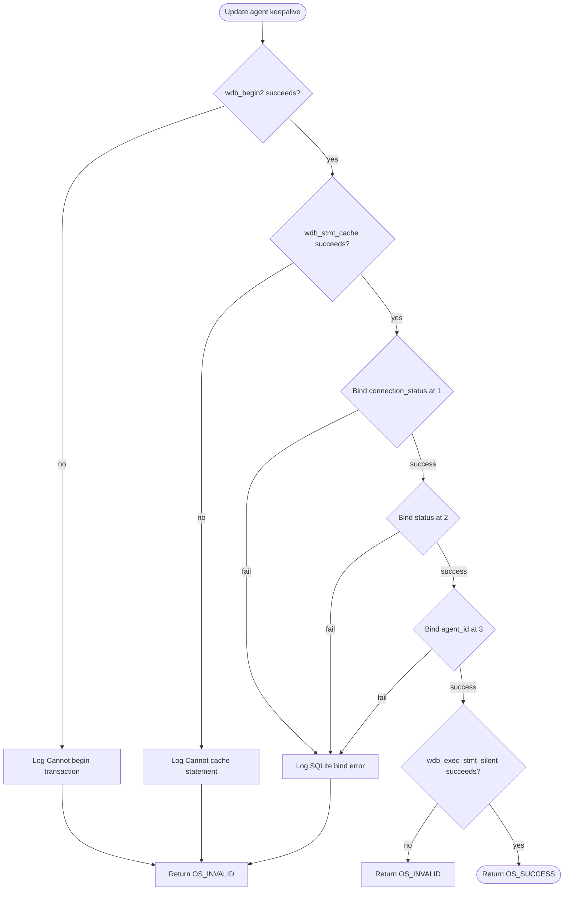
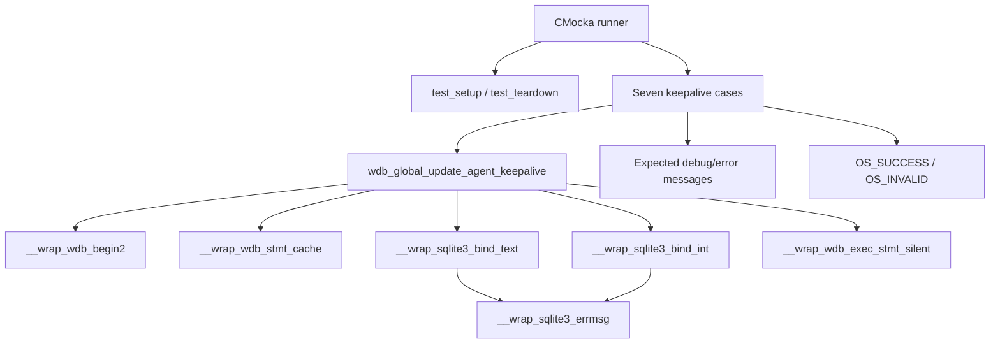
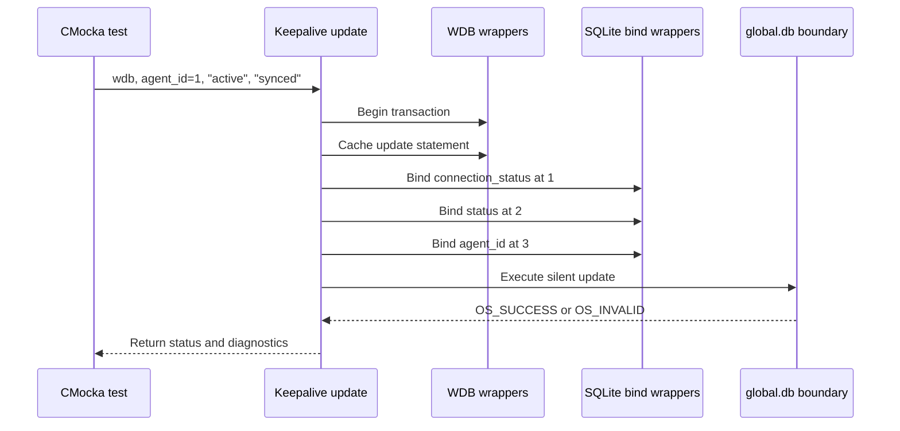

# `update_agent_keepalive_tests`

## Introduction

`update_agent_keepalive_tests` documents the focused CMocka coverage for
`wdb_global_update_agent_keepalive()`, the Wazuh DB operation that updates an
agent's connection state after a keepalive event. The tests are implemented in
[`src/unit_tests/wazuh_db/test_wdb_global.c`](../../src/unit_tests/wazuh_db/test_wdb_global.c)
and exercise transaction setup, statement caching, SQLite parameter binding,
and the final silent update.

This is a narrow slice of the broader [`test_wdb_global`](test_wdb_global.md)
suite. It does not cover agent selection, disconnect detection, or manager-wide
connection resets; those neighboring behaviors remain documented by the
corresponding modules.

## Purpose and system position

The operation persists two state values for one agent:

- `connection_status`, such as `active`;
- synchronization `status`, such as `synced`.

The agent ID identifies the row to update. The function belongs to the global
database layer used by `wazuh-db`; higher-level connection-management code
decides when a keepalive has been received and invokes this persistence
operation.



The production call chain, global database schema, and Wazuh DB command
integration are maintained in [`test_wdb_global`](test_wdb_global.md) and the
linked global database documentation rather than duplicated here.

## Contract under test

The exercised interface is:

```c
int wdb_global_update_agent_keepalive(wdb_t *wdb,
                                     int agent_id,
                                     const char *connection_status,
                                     const char *status);
```

The expected successful sequence is:

1. Begin or join a database transaction.
2. Obtain the cached update statement.
3. Bind `connection_status` at SQLite parameter position `1`.
4. Bind `status` at position `2`.
5. Bind `agent_id` at integer index `3`.
6. Execute the statement through `wdb_exec_stmt_silent()`.
7. Return `OS_SUCCESS` when the update succeeds.

Any transaction, cache, bind, or execution failure returns `OS_INVALID` and
stops the remaining stages.



## Test architecture and dependencies

Each case is registered with `cmocka_unit_test_setup_teardown()`. The shared
fixture creates a minimal `wdb_t`, sets its ID to `"global"`, allocates a
SQLite-handle slot, initializes Wazuh DB configuration, and releases all state
after the test. Fixture details are shared with the parent suite and are not
repeated here.



| Dependency | Role |
|---|---|
| `wdb.h` | Declares `wdb_t`, status constants, and the target function. |
| `test_setup()` / `test_teardown()` | Isolates each test with a synthetic global DB context. |
| `__wrap_wdb_begin2` | Simulates transaction-start success or failure. |
| `__wrap_wdb_stmt_cache` | Simulates prepared-statement cache success or failure. |
| `__wrap_sqlite3_bind_text` | Verifies the two text values and injects text-bind failures. |
| `__wrap_sqlite3_bind_int` | Verifies the agent ID at index `3` and injects ID-bind failures. |
| `__wrap_wdb_exec_stmt_silent` | Controls the final database update result. |
| Logging and SQLite error wrappers | Verify deterministic diagnostics on failure. |
| CMocka | Registers tests, scripts wrapper behavior, and asserts return codes. |

## Component interaction



The tests verify the operation's observable boundary, not SQL text or the
physical schema. Those details belong to the production global DB module.

## Test scenarios

| Test | Injected condition | Expected result |
|---|---|---|
| `test_wdb_global_update_agent_keepalive_transaction_fail` | `wdb_begin2()` returns `-1`. | Logs `Cannot begin transaction`; returns `OS_INVALID`; no statement or bind work follows. |
| `test_wdb_global_update_agent_keepalive_cache_fail` | Transaction succeeds, then `wdb_stmt_cache()` returns `-1`. | Logs `Cannot cache statement`; returns `OS_INVALID`. |
| `test_wdb_global_update_agent_keepalive_bind1_fail` | Binding `connection_status` (`"active"`) at position `1` returns `SQLITE_ERROR`. | Logs the SQLite error; returns `OS_INVALID`. |
| `test_wdb_global_update_agent_keepalive_bind2_fail` | Binding `status` (`"synced"`) at position `2` fails after the first bind succeeds. | Logs the SQLite error; returns `OS_INVALID`. |
| `test_wdb_global_update_agent_keepalive_bind3_fail` | Binding agent ID `1` at index `3` fails after both text binds succeed. | Logs the SQLite error; returns `OS_INVALID`. |
| `test_wdb_global_update_agent_keepalive_step_fail` | All binds succeed, but `wdb_exec_stmt_silent()` returns `OS_INVALID`. | Returns `OS_INVALID`; the update is treated as unsuccessful. |
| `test_wdb_global_update_agent_keepalive_success` | Transaction, cache, all three binds, and execution succeed. | Returns `OS_SUCCESS`. |

All cases use `connection_status = "active"`, `status = "synced"`, and agent
ID `1`. The failure tests isolate one stage at a time, making call ordering and
short-circuit behavior explicit.

## Failure behavior and maintenance guidance

The focused tests establish these invariants:

- transaction and statement-cache failures are fatal;
- text parameters precede the integer agent identifier;
- SQLite failures are reported with the database ID (`global`) and supplied
  SQLite error text;
- the final update uses the silent execution helper;
- only a fully successful update returns `OS_SUCCESS`.

Update this page if the function changes its parameter order, transaction
ownership, statement-cache path, execution helper, logging contract, or return
codes. For related behavior, link to
[`get_agents_to_disconnect_tests`](get_agents_to_disconnect_tests.md),
[`reset_agents_connection_tests`](reset_agents_connection_tests.md), and
[`update_agent_connection_status_tests`](update_agent_connection_status_tests.md)
instead of duplicating their workflows.

## References

- Test source: [`src/unit_tests/wazuh_db/test_wdb_global.c`](../../src/unit_tests/wazuh_db/test_wdb_global.c)
- Parent suite: [`test_wdb_global`](test_wdb_global.md)
- Related keepalive consumers: [`get_agents_to_disconnect_tests`](get_agents_to_disconnect_tests.md)
- Related connection reset: [`reset_agents_connection_tests`](reset_agents_connection_tests.md)
- Related connection-state update: [`update_agent_connection_status_tests`](update_agent_connection_status_tests.md)
- Shared test infrastructure: [`test_wdb_global_test_infrastructure`](test_wdb_global_test_infrastructure.md)
