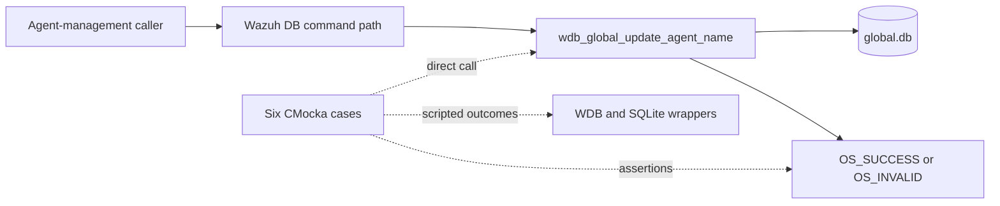
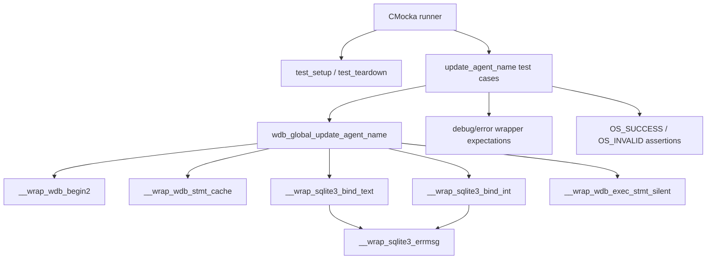
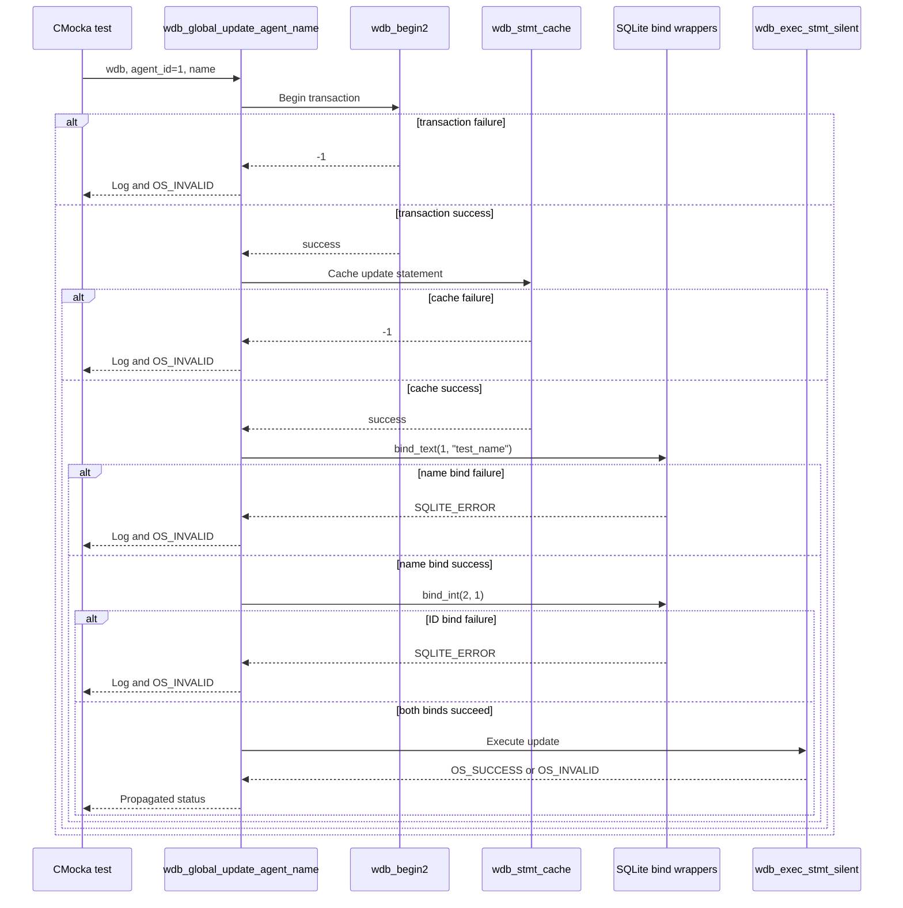

# `update_agent_name_tests`

## Introduction

`update_agent_name_tests` documents the focused CMocka coverage for
`wdb_global_update_agent_name()`, the Wazuh global-database operation that
updates an agent's display name by agent ID. The six tests exercise the
transaction, prepared-statement cache, two SQLite parameter bindings, final
statement execution, and successful completion paths.

This module is a leaf of the broader [`test_wdb_global.md`](test_wdb_global.md)
unit-test suite. The shared fixture and linker-wrapper conventions are
described in [`test_wdb_global_test_infrastructure.md`](test_wdb_global_test_infrastructure.md);
global database architecture is covered by [`wazuh_db_engine.md`](wazuh_db_engine.md)
and related Wazuh DB documentation.

## System position

Agent names are part of the agent metadata stored in the global Wazuh DB.
Production callers reach this operation through the Wazuh DB command and
management layers. The focused tests call the database function directly and
replace transaction, SQLite, execution, and logging boundaries with controlled
wrappers.



## Contract under test

The tested operation has the following effective contract:

```c
int wdb_global_update_agent_name(wdb_t *wdb, int agent_id, char *name);
```

The expected execution pipeline is:

1. Begin or join a transaction with `wdb_begin2()`.
2. Obtain the cached update statement with `wdb_stmt_cache()`.
3. Bind the new name as SQLite parameter `1` using `sqlite3_bind_text()`.
4. Bind the agent ID as SQLite parameter `2` using `sqlite3_bind_int()`.
5. Execute the update with `wdb_exec_stmt_silent()`.
6. Return `OS_SUCCESS` only when every stage succeeds; otherwise return
   `OS_INVALID` and emit the corresponding diagnostic.

The tests use `name = NULL` in early-failure cases only to show that the
function exits before attempting a bind. The successful and bind-focused cases
use `"test_name"`.

```mermaid
flowchart TD
    Start([wdb_global_update_agent_name]) --> Tx{wdb_begin2 succeeds?}
    Tx -- no --> TxErr[Log: Cannot begin transaction] --> Fail([OS_INVALID])
    Tx -- yes --> Cache{wdb_stmt_cache succeeds?}
    Cache -- no --> CacheErr[Log: Cannot cache statement] --> Fail
    Cache -- yes --> Name{Bind name at position 1}
    Name -- SQLITE_ERROR --> NameErr[Log sqlite3_bind_text error] --> Fail
    Name -- SQLITE_OK --> ID{Bind agent ID at index 2}
    ID -- SQLITE_ERROR --> IDErr[Log sqlite3_bind_int error] --> Fail
    ID -- SQLITE_OK --> Exec{wdb_exec_stmt_silent succeeds?}
    Exec -- no --> ExecErr[Return OS_INVALID] --> Fail
    Exec -- yes --> Success([OS_SUCCESS])
```



## Test architecture and dependencies

Each case is registered with `cmocka_unit_test_setup_teardown()`. The shared
`test_setup()` allocates a synthetic `test_struct_t`, a `wdb_t` whose ID is
`"global"`, a placeholder SQLite handle, and the output buffer, then calls
`wdb_init_conf()`. `test_teardown()` frees those objects and calls
`wdb_free_conf()`. No real SQLite database or daemon is required.



| Dependency | Purpose in these tests |
|---|---|
| `wdb.h` | Supplies the `wdb_t` type, target declaration, and status constants. |
| `wdb_init_conf()` / `wdb_free_conf()` | Initialize and release global Wazuh DB configuration. |
| `__wrap_wdb_begin2` | Controls transaction-start success or failure. |
| `__wrap_wdb_stmt_cache` | Controls prepared-statement cache success or failure. |
| `__wrap_sqlite3_bind_text` | Verifies the name binding at position `1`. |
| `__wrap_sqlite3_bind_int` | Verifies agent ID `1` at index `2`. |
| `__wrap_sqlite3_errmsg` | Supplies deterministic SQLite error text. |
| `__wrap_wdb_exec_stmt_silent` | Controls the final update result. |
| CMocka and logging wrappers | Script calls and assert diagnostics and return values. |

## Test scenarios

| Test case | Simulated condition | Expected behavior |
|---|---|---|
| `test_wdb_global_update_agent_name_transaction_fail` | `wdb_begin2()` returns `-1`. | Expects `Cannot begin transaction`; returns `OS_INVALID`; no cache or bind occurs. |
| `test_wdb_global_update_agent_name_cache_fail` | Transaction succeeds and `wdb_stmt_cache()` returns `-1`. | Expects `Cannot cache statement`; returns `OS_INVALID`; no bind occurs. |
| `test_wdb_global_update_agent_name_bind1_fail` | Binding `"test_name"` at position `1` returns `SQLITE_ERROR`. | Expects `DB(global) sqlite3_bind_text(): ERROR MESSAGE`; returns `OS_INVALID`. |
| `test_wdb_global_update_agent_name_bind2_fail` | Name binding succeeds, but agent ID `1` at index `2` returns `SQLITE_ERROR`. | Expects `DB(global) sqlite3_bind_int(): ERROR MESSAGE`; returns `OS_INVALID`. |
| `test_wdb_global_update_agent_name_step_fail` | Both binds succeed; silent execution returns `OS_INVALID`. | Propagates the failed update as `OS_INVALID`. |
| `test_wdb_global_update_agent_name_success` | Transaction, cache, both binds, and execution succeed. | Returns `OS_SUCCESS`. |

The bind assertions make parameter ordering part of the tested contract: the
new name is bound first and the agent identifier second. The cases also verify
short-circuit behavior by configuring no downstream wrapper calls after an
earlier failure.

## Component interaction flow



## Return and diagnostic behavior

This leaf establishes the observable error contract for the update operation:

- transaction and statement-cache failures are reported through debug logging;
- SQLite binding failures include the global database identifier and the
  supplied SQLite error text;
- execution failure is represented by `OS_INVALID`;
- a fully successful update returns `OS_SUCCESS`.

SQL text, schema details, command parsing, and callers that decide when an
agent name should change belong to the production global DB layer and the
broader [`test_wdb_global.md`](test_wdb_global.md) documentation.

## Maintenance guidance

When changing `wdb_global_update_agent_name()` or its prepared statement:

1. Preserve coverage for transaction, cache, name-bind, ID-bind, execution,
   and success boundaries.
2. Update the parameter-index assertions if the SQL statement's bind order
   intentionally changes.
3. Update exact log-message assertions when diagnostics intentionally change.
4. Keep the test isolated through the shared fixture and wrappers rather than
   introducing a live database dependency.
5. Link related agent metadata operations from the neighboring leaf documents
   instead of duplicating their contracts here.

## Source reference

- Test source: `src/unit_tests/wazuh_db/test_wdb_global.c`
- Focused functions: `test_wdb_global_update_agent_name_transaction_fail`,
  `..._cache_fail`, `..._bind1_fail`, `..._bind2_fail`, `..._step_fail`, and
  `..._success`
- Production operation: `wdb_global_update_agent_name()` in the global Wazuh DB
  implementation
- Parent suite: [`test_wdb_global.md`](test_wdb_global.md)
- Shared fixture: [`test_wdb_global_test_infrastructure.md`](test_wdb_global_test_infrastructure.md)
