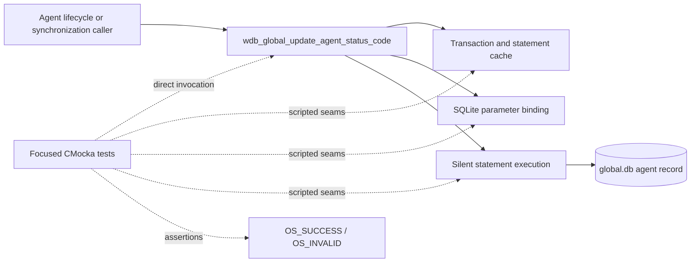
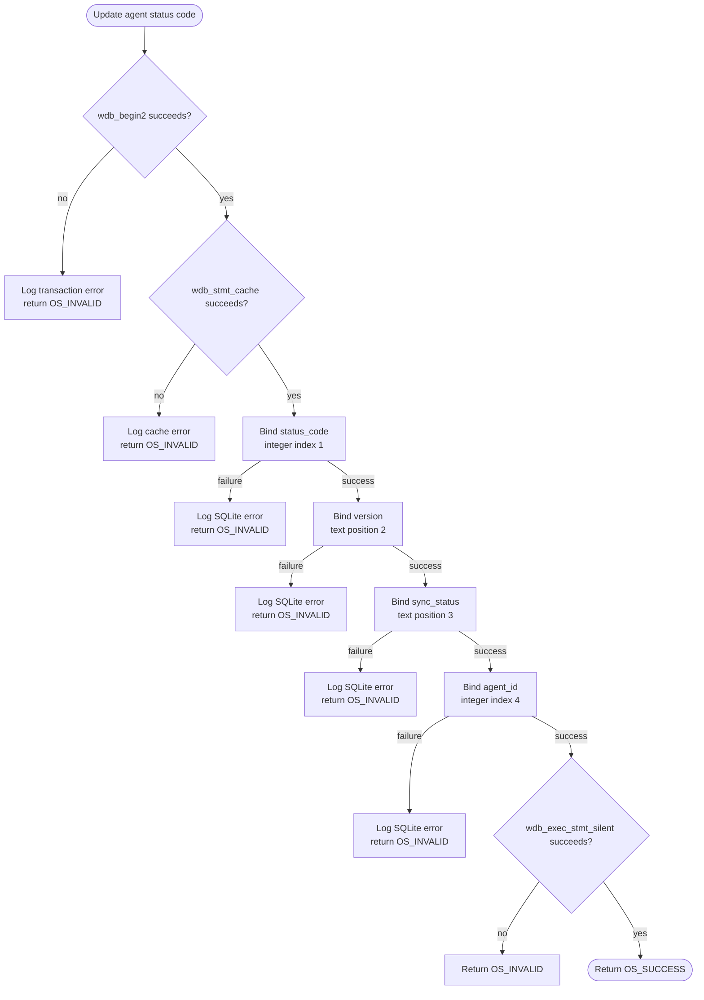
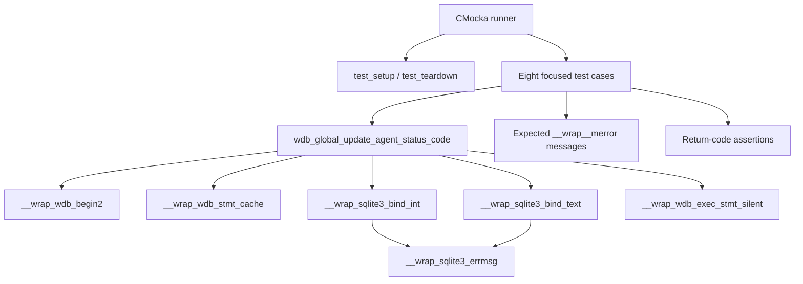
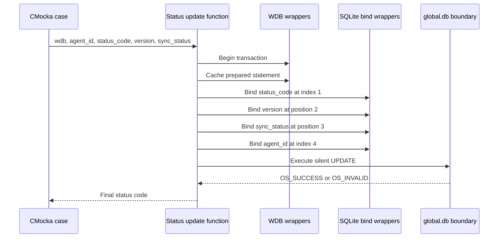
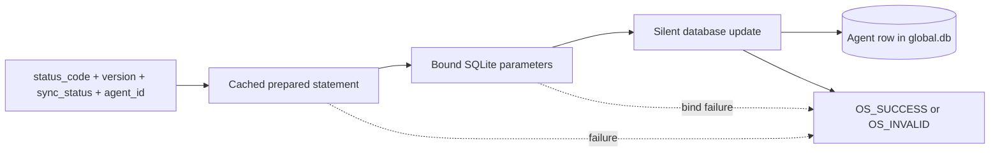

# `update_agent_status_code_tests`

## Introduction

`update_agent_status_code_tests` documents the focused CMocka coverage for
`wdb_global_update_agent_status_code()`, implemented in
`src/wazuh_db/wdb_global.c` and exercised from
`src/unit_tests/wazuh_db/test_wdb_global.c`.

The function updates an agent's status code together with its Wazuh version
and synchronization status in the global database. The tests verify the
standard Wazuh DB write pipeline: transaction setup, statement caching,
ordered SQLite parameter binding, silent statement execution, and conversion
of failures into `OS_INVALID`.

This is a leaf document of the broader [`test_wdb_global`](test_wdb_global.md)
suite. Global database responsibilities and production architecture are
described in [`wazuh_db_global`](wazuh_db_global.md); fixture and linker-wrap
conventions are described in
[`test_wdb_global_test_infrastructure`](test_wdb_global_test_infrastructure.md).

## System position

The production operation belongs to the Wazuh DB global-database layer. A
caller such as the agent lifecycle, keepalive, or synchronization workflow
provides the latest status information; the global DB layer persists it in the
agent row of `global.db`.



The focused module does not test command parsing, socket transport, real SQL
execution, or the callers that decide when the status is changed. Those
concerns remain in the linked parent and production documentation.

## Contract under test

The exercised interface is:

```c
int wdb_global_update_agent_status_code(wdb_t *wdb,
                                        int agent_id,
                                        int status_code,
                                        const char *version,
                                        const char *sync_status);
```

The tests establish this observable sequence:

1. Begin or join a transaction through `wdb_begin2()`.
2. Obtain the cached prepared statement through `wdb_stmt_cache()`.
3. Bind `status_code` as SQLite integer parameter 1.
4. Bind `version` as SQLite text parameter 2.
5. Bind `sync_status` as SQLite text parameter 3.
6. Bind `agent_id` as SQLite integer parameter 4.
7. Execute the update with `wdb_exec_stmt_silent()`.
8. Return `OS_SUCCESS` only when the complete write succeeds; otherwise
   return `OS_INVALID` and log the SQLite or Wazuh DB error.



The SQL statement identifier and target column names are implementation
details owned by `wdb_global.c`; this module verifies the binding contract and
failure boundaries rather than duplicating SQL.

## Architecture and dependencies



| Dependency | Role in this module |
|---|---|
| `wdb.h` | Supplies `wdb_t`, status constants, and the target declaration. |
| `test_setup()` / `test_teardown()` | Creates and destroys an isolated synthetic global DB context. |
| `__wrap_wdb_begin2` | Simulates transaction setup success or failure. |
| `__wrap_wdb_stmt_cache` | Simulates prepared-statement cache success or failure. |
| `__wrap_sqlite3_bind_int` | Verifies integer binding order and values for status code and agent ID. |
| `__wrap_sqlite3_bind_text` | Verifies version and synchronization-status values and positions. |
| `__wrap_sqlite3_errmsg` | Supplies deterministic SQLite error text for logging assertions. |
| `__wrap_wdb_exec_stmt_silent` | Controls the final database write result. |
| CMocka | Registers tests, scripts wrapper behavior, and asserts outcomes. |

Each test receives a fresh `wdb_t` whose ID is `"global"`; no real SQLite
connection is opened. The shared fixture lifecycle is intentionally not
duplicated here.

## Test scenarios

| Test case | Injected failure or success | Expected result |
|---|---|---|
| `test_wdb_global_update_agent_status_code_transaction_fail` | Transaction begins (`1`), but statement caching returns `-1`. | Logs `Cannot cache statement`; returns `OS_INVALID`. Despite its name, this case covers cache failure. |
| `test_wdb_global_update_agent_status_code_cache_fail` | Transaction setup returns `-1`. | Logs `Cannot begin transaction`; returns `OS_INVALID`. Despite its name, this case covers transaction failure. |
| `test_wdb_global_update_agent_status_code_bind1_fail` | Binding integer `status_code` at index 1 returns `SQLITE_ERROR`. | Logs `DB(global) sqlite3_bind_int(): ERROR MESSAGE`; returns `OS_INVALID`. |
| `test_wdb_global_update_agent_status_code_bind2_fail` | Binding `version` at text position 2 fails. | Logs the SQLite text-bind error; returns `OS_INVALID`. |
| `test_wdb_global_update_agent_status_code_bind3_fail` | Binding `sync_status` at text position 3 fails. | Logs the SQLite text-bind error; returns `OS_INVALID`. |
| `test_wdb_global_update_agent_status_code_bind4_fail` | Binding `agent_id` at integer index 4 fails. | Logs the SQLite integer-bind error; returns `OS_INVALID`. |
| `test_wdb_global_update_agent_status_code_step_fail` | All four bindings succeed; silent execution returns `OS_INVALID`. | Returns `OS_INVALID`; no successful-write result is exposed. |
| `test_wdb_global_update_agent_status_code_success` | Transaction, cache, all bindings, and execution succeed. | Returns `OS_SUCCESS`. |

All cases use the representative inputs `agent_id = 1`, `status_code = 0`,
`version = "v4.5.0"`, and `sync_status = "synced"`. Failure cases stop at the
first injected error, which verifies short-circuit behavior and prevents later
bindings or execution from being treated as successful.

## Component interaction and data flow





## Maintenance guidance

When the production function changes, update this document if any of the
following observable contracts changes:

- parameter order, SQLite type, or binding position;
- transaction or statement-cache prerequisites;
- error propagation or diagnostic text;
- final execution helper or return-code mapping.

The two test names for transaction and cache failures are historically
reversed relative to the behavior they inject. Preserve that fact when
interpreting failures or renaming tests, and update both the source registry
and this matrix together.

For broader agent state, synchronization, group, backup, and connection
coverage, use [`test_wdb_global`](test_wdb_global.md) instead of extending this
leaf document with unrelated behavior.

## Source references

- Test source: `src/unit_tests/wazuh_db/test_wdb_global.c`
- Production implementation: `src/wazuh_db/wdb_global.c`
- Public Wazuh DB declarations: `src/wazuh_db/wdb.h`
- Parent test documentation: [`test_wdb_global.md`](test_wdb_global.md)
- Global DB documentation: [`wazuh_db_global.md`](wazuh_db_global.md)
- Shared fixture and wrapper documentation: [`test_wdb_global_test_infrastructure.md`](test_wdb_global_test_infrastructure.md)
