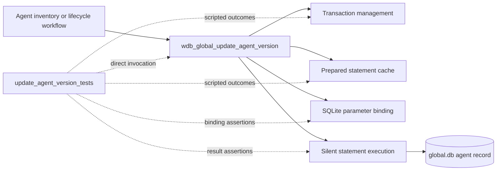
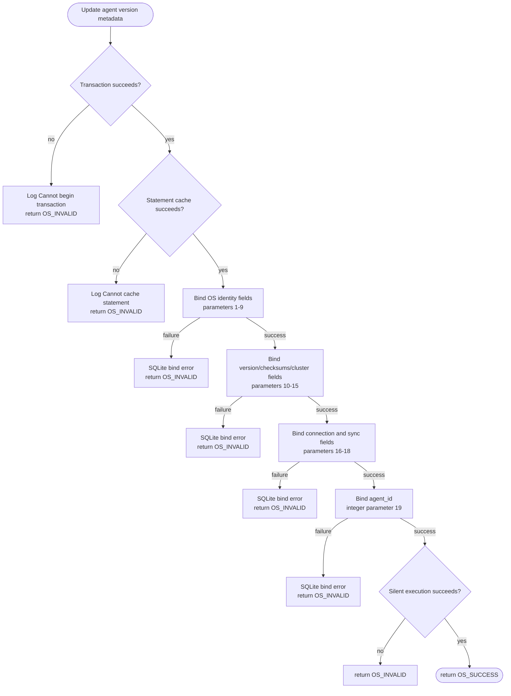
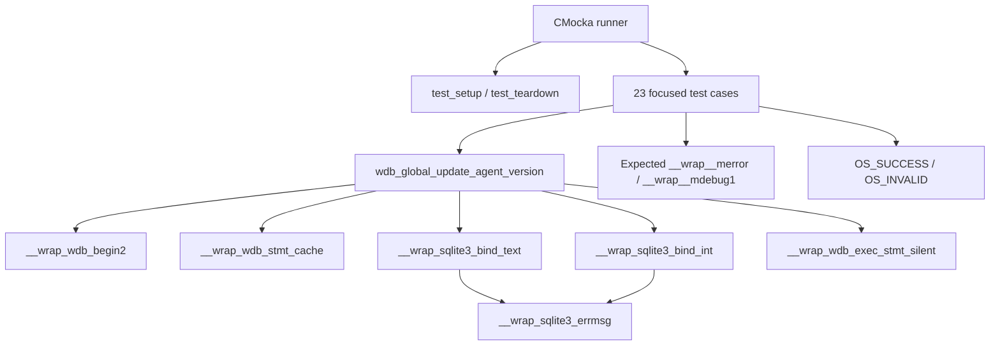
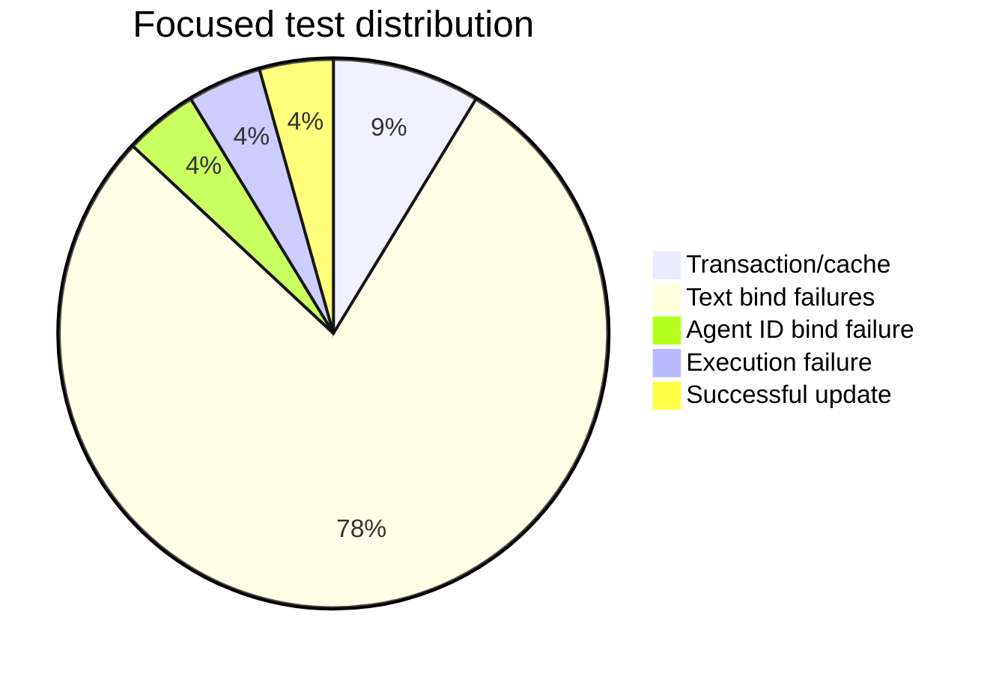
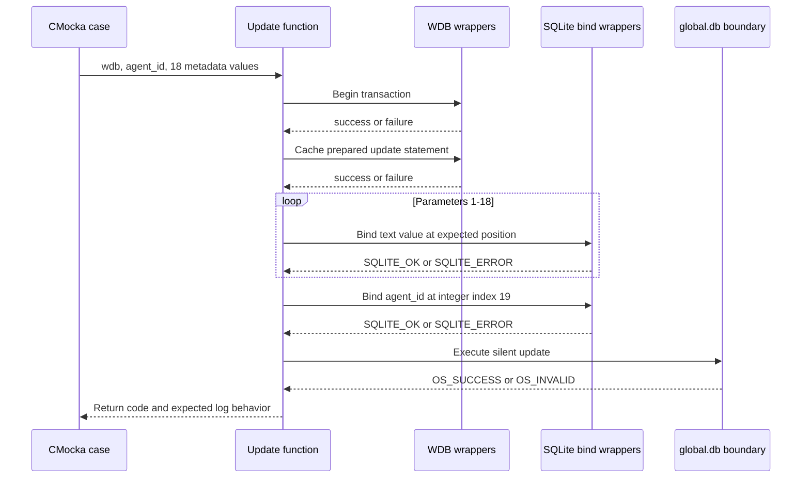

# `update_agent_version_tests`

## Introduction

`update_agent_version_tests` documents the focused CMocka coverage for
`wdb_global_update_agent_version()`, the Wazuh DB operation that persists an
agent's operating-system identity, Wazuh version, configuration checksums,
cluster metadata, network address, connection state, and synchronization
state in the global database.

The tests are implemented in
[`src/unit_tests/wazuh_db/test_wdb_global.c`](../../src/unit_tests/wazuh_db/test_wdb_global.c).
They form one leaf of the broader [`test_wdb_global`](test_wdb_global.md)
suite. This page describes only the 23 supplied test components for the
version-update operation; shared fixture behavior and global database
architecture remain documented by the parent pages.

## System position

Agent inventory and lifecycle workflows collect platform and version
information, then pass it to the Wazuh DB global layer. The operation updates
one agent row through a cached SQLite statement. The unit tests call the
operation directly and replace the transaction, statement, SQLite, and
logging boundaries with deterministic wrappers.



The module does not test the upstream inventory collector, command parser,
socket protocol, database schema, or real SQLite execution. Those concerns
belong to the linked production and parent-suite documentation.

## Contract under test

The exercised interface is conceptually:

```c
int wdb_global_update_agent_version(
    wdb_t *wdb,
    int agent_id,
    const char *os_name,
    const char *os_version,
    const char *os_major,
    const char *os_minor,
    const char *os_codename,
    const char *os_platform,
    const char *os_build,
    const char *os_uname,
    const char *os_arch,
    const char *version,
    const char *config_sum,
    const char *merged_sum,
    const char *manager_host,
    const char *node_name,
    const char *agent_ip,
    const char *connection_status,
    const char *sync_status,
    const char *group_config_status);
```

The observable write pipeline is:

1. Begin or join a transaction with `wdb_begin2()`.
2. Cache the update statement with `wdb_stmt_cache()`.
3. Bind the 18 text fields in their declared order.
4. Bind `agent_id` as integer parameter 19.
5. Execute the statement with `wdb_exec_stmt_silent()`.
6. Return `OS_SUCCESS` only after every step succeeds; otherwise return
   `OS_INVALID` and log the relevant diagnostic.



The tests verify the parameter order and values, but do not duplicate the SQL
statement text or schema definition owned by `wdb_global.c` and the global DB
schema.

## Parameter mapping

The test expectations establish the following binding contract. Text values
are passed through `sqlite3_bind_text`; the final agent identifier uses
`sqlite3_bind_int`.

| SQLite parameter | Source argument | Kind | Representative value |
|---:|---|---|---|
| 1 | `os_name` | text | `test_name` |
| 2 | `os_version` | text | `test_version` |
| 3 | `os_major` | text | `test_major` |
| 4 | `os_minor` | text | `test_minor` |
| 5 | `os_codename` | text | `test_codename` |
| 6 | `os_platform` | text | `test_platform` |
| 7 | `os_build` | text | `test_build` |
| 8 | `os_uname` | text | `test_uname` |
| 9 | `os_arch` | text | `test_arch` |
| 10 | `version` | text | `test_version` |
| 11 | `config_sum` | text | `test_config` |
| 12 | `merged_sum` | text | `test_merged` |
| 13 | `manager_host` | text | `test_manager` |
| 14 | `node_name` | text | `test_node` |
| 15 | `agent_ip` | text | `test_ip` |
| 16 | `connection_status` | text | `active` |
| 17 | `sync_status` | text | `synced` |
| 18 | `group_config_status` | text | `synced` |
| 19 | `agent_id` | integer | `1` |

This ordered mapping is the most important maintenance invariant in the
module: every `bindN_fail` test injects an error at exactly one position after
all preceding bindings have succeeded.

## Test architecture and dependencies

Each test is registered with `cmocka_unit_test_setup_teardown()` and receives
a fresh synthetic `wdb_t`. The common fixture allocates a global DB context,
sets its ID to `"global"`, allocates a placeholder SQLite handle, initializes
Wazuh DB configuration, and releases all resources during teardown. No live
database is opened.



| Dependency | Role in these tests |
|---|---|
| `wdb.h` | Supplies the Wazuh DB type, constants, and target declaration. |
| `test_setup()` / `test_teardown()` | Isolates each test with a minimal global DB fixture. |
| `__wrap_wdb_begin2` | Injects transaction success or failure. |
| `__wrap_wdb_stmt_cache` | Injects statement-cache success or failure. |
| `__wrap_sqlite3_bind_text` | Verifies each text parameter's position and value. |
| `__wrap_sqlite3_bind_int` | Verifies the final agent-ID parameter and its failure path. |
| `__wrap_sqlite3_errmsg` | Provides deterministic SQLite error text. |
| `__wrap_wdb_exec_stmt_silent` | Controls the final write result. |
| CMocka and logging wrappers | Register tests and verify short-circuit diagnostics. |

## Test scenarios

| Test | Injected condition | Expected behavior |
|---|---|---|
| `test_wdb_global_update_agent_version_transaction_fail` | `wdb_begin2()` returns `-1`. | Logs `Cannot begin transaction`; returns `OS_INVALID`; no cache or bind occurs. |
| `test_wdb_global_update_agent_version_cache_fail` | Transaction succeeds; `wdb_stmt_cache()` returns `-1`. | Logs `Cannot cache statement`; returns `OS_INVALID`. |
| `test_wdb_global_update_agent_version_bind1_fail` through `bind9_fail` | Text binding fails at one of the OS identity fields. | Logs the SQLite text-bind error and returns `OS_INVALID`. Earlier bindings must remain successful. |
| `test_wdb_global_update_agent_version_bind10_fail` through `bind15_fail` | Text binding fails at version, checksum, or cluster metadata. | Logs the SQLite text-bind error and returns `OS_INVALID`. |
| `test_wdb_global_update_agent_version_bind16_fail` through `bind18_fail` | Text binding fails at connection or synchronization metadata. | Logs the SQLite text-bind error and returns `OS_INVALID`. |
| `test_wdb_global_update_agent_version_bind19_fail` | Integer binding of `agent_id` fails. | Logs the SQLite integer-bind error and returns `OS_INVALID`. |
| `test_wdb_global_update_agent_version_step_fail` | All 19 bindings succeed; silent execution returns `OS_INVALID`. | Returns `OS_INVALID`; the update is not reported as successful. |
| `test_wdb_global_update_agent_version_success` | Transaction, cache, all bindings, and execution succeed. | Returns `OS_SUCCESS`. |



The test naming is intentionally positional. A failure at bind 12, for
example, proves that parameters 1 through 11 were accepted and that the
function stops before binding `merged_sum` and later fields.

## Component interaction flow



## Failure semantics and maintenance guidance

The focused suite establishes these observable rules:

- transaction setup and statement caching are prerequisites for every bind;
- binding is strictly ordered and stops at the first SQLite error;
- all metadata fields are text-bound, while only `agent_id` is integer-bound;
- SQLite errors are surfaced through the global DB error-message format;
- execution failure maps to `OS_INVALID` even when all bindings succeeded;
- only a fully completed update returns `OS_SUCCESS`.

Update this page if the production signature, field order, SQLite parameter
types, transaction ownership, statement-cache behavior, or return-code policy
changes. Link related agent-state behavior to
[`update_agent_status_code_tests`](update_agent_status_code_tests.md),
[`update_agent_name_tests`](update_agent_name_tests.md), and
[`update_agent_keepalive_tests`](update_agent_keepalive_tests.md) rather than
duplicating their write-pipeline descriptions.

## References

- Test source: [`src/unit_tests/wazuh_db/test_wdb_global.c`](../../src/unit_tests/wazuh_db/test_wdb_global.c)
- Parent suite: [`test_wdb_global`](test_wdb_global.md)
- Production global DB implementation: [`wazuh_db_global`](wazuh_db_global.md)
- Shared test fixture and wrappers: [`test_wdb_global_test_infrastructure`](test_wdb_global_test_infrastructure.md)
- Related agent status update tests: [`update_agent_status_code_tests`](update_agent_status_code_tests.md)
- Related agent name update tests: [`update_agent_name_tests`](update_agent_name_tests.md)
- Related keepalive update tests: [`update_agent_keepalive_tests`](update_agent_keepalive_tests.md)
