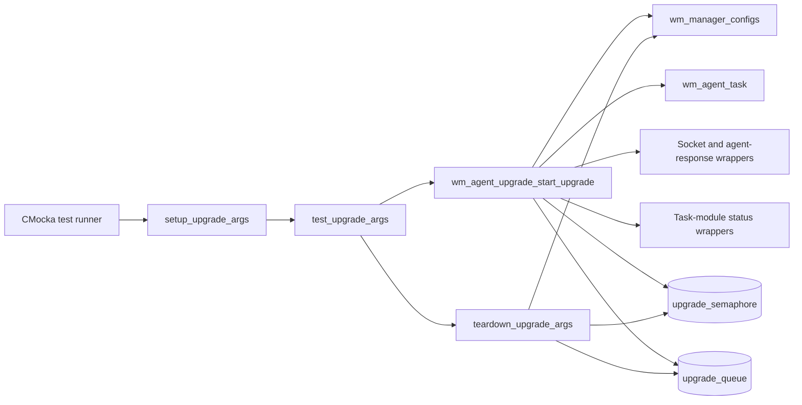
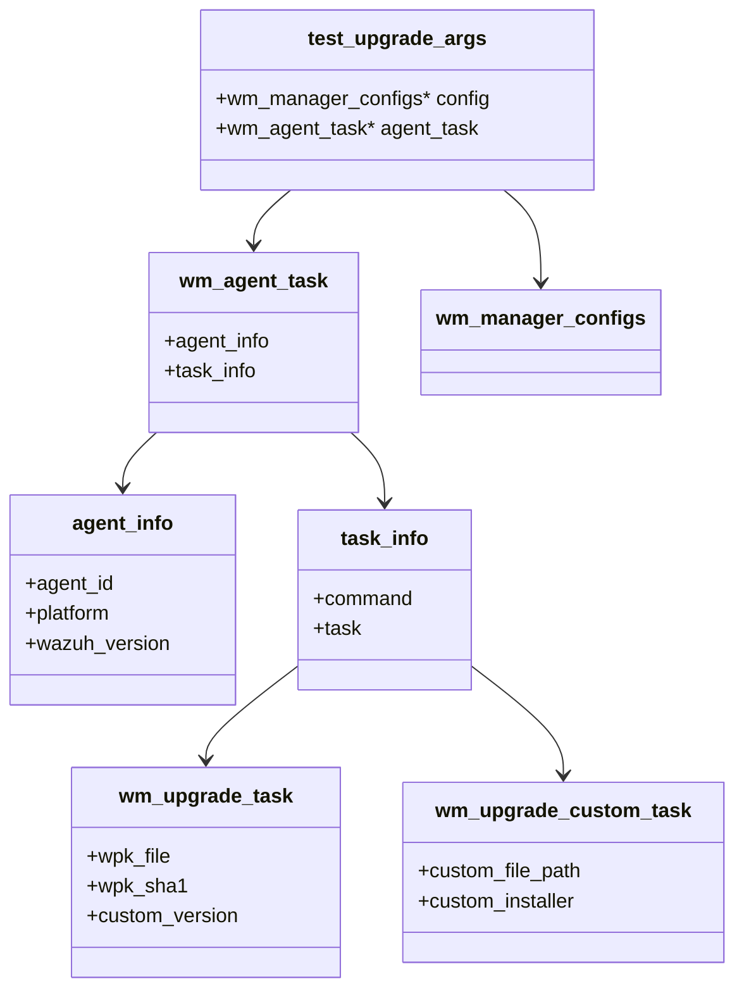
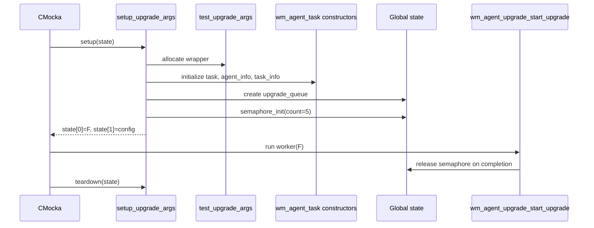
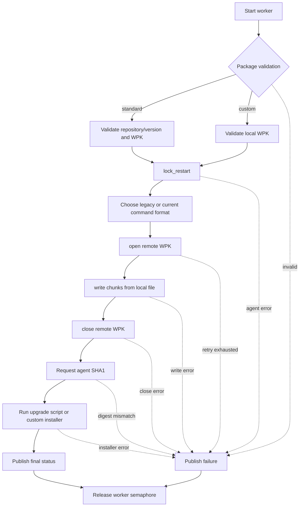
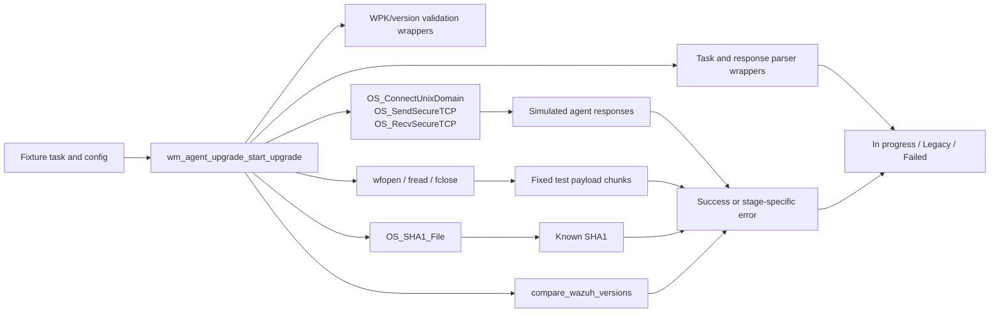
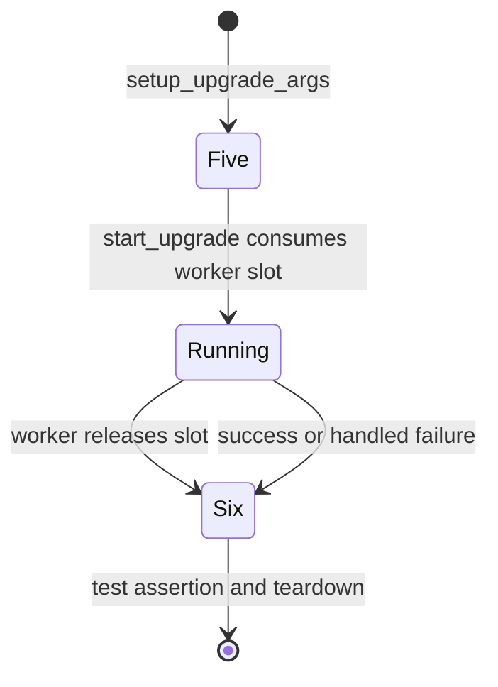

# `upgrade_args_tests`

## Introduction

`upgrade_args_tests` documents the CMocka fixture used by the manager-side agent-upgrade tests that exercise `wm_agent_upgrade_start_upgrade`. The fixture packages a manager configuration and an initialized `wm_agent_task`, then supplies the process-wide queue and semaphore state expected by the upgrade worker.

This is test support, not production upgrade logic. The shared runner, wrapper library, and complete test matrix are described in [agent_upgrade_upgrades_test_infrastructure](agent_upgrade_upgrades_test_infrastructure.md). Production responsibilities are covered by [agent_upgrade_module](agent_upgrade_module.md), [agent_upgrade_commands](agent_upgrade_commands.md), and [agent_upgrade_tasks](agent_upgrade_tasks.md).

## Scope and location

The fixture is defined in:

`src/unit_tests/wazuh_modules/agent_upgrade/test_wm_agent_upgrade_upgrades.c`

Its focused components are:

| Component | Role |
| --- | --- |
| `_test_upgrade_args` / `test_upgrade_args` | Aggregate passed to the upgrade worker; contains `config` and `agent_task`. |
| `setup_upgrade_args` | Allocates and initializes the aggregate, configuration, task hierarchy, queue, and semaphore. |
| `teardown_upgrade_args` | Destroys shared synchronization state and releases the configuration and queue. |
| `test_upgrade_args` test group | The four `wm_agent_upgrade_start_upgrade` tests registered with CMocka setup/teardown hooks. |

The source does not define a production function named `test_upgrade_args`; the name identifies this fixture-oriented test slice.

## Position in the test architecture

The fixture sits between CMocka and the real upgrade-worker function. External operations remain mocked, so the tests verify orchestration and ownership without starting a thread, contacting an agent, or reading a real package.



## Fixture data model

`test_upgrade_args` is intentionally a thin adapter around the production argument shape:

```c
typedef struct _test_upgrade_args {
    wm_manager_configs *config;
    wm_agent_task *agent_task;
} test_upgrade_args;
```

The task is initialized with the same nested records used by production code:



Only one upgrade-task variant is populated per test. Standard upgrades use `wm_upgrade_task`; custom upgrades use `wm_upgrade_custom_task` and set `WM_UPGRADE_UPGRADE_CUSTOM` in `task_info->command`.

## Setup lifecycle

`setup_upgrade_args` performs the following initialization:

1. Allocates the `test_upgrade_args` wrapper and a `wm_manager_configs` object.
2. Creates an empty `wm_agent_task` through `wm_agent_upgrade_init_agent_task`.
3. Allocates its `agent_info` and `task_info` children with the corresponding constructors.
4. Stores the wrapper in CMocka state slot `state[0]` and the configuration in `state[1]`.
5. Initializes the global `upgrade_queue` with `linked_queue_init()`.
6. Initializes `upgrade_semaphore` with an initial count of `5`.

The worker receives the wrapper as its argument. The tests deliberately keep the configuration and task in one object because `wm_agent_upgrade_start_upgrade` needs both while processing a task.



## Cleanup and ownership

`teardown_upgrade_args` retrieves the configuration from `state[1]`, frees it, releases `upgrade_queue`, and destroys `upgrade_semaphore`.

The wrapper and task are not independently freed by this teardown function. That asymmetry is intentional: the worker/test path owns the task argument during execution, and the mocked worker/creation boundary models the corresponding ownership transfer. Maintainers changing the fixture should preserve this contract or update every consumer and teardown path together; otherwise the suite can develop leaks, double frees, or use-after-free failures.

The fixture also assumes that no worker still uses the queue or semaphore when teardown begins. A test that introduces asynchronous execution must join or otherwise synchronize the worker before returning.

## Consumers and scenarios

The fixture is attached to four tests:

| Test | Scenario | Important setup or assertion |
| --- | --- | --- |
| `test_wm_agent_upgrade_start_upgrade_upgrade_ok` | Successful repository-backed upgrade | Simulates validation, package transfer, SHA1 verification, installer execution, and status update; expects semaphore count `6`. |
| `test_wm_agent_upgrade_start_upgrade_upgrade_legacy_ok` | Successful upgrade for a legacy target | Adds `custom_version`; verifies the final `Legacy` status and the same semaphore accounting. |
| `test_wm_agent_upgrade_start_upgrade_upgrade_custom_ok` | Successful custom-package upgrade | Uses a local WPK path and optional installer; verifies local SHA1 calculation, transfer, and completion. |
| `test_wm_agent_upgrade_start_upgrade_upgrade_err` | Failure during the worker flow | Simulates a `lock_restart` failure, publishes `Failed` status with the mapped error, and still expects semaphore count `6`. |

The successful standard and custom cases model the same transfer stages:



## Data flow and mocked boundaries

The tests populate task data locally, while wrappers provide deterministic results at every external seam:



This means the fixture tests the worker’s sequencing and return/status mapping, not the implementation of sockets, hashing, file I/O, or JSON parsing. Those boundaries are covered by the shared suite described in [agent_upgrade_upgrades_test_infrastructure](agent_upgrade_upgrades_test_infrastructure.md) and the specialized [agent_upgrade_parsing](agent_upgrade_parsing.md) tests.

## Semaphore contract

The semaphore starts at `5`. A completed `wm_agent_upgrade_start_upgrade` execution releases one slot, so the expected postcondition is `6` for both success and failure tests. The assertion is a compact guard against worker paths that return without releasing capacity.



The exact numeric value is fixture-specific; the behavioral contract is that each started worker restores one semaphore unit on every terminal path.

## Maintenance guidance

- If the production worker gains a required field, initialize it in `setup_upgrade_args` and populate it only in the scenario that needs it.
- Keep standard and custom task variants separate; mixing their nested structures can hide invalid production assumptions.
- Preserve the mocked protocol order when adding expectations: lock, format selection, open, write, close, SHA1, then upgrade.
- Add failure assertions for both the returned/mapped error and the final status update.
- Keep teardown synchronized with worker completion before destroying the queue or semaphore.

## References

- [agent_upgrade_upgrades_test_infrastructure](agent_upgrade_upgrades_test_infrastructure.md) — shared fixtures, wrappers, runner registration, and full test coverage.
- [agent_upgrade_module](agent_upgrade_module.md) — manager/agent upgrade architecture and WPK workflow.
- [agent_upgrade_commands](agent_upgrade_commands.md) — command handling and task-status orchestration.
- [agent_upgrade_tasks](agent_upgrade_tasks.md) — pending-task ownership, queueing, and task-manager interaction.
- [agent_upgrade_parsing](agent_upgrade_parsing.md) — request, response, and task-module message parsing.
