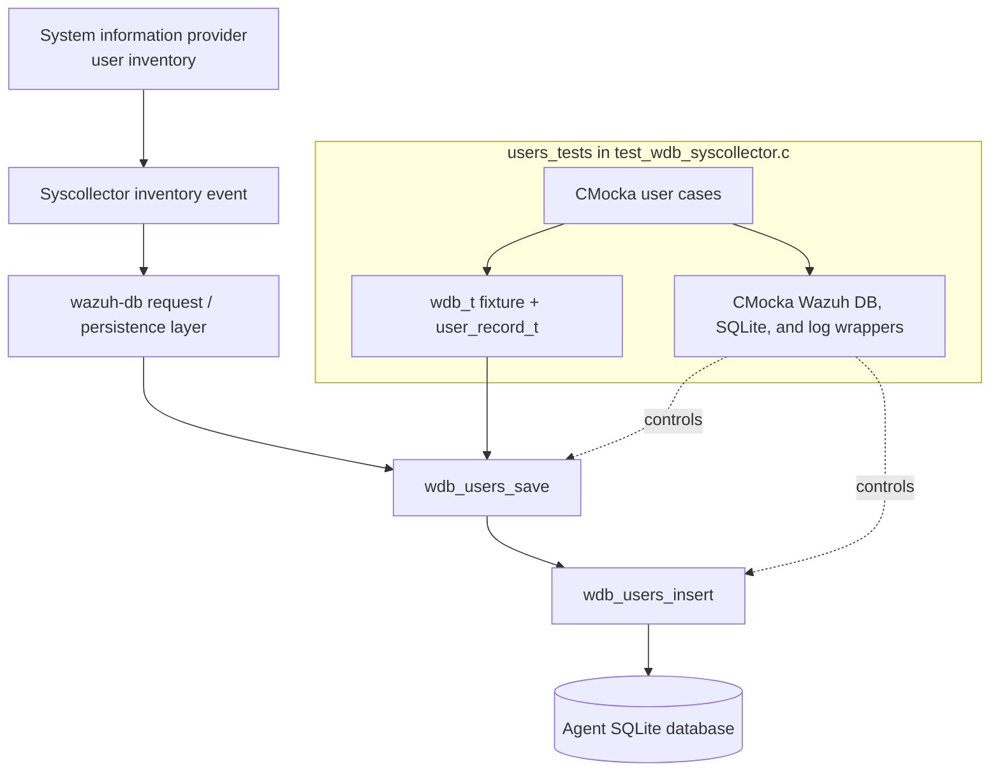
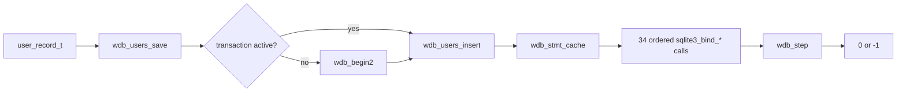
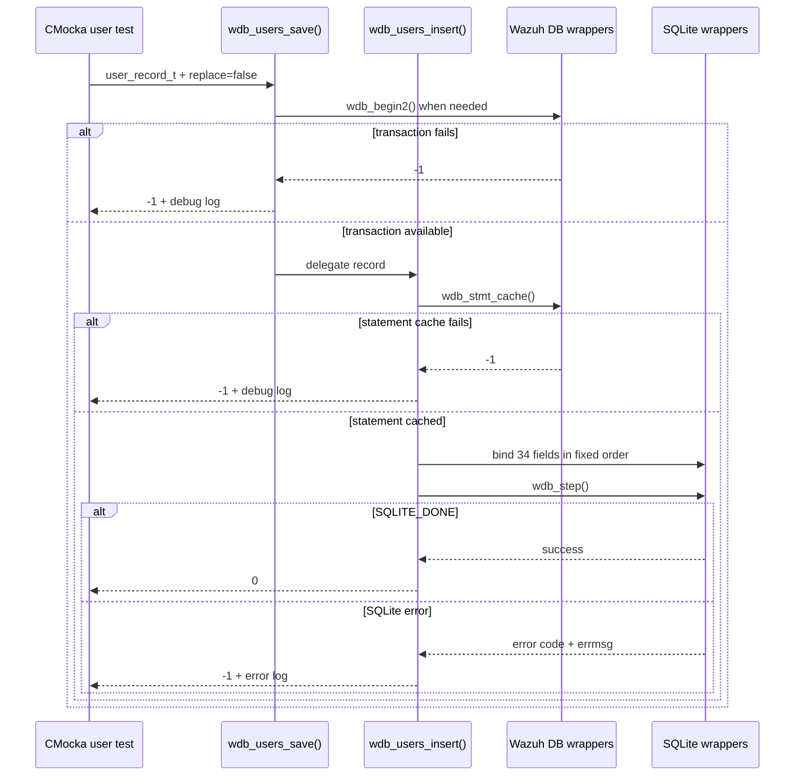
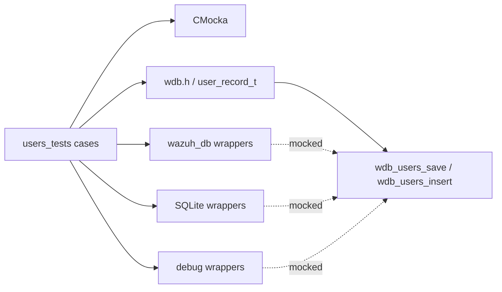

# `users_tests`

## Introduction

`users_tests` documents the user-inventory persistence tests embedded in
`src/unit_tests/wazuh_db/test_wdb_syscollector.c`. The cases validate the
transaction wrapper and SQLite insertion path for `wdb_users_save()` and
`wdb_users_insert()`, including ordered binding of identity, account-policy,
login, and checksum fields.

This is a focused child view of the broader [`test_wdb_syscollector`](test_wdb_syscollector.md)
suite. Shared fixtures, wrapper behavior, null-normalization rules, and test
registration are documented in [`test_wdb_syscollector_test_infrastructure`](test_wdb_syscollector_test_infrastructure.md).
The neighboring group-inventory tests are documented in [`groups_tests`](groups_tests.md).

## Position in the system

Syscollector gathers local account information and sends it through the Wazuh
DB persistence layer. The production implementation receives a typed
`user_record_t`, prepares the users statement, binds its fields, and executes
it against the agent's SQLite database. These tests replace the transaction,
SQLite, and logging boundaries with CMocka wrappers; no real database is used.



The collection side is outside this module. For platform-specific user data
providers, see [`data_provider_users`](data_provider_users.md),
[`data_provider_users_linux`](data_provider_users_linux.md),
[`data_provider_users_darwin`](data_provider_users_darwin.md), and
[`data_provider_users_windows`](data_provider_users_windows.md). Database
engine responsibilities are covered by [`wazuh_db_engine`](wazuh_db_engine.md).

## API layers under test

The tests distinguish orchestration from direct SQL insertion:



`wdb_users_save()` starts a transaction when the fixture is not already inside
one, then delegates to `wdb_users_insert()`. `wdb_users_insert()` owns prepared
statement caching, type-specific SQLite binding, execution, and SQLite error
reporting. The tests assert this division through distinct mocked failure
points.

## User record and binding contract

The success case initializes a representative `user_record_t` with values that
exercise signed identifiers, floating-point timestamps, booleans, nullable
text, account policy, and login metadata. The expected SQLite parameter order
is:

| Position | Record field | Binding type | Example / rule |
|---:|---|---|---|
| 1 | `scan_id` | text | `"scan_id"` |
| 2 | `scan_time` | text | `"scan_time"` |
| 3 | `user_name` | text | `"name"` |
| 4 | `user_full_name` | text | `"full_name"` |
| 5 | `user_home` | text | `"home"` |
| 6 | `user_id` | int64 | `1` |
| 7 | `user_uid_signed` | int64 | `-1` |
| 8 | `user_uuid` | text | `"uuid"` |
| 9 | `user_groups` | text | `"group1,group2"` |
| 10 | `user_group_id` | int64 | `1` |
| 11 | `user_group_id_signed` | int64 | `-1` |
| 12 | `user_created` | double | `1750696338.665` |
| 13 | `user_roles` | text | `"roles"` |
| 14 | `user_shell` | text | `"shell"` |
| 15 | `user_type` | text | `"type"` |
| 16 | `user_is_hidden` | int | `true` → `1` |
| 17 | `user_is_remote` | int | `false` → `0` |
| 18 | `user_last_login` | int64 | `1750696338` |
| 19 | `user_auth_failed_count` | int64 | `1` |
| 20 | `user_auth_failed_timestamp` | double | `1750696338.665` |
| 21 | `user_password_last_change` | double | `1750696338.665` |
| 22 | `user_password_expiration_date` | int | `1750696338` |
| 23 | `user_password_hash_algorithm` | text | `"hash"` |
| 24 | `user_password_inactive_days` | int | `0` |
| 25 | `user_password_max_days_between_changes` | int | `9999` |
| 26 | `user_password_min_days_between_changes` | int | `0` |
| 27 | `user_password_status` | text | `"status"` |
| 28 | `user_password_warning_days_before_expiration` | int | `10` |
| 29 | `process_pid` | int64 | `1010` |
| 30 | `host_ip` | text | Comma-separated addresses |
| 31 | `login_status` | int | `true` → `1` |
| 32 | `login_type` | text | `"type"` |
| 33 | `login_tty` | text | `"tty"` |
| 34 | `checksum` | text | `"checksum"` |

The strict `expect_value()` and `expect_string()` assertions make parameter
order, SQLite type selection, boolean conversion, and signed-value handling
observable. Changes to the production statement or `user_record_t` mapping
must update this contract together with the schema and public declarations.

## Registered test cases

### `wdb_users_save()`

- `test_wdb_users_save_transaction_fail` configures `wdb_begin2()` to return
  `-1`, expects `at wdb_users_save(): cannot begin transaction`, and verifies
  that the wrapper returns `-1` without attempting insertion.
- `test_wdb_users_save_insert_fail` marks the fixture as already inside a
  transaction, makes `wdb_stmt_cache()` fail during the delegated insert, and
  expects `at wdb_users_insert(): cannot cache statement` with return `-1`.
- `test_wdb_users_save_success` starts a transaction successfully, verifies all
  34 bindings in order, returns `SQLITE_DONE`, and expects `0`.

### `wdb_users_insert()`

- `test_wdb_users_insert_sql_fail` allows statement caching and all bindings,
  returns a non-success SQLite step code, supplies `"ERROR"` from
  `sqlite3_errmsg()`, expects `SQLite: ERROR`, and verifies return `-1`.

The source also contains group tests immediately after the user cases. They
are a separate child module and are documented in [`groups_tests`](groups_tests.md).

## Save and insert control flow



## Failure and result semantics

```mermaid
stateDiagram-v2
    [*] --> Ready
    Ready --> TransactionError: wdb_begin2 = -1
    TransactionError --> [*]: return -1
    Ready --> CacheError: wdb_stmt_cache = -1
    CacheError --> [*]: return -1
    Ready --> Binding: cache succeeds
    Binding --> SQLiteError: wdb_step != SQLITE_DONE
    SQLiteError --> [*]: log errmsg; return -1
    Binding --> Persisted: wdb_step = SQLITE_DONE
    Persisted --> [*]: return 0
```

The user-specific tests establish these observable conventions:

- `0` / `OS_SUCCESS` indicates successful persistence.
- `-1` / `OS_INVALID` indicates transaction, statement-cache, or SQLite
  execution failure.
- Debug messages identify transaction and cache failures at the function that
  detected them.
- SQLite execution failures are reported using `sqlite3_errmsg()` and the
  error logger.
- The `replace` argument is passed as `false` in these cases; replacement and
  duplicate handling are covered more broadly by the neighboring syscollector
  tests and shared infrastructure.

## Test fixtures and dependencies

The four cases use `test_setup()` and `test_teardown()` from the parent source.
The fixture allocates a zeroed `wdb_t`; individual tests set `transaction` to
`0` or `1` to select the orchestration path. The user record is constructed
inline in each case so the expected values remain close to the binding
assertions.



Relevant source-level dependencies include:

- `../wazuh_db/wdb.h` for `wdb_t`, `user_record_t`, status constants, and
  persistence declarations;
- `../wrappers/wazuh/wazuh_db/wdb_wrappers.h` for transaction and statement
  cache seams;
- `../wrappers/externals/sqlite/sqlite3_wrappers.h` for bind, step, and error
  expectations;
- `../wrappers/wazuh/shared/debug_op_wrappers.h` for diagnostic assertions;
- CMocka for `will_return()`, `expect_*()`, and test registration.

The wrapper and fixture ownership rules are intentionally not repeated here;
see [`test_wdb_syscollector_test_infrastructure`](test_wdb_syscollector_test_infrastructure.md).

## Maintenance guidance

When changing user persistence, update the implementation, schema/public
record definition, and this test contract together. Pay particular attention
to:

- preserving the 34-position binding order;
- retaining int64/double bindings for large identifiers and timestamps;
- preserving boolean conversion to integer bindings;
- keeping transaction-start and statement-cache diagnostics stable unless the
  change intentionally revises the observable error contract;
- adding tests when a user field changes nullability or SQLite type.

