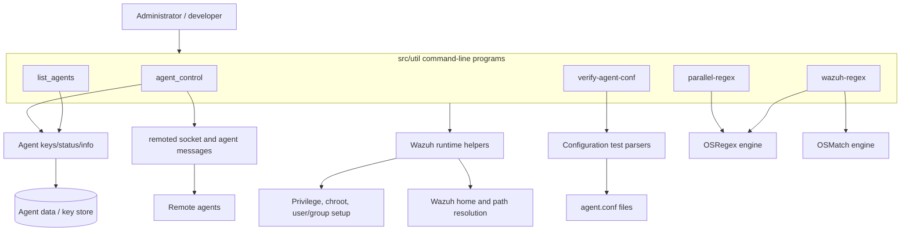
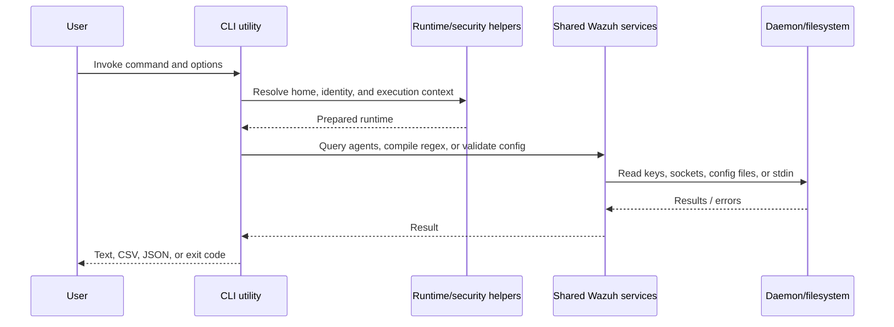
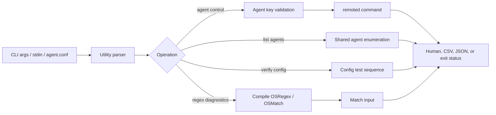

# util_cli_tools

## Purpose

`util_cli_tools` is the native command-line utility layer under `src/util`. It provides operational tools to inspect agents, control remote or local agent behavior, validate agent configuration, and exercise Wazuh regular-expression engines.

The module is intentionally thin: command-line programs parse options, establish Wazuh’s runtime/security context, call shared libraries or daemons, and render output. Agent databases, remoted protocols, configuration parsers, and regex implementations live in shared or daemon modules.

## Architecture overview

Each executable owns a `main` and `helpmsg` entry point. The common startup pattern is: set the executable name, resolve the Wazuh home directory, establish the required security context, dispatch one operation, and return a shell-friendly status.

## Utility documentation

| Utility | Responsibility | Documentation |
|---|---|---|
| `agent_control` | List, inspect, restart, or send active responses to agents | [util_cli_tools_agent_control](util_cli_tools_agent_control.md) |
| `list_agents` | List all, active, or inactive agents | [util_cli_tools_list_agents](util_cli_tools_list_agents.md) |
| `parallel-regex` | Exercise concurrent regex matching | [util_cli_tools_parallel_regex](util_cli_tools_parallel_regex.md) |
| `verify-agent-conf` | Validate one or many `agent.conf` files | [util_cli_tools_verify_agent_conf](util_cli_tools_verify_agent_conf.md) |
| `wazuh-regex` | Test patterns against stdin through multiple match APIs | [util_cli_tools_wazuh_regex](util_cli_tools_wazuh_regex.md) |

## Operational data flow

## Component interaction

## Security and error behavior

- Missing or invalid arguments generally invoke the help path and terminate non-zero.
- `agent_control` refuses manager-only operations on worker nodes and reports the master node.
- Privileged utilities resolve the Wazuh user/group, chroot, and drop privileges before accessing protected state.
- Remote actions fail explicitly when `remoted` cannot be reached or a message cannot be sent.
- Configuration verification returns a cumulative failure status across discovered files.
- Regex tools report compilation failures before processing input.

## Related modules

- [Agent module](agent_module.md) — shared agent operations and status concepts.
- [Framework communication](framework_core_communication.md) — sockets and queues.
- [Configuration data structures](Configuration_Data_Structures_(C_Headers).md) — parser structures.
- [Native daemons](Agent_&_Manager_Native_Daemons_(C).md) — remoted and checking-daemon boundaries.
- [Framework core utilities](framework_core_utils.md) — paths, results, and runtime helpers.

## Source inventory

- `src/util/agent_control.c`
- `src/util/list_agents.c`
- `src/util/parallel-regex.c`
- `src/util/verify-agent-conf.c`
- `src/util/wazuh-regex.c`
