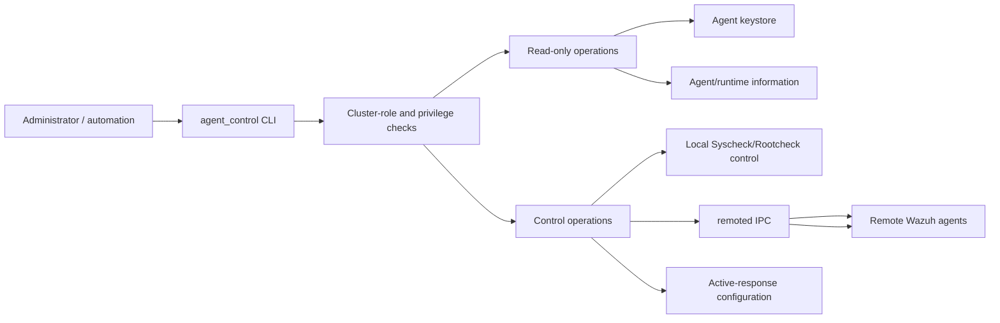
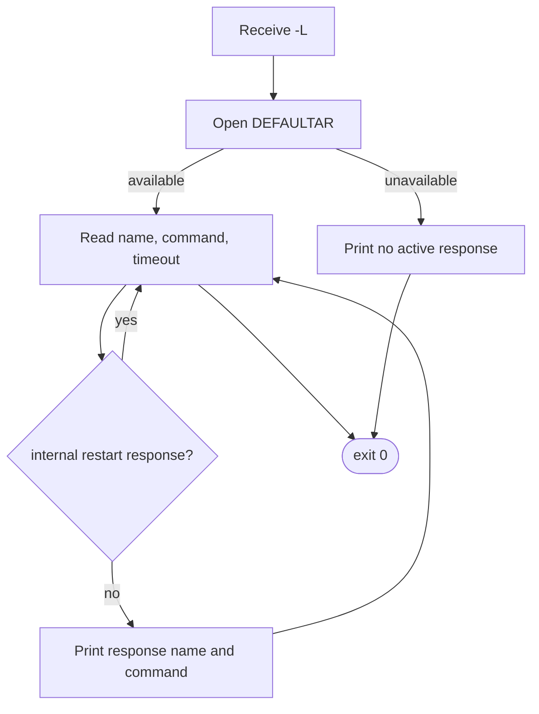
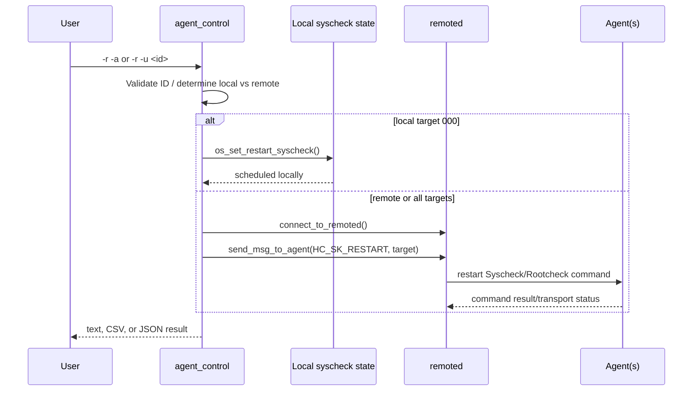
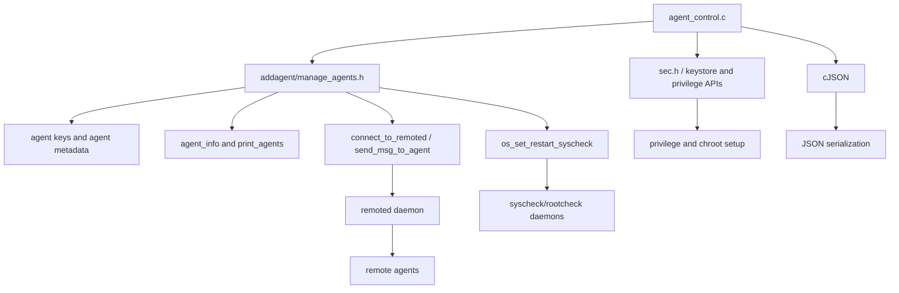

# `util_cli_tools_agent_control`

`agent_control` is a privileged Wazuh manager utility for inspecting agents and issuing operational commands to them. It can list agents, show one agent's runtime information, restart Syscheck/Rootcheck, restart the Wazuh agent process, enumerate configured active responses, and execute an approved active response against one or all agents.

The implementation is a single native CLI entry point: `src/util/agent_control.c`. It acts as an orchestration layer over existing manager libraries and IPC services; agent state, key validation, remoted transport, Syscheck/Rootcheck control, and active-response execution are implemented elsewhere. See [agent_module_core.md](agent_module_core.md), [remoted.md](remoted.md), [syscheck_module.md](syscheck_module.md), [active_response_module.md](active_response_module.md), and [shared_lib.md](shared_lib.md) for those subsystems.

## Scope and role in Wazuh

The utility runs on the manager and communicates with the local manager installation and, for remote operations, the `remoted` daemon. Agent `000` represents the local manager instance. Remote agent identifiers are checked against the manager keystore before an operation is sent.



## Source organization

| Component | Responsibility |
|---|---|
| `helpmsg` | Prints the command synopsis and terminates with status 1. |
| `main` | Parses options, establishes execution context, dispatches the selected operation, formats output, and exits. |
| `src/util/agent_control.c` | Complete CLI implementation and integration point for the utility. |

The file includes `addagent/manage_agents.h` for agent/key and manager-control helpers, `sec.h` for security and IPC primitives, and cJSON for JSON output. The source does not implement a separate service layer or persistent state store.

## Architecture

The utility follows a staged command pipeline:

1. Establish the Wazuh home directory and reject worker-node execution.
2. Parse command-line flags and choose text, CSV, or JSON output.
3. Resolve the Wazuh service user and group.
4. Drop privileges into the manager's expected filesystem context.
5. Resolve the requested agent, if any.
6. Execute exactly one terminal operation branch and exit.

```mermaid
flowchart TD
    Start([process start]) --> Name[OS_SetName agent_control]
    Name --> Home[w_homedir(argv[0])]
    Home --> Chdir[chdir Wazuh home]
    Chdir --> Cluster{worker node?}
    Cluster -- invalid --> Stop1[error and return]
    Cluster -- yes --> Stop2[reject; use master node]
    Cluster -- no --> Args[getopt option parsing]
    Args --> Format[select text / CSV / JSON]
    Format --> Identity[resolve USER and GROUPGLOBAL]
    Identity --> Priv[set group, chroot, set user]
    Priv --> Host[gethostname]
    Host --> Dispatch{operation selected}
    Dispatch --> ListResponses[List active responses]
    Dispatch --> ListAgents[List agents]
    Dispatch --> Info[Show agent information]
    Dispatch --> Syscheck[Restart Syscheck/Rootcheck]
    Dispatch --> Restart[Restart agent process]
    Dispatch --> ActiveResponse[Run active response]
    Dispatch --> Invalid[Invalid combination -> help]
```

### Cluster restriction

`w_is_worker()` is evaluated before normal command execution. A worker node is rejected because this utility is intended to operate from the cluster master. An invalid cluster configuration also stops processing. This is a manager-side availability rule and is separate from per-agent authorization.

### Privilege and filesystem setup

The program first changes to the Wazuh home directory, resolves the configured service group and user, sets the group, chroots to the Wazuh home, enters chroot mode, and then sets the service user. Failures in these steps terminate through the common Wazuh error helpers. The order allows configuration files, key material, sockets, and manager paths to be accessed from the expected root while reducing privileges before command execution.

## Command-line interface

The help text exposes the following operations:

| Option | Meaning |
|---|---|
| `-l` | List available agents. |
| `-lc` | List active agents only (`-l` plus `-c`). |
| `-ln` | List disconnected/inactive agents only (`-l` plus `-n`). |
| `-i <id>` | Show detailed information for an agent. |
| `-R -a` | Restart all agents. |
| `-R -u <id>` | Restart one agent. |
| `-r -a` | Restart Syscheck/Rootcheck on all agents. |
| `-r -u <id>` | Restart Syscheck/Rootcheck on one agent. `000` targets the manager locally. |
| `-b <ip>` | Supply an IP address to an active response. |
| `-f <ar>` | Select the active response name used with `-b`. |
| `-f <ar> -a` | Run the active response on all agents. |
| `-f <ar> -u <id>` | Run the active response on one agent. |
| `-L` | List configured active responses. |
| `-s` | CSV output. |
| `-j` | JSON output. |
| `-d` | Enable debug logging. |
| `-V` | Print the Wazuh version. |
| `-h` | Print help. |

`-s` and `-j` are mutually exclusive in the parser: selecting one clears the other. Most operation branches require a meaningful combination of flags; an absent or conflicting operation ends in `Invalid argument combination` followed by help.

## Operation flows

### List active responses (`-L`)

The utility opens `DEFAULTAR`, the active-response configuration file, and parses each entry into a response name and command. Internal restart responses named `restart-ossec0` and `restart-wazuh0` are intentionally omitted. If the file cannot be read, it reports that no active response is available. This branch exits without contacting `remoted`.



### List agents (`-l`, `-lc`, `-ln`)

The local manager is represented first as ID `000`, name `gethostname()` (or `localhost` if hostname lookup fails), address `127.0.0.1`, and a `/Local` marker in human-readable/CSV output. JSON output uses an object with `error: 0` and a `data` array. Remote entries are appended by `print_agents()`, which is part of the agent-management implementation.

The `active_only` and `inactive_only` flags are passed to that helper. The source allows both counters to be incremented, but the semantic filtering is delegated to the helper and should be treated as an invalid or ambiguous combination by callers.

### Agent information (`-i <id>`)

The requested ID is validated before dispatch. ID `000` is treated as the local instance; other IDs are checked with the loaded raw key store and `OS_IsAllowedID()`. The utility then calls `get_agent_info()` and emits:

- identity: ID, name, IP, and connection status;
- platform: operating system and client version;
- synchronization state: configuration and merged/shared-file hashes;
- liveness: last keepalive;
- integrity scan timestamps: Syscheck start and end times.

Human-readable output is labeled, CSV output is comma-delimited, and JSON output is shaped as `{ "error": 0, "data": { ... } }`. JSON field names include `configSum`, `mergedSum`, `lastKeepAlive`, `syscheckTime`, and `syscheckEndTime`.

### Restart Syscheck/Rootcheck (`-r`)

For all agents (`-r -a`), the local manager is marked for restart with `os_set_restart_syscheck()`, then a `HC_SK_RESTART` message is sent through `remoted`. For a single target, ID `000` invokes the same local operation without IPC; a remote ID is sent through `remoted` with the target ID.



### Restart agent (`-R`)

The command requires either `-a` or `-u <id>`. After connecting to `remoted`, it sends the `restart-wazuh0` command with a null target for all agents or the validated ID for one agent. This is an agent-process restart, distinct from the `HC_SK_RESTART` Syscheck/Rootcheck control message.

### Run an active response (`-b`, `-f`, and target)

Before sending a command, the selected response name is searched in `DEFAULTAR`. The source rejects an unavailable or malformed response file and rejects names not present in the file. It then connects to `remoted` and sends the response name, target ID (or all-agent target), and supplied IP address.

The response is therefore allow-listed by configuration rather than accepting an arbitrary executable name from the command line. The actual active-response program and agent-side execution path are documented in [active_response_module.md](active_response_module.md) and [active_response_native.md](active_response_native.md).

## Dependencies and integration boundaries



Key boundaries are:

- Agent listing and metadata are delegated to the agent-management layer; see [agent_module_core.md](agent_module_core.md) and [agent_module_cli.md](agent_module_cli.md).
- Message delivery is delegated to the manager-to-agent transport and `remoted`; see [remoted.md](remoted.md), [remoted_request_protocol.md](remoted_request_protocol.md), and [shared_lib_networking.md](shared_lib_networking.md).
- Local Syscheck/Rootcheck restart handling belongs to the Syscheck and Rootcheck subsystems; see [syscheck_module.md](syscheck_module.md) and [rootcheck_module.md](rootcheck_module.md) where available.
- Key loading and ID validation use shared security/crypto facilities; see [os_crypto.md](os_crypto.md) and [shared_lib_system_utils_agents.md](shared_lib_system_utils_agents.md).
- JSON formatting is local to this utility and uses cJSON directly; it does not use the Python API models or API response framework.

## Output and error behavior

Normal output has three modes:

1. Human-readable text, including headings and explanatory messages.
2. CSV, intended for simple command-line processing. Its columns vary by operation.
3. Compact JSON, generally using an `error` number and either `data` or `message`.

Important JSON error codes emitted by the source include:

| Code | Condition |
|---:|---|
| `40` | Invalid agent ID. |
| `41` | Cannot connect to `remoted` for all-agent Syscheck/Rootcheck restart. |
| `42` | Cannot restart Syscheck on all agents. |
| `43` | Cannot connect to `remoted` for a targeted operation. |
| `44` | Cannot restart Syscheck on one agent. |
| `45` | Agent target missing for an agent restart. |
| `46` | Cannot restart the agent process. |
| `47` | Cannot run the active response. |

Not every failure path is JSON-aware: active-response configuration-file failures and some agent-information failures print text even when JSON was requested. Automation should therefore inspect both the process exit status and the response body, and should not assume every failure is a JSON object.

## Security considerations

- The utility refuses to operate on worker nodes and directs users to the cluster master.
- It resolves and applies the Wazuh service identity and chroot before performing manager operations.
- Remote agent IDs are validated against the raw key store; ID `000` is handled as a special local identity.
- Active responses are checked against `DEFAULTAR` before being sent.
- The command can trigger restarts and active responses, so access to the binary and its execution context should be restricted to trusted administrators.
- The IP supplied to an active response is passed as command data. Validation and enforcement of the response itself occur in the active-response subsystem and on the receiving agent.

## Process termination and resource handling

Each successful operation is terminal and calls `exit(0)` after output. Operational failures generally use a nonzero exit status; help and invalid argument paths terminate through `helpmsg()`, which exits with status 1. The code closes active-response configuration files and frees cJSON roots and allocated agent information on the principal success paths. The key store is initialized on the stack and populated only when a non-local ID is requested.

## Maintenance guidance

When changing this utility:

1. Preserve the distinction between local ID `000`, one remote agent, and all agents.
2. Keep Syscheck/Rootcheck restart (`HC_SK_RESTART`) separate from process restart (`restart-wazuh0`).
3. Update `helpmsg`, option parsing, validation, dispatch, and output formats together.
4. Verify text, CSV, and JSON behavior independently; several branches have intentionally different output paths.
5. Test worker-node rejection, invalid IDs, missing targets, unavailable `DEFAULTAR`, remoted connection failure, and send failure.
6. Prefer extending the delegated agent/remoted/security APIs instead of duplicating their state or protocol logic here.

## Related documentation

- [agent_module.md](agent_module.md) — agent API/core module overview.
- [agent_module_core.md](agent_module_core.md) — agent state, grouping, and manager-side operations.
- [agent_module_cli.md](agent_module_cli.md) — related agent-management CLI utilities.
- [remoted.md](remoted.md) — remote-agent transport daemon.
- [remoted_secure_connection.md](remoted_secure_connection.md) — secure remoted communication.
- [syscheck_module.md](syscheck_module.md) — Syscheck/FIM control path.
- [active_response_module.md](active_response_module.md) — active-response API and service path.
- [active_response_native.md](active_response_native.md) — native active-response implementations.
- [shared_lib.md](shared_lib.md) — shared C infrastructure.
- [os_crypto.md](os_crypto.md) — cryptographic and key-related support.
