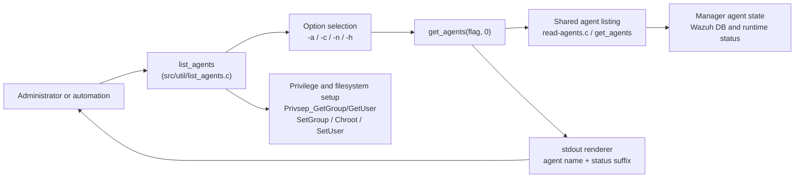
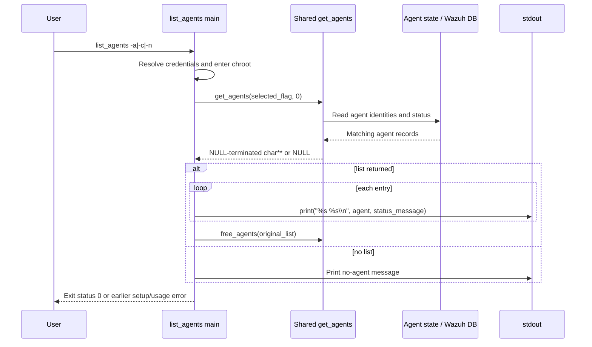
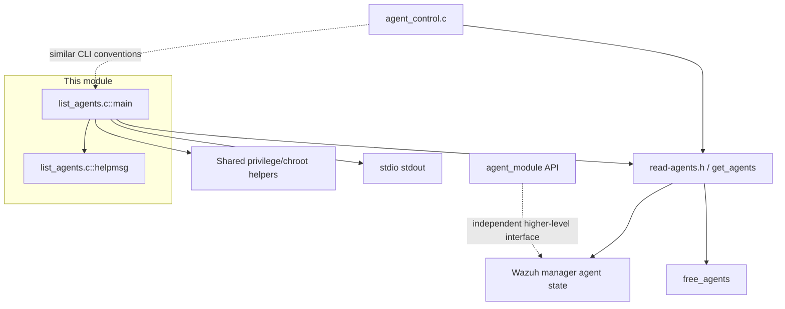

# `util_cli_tools_list_agents`

`util_cli_tools_list_agents` documents the native Wazuh `list_agents` command-line utility, implemented in `src/util/list_agents.c`. The utility is a small, read-only manager-side command that enumerates agents and labels each result as available, active, or not active. It owns command-line parsing, privilege/chroot setup, and terminal output; agent discovery and connection-state filtering are delegated to the shared agent utilities.

The module is part of the broader [CLI utilities and migration tools](CLI_Utilities_%26_Migration_Tools.md) area. Its closest implementation neighbor is [`util_cli_tools_agent_control`](util_cli_tools_agent_control.md), while the underlying agent enumeration contract is documented in [`shared_lib_system_utils_agents`](shared_lib_system_utils_agents.md).

## Purpose and scope

The executable accepts exactly one primary option:

| Option | Shared flag | Meaning | Output suffix |
|---|---|---|---|
| `-a` | `GA_ALL` | List all known agents | `is available.` |
| `-c` | `GA_ACTIVE` | List agents currently connected | `is active.` |
| `-n` | `GA_NOTACTIVE` | List agents that are not connected | `is not active.` |
| `-h` | — | Print usage information and terminate | — |

The command prints one line per returned agent, for example `001 web-server is active.`. If the shared lookup returns no list, it prints `** No agent available.`.

This module does not manage keys, enroll agents, send commands, query the REST API, or implement connection-state logic. Those responsibilities belong to the shared agent library and other utilities; see [addagent_native](addagent_native.md), [util_cli_tools_agent_control](util_cli_tools_agent_control.md), and [shared_lib_system_utils_agents](shared_lib_system_utils_agents.md).

## Architecture



### Components

| Component | Location | Responsibility |
|---|---|---|
| CLI entry point | `src/util/list_agents.c::main` | Initializes the process, validates the argument, selects a shared filter, invokes lookup, and prints results. |
| Usage handler | `src/util/list_agents.c::helpmsg` | Prints command description and supported options, then exits with status `1`. |
| Shared lookup | `get_agents()` from `read-agents.h` and its implementation | Returns a NULL-terminated list of agent identifiers/names filtered by a `GA_*` flag. |
| Privilege helpers | `Privsep_GetGroup`, `Privsep_GetUser`, `Privsep_SetGroup`, `Privsep_Chroot`, `Privsep_SetUser` | Resolve service credentials and reduce the process context before accessing manager data. |
| Memory cleanup | `free_agents()` | Releases the NULL-terminated list returned by `get_agents()`. |

## Process lifecycle

The security setup occurs before option dispatch and agent lookup. This ensures normal execution runs inside the Wazuh home chroot under the configured Wazuh user and group.

```mermaid
flowchart TD
    Start([Start]) --> Name[OS_SetName("list_agents")]
    Name --> Home[w_homedir(argv[0])]
    Home --> Args{argc >= 2?}
    Args -- No --> Help[helpmsg]
    Args -- Yes --> Credentials[Resolve USER and GROUPGLOBAL]
    Credentials --> Valid{uid and gid valid?}
    Valid -- No --> Error1[Report USER_ERROR and exit]
    Valid -- Yes --> SetGroup[Privsep_SetGroup]
    SetGroup --> GroupOK{Success?}
    GroupOK -- No --> Error2[Report SETGID_ERROR and exit]
    GroupOK -- Yes --> Chroot[Privsep_Chroot(home_path)]
    Chroot --> ChrootOK{Success?}
    ChrootOK -- No --> Error3[Report CHROOT_ERROR and exit]
    ChrootOK -- Yes --> CleanupHome[Free home_path; nowChroot]
    CleanupHome --> SetUser[Privsep_SetUser(uid)]
    SetUser --> UserOK{Success?}
    UserOK -- No --> Error4[Report SETUID_ERROR and exit]
    UserOK -- Yes --> Option[Dispatch argv[1]]
    Option --> Lookup[get_agents(flag, 0)]
    Lookup --> Output[Print entries or no-agent message]
    Output --> Done([Return 0])
```

Important lifecycle details:

1. `OS_SetName(ARGV0)` sets the process name to `list_agents`.
2. `w_homedir(argv[0])` resolves the Wazuh home path used for the chroot.
3. The configured group and user are resolved using `GROUPGLOBAL` and `USER`.
4. The process sets its group, enters the Wazuh home chroot, frees the path buffer, calls `nowChroot()`, and then sets its user.
5. Any failure in credential resolution or privilege setup terminates through the project’s error helpers.

## Option and lookup flow

```mermaid
flowchart TD
    A[argv[1]] --> H{"-h"}
    H -- Yes --> Help[Print help; exit 1]
    H -- No --> All{"-a"}
    All -- Yes --> F1[flag = GA_ALL\nmsg = "is available."]
    All -- No --> Connected{"-c"}
    Connected -- Yes --> F2[flag = GA_ACTIVE\nmsg = "is active."]
    Connected -- No --> NotConnected{"-n"}
    NotConnected -- Yes --> F3[flag = GA_NOTACTIVE\nmsg = "is not active."]
    NotConnected -- No --> Invalid[Print invalid-option notice\nthen helpmsg; exit 1]
    F1 --> G[get_agents(flag, 0)]
    F2 --> G
    F3 --> G
    G --> HasList{Returned list?}
    HasList -- No --> Empty[Print ** No agent available.]
    HasList -- Yes --> Iterate[Iterate until NULL terminator]
    Iterate --> Print[Print agent value + msg]
    Print --> Free[free_agents(original list)]
    Empty --> End([Return 0])
    Free --> End
```

Only `argv[1]` is examined. Extra arguments are not parsed as additional filters. An absent argument, `-h`, or an unknown option invokes `helpmsg()`, which exits with status `1`; successful lookup/output returns `0`.

## Data flow and ownership

`get_agents(flag, 0)` returns a dynamically allocated, NULL-terminated `char **`. `main` keeps the original pointer in `agent_list_pt` because the iteration pointer advances through the array. The original pointer is passed to `free_agents()` after printing.



The `0` argument passed to `get_agents` is part of the shared API contract. The utility does not inspect the returned records or calculate status itself; it relies on the selected `GA_*` filter and adds the corresponding human-readable suffix.

## Dependencies and system position



The most important dependency is the shared agent-listing layer. Its query behavior, supported `GA_*` filters, record construction, and data-source details are documented in [shared_lib_system_utils_agents](shared_lib_system_utils_agents.md); this document intentionally does not duplicate that implementation.

The utility is also related to:

- [util_cli_tools_agent_control](util_cli_tools_agent_control.md): neighboring manager CLI with broader agent operations and overlapping privilege/agent-state conventions.
- [addagent_native](addagent_native.md): enrollment and key-management tooling, including other agent-listing paths.
- [shared_lib_system_utils](shared_lib_system_utils.md): common manager-side system helpers used by native utilities.
- [agent_module_core](agent_module_core.md): framework/API-facing agent management, which is separate from this local native CLI.

## Error and edge-case behavior

| Condition | Behavior |
|---|---|
| No command-line option | `helpmsg()` prints usage and exits `1`. |
| `-h` | Prints usage and exits `1`; help is treated as a terminating command rather than a successful query. |
| Unknown option | Prints `** Invalid option '<value>'.`, then prints usage and exits `1`. |
| Unknown service user/group | Terminates with `USER_ERROR`. |
| Group, chroot, or user transition failure | Terminates with the corresponding project error (`SETGID_ERROR`, `CHROOT_ERROR`, or `SETUID_ERROR`). |
| `get_agents()` returns `NULL` | Prints `** No agent available.` and returns `0`. |
| Empty result list | Treated as no available agent according to the shared lookup contract. |
| Successful list | Prints every entry and frees the returned allocation. |

The implementation assumes the selected option is at `argv[1]` and does not support combined short options such as `-ac`.

## Maintenance notes

- Keep the display suffix synchronized with the selected `GA_*` flag; the suffix is assigned in the same branch as the filter.
- Preserve the original `char **` returned by `get_agents()` so `free_agents()` receives the allocation base rather than the iteration cursor.
- Changes to agent status semantics should be made in the shared agent-listing implementation and its documentation, not duplicated in this CLI.
- Changes to service-account, chroot, or privilege behavior should be reviewed against the shared privilege helpers and the sibling [`agent_control`](util_cli_tools_agent_control.md) utility.
- This is a native executable, not a Python API controller; REST API changes in [`agent_module`](agent_module.md) do not automatically change its output or filtering behavior.

## Source reference

Primary implementation: `src/util/list_agents.c`

Core symbols:

- `helpmsg()` — usage text and terminating help/error path.
- `main()` — process setup, option dispatch, shared lookup, rendering, and cleanup.

