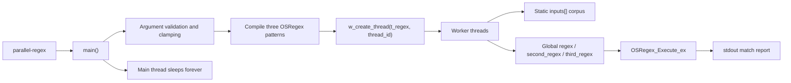
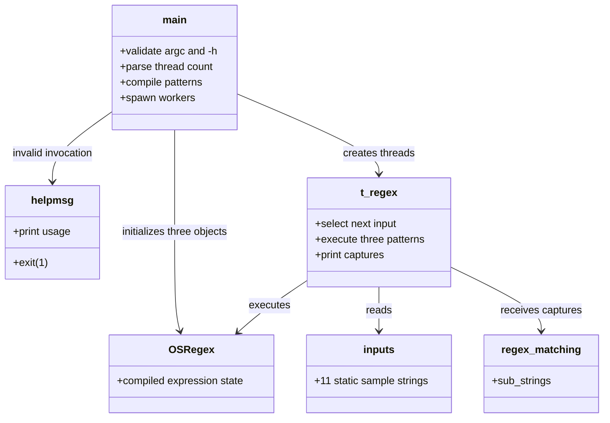
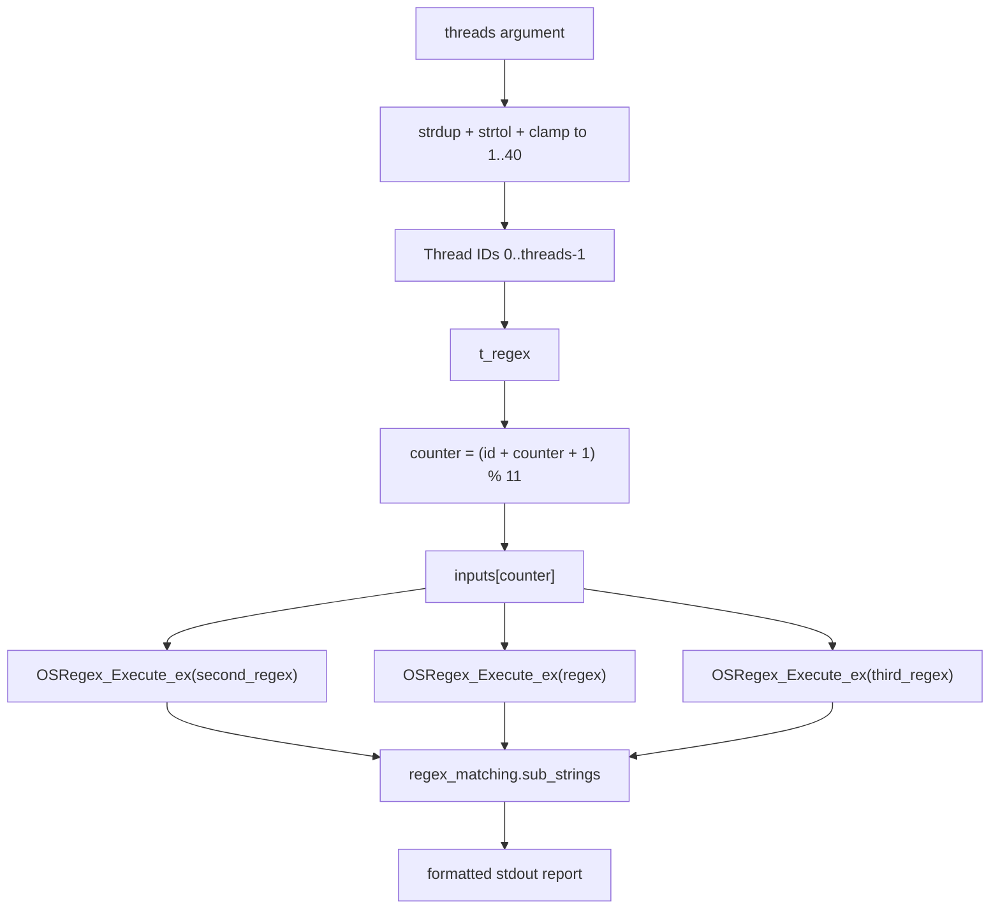
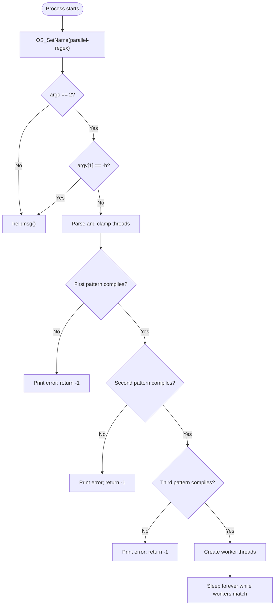
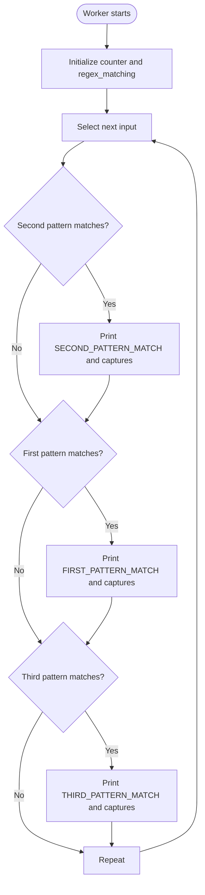
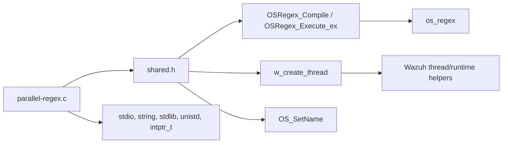

# `util_cli_tools_parallel_regex`

## 1. Introduction

`util_cli_tools_parallel_regex` is a standalone C command-line diagnostic used to exercise Wazuh's `OSRegex` implementation concurrently. It compiles three patterns, starts a bounded number of worker threads, and repeatedly applies all three patterns to a fixed set of sample strings. Successful matches are printed with the worker ID, pattern category, input string, and any captured substrings.

The utility is part of the CLI tools collection. It is not a daemon, API endpoint, configuration parser, or production event-processing path. The surrounding CLI utilities are described in [util_cli_tools.md](util_cli_tools.md); the shared native services and libraries it depends on are covered by [shared_lib.md](shared_lib.md) and [os_regex.md](os_regex.md).

## 2. Location and scope

| Item | Value |
|---|---|
| Module | `util_cli_tools_parallel_regex` |
| Source | `src/util/parallel-regex.c` |
| Entry points | `helpmsg`, `main` |
| Internal worker | `t_regex` |
| Input source | Static `inputs[]` array containing 11 test strings |
| Output | Standard output; diagnostic text and match results |
| Lifetime | Runs indefinitely after worker creation |

The module tree places this utility under `CLI_Utilities_&_Migration_Tools` → `util_cli_tools`. It is a sibling of `wazuh-regex`, `agent_control`, `list_agents`, and `verify-agent-conf`, but it does not call those utilities or expose a shared application-level interface.

## 3. Architecture

The utility has three functional areas:

1. **Process setup** — names the process, validates the single command-line argument, and normalizes the requested thread count.
2. **Regex initialization** — compiles three global `OSRegex` objects with substring capture enabled.
3. **Parallel matcher** — creates worker threads. Each worker selects inputs in a thread-dependent round-robin sequence and executes all three regular expressions.



### 3.1 Component relationships



## 4. Core components

### 4.1 `helpmsg`

`helpmsg` is a non-returning usage function. It prints:

```text
parallel-regex <threads>
```

The function exits with status `1`. It is called when the program receives anything other than exactly one user argument, or when that argument is `-h`.

### 4.2 `main`

`main` owns startup and intentionally leaves the worker threads running.

#### Process naming

`OS_SetName(ARGV0)` labels the process as `parallel-regex`, using the shared Wazuh process utility.

#### Argument handling

The command expects exactly one argument:

```text
parallel-regex <threads>
```

The argument is copied with `strdup` and parsed with `strtol`. The implementation applies these limits:

- An argument whose string length is 1–3 characters is parsed as supplied.
- Empty or four-or-more-character values are replaced with `"1"` before parsing.
- Values below `1` become `1`.
- Values above `40` become `40`.

This is a simple diagnostic parser, not a strict numeric validator: `strtol`'s end pointer and conversion errors are not checked. As a result, malformed short strings can be interpreted as zero and subsequently normalized to one thread.

#### Pattern compilation

All patterns are compiled with `OSRegex_Compile(..., OS_RETURN_SUBSTRING)`, enabling capture extraction:

| Matcher label | Pattern | Purpose |
|---|---|---|
| First | `This (\\w+) a test (\\w*) for testing the (\\w+) regex\|pattern (\\w).` | Tests word captures and an alternation branch for `pattern <character>`. |
| Second | `This is the (\\w*) pattern.` | Tests the middle word in a short sentence. |
| Third | `Without substrings.` | Tests a match with no capture groups. |

If any pattern fails to compile, `main` prints the failing pattern and returns `-1`; no worker threads are created after that failure.

#### Thread creation and lifetime

For each ID from `0` through `threads - 1`, `main` invokes `w_create_thread(t_regex, (void *)(intptr_t)i)`. It then sleeps for 10 seconds in an infinite loop. The worker threads themselves also loop forever, so normal completion is not expected.

### 4.3 `t_regex`

Although it is not listed as a module-tree core symbol, `t_regex` is the operational heart of the utility.

Each worker:

1. Converts its opaque argument to an integer thread ID.
2. Initializes a local `regex_matching` structure to zero.
3. Prints a startup line.
4. Advances a counter using `(thread_id + counter + 1) % input_number`.
5. Runs the second, first, and third expressions in that order.
6. For each successful match, formats a report into a local 1 KiB buffer and prints every non-null entry in `str_match.sub_strings`.
7. Repeats forever.

The counter formula gives each thread a deterministic, thread-offset traversal of the same shared corpus. It is not a work queue and does not guarantee that each input is processed exactly once globally.

## 5. Data flow



The input corpus is read-only static data. The compiled expressions are global objects shared by workers, while each worker owns its `msg` buffer, counter, loop variables, and `regex_matching` structure. Output is written directly to `stdout` from multiple threads; lines from different workers may therefore interleave depending on scheduling and stdio behavior.

## 6. Process flows

### 6.1 Startup and failure flow



### 6.2 Worker loop



## 7. Dependencies and system fit



The source includes `shared.h`, which supplies the Wazuh shared declarations and transitively provides the regex, process, and threading interfaces used here. The module does not access Wazuh DB, sockets, agent state, cluster services, API middleware, or native daemons. Consequently, its relationship to the overall system is limited to validating behavior of the shared regex and thread helpers.

For details of the regex engine itself, link to [os_regex.md](os_regex.md) rather than duplicating its matching semantics here. Shared process, memory, logging, and utility conventions belong in [shared_lib.md](shared_lib.md). The neighboring CLI tools are cataloged in [util_cli_tools.md](util_cli_tools.md).

## 8. Operational characteristics and limitations

- **Diagnostic-only:** The sample strings and patterns are compiled into the executable; there is no file, stdin, or network input.
- **Unbounded execution:** There is no stop condition, graceful shutdown handler, or signal-specific cleanup in this source. Operators must terminate the process externally.
- **Thread count cap:** Requests are constrained to 1–40 workers, limiting accidental thread explosion.
- **Shared compiled regex state:** All workers execute the same global compiled expressions. This makes the program useful for concurrent-regex testing, but also means thread-safety characteristics of `OSRegex_Execute_ex` are part of what is being exercised.
- **Shared stdout:** Multiple workers print concurrently, so output ordering is nondeterministic and may be interleaved.
- **Fixed output buffer:** Each report is built in `char msg[1024]`; formatting does not explicitly reject truncation from `snprintf`, so very long future test inputs or captures could produce incomplete reports.
- **Compile failure is fail-fast:** A failure to compile any one of the three expressions prevents worker startup and returns `-1`.

## 9. Example invocation

```bash
parallel-regex 4
```

This starts four workers. A successful match is reported in a form similar to:

```text
+ [Thread 0][FIRST_PATTERN_MATCH]: This is a test pattern for testing the parallel regex.
 -Substring: is
 -Substring: pattern
 -Substring: parallel
```

The exact order and frequency of lines depend on thread scheduling and the infinite input-selection loop.

## 10. Summary

`util_cli_tools_parallel_regex` is a compact concurrency harness for the Wazuh OSRegex engine. `main` validates a thread-count argument, compiles three substring-aware expressions, and starts bounded workers. `t_regex` repeatedly tests a fixed corpus against all expressions and reports captures. Its deliberate infinite lifetime, shared regex objects, and concurrent output make it appropriate for manual diagnostics and thread-safety experiments, not for normal Wazuh service operation.
